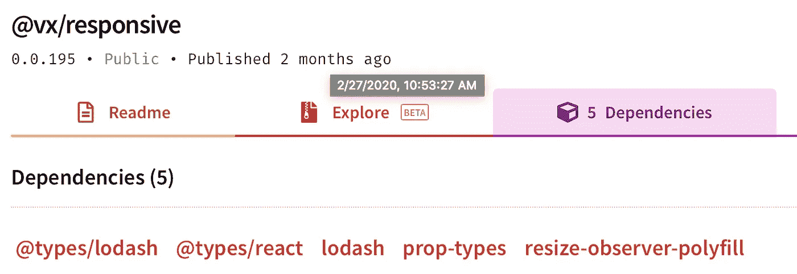

# 使用 Dimension 反应钩

> 原文：<https://medium.datadriveninvestor.com/usedimension-react-hook-dcd0ecaf1160?source=collection_archive---------0----------------------->


获取元素高度和宽度的自定义 react 挂钩

当设计一个必须遵循 RWD(响应式网页设计)的网页应用程序时，无论你对 CSS 有多了解，你都会面临一些限制。在某些领域，你会想“为什么不能用 CSS 来做这件事”，你会做很多研究，但最终你会意识到，这是一个死胡同。

> ***这个为什么？***

这发生在我身上，我面临的问题是创建响应图。作为一名开发人员，我们首先想到的是，显然已经有了解决方案，所以我开始研究。我碰到过两个这样的库:[**react-with-dimensions**](https://www.npmjs.com/package/react-with-dimensions)和[**VX/response**](https://www.npmjs.com/package/@vx/responsive)**。**第二个是因为我在用 [**VX**](https://vx-demo.now.sh) 处理图形。

这两个库都为您提供了包装主组件的高阶组件，因此看起来像:

```
**import** { withParentSize } **from** '@vx/responsive';let chartToRender **=** withParentSize(myComponent);
```

他们会把*高度和宽度道具*传给你，你可以用它们来制作*风格道具*，让你的元素看起来像是动态的。

在我用它完成手头的任务后，我意识到这个实现有一个巨大的缺点，*它只能用来获得最顶层元素的宽度。这意味着如果我想在我的元素树中间得到一个元素的宽度，我将不得不移动到另一个组件，这看起来工作量太大了。*

> ***该如何***

通过创建一个更高阶的组件，我将做与上述库相同的事情。我在一篇文章中读到过，一个 HOC 所做的大部分事情都可以通过使用钩子来完成。因为钩子只是函数，所以我可以灵活地创建多个元素引用。

创建一个**定制钩子**就是方法。那么，我需要什么来创建这个自定义钩子呢，一个是检查我的元素的观察器，第二个是对我的元素的引用，这是一个我将从观察器绑定我的值的状态。

当创建一个定制钩子时，名字必须以 **use，**开始，当我返回元素的尺寸时，名字是这个钩子最简单的部分， **useDimension。**

> *观察者*

第一个任务是我需要一个观察者来观察元素的任何变化，这更容易找到，我只是检查了 npm 上的依赖部分



vx/responsive dependencies

这个名字足以让我知道我必须从这里去哪里， [resize-observer-polyfill](https://www.npmjs.com/package/resize-observer-polyfill) 是 HTML5 提供的 [ResizeObserver api](https://developer.mozilla.org/en-US/docs/Web/API/ResizeObserver) 的实现/polyfill。

```
npm install resize-observer-polyfill --save-dev
```

按照 Mozilla 的说法:`**ResizeObserver**`接口报告了`[Element](https://developer.mozilla.org/en-US/docs/Web/API/Element)`的内容或边框尺寸的变化，或者`[SVGElement](https://developer.mozilla.org/en-US/docs/Web/API/SVGElement)`的边框尺寸的变化。

> ***引用***

这就是 React 提供的 **useRef 钩子**和 **ref 回调**的作用。我必须使用 useRef 创建一个 Ref，并将其添加到元素的 ref 回调中以获取节点。

```
const divRef = useRef(null);
useEffect(() => {
 if (divRef.current) {
   //add logic here;
 }
}, [divRef]);<div ref={divRef}></div>
```

由于 divRef 在初始化时没有任何引用，建议与 useEffect 一起使用，因为元素引用只设置一次，useEffect 只调用一次。

现在我们有了观察者和对元素的引用，是时候创建钩子并将维度绑定到组件可以使用的状态了。

> ***状态***

状态由 useState 挂钩维护。

```
const initialState = { width: 0, height: 0 };const [dimensions, setdDimensions] = useState(initialState);return dimensions;
```

**dimensions** 是钩子将要返回的对象，可以在调用钩子的组件中使用。

> ***钩子***

是时候把所有的积木组合起来，创造我们的钩子了:

第一步，我们需要将元素 ref 绑定到 observer，这样我们就可以在元素发生变化时获取元素信息。

```
const resizeObserverRef = useRef(null);useEffect(() => {
resizeObserverRef.current = new ResizeObserver((entries = []) => {
 entries.forEach((entry) => {
  const { width, height } = entry.contentRect;
  //change state here
 });
});
//checking whether the ref exists 
if (ref.current) resizeObserverRef.current.observe(ref.current);
```

将 resizeObserverRef 作为 Ref 而不是变量的原因是，useEffect 将在每次调用回调时创建 ResizeObserver 的新实例。

Observe 就像一个订阅，并且像所有订阅一样，如果它没有关闭，就会有内存泄漏，所以我们需要在卸载组件时销毁它。为此，我们可以在 useEffect 钩子中使用 return 回调函数，这个函数在组件被卸载时被调用。

```
useEffect(() => {
resizeObserverRef.current = new ResizeObserver((entries = []) => {
 entries.forEach((entry) => {
  const { width, height } = entry.contentRect;
  // update state here
  });
});
if (ref.current) resizeObserverRef.current.observe(ref.current);
return () => {
 if (resizeObserverRef.current)  resizeObserverRef.current.disconnect();
 };
}, [ref]);
```

至此，我们所有的钩子都准备好了，我们只需要在每次调用观察者回调时更新状态。最终产品:

> ***使用钩子:***

如您所见，useDimension 钩子给出了 ref 元素的高度和宽度


demo

我希望这有助于你理解钩子的用法。如果你对我的实现有什么意见，请告诉我。