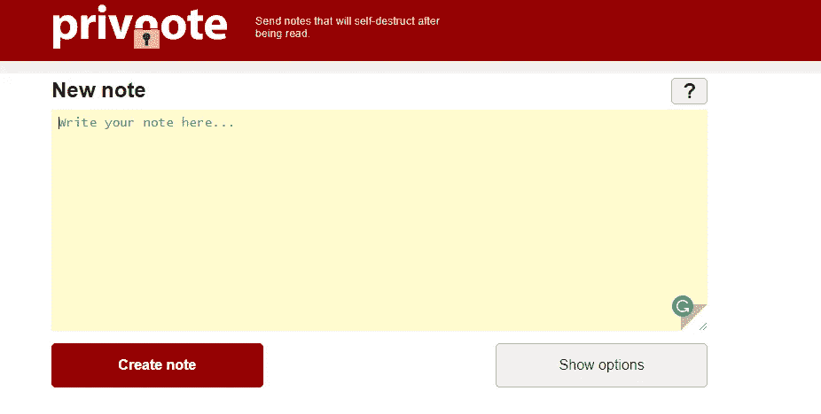
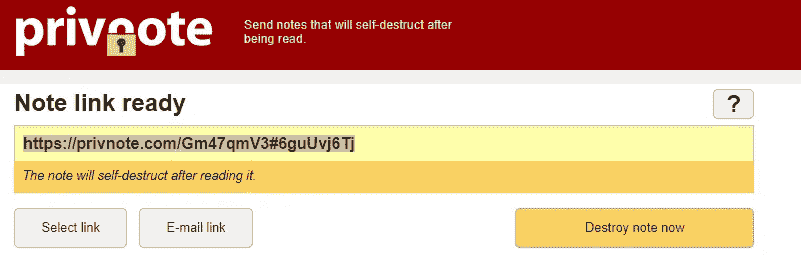
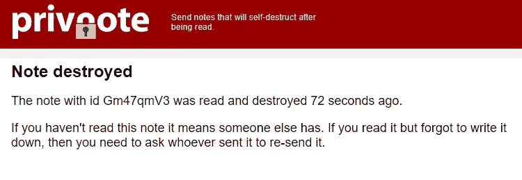
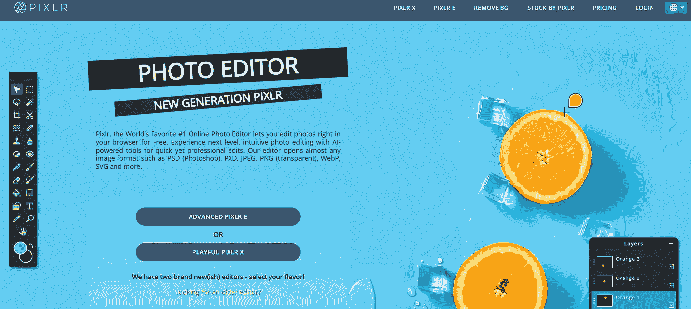
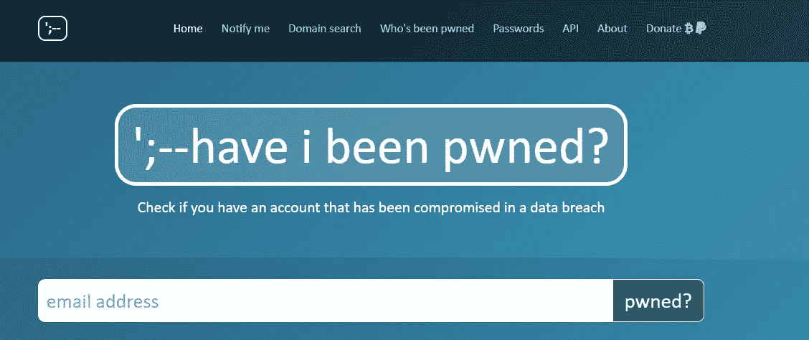
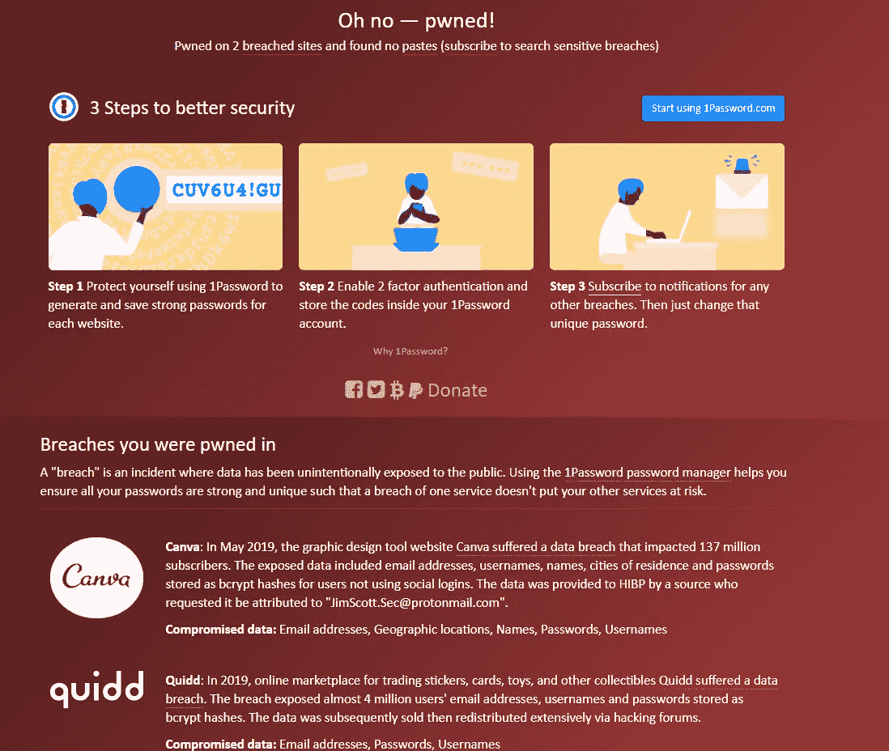
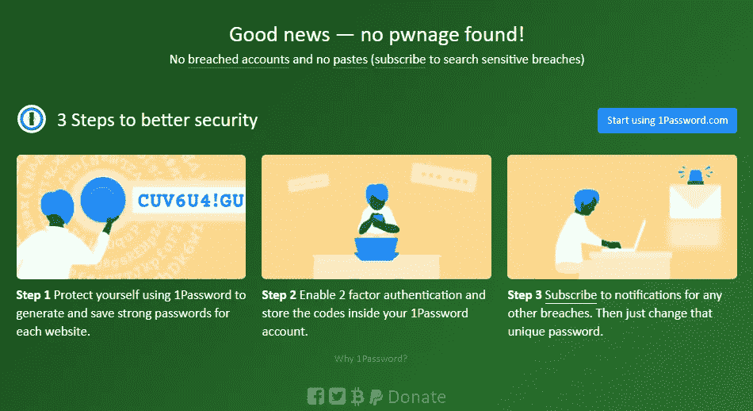
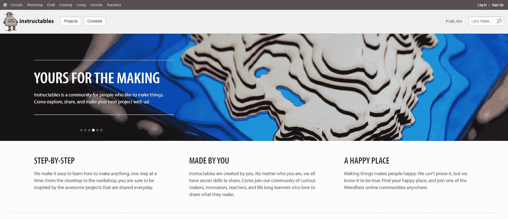
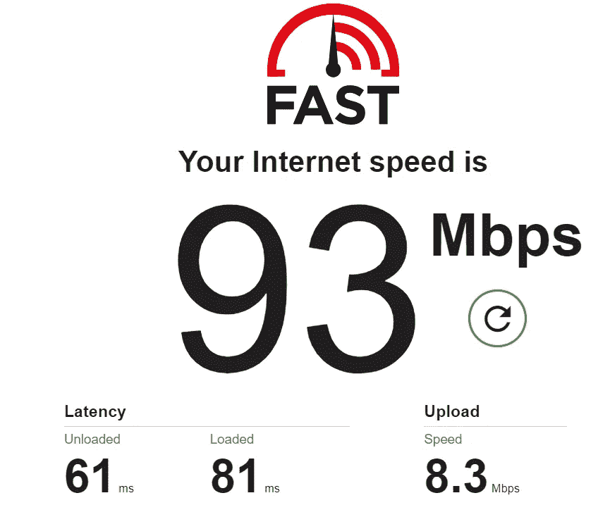

# 每个人都应该知道的有用网站

> 原文：<https://medium.datadriveninvestor.com/useful-websites-everyone-should-know-about-aca65a6abd7b?source=collection_archive---------17----------------------->

互联网上有数十亿个网站，很难将有用的和不必要的网站区分开来。

互联网几乎遍布世界各地，随着技术的进步，它将很快覆盖全球。这个行业每一秒钟都在发展壮大，这就是为什么我列出了一些大家都应该知道的网站。

我将在这篇文章中谈到的每一个网站都是值得收藏的，会让你的网上生活更容易。该类别将从一切，以便任何人都将被包括在内，可以找到一些有用的东西。

# 私人笔记

发送自毁消息以获得最大隐私。Privnote 可以让你写笔记，在收件人阅读后自动自毁。您可以安排在预定时间过期的便笺。不需要下载软件！

你所要做的就是在上图所示的文本区写下你的笔记。点击 create note 按钮，然后这个窗口就会出现，你可以在这里创建链接。在收件人阅读了笔记后，它将自毁，链接将不再可用。

当你试图打开一个被破坏的笔记时，你会看到这个页面。

这个[网站](https://privnote.com/)从 2009 年就存在了，它提供了很棒的服务，而且完全**免费**。它在很多场合肯定是有用的，把它收藏起来是个好主意。

# Pixlr

[**Pixlr**](https://pixlr.com/) ，世界上最受欢迎的#1 在线照片编辑器，让你在浏览器中编辑照片，免费**。使用人工智能工具体验下一级的直观照片编辑，实现快速而专业的编辑。**

**Pixlr 经常被拿来和 Adobe **Photoshop** 比较，但事实上，这种比较对 Pixlr**来说是非常不公平的。照片编辑领域的许多专家会说 **Pixlr** 与 Adobe **Photoshop** 做许多**相同**的事情，并且具有许多**相同**的功能。不同之处在于 Pixlr 比 Adobe 简单。****

**它有 Pixlr X 和 Pixlr E 两种格式，两者各有优势。x 有裁剪、编辑、过滤和特效的基础，而 E 是为那些需要更高级工具的人准备的。**

** [## 我如何利用技术显著提高身体意识|数据驱动投资者

### 瑜伽练习最大的挑战是什么？是发展肌肉力量，还是柔韧性，还是耐力…

www.datadriveninvestor.com](https://www.datadriveninvestor.com/2020/11/12/how-i-dramatically-increased-body-awareness-using-technology/) 

# 我被耍了吗？

在过去几年的所有数据泄露事件中，你的数据很可能已经被泄露。在这个 [**网站**](https://haveibeenpwned.com/) 上，你可以发现你的账号是否被攻破了。

我被 pwn 了吗？是一个允许互联网用户检查其个人数据是否因数据泄露而受损的网站。

如果你已经妥协，你会看到像这样的漏洞来自哪些网站。

如果你是安全的，你会得到这个结果。

# 指令

[**Instructables**](https://www.instructables.com/) 是一个专注于用户创建和上传 DIY 项目的网站，目前归欧特克所有。它于 2005 年 8 月创建并推出，自那以后用户数量大幅增加。Instructables 致力于成员间的逐步协作，以构建各种项目。

这是一个找到所有你喜欢的 DIY 项目的好地方，从装饰、建筑、艺术、工艺、电子、化妆教程、服装、道具到食谱等等。提供许多有反馈的基础和复杂技能的免费课程。

它深入探讨了如何做复杂的技能和非常简单的日常项目。精彩的正在进行的比赛有惊人的奖品！用户内容驱动网站和**专业内容**帮助推广您的业务。

# 快的

如果你不信任与**互联网服务提供商**有关联的网速测试网站，那么我建议你去看看这个[网站](https://fast.com/)。这是一个由网飞创建的网站，目标是让互联网服务提供商对他们的真实速度负责。

这个网站将确定你拥有的下载速度，如果你点击显示更多按钮，你会看到更多的东西。如**延迟**和**上传**速度。

# 结束语

在浏览器的书签里放一些有用的网站总是好的，因为你可能永远不知道什么时候需要它们。如果你不保存它们，那么很有可能你会忘记这些网站。

我用我用过的网站和一些仍然经常使用的网站编制了这个列表。如果你想要这篇文章的第二部分或者有任何建议，请在下面的评论区留下你的评论。

## 访问专家视图— [订阅 DDI 英特尔](https://datadriveninvestor.com/ddi-intel)**