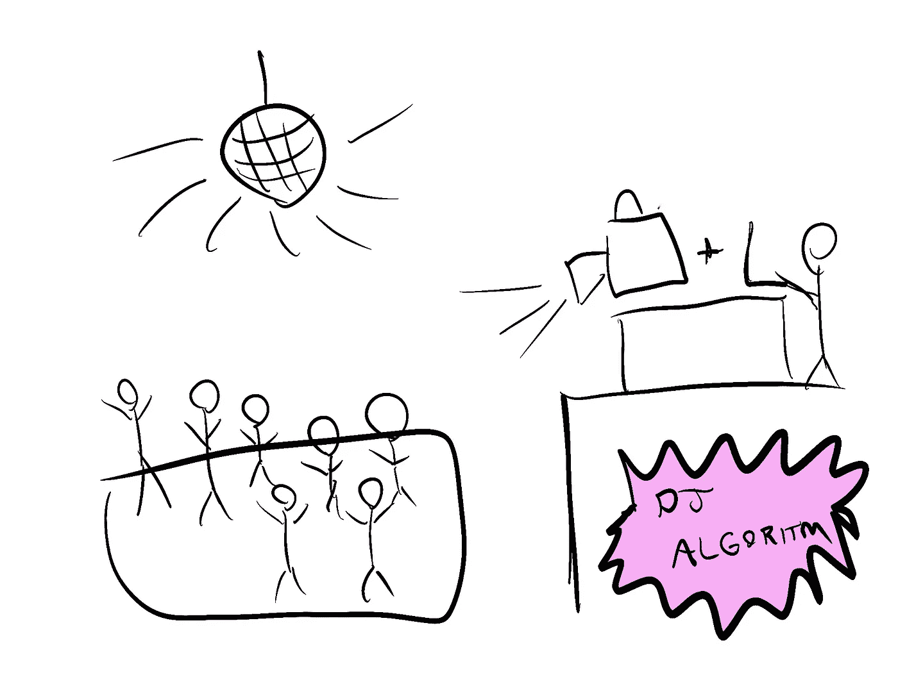
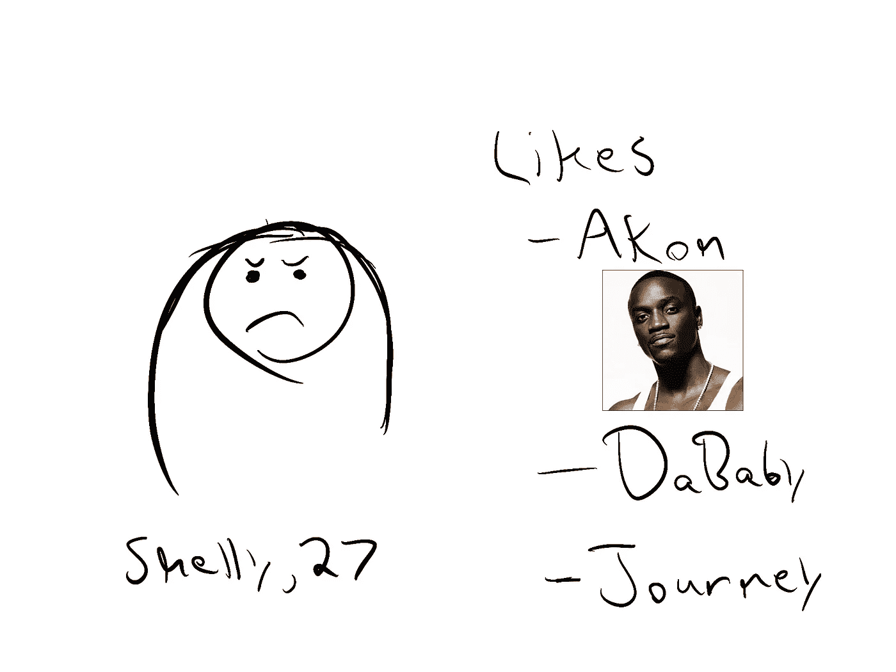
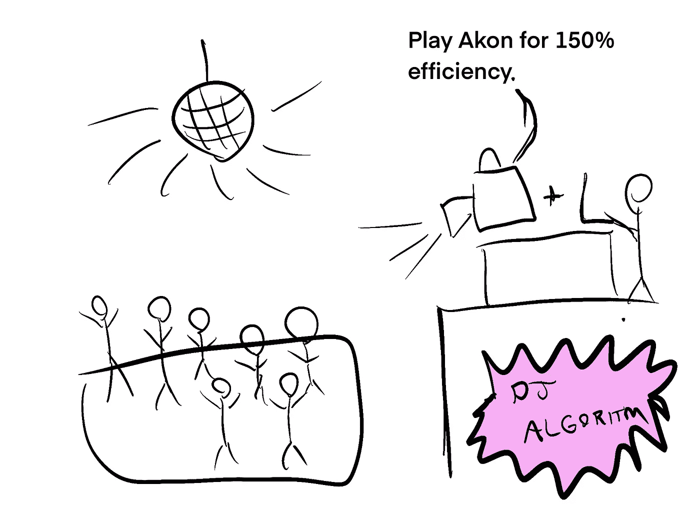
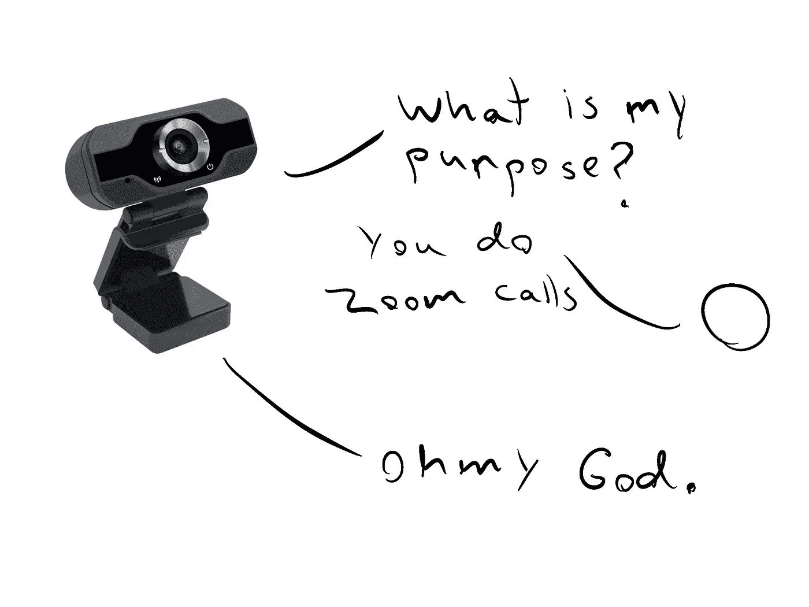
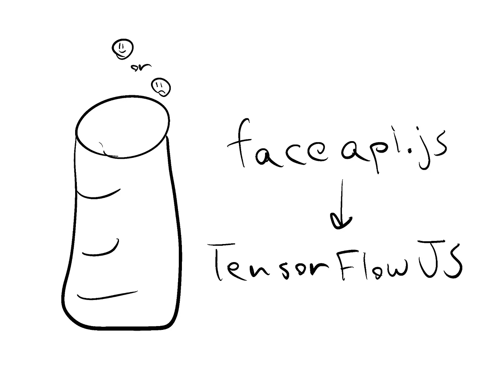
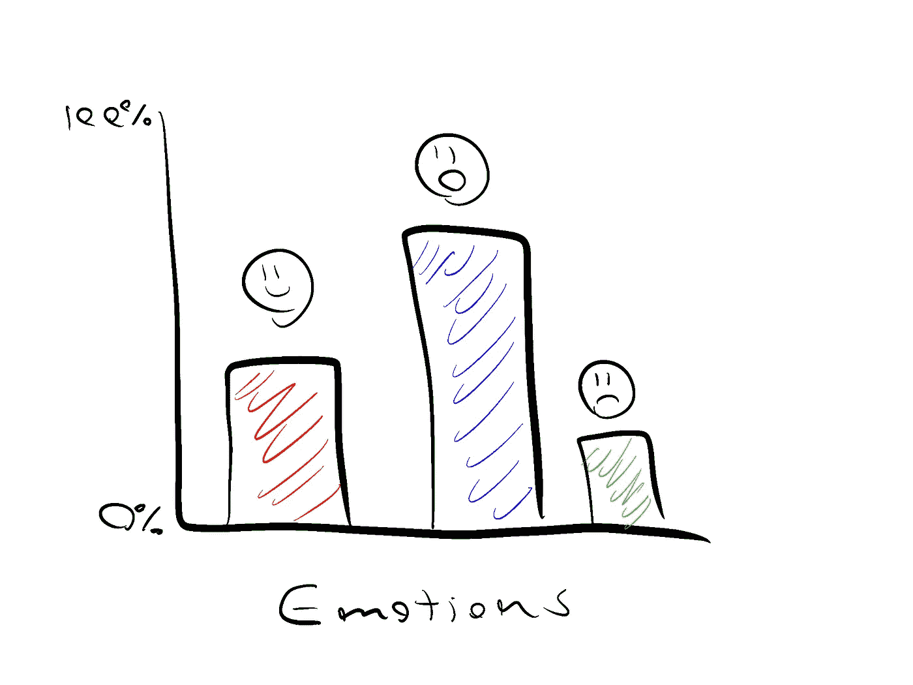
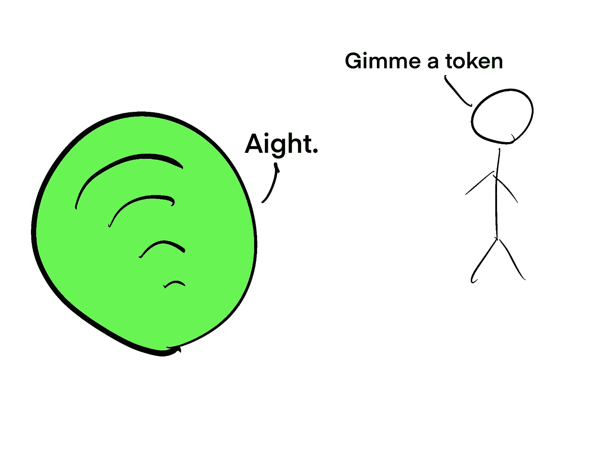
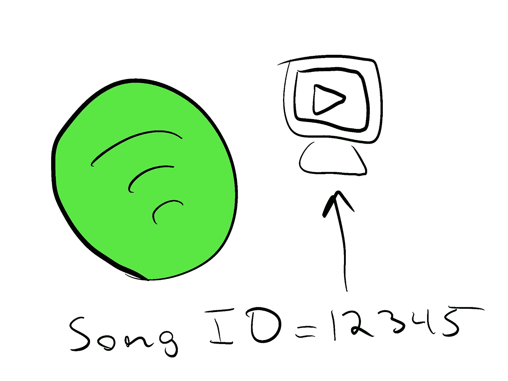
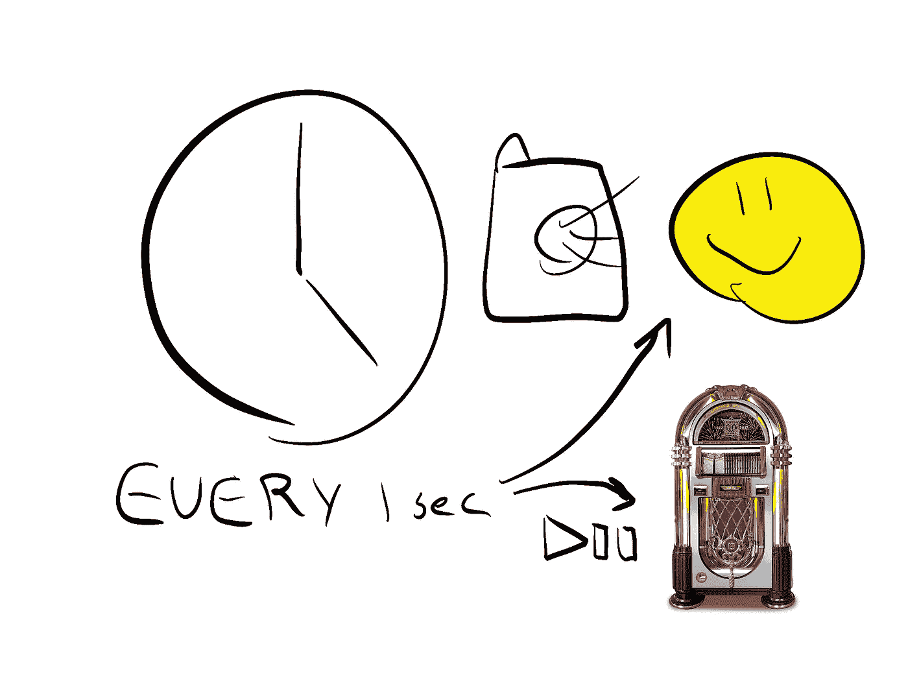
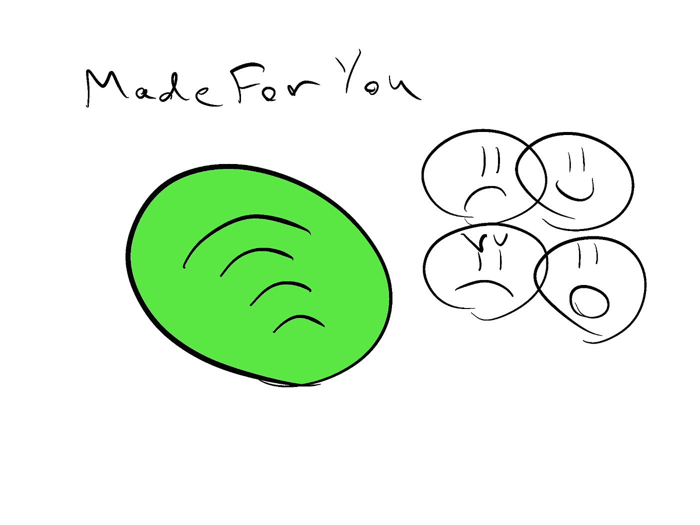

# 使用人工智能选择 Spotify 上播放的下一首歌曲

> 原文：<https://medium.datadriveninvestor.com/using-ai-to-choose-the-next-song-that-plays-on-spotify-aca43455d52f?source=collection_archive---------22----------------------->

**想象一下:**

2035 年的一个周六，你和朋友在一家俱乐部。但是等等，这不是普通的舞蹈俱乐部。这个俱乐部被称为数据俱乐部，在这里你可以获得个性化的体验，增加你对夜晚的享受。

Turn up for data!!

你的一个朋友今天过得很糟糕，俱乐部知道她自从上次来这里后就非常喜欢阿肯。

它很快交叉参考了俱乐部中所有其他的面孔，并决定将阿肯作为下一首歌曲是增加俱乐部整体能量的最佳举措。

听起来很疯狂，对吧？但是，如果我告诉你，使这成为可能的所有技术今天都存在，会怎么样呢？

# 团队

为了实现这个演示，我利用了三种不同的技术:网络摄像头、Spotify API 和面部表情检测 ML 模型。

# 网络摄像头

streamers 和 Zoom 在全球范围内使用的不起眼的网络摄像头也可以用于创建机器学习应用程序。因为帧是实时渲染的，所以我们可以在相机上捕捉不同的东西，然后将图像传递给我们的程序进行处理。

# 人脸表情检测

人脸表情检测算法是这台机器中最复杂的部分。在后台，它使用 Tensorflow(谷歌机器学习库)来预测一幅图像正在描绘什么样的情感。

 [## 商业价值和人工智能的 5 个原则|数据驱动的投资者

### 提取商业价值很难。我是说真的很难...说到高级分析，这一过程甚至…

www.datadriveninvestor.com](https://www.datadriveninvestor.com/2020/07/07/5-principles-for-business-value-and-artificial-intelligence/) 

这项技术有许多不同的实现和库。对于这个项目，我使用了 faceapi.js，因为它可以在浏览器中工作，而且设置起来相对简单。

我一帧一帧的收集情绪，然后平均，得到最常见的情绪。

Surprise!

这就是乐趣所在。然后，我们可以使用来自 ML 模型的预测来执行函数，例如…

# Spotify API

Spotify API 是我们的应用程序通过调用函数来请求 Spotify 做事情的一种方式。为了能够首先做到这一点，Spotify 需要给你一把钥匙。此键允许您代表用户操作。

下一个功能是播放歌曲。Spotify 中的每首歌曲都有自己的 ID。为了播放我想要的歌曲，我从 Spotify 复制了 ID，然后将其插入 Spotify API。

在我的脚本用不同的情感请求触发 API 之后，它切换到播放另一首歌曲。你可以认为这基本上是告诉电脑，每当你停止微笑时，就播放下一首歌。

就像你是皇室一样，你可以随时停止派对！

# 结果

在我把所有部件连接在一起后，我有了一个可以工作的 Spotify 心情戒指。它只配置为跟踪一个人的面部，播放五首歌曲，但嘿，这是一个很酷的开始。

你会将哪些歌曲添加到心情播放列表中？

## 访问专家视图— [订阅 DDI 英特尔](https://datadriveninvestor.com/ddi-intel)