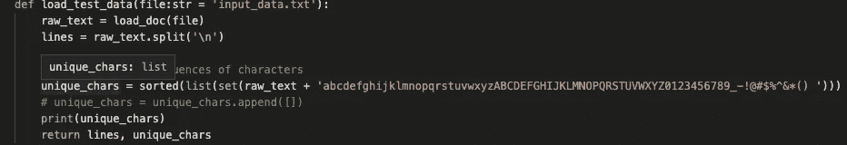
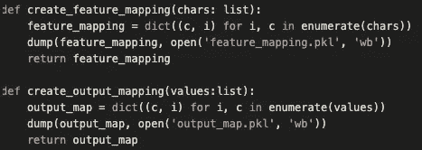
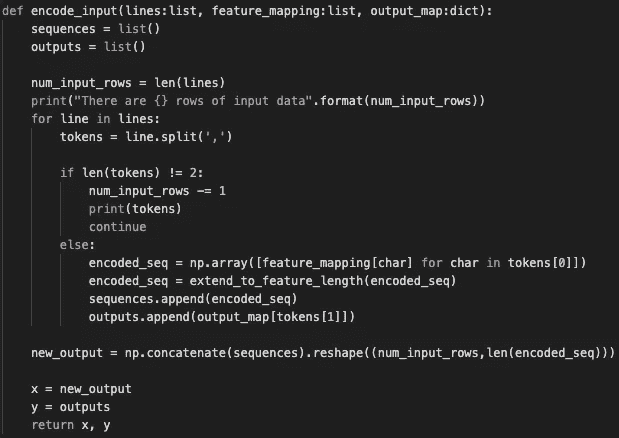
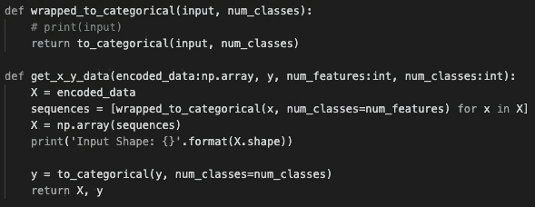

# 使用 LTSM 识别标识符

> 原文：<https://medium.datadriveninvestor.com/using-an-ltsm-for-recognizing-identifiers-8a147ac3413c?source=collection_archive---------8----------------------->

Photo by [Myriam Jessier](https://unsplash.com/@mjessier?utm_source=medium&utm_medium=referral) on [Unsplash](https://unsplash.com?utm_source=medium&utm_medium=referral)

# 用例

## 系统到系统的集成

多年来，银行、资产管理公司、保险公司在技术上花费了数十亿美元，成功的公司已经开发了非常棒的应用程序来解决特定的问题。然而，当软件开发世界采用以应用程序为中心的方法，或者以问题为中心的方法时，这些应用程序就进化了。尽管新创公司通常采用以产品或平台为中心的方法进行开发，但大型金融公司已经有了几十年的代码。因此，有大批“分析师”将应用程序与复制/转换/粘贴操作联系在一起。

想象一下这个典型的工作流程:

*   应用程序 A 发出一个仪器 ID
*   应用 B 需要一个仪器 ID 来触发其工作流程

然而，这些 id 可能不同。例如，应用程序 A 可能会吐出一个内部标识符，但应用程序 B 可能需要一个 ISIN/塞多尔/CUSIP/雷/FIGI/等等。因此分析师必须转换 ID。复杂的情况接踵而至:也许 B 的标识符还没有设置，也许应用程序 A 的 ID 有错误，等等。

## 书面通信

每当没有 API 来连接系统时，我们就不得不求助于讨厌的人。人类可能无法完美地交流，例如，他们可能犯了拼写错误，但另一个人可以推断出正确的答案。

例如，8 月 5 日有一次国债拍卖，CUSIP 为 912810SP4。CUSIP 到 ISIN 的翻译是算法上的。转换成“US”+CUSIP+<checksum>。如果有人给我们发来 912810SP4(也就是说，他们遗漏了校验和)，聪明人无论如何都能算出正确的 ISIN。或者如果有人发送“US 912810SP49”(即，额外的空格，但是具有最后 9 位的校验和)，则有人也可以推断这是 ISIN。或者如果有人发送 912810SP4(即正确的 cusip)，他们足够聪明地推断这是一个 CUSIP。</checksum>

## 问题是:

> 当我得到一个字符串时，我怎么知道它是什么类型的标识符？

## 处理标识符的老方法

REGEX！许多标识符都有校验和以及与之相关的正则表达式模式。在存在这些的地方，您可以强力使用正则表达式模式匹配器。挑战在于不是每个标识符都有一个正则表达式模式，而且它不会捕捉到人为的错误。

正则表达式是相当计算密集型的，因此大规模匹配成为问题。此外，它们需要精心维护。

最后，它不适用于复合标识符。ESM0 就是一个例子。这是一个期货报价器。在彭博，ESM0 可以是两种仪器。ESM0 Comdty 是瑞士法郎利率期货。ESM0 指数是 S&P 迷你期货。这个字符串现在是一个复合标识符“ESM0”和“com DTY”/“Index”。正则表达式在这里失败了，因为建模的复杂性呈指数增长。任何确定性逻辑都变得非常复杂非常快。

 [## 金融科技的全球趋势|数据驱动的投资者

### 各国可能已经封锁了边境，以减轻新冠肺炎疫情，但当地和国际贸易必须去…

www.datadriveninvestor.com](https://www.datadriveninvestor.com/2020/04/28/global-trends-in-fintech-technology/) 

## 新的学校方法:扔一些人工智能在上面

虽然我喜欢机器学习，但我确实发现它的好处有时被严重夸大了，所以我想看看神经网络是否能在这方面有所帮助。本文的其余部分将展示如何进入这个领域。我不想暴露所有的步骤，所以不包括我使用的代码/数据，但是我会给你足够的提示让你自己解决问题。如果你想对底层代码有所贡献，请在评论中联系我们，也许我们可以在这上面标记 team。我打算更进一步。

# 目标

在本文中，我们不会试图匹配复合标识符，但是我们会做一些基本的工作。承认 UUID 对 ISIN 对 BBG ID 对 DTCC ID。

*   UUID:这是一个技术标识符，不是商业标识符
*   ISIN:固定收益证券的全球唯一标识符
*   BBG ID:仪器的公司特定标识符
*   DTCC 标识:用于报告衍生产品交易的数字标识

***给定一个字符串，目标是找到‘最可能’的标识符*** 。如果模型有效，我们可以使用输出来查找特定的数据源，以确认或拒绝有效性。

额外的目标是能够处理数据输入异常。例如，uuid 是带连字符的十六进制标识符。如果模型收到带下划线的十六进制数，它可能仍然是一个格式不正确的 uuid，可能值得进行后处理来检查。

# 测试数据

金融科技领域的测试数据通常是简单入门的一个障碍。我不会与你分享数据集，所以你可以认为这是一个信息指南，而不是详尽的。

 [## 金融技术顾问/LTSM _ 产品

### 在 GitHub 上创建一个帐户，为 finTechInsider/LTSM 产品开发做出贡献。

github.com](https://github.com/finTechInsider/LTSM_Product/blob/master/test_data_synthesizer.py) 

基本上，如果您运行此代码，它将生成以下格式的文本文件。

> 标识符示例，类别

测试数据是垃圾，但我试图说明这种方法。你应该可以以此为基础做更多令人兴奋的事情。

如果你想在这方面合作，请随时联系我，我可能会给你更多的机会。

# 建立模型

下面是一组用于构建模型的示例代码。我做了一些事情来简化:

*   我假设我的输入是字母数字(加上一些特殊字符)。为了不一般化和支持任何文本，您需要扩展或预处理数据
*   没有针对性能优化代码(根本没有！);如果使用大量数据，这将会很糟糕。

## 加载数据

在这里，我以非性能的方式加载数据。对于这个例子，我只综合了一小部分测试数据。我得到了每一行，得到了独特的字符。

## 构建要素/输出地图

现在我们创建一个输入字符到数字的字典。这些将成为模型的输入要素。如果你将字符扩展到一个大的集合，你的模型构建过程将变得更加内存密集型。我们将这个例子保持得很小，以便读者可以在他们的 Mac 上进行构建和实验。输出映射将是我们将输入映射到的分类。

我把它保存起来作为参考，以后需要的时候再加载。

## **编码输入**

我们离激动人心的东西越来越近了。在这里，我们将输入作为“行”的列表。每一行都应该是我们前面提到的格式:

> 标识符示例，类别

输出将是编码字符和编码类的列表。

> x:编码为输入要素的 2d 线矩阵
> 
> y:正确类别的向量/列表

我们对每一行进行标记，将类与输入文本分开。注意我们是在逗号上分开的，所以如果你的输入或类中有逗号，这将会断开。这是一个预处理类型的例子，如果你想将这种模型产业化，你应该考虑一下。

**扩展到特征长度:**这是一个填补空白的功能，这样所有的输入都是相同的长度；这意味着存在最大输入长度。可能有允许混合长度输入的方法，但是我必须做一些研究。

## 培训前的最后一步

到目前为止，我们已经有了将输入转换成编码字符的函数，但是我们需要将它们映射到分类特征，以便将它们转换成我们的 LTSM。

## 培养

这里我们使用了一个 LTSM，它将在输入数据和输出数据的模式之间建立联系。

对于这个例子，这些参数应该可以正常工作，但是您需要进行实验。该模型对输入参数很敏感，因此您可以构建一个训练平台来进行实验，以找到最适合您的目的的模型。

完整的构建模型在这里:[https://github . com/finTechInsider/LTSM _ 产品/blob/master/build_model.py](https://github.com/finTechInsider/LTSM_Product/blob/master/build_model.py)

## 运行模型

这与构建相比很简单，所以我就不看图片了。可以在这里使用 github 上的代码:[https://github . com/finTechInsider/LTSM _ 产品/blob/master/run_model.py](https://github.com/finTechInsider/LTSM_Product/blob/master/run_model.py) 。

# 看看结果

该模型在与我们合成的数据非常相似的输入上表现良好。你可以自己去看看。

让我们开始看看更高级的案例:

**$US129393939** 大概是:ISIN
**ade 54a 74 _ fa7b _ 11ea _ ab1b _ 1094 bbdb 9 AFE**大概是:UUID

通过添加美元符号，ISIN 仍然可以识别，通过用下划线替换连字符，UUID 仍然可以识别。

US 129393939 至今仍被公认为 ISIN。

## 失败之处:

**CA129393939** 没有被抓获。我希望，尽管输入数据有限，但模型可能已经知道 2 个字母的代码后跟数字将是一个 ISIN。在我使用真实数据进行的个人测试中，模型的性能有了显著的提高。

# 结束语

该模型在既定目标下表现良好。为了在生产环境中变得更有用，您需要考虑一些事情:

*   你的投入会有多大？你能接受文档或长输入吗？你会怎么处理
*   您要提交什么预处理？例如，您是否希望构建停用词，并限制可以接受的输入内容
*   您的模型的计算密集程度如何？这种字符级的识别在你的模型构建中需要更多的强度！
*   你想做什么后期处理？例如，如果您看到可能是 UUID 但不是的东西(例如，下划线而不是连字符)，这对您的用例有用吗？您打算如何处理它

这是一篇判断角色等级模型是否适合你的好文章:【https://www.lighttag.io/blog/character-level-NLP/】T4

## 完整的源代码可以在这里找到:[https://github.com/finTechInsider/LTSM_Product](https://github.com/finTechInsider/LTSM_Product)

**访问专家视图—** [**订阅 DDI 英特尔**](https://datadriveninvestor.com/ddi-intel) **获得**