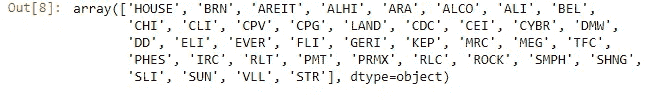
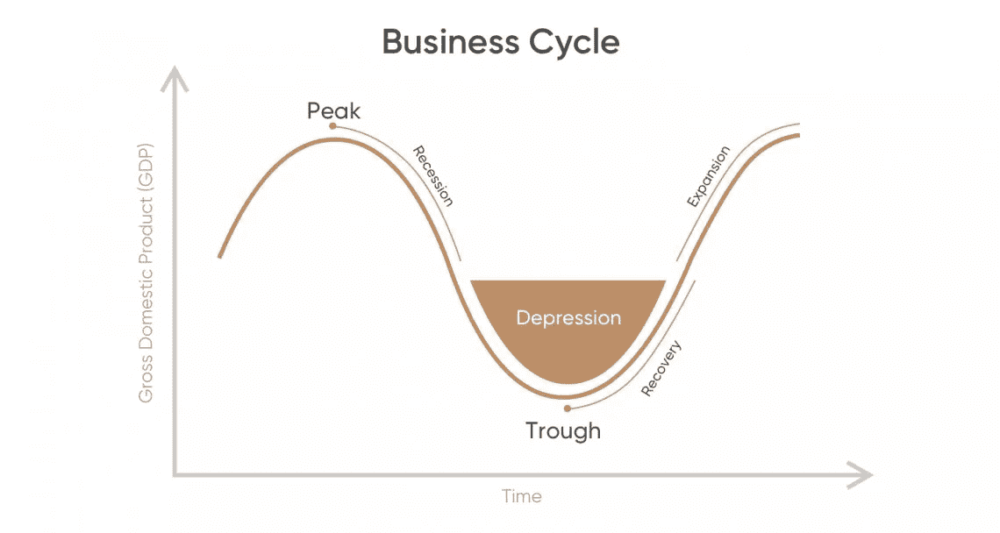
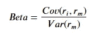
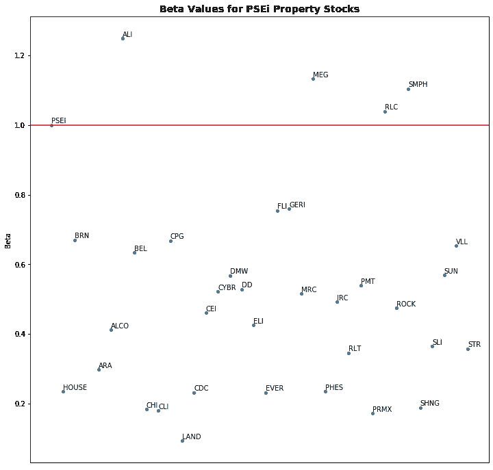
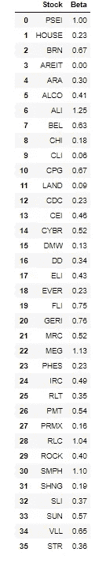

# 在股票投资中使用分析——通过分析了解菲律宾的房地产股票

> 原文：<https://medium.datadriveninvestor.com/using-analytics-in-equity-investing-understanding-philippines-property-stocks-through-analytics-32f30db638ed?source=collection_archive---------4----------------------->

## 菲律宾。金融分析。股票。房地产。

## 使用 Python 和 Fastquant 包访问菲律宾股票数据

在本文中，我将尝试结合房地产、数据科学和金融这三个不同的领域。这将是一项艰巨的任务，我们需要确保我们这样做的方式，以加强所有这些领域的写作。


Photo by [Precondo CA](https://unsplash.com/@precondo) at [Unsplash](https://unsplash.com/photos/OlSGcrLSYkw)

为此，我们将使用 fastquant 包。Fastquant 是由一组菲律宾开发人员开发的软件包。我对此感到非常自豪，这证明了我一直以来的想法:我们并不缺乏人才。所以让我们都来支持我们的菲律宾同胞，使用这个包！

首先，我们需要导入 fastquant。要安装它，只需输入你的 powershell ( *我用的是 Windows* )。

```
pip install fastquant
```

之后，我们导入以下包:

```
from fastquant import get_stock_data, get_stock_table
import pandas as pd
import numpy as np#For Visualization
import seaborn as sns
import matplotlib.pyplot as plt
%matplotlib inline
```

*get_stock_data* 方法允许我们获取在菲律宾证券交易所上市的所有股票。它返回一个数据帧，然后我们可以使用 pandas 来操作它。

```
stocks = get_stock_table()
```

为了只选择“地产股”，我们需要从股票表中过滤它。通过选择“扇区”==“属性”来分割数据帧。

```
property_stocks = stocks[stocks.Sector == "Property"]["Stock Symbol"].values
```

确认你拥有的是地产股。

令人惊讶的是，由于这一数据来自菲律宾证券交易所，AREIT ( *最近上市的房地产投资信托基金*)已经包括在内。

```
property_stocks
```



# **股票速成班测试版**

现在，让我们下载一些股票价格信息，并用它来计算贝塔系数。

股票贝塔揭示了股票对经济波动的敏感程度。贝塔系数为 1 意味着股票的走势与经济完全相关，如果经济增长 5%，股票价格预计会增长 5%。

小于一(1)的贝塔系数意味着股票受经济变化的影响较小(*在这种情况下，我们指的是整个股票市场，它被用作经济的衡量标准，尽管并不完美*)。

如果菲律宾股市增长了 10%，那只股票的增长不到 10%。这样做的好处是，如果股市下跌 10%，那只股票的跌幅小于 10%。通常，我们称这些股票为“防御性股票”。它们尤其为减缓经济增长提供了很好的防御。公用事业、医疗保健和消费品等行业属于这一类。

对于贝塔系数大于 1 的股票，我们称之为“周期性”股票。因为它们往往随着菲律宾股市的整体涨跌而波动。如果股市增长 10%，这些股票升值超过 10%。

**计算贝塔**

计算贝塔的过程需要你得到两件事:股票收益的方差，股票收益和菲律宾股市收益的协方差。

对于时间段:理想情况下，**我们想要一个覆盖整个商业周期的时间段**。这意味着一个时期有扩张和衰退的子周期。



Taken from capital.com

理想情况下，贝塔捕捉股票回报在所有时期如何随市场变动。

虽然专业人士对此有不同的偏好，但我们可以说，2010 年，世界正在从全球金融危机中复苏，到 2020 年，新冠肺炎标志着另一个衰退时期，我们完成了一个周期。

```
#Ensure that the trading date is earlier than current date. You can choose an earlier dateSTART_DATE = "2010-10-02"
END_DATE = "2020-10-02"property_df = pd.DataFrame()
for stock in property_stocks:
    try:
        df_ = get_stock_data(stock, START_DATE, END_DATE)
    except:
        continue
    df_.columns = [stock]
    property_df = pd.concat([property_df, df_], axis=1)
```

fastquant 包的未来开发将包括访问 PSEI 值的能力。现在，出于本练习的目的，让我们使用从第三方收集的信息。该文件可以从[我的 Github 页面](https://github.com/francisadrianviernes/Financial-Analytics/tree/master/Understanding%20Philippines'%20Property%20Stocks%20Through%20Analytics)访问。

```
psei = pd.read_excel('data/PSEI.xlsx', index_col=0)#Merge the two databases on similar indices, in this case, it is the datetime index.
merged = psei.merge(property_df, on='dt')
```

**贝塔公式**



where 𝑟𝑖 refers to the returns of stock i and 𝑟𝑚 refers to the market returns represented by PSEi returns.

幸运的是， *pandas* 有一个内置的方法，可以简单地应用我们之前的公式。

```
#Calculate the returns
ph_stocks_returns = merged.pct_change()#This formulation returns a matrix object (similar to correlation matrix)
beta_df = ph_stocks_returns.cov()/ph_stocks_returns.var()#unstack would turn this into a series
beta_df = beta_df.unstack()['PSEI'].to_frame()#We reset the index because we plan to label the plot later. Labeling is easier with an integer index.
beta_df = beta_df.reset_index()
beta_df.columns = ['Stock','Beta']
```

**将结果可视化**

现在我们已经有了测试表，让我们可视化，看看我们是否能从可视化中获得洞察力。

```
plt.figure(figsize=(12,12))
ax = sns.scatterplot(x=beta_df.index, y=beta_df.Beta);ax.set_title('Beta Values for PSEi Property Stocks',
            fontweight = 'heavy',
            fontsize = 14)#Drawing a horizontal line where the PSEI lies
ax.axhline(1, c = 'red');#Text
ax.axes.get_xaxis().set_visible(False);
texts = [ax.text(p[0], p[1]+.005,beta_df.loc[p[0], 'Stock']) for p in zip(beta_df.index, beta_df.Beta)];
```



Beta for PH Property Stocks



Calculated Betas for PH Property Stocks

**计算β的第二种方法**

另一种获得股票贝塔系数的方法是做线性回归，目标值是股票的回报，因变量是 PSEi 的回报。

```
from sklearn import linear_model#Create an empty dataframe to store our values
regression_beta = pd.DataFrame(columns=['Stock', 'Beta'])#list of stocks
tickers = ph_stocks_return.columns.to_list()#Call on the method
linear_regression = linear_model.LinearRegression()#before calling fitting on the regression, ensure that the nan values are filled with "0"
regression_df = ph_stocks_return.fillna(0)X = regression_df.loc[:,'PSEI'].values.reshape(-1, 1)
for i in tickers:
    y = regression_df.loc[:,i].values.reshape(-1, 1)
    linear_regression.fit(X,y)
    regression_beta.loc[len(regression_beta)] = [i,round(linear_regression.coef_[0][0],2)]
regression_beta
```

**用领域知识分析结果**

那么在投资地产股时，这些结果告诉了我们什么呢？它告诉我们，有一些股票对 PSEi 的走势特别敏感，比如 Ayala Land Inc .、Megaworld、Robinsons Land(RLC)和 SM Prime Holdings (SMPH)。这意味着在经济衰退时期，这些股票的跌幅相对大于 PSEi，因此一旦 PSEi 有望复苏，这些股票就会提供更多的上涨机会。

此外，这种做法质疑了金融界的通常观念，即贝塔系数较高的公司往往是那些在“奢侈品行业”经营的公司，贝塔系数较低的公司在更“防御性”的行业经营，被认为是“必需品”而不是“奢侈品”。事实上，一些知名开发商在“豪宅”领域表现出较低的贝塔系数(ROCK，SHNG)。

因此，未来的研究实际上可能想看看公司的规模是否在贝塔系数的影响中发挥作用，或者跨房地产细分市场(酒店、商场、住宅、办公室)的多样化是否影响贝塔系数。然而，快速浏览一下，似乎可以告诉我们，两者都会影响 it，因为我们发现一些公司也在进行综合开发(FLI)，拥有巨大的资产基础，如 VLL，但贝塔系数较低。

让我知道你的想法和你想知道的关于这个主题的其他事情。

完整代码: [Github](https://github.com/francisadrianviernes/Financial-Analytics/tree/master/Understanding%20Philippines'%20Property%20Stocks%20Through%20Analytics) 。