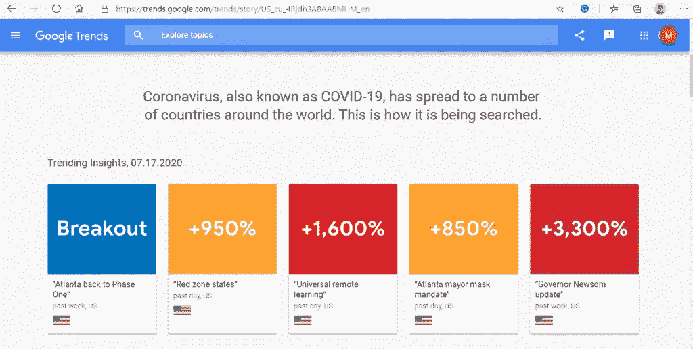

# 利用数据科学预测未来，拯救地球

> 原文：<https://medium.datadriveninvestor.com/using-data-science-to-predict-the-future-and-save-the-planet-dbde4c68a44f?source=collection_archive---------14----------------------->

> ****作为数据科学家，我们的工作就是从噪音中提取信号。****

****

**Photo by Michael Competielle**

# **大数据时代**

**我们目前正处于被称为 ***信息时代*** 和更重要的 ***大数据时代*** 的历史时期。数据和数字存储改变了我们分享知识和信息的方式。它也改变了我们消费内容的方式。一个有价值的知识财富几乎是几个按键的距离。**

**技术趋势创造了一个蓬勃发展的“智能”互联设备行业，即“物联网”。这些设备以前是“哑”设备，如你的牙刷、手表或冰箱。这种新技术正在蓬勃发展，因为大多数业务领域的制造商正在安装连接。根据英特尔的预测，到 2025 年，55%的数据将由 IOT 产生。**

**最近我买了一台新的 GE 窗式空调。在过去的几年里，我家的居民越来越少，中央空调系统也逐渐老化，我正在寻找减少碳足迹的方法。这个新的窗户单元的重量和我在公寓生活时记得的旧型号没有什么不同。IOT wifi 连接的整合让我大吃一惊。**

**为什么一台简单的空调需要 Wi-Fi 连接？实际上没有。当我思考让“老大哥”监控我的空调消耗的入侵性时，我决定无论如何都要连接。**

**GE 提供了一款应用 SmartHQ，可以让你的设备与外界连接。该应用程序监控外部温度、风扇速度、目标温度、过滤器状态，并允许选择经济模式。您可以远程监控您的室内温度和程序时间，直到循环开启和关闭。**

** [## 将定义 2020 年就业前景的五大数据科学和机器学习趋势|数据驱动…

### 数据科学和 ML 是 2019 年最受关注的趋势之一，毫无疑问，它们将继续发展…

www.datadriveninvestor.com](https://www.datadriveninvestor.com/2020/02/19/five-data-science-and-machine-learning-trends-that-will-define-job-prospects-in-2020/) 

# 为什么要共享数据？

好吧，所以数据共享和互联世界是一把双刃剑。一方面，随着越来越多的连接设备和数据流的增加，我们变得越来越不连接。我已经[写了](https://medium.com/mindful-muse/finding-connection-in-the-age-of-connectivity-f300d6ecf734)关于它的文章，并努力花一些时间与外界隔绝。那么剑的另一边是什么呢？*我们星球的未来。*

所以你可能已经停止阅读了，但是如果你还在等待，我会为你澄清这一切。我们目前不仅在努力应对全球变暖和致命的疫情，我们还在应对全球经济和潜在的 T4 经济崩溃。

# 那么，数据科学到底为什么重要？

问某人感觉如何？大多数时候，人们感觉“很好”、“还好”或疲倦。世界上有谁比谷歌更了解你？还有更重要的[谷歌趋势](https://trends.google.com/trends/?geo=US)？哦，原来我所有的数据都存储在那里？算是吧。根据电子前沿基金会的数据，92%的互联网搜索都是通过谷歌进行的。

即时 ***全球数据*** 的力量可以并将被科学家、营销人员、制造商和政府用来观察当前趋势。COVID 病例的爆发？谷歌大概先知道了。根据本周的谷歌美国趋势，COVID 的影响似乎是趋势。

通过汇编和分析数据，我们最终看到了疾病、经济困难、民事问题、环境问题等困难案例的趋势。通过自愿提供数据，我们让数据科学家有机会分享信息，这些信息最终可以帮助我们预测未来，并做出微小的调整以避免爆发和斗争。

> *[*统计就像比基尼*](https://www.mackenziecorp.com/much-data-not-enough-data-lets-start/) *。他们揭示的是暗示，但他们隐藏的是至关重要的。”**
> 
> *巴鲁克学院商学教授艾伦·莱文斯坦。*

****

***原载于 2020 年 7 月 19 日*[*【https://mtcwriter.com】*](https://mtcwriter.com/2020/07/19/using-data-science-to-predict-the-future-and-save-the-planet/)*。***

****访问专家视图—** [**订阅 DDI 英特尔**](https://datadriveninvestor.com/ddi-intel)**