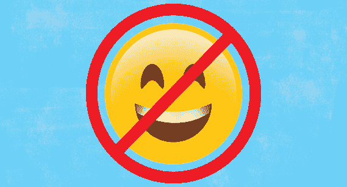
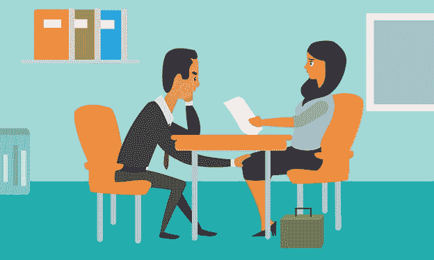

# 在工作场所使用表情符号以及为什么不应该使用

> 原文：<https://medium.datadriveninvestor.com/using-emojis-in-the-workplace-and-why-you-should-not-6faf8cbef3bd?source=collection_archive---------10----------------------->

表情符号……那些小的符号图标，在我们忙碌的生活中没有时间打一堆字的时候，可以快速地向朋友、家人和我们生活中其他特别的人表达我们的想法和感受。告诉朋友你好或祝一天愉快的笑脸，向浪漫的伴侣飞吻的眨眼脸，对工作中糟糕的一天做鬼脸的热红脸，带着泪水的皱眉脸告诉世界一些悲伤……所有这些表情符号和更多已经成为规范，我们大多数人每天相互交流的公认方式。我们通过短信、社交媒体，有时还有工作邮件来使用这些情感符号。

## 但问题是…我们应该在生活的各个领域使用它们吗？

给朋友、家人和爱人发个人短信或电子邮件…太棒了！

在非专业的社交媒体网站上发帖…没问题！

在工作场所的电子邮件或专业的社交媒体网站如 LinkedIn 上使用……绝对不行！

你会问，“为什么我们不应该在工作场所使用表情符号”？让我们来讨论我认为我们不应该在职业生活中使用表情符号的四个主要原因。

## 可以暗示讽刺

我知道你可能无意中在回复经理的邮件末尾使用了那个笑脸表情符号，意思是你愉快地完成了他们让你做的任务。你可能认为，在给同事的“我很抱歉造成了你必须改正的错误”的邮件中，面无表情只是请求原谅的一种方式。一张皱眉的脸插入到客户沟通中，为他们的货物为什么会延迟而道歉…我知道你这样做并没有任何负面的意思。

根据艾丽莎·k·洛威尔的说法，LCSW·R·CEDS 是一名临床社会工作者，也是纽约市的精神分析学家，她在题为*的文章中写道，我们为什么使用表情符号？有时，我们的话语受益于图片的添加，*我们经常出于几种不同的原因使用表情符号，如减轻情绪，减轻打击，以及当我们难以交流正确的话语时表达自己(Lowell，2016)。然而，她也指出，“表情符号没有标签，所以它们的意义取决于使用它们的人”(Lowell，2016)。这就是我开始对它们被用在工作场所有问题的地方。

 [## 不开玩笑:营销是为了搞笑|数据驱动的投资者

### 当你把幽默和营销结合在一起时，这是一件有趣的事情。当然，马克·安德森希望如此。别叫他雪莉。相反…

www.datadriveninvestor.com](https://www.datadriveninvestor.com/2019/02/25/no-fooling-marketing-goes-for-laughs/) 

由于表情符号可以有多种不同的解释方式，工作场所邮件的收件人可能不会按照你的本意来看待你的回复。当与患有饮食失调或婚姻问题的人打交道时，社会工作者或精神病学家使用表情符号来“缓解情绪”或“减轻打击”可能是没问题的；然而，当你的经理持续得到“完成”时，他可能会开始变得不耐烦😊“对他们多次要求你做的事情的回应。你的同事不得不经常给你发邮件来纠正你犯的错误，他会开始认为你每次给他们发的那张严肃的脸有讽刺的意思。如果客户继续收到皱眉表情，但未来错误数量没有变化，他们可能会去找另一家供应商，因为他们的订单被搞乱或再次延迟发货，所以他们真的想给你发送愤怒的红脸表情符号。

## 可能会被视为性骚扰

作为一名经理，我在一封电子邮件中收到了一张眨眼的脸，我在邮件中问其他员工为什么他们没有遵循某个流程。尽管我知道某个员工只是在暗示，他们很高兴我要求其他人也遵循他们之前要求的特定流程，但这让我作为一名人力资源经理开始思考，眨眼的表情是否合适。

眨眼、微笑或其他表情符号会被认为是职场性骚扰吗？是的，我相信他们可以，某些律师也是如此。

“在我的案例中，很常见的情况是，雇主对一个人说了一些不恰当的话——或发生了性关系——这个人感到震惊，无法做出回应。华盛顿特区的就业律师黛布拉·s·卡茨说:“通常，他们会用表情符号来试图缓解这种情况。我见过辩护律师说，‘这种行为不是不受欢迎的——看看表情符号。’他们不是说“现在就停止”，而是试图通过发送更友好的——或者至少更中性的——符号来传播这种情绪(Schirm，2018)。"

## 可能会表现出无能

虽然我们大多数人在个人互动中使用表情符号作为交流情绪和感受的一种有趣方式，但在工作场所使用表情符号可能只会让一个人显得无能。拥有硕士学位的同事除了一个笑脸表情符号之外，从来没有对任何问题或流程改进提出过任何真正的意见，这往往会让我认为他们真的不称职。在我看来，表情符号是他们散布对正在讨论的主题缺乏了解的一种方式。

如前所述，任何表情符号都有许多不同的含义。根据发表在《社会心理和人格科学》上的一项研究，笑脸不是微笑，“最好不要在正式的电子邮件中使用它们”(利贝曼，2017)。

## 可能会破坏信誉

不在工作场所使用表情符号的另一个原因是为了保留所有同事的信任。例如，如果我作为工厂控制员和人力资源经理发送一封电子邮件备忘录，提醒所有员工遵守公司的工作场所欺凌和骚扰政策，如果我在邮件中使用表情符号，我可能会被嘲笑和奚落。员工很可能会认为我是一个虚伪的领导者，自己都不遵守政策。

如果一位首席执行官需要发出一份备忘录，说明公司已经被出售，未来的裁员或重组即将到来，他/她不会希望使用皱眉表情，因为这可能会让公司陷入疯狂和混乱的状态。员工可能会立即跳槽，表现出消极的态度，变得效率更低；因此给企业带来了重大的成本问题。

总之，在商务邮件中偶尔使用表情符号可能没问题；但是，最好不要使用它们。无论是处理感到被欺负或被骚扰的员工提起的诉讼，还是由于高管不被重视而导致的生产力下降，还是其他工作场所的沟通问题，只要一个表情符号被错误地使用，个人或企业就会遭受严重的职业和经济影响。

## 参考

俄亥俄州利贝曼市(2017 年 8 月 17 日)。一项研究发现，在工作邮件中使用表情符号会让你看起来无能。检索自 CNN:[https://www . CNN . com/2017/08/17/health/emotics-emails-study-trnd/index . html](https://www.cnn.com/2017/08/17/health/emoticons-emails-study-trnd/index.html)

洛厄尔，A. K.-R. (2016 年 5 月 16 日)。*我们为什么使用表情符号？*检索自今日心理学:[https://www . psychologytoday . com/us/blog/contemporary-Psychology-in-action/2016 05/why-do-we-use-e mojis](https://www.psychologytoday.com/us/blog/contemporary-psychoanalysis-in-action/201605/why-do-we-use-emojis)

Schirm，B. (2018 年 11 月 18 日)。*表情符号能被认定为性骚扰吗？*检索自超级律师:[https://www . Super Lawyers . com/Washington-DC/article/can-e mojis-be-concerted-性骚扰/2d 21 E4 c 0-d606-4650-9717-44df 031755 ba . html](https://www.superlawyers.com/washington-dc/article/can-emojis-be-deemed-sexual-harassment/2d21e4c0-d606-4650-9717-44df031755ba.html)

*原载于 2020 年 1 月 26 日 http://thedeeperpocket.com***。**