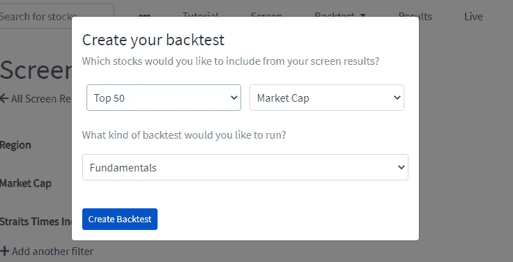
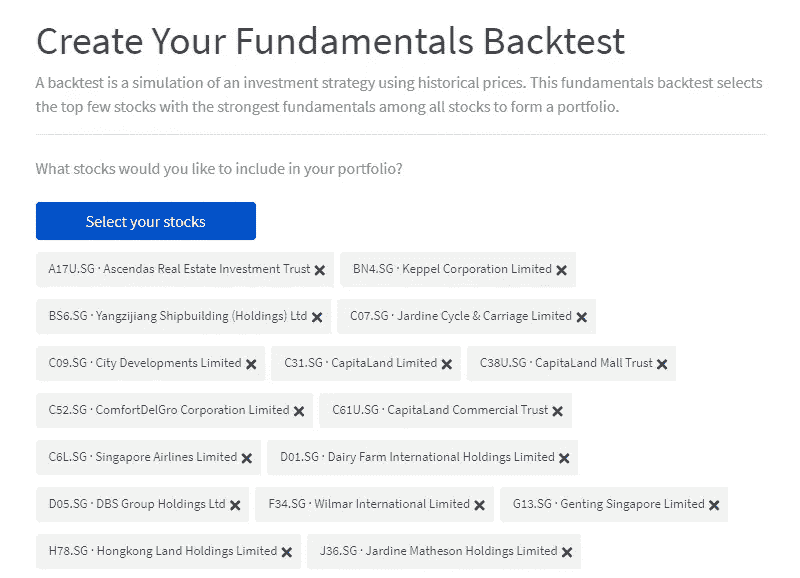
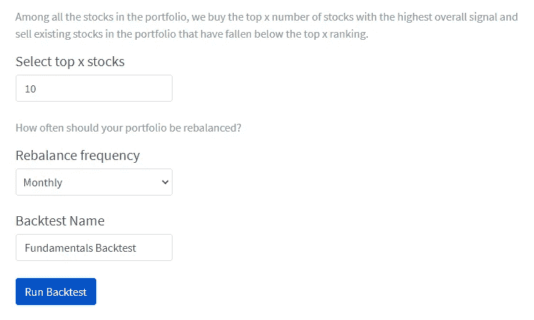
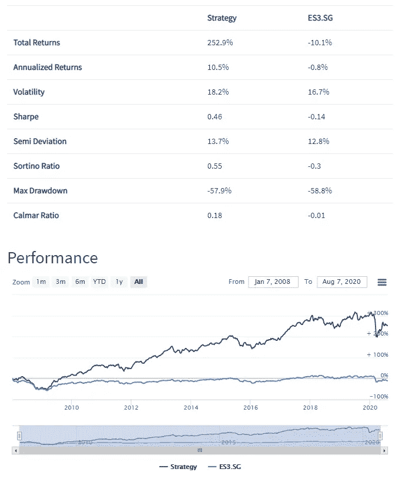
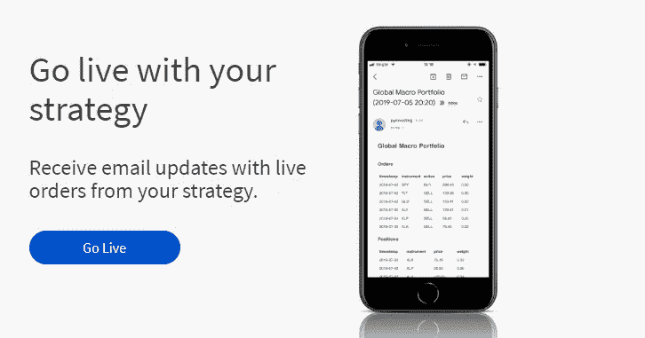

# 利用基本数据投资补充退休计划(SRS)

> 原文：<https://medium.datadriveninvestor.com/using-fundamental-data-to-invest-with-the-supplementary-retirement-scheme-srs-to-complement-your-d6005d2c096e?source=collection_archive---------17----------------------->

# 为什么你应该开始投资补充退休计划？

补充退休计划(SRS)是由新加坡政府设立的，旨在帮助新加坡人积累退休储蓄。该计划完全是自愿的，用于补充我们的中央公积金储蓄。您应该开始使用 SRS 进行投资的主要原因是，SRS 的**投资回报在提款前是免税的，在退休时，只有 50%的提款需要纳税。**

# 我应如何利用补充退休计划进行投资？

投资 SRS 的一个可能方法是使用基本因素，如市盈率、自由现金流收益率、利润率和利润增长，以实现惊人的结果。以下是你如何使用 pyinvesting.com 实现这一策略。

 [## 如何在不牺牲孩子或财务的情况下安全理智地离婚|数据驱动…

### 在美国，七月是以孩子为中心的离婚月。作为 cdfaⓡ的专业人士，我可以向你保证，从长远来看…

www.datadriveninvestor.com](https://www.datadriveninvestor.com/2020/07/28/how-to-divorce-safely-and-sanely-without-sacrificing-your-children-or-your-finances/) 

# **1)您投资领域的屏幕**

我们可能投资的工具有成千上万种，所以我们需要通过筛选我们感兴趣的股票来缩小名单。就我的策略而言，我打算只投资海峡时报指数中的股票。我们可以在[https://pyinvesting.com/screen/](https://pyinvesting.com/screen/)用下面显示的参数做一个筛选。

这将导致海峡时报指数中的 30 只股票被挑选出来组成我们的投资领域。

# **2)回测你的策略，确认它有效**

下一步是对你的投资领域进行回溯测试。回溯测试是使用历史数据模拟我们的投资策略。如果模拟结果很差，策略的表现远远低于其基准，这就证实了该策略不起作用。相比之下，如果该策略的表现远远超过其基准，它会让我们相信它很可能会继续表现良好。回溯测试还告诉我们应该在投资组合中持有哪些股票，这样我们就知道在实施我们的策略时应该买入或卖出哪些股票。

点击“使用屏幕结果创建回溯测试”按钮后，我们将选择我们想要模拟的策略类型。我将使用基本面策略，选择基本面因素最强的股票组成投资组合。

这将引导您进入创建基础回溯测试的表单。我选择的基准是海峡时报指数 ETF (ES3。SG)。

接下来，我们必须决定使用哪些基本面因素来选择我们的股票。

## **a .最低市盈率(P/E 比率)—权重为 25%**

这些股票的价格比它们的收益要低，而且正在折价交易。由于短期内市场对坏消息的过度反应，这些公司可能被低估。这使得价值投资者可以以巨大的折扣购买这些股票，并在它们恢复时获利。

## **b .最高自由现金流收益率——加权 25%**

这些股票在对资本资产进行再投资后，能够产生大量现金流。现金流健康的企业非常稳健，倾向于偿还债权人而不违约，并向投资者支付股息。

## **c .最高净利润率—加权 25%**

这些公司能够产生相对于其收入的高收入。这些公司往往有一个强大的管理团队，能够从销售中产生利润，并控制其运营成本。

## **d .最高利润增长率—权重为 25%**

这些公司在增加收入方面有着良好的记录。这可能意味着该公司正在扩大和增加其市场份额，从而使其更有利可图。通过选择这些股票，投资者能够从这些公司的增长中获利。

您可以为用于构建最终信号的每个因素分配权重。我选择的基本面因素同样占 25%的权重。

然后我们必须决定在投资组合中持有多少股票。我决定在投资组合中持有 10 只权重相等的股票，以避免集中风险。每个月，海峡时报指数中的股票根据其基本面因素进行排名，并选择前 10 只股票组成相等的加权投资组合。

# **3)分析你的回溯测试结果**

结果显示，自 2008 年以来，基本面策略的年化回报率为 10.5%，显著优于 STI 基准。尽管该策略的波动率较高，为 18.2%，而 STI 的波动率为 16.7%，但该策略的夏普比率较高，为 0.46，而 STI 的夏普比率为-0.14。这意味着该策略具有更高的风险调整回报。该策略的最高提款率为-57.9%，接近 2008 年金融危机期间 STI 的提款率-58.8%。

这种回溯测试表明，我们的基本策略在过去表现良好，因此，它很可能在未来表现良好。

# **4)实施您的战略**

通过选择使用你的回溯测试，PyInvesting 将每天使用实时价格运行你的回溯测试。我们将每天向您发送一封电子邮件，告知您当前的头寸以及您的策略产生的有效订单。只需选择您感兴趣的策略的回溯测试结果，然后单击“上线”。

开始使用补充退休计划(SRS)来保障您的退休生活

补充退休计划通过减少我们的税收和鼓励我们投资储蓄，帮助解决新加坡人的财政需求。虽然拥有投资储蓄的原则是很好的第一步，但拥有一个好的投资策略同样重要，因为它决定了我们的储蓄增长的速度。我讨论的投资策略是一个例子，说明如何利用基本面因素，如低市盈率、高自由现金流收益率、高利润率和高利润增长，来实现投资组合的市场回报。

# 附录:如何设置我的 SRS 帐户？

要设置您的 SRS 账户，请登录 DBS i-Banking，开立一个 SRS 账户，并至少转账 1 美元。SRS 帐户将在几天后出现，并在您的帐户摘要中显示一个帐号。接下来，进入您的经纪账户，将您的 SRS 账户与您的经纪账户关联起来。3 个营业日后，当您交易时，您的经纪账户应该有一个新的 SRS 结算模式。然后，您可以使用您的 SRS 帐户中的资金在该帐户上进行交易。有许多 SRS 批准的工具可供选择，如股票、债券、REITs、ETF、robo advisors 和单位信托。

# **关于作者**

伊万是 PyInvesting.comT2 的创始人，他对科技和金融充满热情。他曾在一家对冲基金担任软件开发人员，负责构建该基金的交易系统。

*原载于 2020 年 8 月 11 日*[*https://the finance . SG*](https://thefinance.sg/2020/08/11/using-fundamental-data-to-invest-with-the-supplementary-retirement-scheme-srs-to-complement-your-cpf-savings/)*。*

**访问专家视图—** [**订阅 DDI 英特尔**](https://datadriveninvestor.com/ddi-intel)