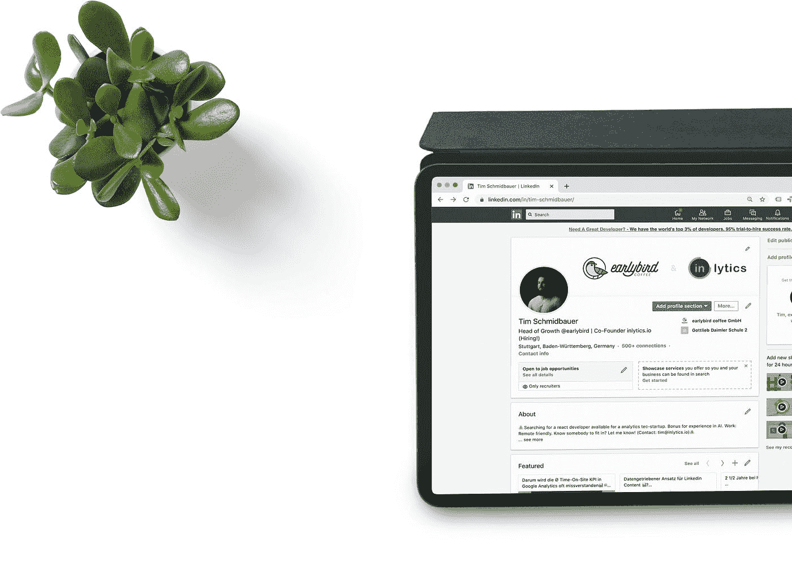

# 小型企业使用 LinkedIn 营销

> 原文：<https://medium.datadriveninvestor.com/using-linkedin-marketing-for-small-businesses-734987533cf1?source=collection_archive---------41----------------------->

## 啊，领英

Photo by [analytics | LinkedIn Analytics Tool](https://unsplash.com/@inlytics?utm_source=medium&utm_medium=referral) on [Unsplash](https://unsplash.com?utm_source=medium&utm_medium=referral)

LinkedIn 拥有超过 5 亿用户，是 B2B 领域的最佳途径，尽管它不是一个受欢迎的社交媒体。现在我们来看一些我发现的为您的企业创造更多销售线索、客户和销售额的最佳方法。

啊，领英。作为世界上最无聊的社交媒体平台，它已经走过了漫长的道路。它现在已经证明了自己，并发展成为一个绝对的商业专业人士的发电站，他们希望扩大自己的网络，并与其他志同道合的人联系。

但就像所有的社交媒体平台一样，它的好坏和有用程度取决于它背后的实际策略。

我们首先需要确保 LinkedIn 是最适合你和你的企业的地方。确定这一点的唯一方法是从你的理想目标市场开始，你试图接触谁，你将要使用的信息和他们的痛点和问题，以及你的企业积极定位要解决的事情。

*然后，这两种方式如何协同工作，从那里，你将最终选择媒体，在这种情况下，可能会也可能不会 LinkedIn。*

# 价值第一

现在说到 LinkedIn，我对你最大的呼吁是不要发垃圾邮件。请不要发垃圾邮件。

每个人都吐，这太可怕了。如果你在这个平台上呆过一段时间，你会很清楚我在说什么。你的收件箱正被各种各样的、乏味的、普通的提议填满，这些提议是给那些试图解决你可能没有的问题的人的。因此，垃圾邮件是你能做的最糟糕的事情，那么很明显，当你开始一段新的关系时，你会希望尽可能提前、尽可能快地提供更多的价值。

你在这里想做的是。把 LinkedIn 想象成一个真实的社交活动。

在社交活动中，人们最不喜欢的事情就是有人突然出现在他们面前，把他们的名片推到他们面前，开始漫谈他们和他们的业务，以及他们能做的所有美好的事情。

*可怕。*

要克服这一点并避免向某人发送垃圾邮件，你需要做的就是做一些尽职调查。查看他们的个人资料，通读他们的简历，查看他们的链接或访问他们的网站，尝试了解他们在哪里，他们来自哪里，然后看看你和你的企业之间以及他们和他们的企业之间是否有一些重叠，以及你如何能够提前提供一些价值，以开始对话和建立关系。

# 搜索引擎？

LinkedIn 应该明白，在为你的企业进行营销时，它的运作非常像一个搜索引擎。

*它是一个搜索引擎。*

这意味着你需要确保充分优化你的个人资料，用你的目标受众会搜索的关键词来完成。这也意味着定期更新你的简历和你的全部个人资料，确保它是最新的，包含最新的信息，并准确地反映你目前的职位、工作和专长。

例如，假设你参与了数字营销。

显然，你要确保你的简介在标题、描述和简历中包含这些关键词，因为如果有这些关键词，任何寻找这些关键词的人都更有可能找到你。

很明显，对吧？

LinkedIn 为你提供了大量不同的领域来填写你的简历，所以确保你浏览了所有的内容，包括经历。你所有的工作细节，试图建立一些证明，基本上确保你的个人资料尽可能完整。

不需要太长时间，也很值得付出。

Photo by [inlytics | LinkedIn Analytics Tool](https://unsplash.com/@inlytics?utm_source=medium&utm_medium=referral) on [Unsplash](https://unsplash.com?utm_source=medium&utm_medium=referral)

# 第一印象很重要

要明白第一印象很重要，而且非常重要。同样，这也是 LinkedIn 充当离线社交活动或与某人见面的地方。

你希望将我们在线下世界使用的许多概念结合起来，并将它们带到在线世界，尤其是当它与 LinkedIn 相关时。

这意味着要有一份干净、简洁、清晰的简历，以及一张准确反映你是谁和你代表什么的专业头像。在一个完美的世界里，我们永远不会根据一个人的长相来判断他。尽管如此，我们并不是生活在一个完美的世界里。

这就是为什么你必须尽可能准确地展示你最好的一面，以一种理想的方式展示自己，吸引你理想的目标市场。这意味着要有一张干净专业的头像，一份漂亮的简历，反映和建立一份一流的在线简历或作品集。

理解第一印象的重要性，并利用这一点。

 [## 给数字营销工作者的 5 本书推荐|数据驱动的投资者

### 随着就业率的上升，由于疫情和人们花更多的时间在网上，数字营销的技巧…

www.datadriveninvestor.com](https://www.datadriveninvestor.com/2020/10/28/5-book-recommendations-for-those-who-work-with-digital-marketing/) 

# 页面与个人帐户

理解页面和个人页面的区别。

现在我们在这里讨论的是个人资料和商业页面的区别。这将类似于许多不同的社交媒体网络，包括脸书，在那里你将有你的个人资料，当然，你的公司业务页面。

脸书个人和 LinkedIn 个人与脸书商业和 LinkedIn 商业有一些*的相似之处，但也有一些不同之处。*

首先，对于 LinkedIn 来说，如果你是企业主或创始人或类似的人，你会希望有一个公司业务页面，但对于 LinkedIn 来说，你将从哪里获得最大的回报实际上是通过你的个人资料。

这是因为人们喜欢与人做生意，而不是做生意。因此，接触和发布内容，与人建立联系和网络就容易多了。

你这样做是从你的个人资料和人类和真实的。这与脸书有点不同，因为脸书不是一个商业网络平台，所以你在脸书使用你的商业页面比你的个人页面会有更好的结果。

但这并不意味着你应该忽略任何一个，无论我们谈论的是脸书还是 LinkedIn，两者都可以使用。

# LinkedIn 广告。

我喜欢广告，并认为这可能是营销策略中最有力的选择之一，因为你能够将你的完美信息迅速传递到你理想的目标市场，并跟踪一切。

因此，在脸书、Instagram 和 YouTube 上，广告无疑是最佳选择之一，也是我们大多数合作客户的首选工具。

但是 LinkedIn 呢？这是一个有点不同的故事。与脸书、Instagram 和 YouTube 等其他平台不同，LinkedIn 的广告非常昂贵。非常贵。现在，这并不意味着你应该完全忽略它们，根本不用它们。

不过，你需要确保你获得了足够高的终身客户价值，以证明这笔费用是值得的，因为当谈到广告时，它完全是关于投资回报或广告支出回报的。

当然，另一方面，如果你的目标是一家公司的总裁、首席执行官或其他高管，那么 LinkedIn 可能是个不错的选择，但要再次确保你已经获得了足够高、足够多的终身客户价值，从而为正投资回报做出贡献。

# 建立联系

我关于 LinkedIn 广告的最后一点是:脸书广告是的，Instagram 广告是的，YouTube 广告是的，LinkedIn 广告，也许是，也许不是。幸运的是，你可以单独用你的个人资料做很多破坏，所以从那里开始。

LinkedIn 是关于建立联系的。做到这一点的方法是网络或潜在客户 101。

了解这个人，提供一些有价值的东西，不要急于求成或兜售，明白良好的关系和适当的网络需要时间来建立和培养。

## 访问专家视图— [订阅 DDI 英特尔](https://datadriveninvestor.com/ddi-intel)