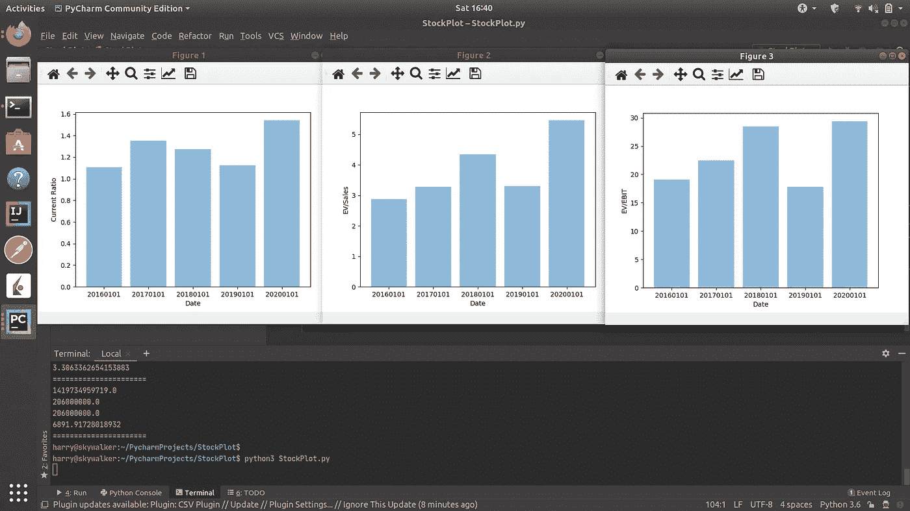

# 使用 Matplotlib 分析股票趋势

> 原文：<https://medium.datadriveninvestor.com/using-matplotlib-to-analyze-stock-trends-2599332e4530?source=collection_archive---------7----------------------->


在本教程中，我们将学习如何利用 Python 中的数据可视化来研究公司估值、流动性和运营效率的趋势。

我们还将从我在 [TenQuant.io](https://www.tenquant.io/) 上的 API 中获取历史财务数据。你可以在网站上免费注册一个 API 密匙——你可以直接从 SEC 的数据库中获得早在 2010 年的财务报表和价格。注册你的 API 密匙并把它放在安全的地方。

在开始任何重大项目之前，最好先做好计划。让我们写出一些类和方法存根，并导入一些我们将要使用的库。打开 Python IDE 或编辑器，编写以下代码:

```
import matplotlib.pyplot as plt; plt.rcdefaults()
import numpy as np
import matplotlib.pyplot as plt 
import requests

class StockPlot:
    def __init__(self, ticker):
        self.ticker = ticker

    # plots a graph of our data over time
    def plot(self):
        pass

    # returns a Dictionary of point-in-time financial data
    def get_financials(self, date='20200101'):
        pass

    # runs calculations and returns the current ratio: current assets - current liabilities
    def get_current_ratio(self, financials):
        pass

    # returns enterprise value to sales
    def get_ev_to_sales(self, financials):
        pass

    # returns ev to ebit, excluding unusual items
    def get_ev_to_ebit(self, financials):
        pass
```

这是一种松散的面向对象的方法——请注意，我们将各种特定的计算分解成单一的方法。这有助于我们保持更清晰的代码，并轻松地添加新功能。

让我们从 [TenQuant.io](https://www.tenquant.io/) 的财务数据开始:

```
def get_financials(self, date='20200101'):
    API_KEY = 'YOUR_KEY_HERE'

    # use an f-string to build your query
    query_url = f'https://api.tenquant.io/historical?key={API_KEY}&date={date}&ticker={self.ticker}'
    financials = requests.get(query_url).json()
    return financials
```

该方法将在指定日期返回一个经过清理的标准化财务的 JSON 表示。

接下来，我们需要对这些财务数据进行一些基本的计算，这样我们就可以可视化趋势。我选择了流动比率(因为它可以让我们看到一家公司是否有能力按时履行义务)、EV-to-sales(一种估值指标，衡量收购一家公司的成本与其产生的收入之比)和 EV-to-EBIT，这是另一种估值指标，常用于模拟收购一家公司的成本。

先说流动比率:

```
def get_current_ratio(self, financials):
    current_assets = financials['currentassets']
    current_liabilities = financials['currentliabilities']
    return current_assets / current_liabilities
```

如您所见，这是一个相当简单的计算。低于 1 或 1.5 的流动比率可能表明一个公司有在下一年无法偿还债务的危险，除非它能产生足够的现金流来偿还债务。

[](https://www.datadriveninvestor.com/2020/03/12/three-simple-questions-and-one-difficult-one-to-ask-before-investing-in-a-blockchain/) [## 投资区块链前要问的三个简单问题(也是一个困难的问题)|数据…

### 现在是了解区块链的最佳时机。不同货币之间的增长率，比如…

www.datadriveninvestor.com](https://www.datadriveninvestor.com/2020/03/12/three-simple-questions-and-one-difficult-one-to-ask-before-investing-in-a-blockchain/) 

接下来是电动汽车销售。企业价值定义为:[市值]+[债务]-[现金及等价物]。因为有些财务报告不是全年的，我们还需要按年计算报告的收入。

```
def get_ev_to_sales(self, financials):
    sales = financials['revenues']
    duration = financials['duration']  # figures are from this many quarters
    cash = financials['currentassets']  # substitute current assets for cash
    debt = financials['liabilities']
    market_cap = financials['marketcap']

    annualized_sales = sales / (duration / 4)  # annualize sales

    ev = market_cap + debt - cash
    ev_to_sales = ev / annualized_sales

    return ev_to_sales
```

最后，我们将计算 EV-to-EBIT。根据计算方式的不同，EBIT(息税前收益)可以自下而上计算(取净收入，加回利息和税)，也可以自上而下计算(仅计算营业收入)。我们将采用前一种方法，因为它更符合指标的精神，但可能包括非营业收入和费用。

```
def get_ev_to_ebit(self, financials):
    net_income = financials['netincomeavailabletocommonstockholdersbasic']
    interest = financials['interestanddebtexpense']
    taxes = financials['incometaxexpensebenefit']
    ebit = net_income + interest + taxes*(-1)  # taxes are recorded as an absolute figure: income/(loss)

    duration = financials['duration']  # figures are from this many quarters
    cash = financials['currentassets']  # substitute current assets for cash
    debt = financials['liabilities']
    market_cap = financials['marketcap']

    annualized_sales = ebit / (duration / 4)

    ev = market_cap + debt - cash
    ev_to_ebit = ev / annualized_sales

    return ev_to_ebit
```

太好了！现在，我们需要使用强大的 Python 数据可视化工具 Matplotlib 来可视化这些数据点。获取数据并为绘图做好准备:

```
def plot(self):
    dates = ['20160101', '20170101', '20180101', '20190101', '20200101']
    x_pos = np.arange(len(dates))

    # let's use some fancy list comprehension
    # it's fun and makes for cleaner code.
    financials = [self.get_financials(d) for d in dates]
    current_ratios = [self.get_current_ratio(f) for f in financials]
    ev_to_saless = [self.get_ev_to_sales(f) for f in financials]
    ev_to_ebits = [self.get_ev_to_ebit(f) for f in financials]
```

现在，我们只需要使用 Matplotlib 生成一些图。

```
# window 1
plt.figure(1)
plt.bar(x_pos, current_ratios, align='center', alpha=0.5)
plt.xticks(x_pos, dates)

plt.ylabel('Current Ratio')
plt.xlabel('Date')

# window 2
plt.figure(2)
plt.bar(x_pos, ev_to_saless, align='center', alpha=0.5)
plt.xticks(x_pos, dates)

plt.ylabel('EV/Sales')
plt.xlabel('Date')

# window 3
plt.figure(3)
plt.bar(x_pos, ev_to_ebits, align='center', alpha=0.5)
plt.xticks(x_pos, dates)

plt.ylabel('EV/EBIT')
plt.xlabel('Date')

# plot graphs
plt.show()
```

最后，添加这些代码，让你的程序运行起来！

```
if __name__ == '__main__':
    sp = StockPlot('AAPL')
    sp.plot()
```

你应该会看到三张美丽的图表记录了苹果公司的发展趋势。



像往常一样，研究一下这段代码，让它成为你自己的代码。尝试绘制新的变量，改进逻辑，或者尝试新的图表类型。祝你玩 Python 愉快！

在我的 Github 上查看完整的项目:[https://github.com/hsauers5/StockPlot](https://github.com/hsauers5/StockPlot)