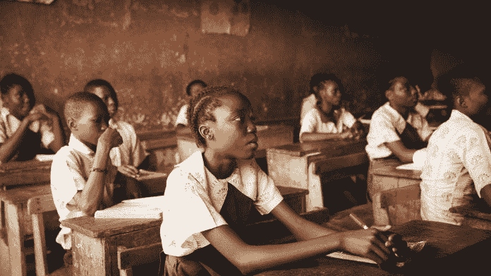
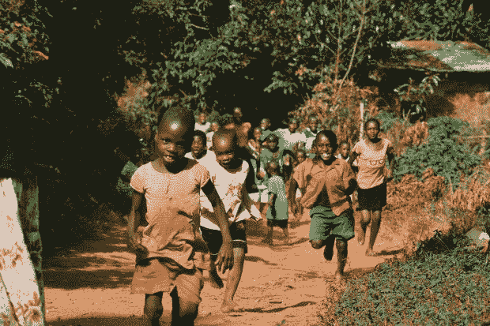
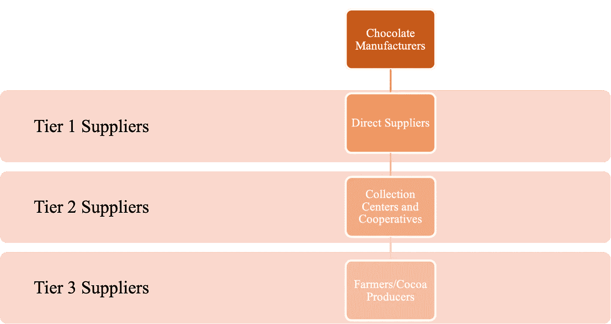
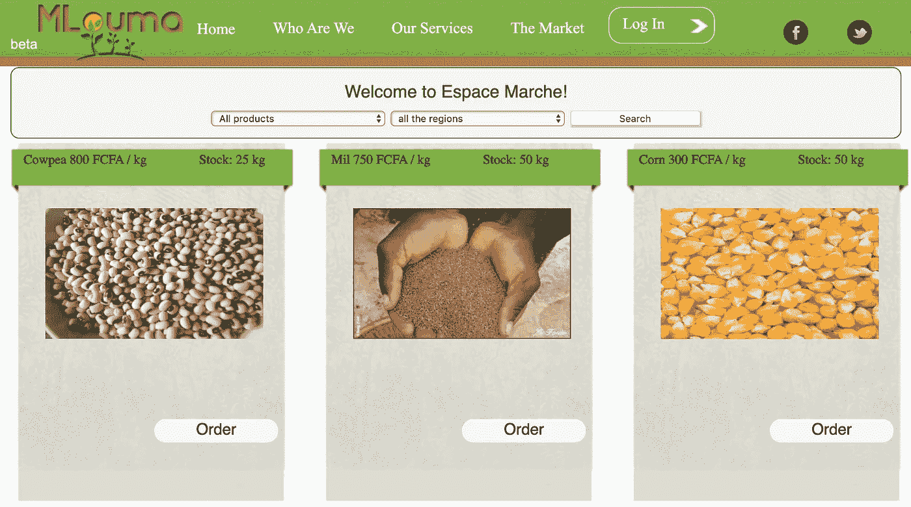
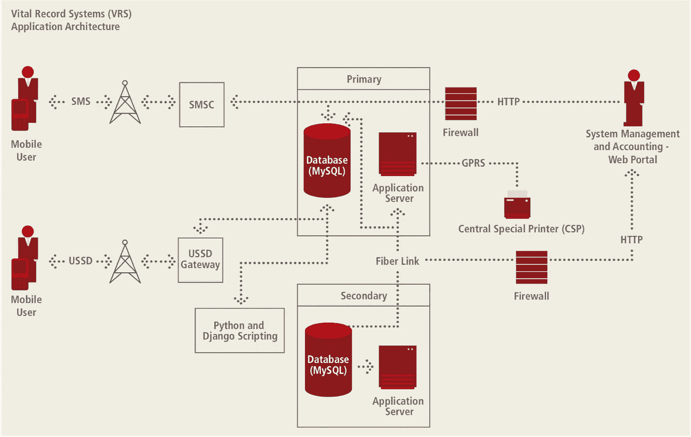

# 使用手机帮助消除科特迪瓦可可农场的童工现象

> 原文：<https://medium.datadriveninvestor.com/using-mobile-to-help-eradicate-child-labor-on-ivorian-cocoa-farms-e8b49c5f4ed1?source=collection_archive---------10----------------------->

西非农民使用童工来经济高效地扩大巧克力公司用来制作巧克力的可可产量。在消费者的视野和思维之外，这件事往往无法获得应有的关注。大约 210 万名儿童在科特迪瓦和加纳的可可农场工作时，必须面对这个黑暗的现实。

[科特迪瓦生产世界上 32%的可可](http://documents.worldbank.org/curated/en/782461531301524037/pdf/128223-WP-IVC-ENGLISH-Digitizing-Cocoa-Value-Chain-PUBLIC.pdf)，这是我们所吃的巧克力中的一种关键成分。不幸的是，科特迪瓦农民受到结构性贫困的困扰，[可可种植户的平均收入仅为科特迪瓦农村生活收入的 37%。为了最大限度地降低可可种植的劳动力成本，科特迪瓦可可种植者雇佣童工。虽然大多数童工与他们为之工作的农民有家庭关系，但仍有其他人通过中间人被贩卖或招募。在最可怕的情况下，可可农场的儿童被迫工作，甚至被奴役。](https://www.voicenetwork.eu/wp-content/uploads/2019/07/2018-Cocoa-Barometer.pdf)

Photo by Seth Doyle on Unsplash

在充当田间工人的同时，儿童在不健康的环境中从事危险的工作，包括烧荒和清理田地、喷洒农药、使用锋利的工具打碎可可果荚，以及搬运沉重的可可果荚和水。至少，从事这一行会分散孩子上学的注意力。这些儿童进入教育机构的机会进一步受到限制，因为他们害怕在学校遭受性虐待和身体虐待，缺乏教员，无法出示适当的身份证件(如出生证明)，交通需求高，卫生设施差，以及学费昂贵。没有教育，孩子们就被剥夺了提升自己的机会，从而使家庭的贫困延续到下一代。

 [## 幸福的算法？数据驱动的投资者

### 从一开始，我们就认为技术正在使我们的生活变得更好、更快、更容易和更实用。社交媒体…

www.datadriveninvestor.com](https://www.datadriveninvestor.com/2019/03/08/an-algorithm-for-happiness/) 

**鉴于这种情况，包括玛氏、雀巢和好时在内的许多巧克力制造商已经承诺从他们的供应链中消除童工。**

不幸的是，巧克力公司正在努力兑现他们的承诺，因为他们很难识别可可农场的童工案例。在许多情况下，农场工人的年龄只能根据外表来估计，因为工人可能没有出生证明。此外，通过对农场进行随机检查和审计，巧克力公司冒着得罪可可种植者的风险，并使童工现象隐藏起来，但并没有减少。

[让事情变得更复杂的是，家庭农场文化和传统，以及对农村地区儿童角色的根深蒂固的态度，可能与巧克力制造商定义的童工相冲突。](https://www.ilo.org/ipec/areas/Agriculture/WCMS_172416/lang--en/index.htm)这些文化差异以及使用童工节省的成本可能会阻止可可种植者参与巧克力公司识别和消除童工的努力。

为了解决这种利益冲突并实现他们的目标，巧克力制造商需要将他们的注意力从攻击童工制度转移到识别和补救迫使可可种植者使用童工的情况。这将要求巧克力公司投资建立一种以**开放交流**和**互惠互利**为核心的关系，与为其供应链做出贡献的可可种植者合作。

**促进开放式沟通**

> 根据一些行业顾问的说法，部分问题在于这些公司没有做足够的工作来充分调查问题的深度。
> 
> —《华盛顿邮报》(彼得·沃利斯基、雷切尔·西格尔、萨尔万·乔治)

**Figure 1: Simplified Supply Chain for Chocolate.** Currently, many leading chocolate manufacturers cannot physically trace a significant portion of the cocoa shipments that they receive down to the farm-level. Naturally, they cannot visit farms that they do not even know contribute to their supply chains. The image is an original creation.

由于各种原因，巧克力公司仅仅依靠亲自拜访，有可能使与可可种植者的交流变得断断续续。与位于困难地形或与交通基础设施脱节的农场中的农民打交道尤其具有挑战性。此外，考虑到巧克力公司仍然无法在地理上确定为其供应链做出贡献的所有农场，因此目前不可能亲自接触许多可可种植者。

幸运的是，巧克力公司可以利用移动通信作为解决物理访问带来的限制的方法。通过移动连接，只要农民有网络覆盖，他们就可以与农民保持联系。这可以为农民提供更多的机会来表达他们的想法、问题、需求和担忧。为了让农民在讨论童工等敏感话题时感觉更自在，巧克力公司可以建立一个单独的帮助热线，匿名提供农民的联系方式。

利用从这些对话中收集的信息，结合他们可以通过手机管理的调查和问卷，巧克力公司可以学习如何通过科特迪瓦可可农民的视角来看待世界。通过这样做，他们可以更好地理解可可种植者所承受的困难，以及导致使用童工的潜在力量。

**启动互惠安排**

一旦巧克力制造商对童工的根源有了深入的了解，他们就可以开发专门针对童工的移动服务。通过这样做，巧克力公司可以同时改善可可种植社区的整体生活质量，在消除童工方面取得进展，并向可可种植者证明，他们的重点不是惩罚使用童工的农民，而是为他们提供补救措施。

例如，巧克力公司可以开发移动应用程序，降低可可种植者获取信息的成本。对大多数美国人来说可能是简单的谷歌搜索，但对没有互联网的可可种植者来说可能是无法获得和负担不起的情报。为了解决与这种信息不足相关的财务缺陷，巧克力公司可以使用语音和文本定期向可可种植者告知当前可可的世界市场价格、提高产量的生产技术、市场趋势和天气预报。这将使巧克力制造商提高可可种植者的利润率，同时解决贫困问题，这是使用童工的一个驱动力。

**Figure 2: MLouma.** MLouma is a mobile platform that sends real-time updates to Senegalese farmers on the market price, location, and availability of farm products through the Internet, SMS, or a call center. Chocolate companies can invest in a similar service to increase profit margins for cocoa farmers. Image by MLouma.

另一个例子是，巧克力公司可以为可可种植社区部署移动出生登记服务。[全国出生登记率仅为 65%](https://www.gsmaintelligence.com/research/?file=d1553a76179408fc82301b75174bc281&download) ，科特迪瓦是西非许多出生登记率低的国家之一，原因是国家出生登记办公室和农村之间缺乏有效的沟通。为了进行出生登记，村长经常不得不长途跋涉，这是一项既费钱又费时的工作。对于村长来说，这是一个无法克服的问题，在这样的社区中，儿童可能仅仅因为没有出生证明而无法获得国家医疗服务、入学或要求继承权。此外，他们更有可能成为童工的受害者，因为他们无法证明自己的年龄。通过部署允许可可种植社区通过移动设备进行出生登记的移动服务，巧克力公司可以允许社区克服登记障碍，将新的特权扩展到农民的子女，并提高他们自己验证农场工人年龄的能力。

**Figure 3: Mobile Birth Registration.** In order to address the low birth registration rate in Uganda, Uganda Telecom developed a mobile app (using the architecture shown above) that allows Ugandan village chiefs to register local births with mobile phones, without needing an Internet connection. Image by GSMA Mobile Identity Team.

**以移动为中心的供应链管理方法在科特迪瓦的前景**

移动电话的电池寿命相对较长，并且几乎不需要基础设施就能工作。移动技术的这些低维护质量使得在科特迪瓦电信和电气化基础设施不发达、人口稀少的广大地区增加移动电话拥有量和网络覆盖率成为可能。[根据国际金融公司](http://documents.worldbank.org/curated/en/782461531301524037/pdf/128223-WP-IVC-ENGLISH-Digitizing-Cocoa-Value-Chain-PUBLIC.pdf)进行的一项研究，研究地区 81%的科特迪瓦可可种植者报告说，他们家附近的网络蜂窝覆盖良好，99%的人可以使用移动电话。

随着获得移动技术对科特迪瓦可可种植者来说变得越来越普遍，巧克力公司应该开始利用移动通信的力量来管理他们的供应链。在这一努力中，巧克力公司可以与科特迪瓦领先的移动网络运营商合作，包括 Orange、MTN 和 Moov，以汇集使用移动设备帮助消除科特迪瓦可可农场童工所需的技术资源。