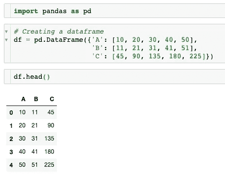
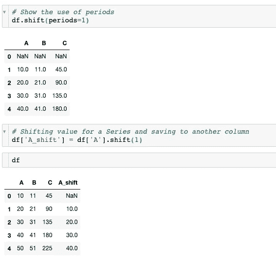
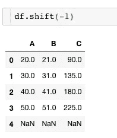
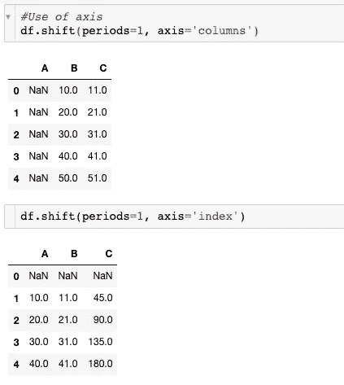

# 使用熊猫的“轮班”功能

> 原文：<https://medium.datadriveninvestor.com/using-pandas-shift-function-764df8c5dfcf?source=collection_archive---------0----------------------->

你对熊猫转移功能了解多少？不到一周前，我发现了如何使用它。以前，我从来不需要推动我的数据帧的值，除非我在处理时间序列。在这种情况下，时间序列模型负责计算指定的滞后。然而，在 pandas 中，您可以通过使用 pandas.DataFrame.shift 获得类似的结果。

**参数**

该函数最多可以有 4 个参数。

默认情况下,“周期”等于 1 表示要移动的周期数。它可以是积极的，也可以是消极的。负数会将数值上移。

‘freq’是保留原始数据；这意味着指数不仅仅是转移数据。

有一个“轴”参数来告诉移动的方向。可能的值为 0 或“索引，1”或“列”。

 [## 2019 年最值得学习的编码语言|数据驱动的投资者

### 在我读大学的那几年，我跳过了很多次夜游去学习 Java，希望有一天它能帮助我在…

www.datadriveninvestor.com](https://www.datadriveninvestor.com/2019/02/21/best-coding-languages-to-learn-in-2019/) 

最后但同样重要的是，“fill_value”可用于因移位而引入的缺失值。通过移动数据，我们将丢失第一个或最后一个索引的一些值，这取决于“周期”值。我们可以决定用我们选择的值来填充这些“NA”。

**例句**

*   让我们首先创建一个简单的数据框架来展示 shift 函数的使用和输出。

A simple dataframe with random numbers

*   移位 1 个周期的结果是什么？

如前所述，周期的值指示如何移动数据。在第一种情况下，输出导致所有列移位。最初在索引 0 中的值转移到索引 1，依此类推。此外，我们只能移动一列。结果可以保存在新列中以供将来使用。注意，我们丢失了最后一个值，第一个值是 NaN。

Output of a negative period value.

*   应用“轴”会如何改变结果？

默认情况下,“轴”设置为索引值。第二行代码返回了与前面相同的输出。但是，如果我们想将 dataframe 的值转移到下一列，我们必须将“columns”作为“axis”的值传递。

*   怎么去掉‘南’？

Filling NAs by the value you want to

“fill_value”参数很重要，因为它有助于我们删除 NAs，并且根据项目，我们将用最佳值替换所有的 NaN。有些模型不接受空值，在这种情况下，我们将不得不丢弃 NAs 或者用适当的值来替换它们。请注意，给定的值将替换我们原本应该拥有的所有 NAN。

移位函数可能非常有用，并且比对值进行切片更容易。该函数的一个用例可以是线性回归，其中因变量的先前值构成模型中的一个特征。

如果您有任何问题或想要其他功能的替代品，请随时联系我。