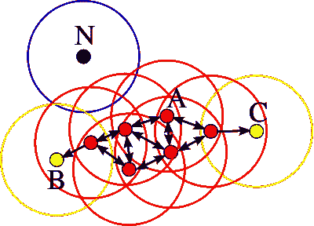
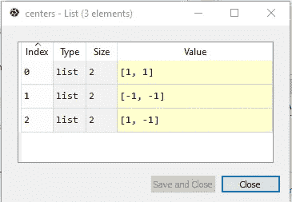
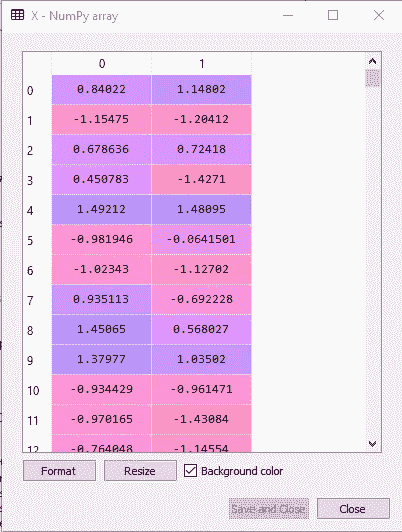
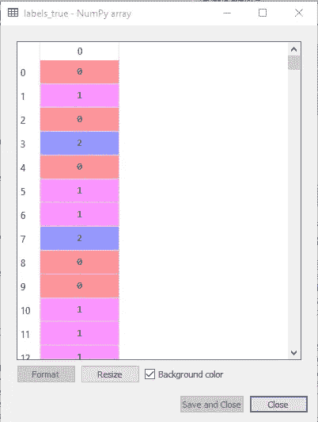
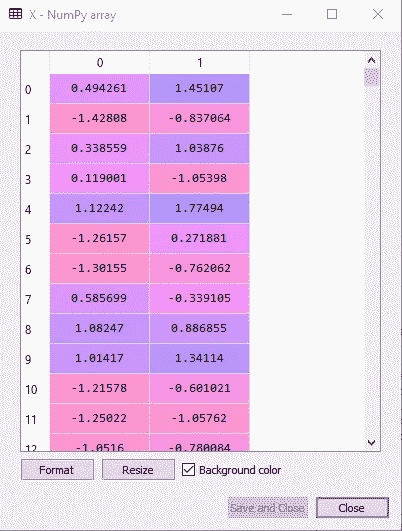
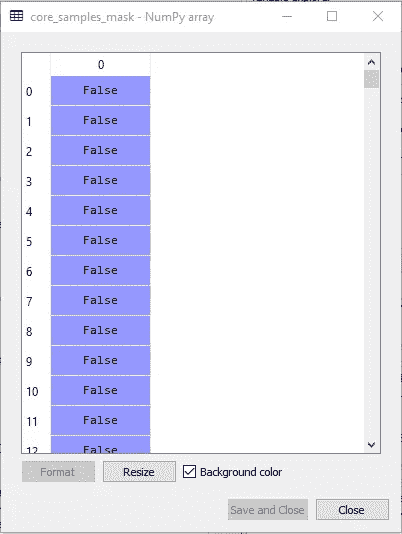
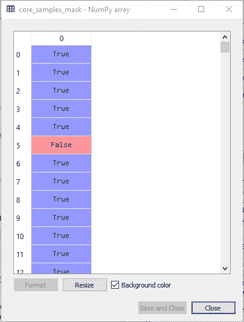
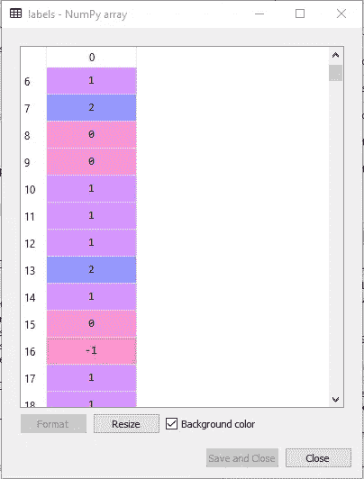
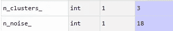
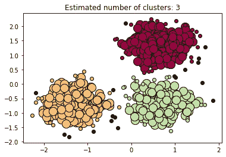

# 使用 Python 和 Sklearn 的 DBSCAN 寻找高密度岩心样本

> 原文：<https://medium.datadriveninvestor.com/using-python-and-sklearns-dbscan-to-find-core-samples-of-high-density-784805832874?source=collection_archive---------2----------------------->

## 实现 DBSCAN 算法以查找岩心样本


(Image from [Pixabay](https://cdn.pixabay.com/photo/2017/04/17/00/38/galaxy-2236129_960_720.jpg))

**DBS can**——**的简称，是一种基于密度的聚类算法。基于密度参数形成聚类。**

就 DBSCAN 而言，密度意味着位于给定区域内的点的数量。这些点彼此越靠近，密度就越大。

[](https://www.datadriveninvestor.com/2020/10/27/algorithms-have-rights-like-people-and-corporations/) [## 算法像人和企业一样有权利？数据驱动的投资者

### 我们不会让一辆车就这么扔出去，开始开着它到处跑，而不检查一下车轮是否已经固定好…

www.datadriveninvestor.com](https://www.datadriveninvestor.com/2020/10/27/algorithms-have-rights-like-people-and-corporations/) 

DBSCAN 算法采用 2 个参数；*ε*—ε，是核心点的半径，也是聚类中数据点的最小个数。

在下面取自[维基百科](https://upload.wikimedia.org/wikipedia/commons/thumb/a/af/DBSCAN-Illustration.svg/400px-DBSCAN-Illustration.svg.png)的图表中，最小点数被选为 4，minPts = 4。

点 A 和所有其他红点被称为**核心点**，因为它们在其圆内至少包含 4 个点。点 B 和 C 是边界点，它们不是核心点，因为它们没有包含最少 4 个点。点 N 是一个**噪声点。**



(Image from [Wikipedia](https://upload.wikimedia.org/wikipedia/commons/thumb/a/af/DBSCAN-Illustration.svg/400px-DBSCAN-Illustration.svg.png))

**DBSCAN 算法**可以抽象为以下几个主要步骤:

1.  求一个点的ε闭包里的点数，并识别核心点。
2.  在邻域中寻找*核*点的连通分量。
3.  如果每个边界点在邻域中，则将该点分配给附近的核心点簇，否则将其分配给噪声。

密集区域内的点称为**岩心样本**。在下面的代码示例中，我们将使用 Sklearn 的 DBSCAN 来查找自生成数据的核心样本。

# 密码

在本文的这一部分中，我们将仔细检查代码，以找到高密度的核心样本，并从中扩展集群。

## 导入库和模块

首先，让我们导入相关的库和模块。我们将导入 **NumPy** ，Sklearn 的**度量**，来自 Sklearn 的 **DBSCAN** 算法， **make_blobs** 函数允许我们生成具有高斯分布的点的 blob，以及 **StandardScaler** 用于特征标准化。

```
import numpy as np
from sklearn.cluster import DBSCAN
from sklearn import metrics
from sklearn.datasets import make_blobs
from sklearn.preprocessing import StandardScaler
```

## 生成样本数据

接下来，我们将生成样本数据，首先创建中心，然后使用 **make_blobs** 函数生成斑点，并标准化我们的特征。

我们将有 3 个**中心**，坐标如下:(1，1)，(-1，-1)，和(1，-1)。

```
centers = [[1, 1], [-1, -1], [1, -1]]
```



Generating Center Points (Image by Author)

使用 [**make_blobs**](https://scikit-learn.org/stable/modules/generated/sklearn.datasets.make_blobs.html?highlight=make%20blobs#sklearn.datasets.make_blobs) 函数，我们将生成总共有 750 个点的斑点，这些点在聚类中平均分配，中心由中心数组给出，标准偏差为 0.4。

```
X, labels_true = make_blobs(n_samples=750, centers=centers, cluster_std=0.4,
                            random_state=0)
```

这将导致 NumPy 数组: **X** 和 **labels_true。**



NumPy Array X before Feature Standardization (Image by Author)



**labels_true** Numpy Array storing the labels of the data points in **X** (Image by Author)

然后，我们将使用[**standard scaler()**](https://scikit-learn.org/stable/modules/generated/sklearn.preprocessing.StandardScaler.html?highlight=standard%20scaler#sklearn.preprocessing.StandardScaler)对 **X.** 应用特征标准化。这将通过移除平均值并将其缩放至单位方差来标准化特征。

```
X = StandardScaler().fit_transform(X)
```



NumPy Array **X** after Feature Standardization (Image by Author)

## 计算数据库扫描

一旦我们创建并标准化了我们的数据，我们将部署来自 [Sklearn](https://scikit-learn.org/stable/modules/generated/sklearn.cluster.DBSCAN.html?highlight=dbscan) 的 DBSCAN 算法，其中ε=**0.3***和 **10** 的值作为集群中的最小样本数。*

```
*db = DBSCAN(eps=0.3, min_samples=10).fit(X)*
```

*然后，我们将定义一个数组 **core_sample_mask** ，它的维数与标签的维数相同。 **core_sample_mask** 将是一个包含 750 个零(假)元素的数组。*

```
*core_samples_mask = np.zeros_like(db.labels_, dtype=bool)*
```

**

***core_samples_mask** array (Image by Author)*

*在对数据拟合 DBSCAN 模型之后，我们将计算 **core_samples_mask。***

```
*core_samples_mask[db.core_sample_indices_] = True*
```

**

***core_samples_mask** array (Image by Author)*

*然后，我们将所有数据点的标签值存储在**标签**数组中。*

```
*labels = db.labels_*
```

***标签**数组中共有 4 个值:0、1、2 和-1。值 0、1 和 2 指的是由数据组成的 3 个聚类，而-1 是那些核心样本点与**中心**阵列中的样本点不匹配的数据点的标签。*

**

***labels** array (Image by Author)*

## *聚类数和噪声*

*现在让我们打印忽略噪声数据点形成的聚类数以及异常值的总数:*

```
*n_clusters_ = len(set(labels)) - (1 if -1 in labels else 0)
n_noise_ = list(labels).count(-1)
print('Estimated number of clusters: %d' % n_clusters_)
print('Estimated number of noise points: %d' % n_noise_)*
```

*我们有 **3** 个集群和 **18** 个异常值/噪声:*

**

## *绘制聚类图*

*最后，让我们绘制聚类结果。我们将使用 **matplotlib** 来绘制集群。*

```
*import matplotlib.pyplot as pltunique_labels = set(labels)
colors = [plt.cm.Spectral(each)
          for each in np.linspace(0, 1, len(unique_labels))]
for k, col in zip(unique_labels, colors):
    if k == -1:
        # Black used for noise.
        col = [0, 0, 0, 1]class_member_mask = (labels == k)xy = X[class_member_mask & core_samples_mask]
    plt.plot(xy[:, 0], xy[:, 1], 'o', markerfacecolor=tuple(col),
             markeredgecolor='k', markersize=14)xy = X[class_member_mask & ~core_samples_mask]
    plt.plot(xy[:, 0], xy[:, 1], 'o', markerfacecolor=tuple(col),
             markeredgecolor='k', markersize=6)plt.title('Estimated number of clusters: %d' % n_clusters_)
plt.show()*
```

**

*Clusters (Image by Author)*

*如上图所示，通过样本数据生成的数据点聚集在 3 个主体中。*

*落在聚类之外的所有点都是异常值/噪声，因此被涂成黑色。*

# *结论*

*在本文中，我们使用了 Sklearn 的 DBSCAN 算法，这是一种对自己生成的样本数据进行无监督聚类的算法。DBSCAN 聚类算法能够根据半径和半径中的最小点(我们通过代码输入)将数据点聚类在一起。*

*DBSCAN 算法有许多应用。它用于市场研究、识别模式、分析数据和处理图像。这对于在数据集中从低密度聚类中分离高密度聚类是非常有用的，并且具有异常值检测的鲁棒性。*

*希望你喜欢阅读这篇文章！😃*

*到目前为止，您是否在任何项目中使用过 DBSCAN？*

## *访问专家视图— [订阅 DDI 英特尔](https://datadriveninvestor.com/ddi-intel)*