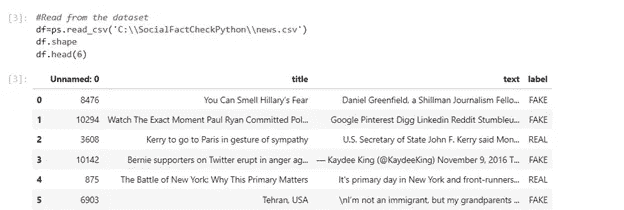
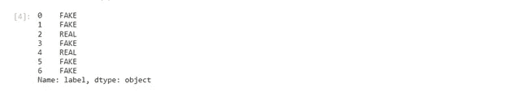
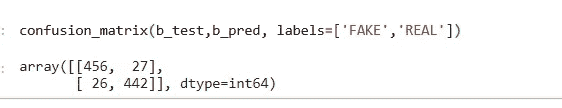

# 使用 Python 检测假新闻

> 原文：<https://medium.datadriveninvestor.com/using-python-to-detect-fake-news-7895101aebb8?source=collection_archive---------1----------------------->

## 数据科学

## 社交媒体是真是假

Photo by [Shahadat Rahman](https://unsplash.com/@hishahadat?utm_source=medium&utm_medium=referral) on [Unsplash](https://unsplash.com?utm_source=medium&utm_medium=referral)

> 社交媒体网络充斥着假新闻。有办法检测出来吗？

2016 年总统竞选中更具争议的一个方面是对脸书的批评。社交媒体巨头招致了来自各个角落的批评。批评者认为，脸书拒绝核实和审查其平台上列出的新闻的真实性是危险的。

它允许误导性和虚假新闻的扩散，经常滚雪球般变成阴谋论。例如，谣传俄罗斯影响了那次选举的结果。

几年后，马克·扎克伯格出现在国会面前，回答了一系列问题。美国立法者指责脸书首席执行官在 2020 年大选前允许政治虚假信息传播。

在所有的紧张气氛中，扎克伯格因缺乏对政治广告活动的事实检查而受到盘问。

> "我可以在初选中针对共和党人做广告，说他们投票支持绿色新政吗？"亚历山大·奥卡西奥·科尔特斯

扎克伯格吃了一惊，觉得很难回答。这些事件标志着大众越来越意识到要对虚假内容采取行动。

Photo by [Kon Karampelas](https://unsplash.com/@konkarampelas?utm_source=medium&utm_medium=referral) on [Unsplash](https://unsplash.com?utm_source=medium&utm_medium=referral)

在社交媒体上消费新闻是一把双刃剑——它可以负担得起，容易获得，并且传播大量信息。人们关注全球时事，分享他们的想法并分享它们。

然而，这种优势经常被病毒式营销所利用，即低质量的新闻尽管包含虚假事实，但仍被有意推广。社交媒体上的假新闻可以有多种形式。创建了几个恶意帐户来传播假新闻，如巨魔、电子人用户和社交机器人。

假新闻的迅速泛滥会对社会产生负面影响。它会助长误解，甚至危及生命。2016 年总统选举期间最受欢迎的政治新闻是基于虚假事实本身。因此，在真实媒体上寻找基于事实的新闻是绝对必要的。

## 你应该知道什么

在继续之前，理解某些概念很重要:

TF-IDF

在机器学习中，有一个主要的困境:算法计算数字。然而，自然语言主要由文本组成。因此，需要将这些文本转换成数字，这个过程通常被称为文本矢量化。它是机器学习的重要组成部分，有助于文本分析。矢量化算法会产生不同的结果，因此您需要谨慎选择。

TF-IDF 是一种统计度量，当一个单词被放置在一组文档中时，它确定该单词在文档中的相关性。它通过将以下两个指标相乘来计算:

*词频*是一个词在文档中出现的次数。

*逆文档频率*是一个词在一组文档中出现的次数。

您将使用 TfidfVectorizer 将文本转换为特征向量。

## 被动积极分类器

被动攻击算法是在线学习算法。它们被用来从大量数据中学习。例如，您的系统正在从 Twitter 24/7 收集推文，您希望根据这些数据做出预测。由于存储限制，这是不可行的。

你的记忆中储存不了这么多数据。被动积极算法从这些例子中学习，并在使用后立即丢弃它们，而不将它们存储在存储器中。

这些算法被称为被动的，因为它们是温顺的，直到分类结果保持正确。一旦他们发现计算错误，他们就会变得积极主动，更新和调整模型。

## 混淆矩阵

如果输出应该生成两个或更多个类，则在机器学习分类中使用它来进行性能测量。有四种可能的结果:

真阳性——你预测是阳性的，结果证明是真的。

真阴性——你预测为阴性，结果却是真的。

假阳性——你预测阳性，结果是假的。

假阴性——你预测阴性，结果是假的。

## 问题

假设您已经用 Python 构建了一个 web 抓取应用程序，它收集来自社交媒体网络(如脸书)的所有新闻链接。你怎么知道那些网站上的信息来自真实的事实？

## 解决办法

我们用 Python 建立了一个系统，可以识别新闻链接是否真实。我们已经使用 sklearn 为我们的数据集创建了一个 TfidfVectorizer。Tfidf 的目的是将文本转换为特征向量。这允许您将它们用作估计器的输入。

## 先决条件

打开命令行，下载并安装 Numpy。Numpy 是数字 python 的简称。它支持大规模多维数组和矩阵，以及几个有用的数学函数。运行以下命令:

## **Pip 安装 numpy**

接下来，安装熊猫。Pandas 帮助您对数据执行各种操作，例如导入、准备、合并、整形、连接、处理、分析和调整数据。它是围绕 DataFrame 对象组织的。运行以下命令:

## **Pip 安装熊猫**

最后，是时候安装我们项目中最重要的库了，sklearn。主要用于机器学习。它包含内置算法，这些算法包含模型选择、模式、聚类分析、回归和聚类分析的函数。运行以下命令:

## **Pip 安装 sklearn**

您还需要安装 Jupyter Lab。JupyterLab 是一个基于网络的工具，用于 Jupyter 数据、代码和笔记本。它是灵活的。您可以对其进行定制，以在机器学习、科学计算和数据科学中的多个工作流上工作。运行以下命令:

## **Pip 安装 jupyter 实验室**

安装后，您可以在命令提示符下键入以下命令。

C:\ >朱庇特实验室

浏览器会打开一个新窗口。转到新à控制台。选中下方的文本框—您将在此处键入代码。输入 Shift + Enter 运行命令。

## 我们将使用什么数据集？

我们正在使用一个包含 7796 行和 4 列的大型数据集。这些列代表:

ü一个标识符

ü新闻标题

ü新闻文本

ü标签，即新闻是真是假。

你可以从这个[链接](https://drive.google.com/file/d/1er9NJTLUA3qnRuyhfzuN0XUsoIC4a-_q/view)下载数据集。

## 社交媒体上的事实核查新闻

导入您刚刚在 JupyterLab 控制台中安装的所有库。运行以下代码:

**进口数量为 ny**

**导入熊猫作为 ps**

**导入 itertools**

**从 sklearn.model_selection 导入 train_test_split**

**从 sk learn . feature _ extraction . text 导入 TfidfVectorizer**

**从 sklearn.linear_model 导入 PassiveAggressiveClassifier**

**来自 sklearn.metrics 导入准确度 _ 分数，混淆 _ 矩阵**

我们需要将 Excel 数据转换成二维数据结构(矩阵)。为此，我们将使用来自熊猫的数据帧。它是一个二维数据结构，可以包含不同种类的列。通过使用属性 *shape* 和 *head，*，我们可以确定数据集的格式和检查行。运行以下代码:

## **#从数据集中读取**

**df = PS . read _ CSV(' C:\ \ SocialFactCheckPython \ \ news . CSV ')**

**df.shape**

**df.head(6)**

使用数据框获得真实和虚假的事实。运行以下代码:

## **#检查标签**

**factcheck=df.label**

**factcheck.head(7)**

现在是共同的任务——将数据集分成两组:训练和测试。

## **#分割数据集**

**a_train，a_test，b_train，b _ test = train _ test _ split(df[' text ']，factcheck，test_size=0.15，random_state=8)**

初始化 tfidf 矢量器。设置英文停用词，并指定最大文档频率为 0.65。这意味着包含较高文档频率的术语将被删除。

我们总是过滤掉自然语言处理中的停用词。tfidf 矢量器用于将一组原始文档转换为 TF-IDF 特征矩阵。*随机状态*用于指定随机生成的种子。它确保了列车分割测试总是得出确定性的结果。

使用矢量器来拟合和转换您的训练集和测试集。*。fit_transform* 学习词汇，逆文档频率。作为响应，它创建术语-文档矩阵。*。transform* 返回一个术语-文档矩阵。运行以下代码:

**tfi df _ vector izer = tfi df vector izer(stop _ words = ' English '，max_df=0.65)**

**tfi df _ train = tfi df _ vectorizer . fit _ transform(a _ train)**

**tfi df _ test = tfi df _ vectorizer . transform(a _ test)**

现在，您需要初始化一个被动主动分类器，它将安装在 *tfidf_train* 和 *b_train* 上。TfidfVectorizer 将有助于对测试集进行预测，并使用 sklearn.metrics 的 *accuracy score()* 来检查准确性。

在多标签分类中， *accuracy score()* 函数用于处理子集的准确度。为样本预测的标记必须与另一个子集中的相应标记完全匹配。

运行以下代码:

**pclass = PassiveAggressiveClassifier(max _ ITER = 60)**

**pclass.fit(tfidf_train，b_train)**

**b _ pred = pclass . predict(tfi df _ test)**

**factcheckscore = accuracy _ score(b _ test，b_pred)**

**打印(f '事实核对精度为{round(factcheckscore*100，2)}%')**

这表明，我们的模型在从假新闻中识别真实新闻时的准确率为 94.43%。让我们看看有多少次是对的。运行以下代码:

这意味着我们有 456 个真阳性，442 个真阴性，27 个假阳性和 49 个假阳性。

## 最后的想法

Python 可以用来检测社交媒体上的假新闻。我们从包含政治新闻的数据集中提取数据，用 TfidfVectorizer 将其转换为向量，运行 PassiveAggressiveClassifier，并拟合我们的模型。最终，我们生成了 94.43%的准确率。