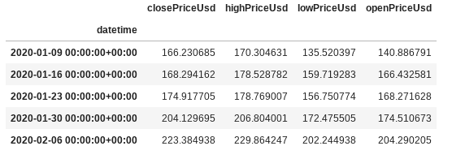
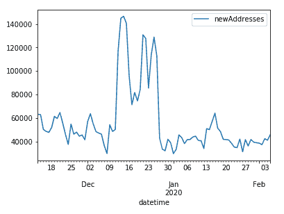
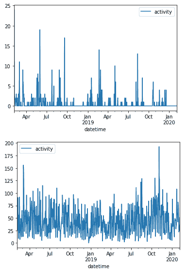
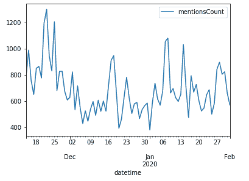

# 使用 Python 获取加密市场数据

> 原文：<https://medium.datadriveninvestor.com/using-python-to-get-crypto-market-data-ba173d93896b?source=collection_archive---------3----------------------->

让我们看看用 Python 为加密市场下载历史价格和替代数据是多么容易。

当提到历史价格数据时，这是关于任何资产的开盘价、收盘价、最高价和最低价。您可以根据这些数据创建交易机器人或警报机器人。只需为此条件创建一个计划脚本:

```
If Close > desired X: send_me_message(“Look at this!”)
```

问题就在这里，我们开始解决吧。


替代数据很容易跳过，但真正看一看它是很重要的。对于石油股票，它是关于管道、钢铁价格的财务数据或来自物流公司的数据或任何可能影响石油股票的相关数据。此外，它还可以提供新闻和政府报告。

在加密领域，它是链上数据、社交数据、新闻等。

[](https://www.datadriveninvestor.com/2019/03/04/be-afraid-be-very-afraid-why-fiat-is-right-to-fear-digital-currency/) [## 害怕，非常害怕...为什么菲亚特害怕数字货币是正确的|数据驱动的投资者

### 本文的目的是为我们最近(以及即将到来的)欧盟 H2020 拨款中的一个部分提供额外的视角…

www.datadriveninvestor.com](https://www.datadriveninvestor.com/2019/03/04/be-afraid-be-very-afraid-why-fiat-is-right-to-fear-digital-currency/) 

这对你来说是一个超级好消息，因为你可以从历史角度和在区块链上实时看到每一笔交易。但是获得这些数据有多容易呢？

我将使用 [Santiment](https://santiment.net/?via=sun&utm_campaign=yura) API，它提供了两种方法。简单地使用 Python 库和一个基于使用 GraphQL。有一些替代方案([coimarketap](https://coinmarketcap.com/api/pricing/)、 [Coingecko](https://www.coingecko.com/en/api) 等)。)，但 Santiment API 拥有的不仅仅是财务数据。

第一种方法使用一个名为 sanpy 的库。让我们安装 sanpy 库。

```
pip install sanpy
```

下面是收集以太坊历史定价数据所需的基本代码:

```
import sanohlc_df = san.get(“ohlc/ethereum”,from_date=”2015–01–01",to_date=”2020–02–10",interval=”1w”)print(ohlc_df.tail())
```



你可以看到，你的结果应该是一个熊猫数据帧，包含以太坊的每周历史 OHLC 数据。

看 san.get()函数的第一个参数。(“ohlc/以太坊”)ohlc 是公制的名称，“以太坊”是鼻涕虫。 **Slug** 是资产的唯一标识符。为您的资产定位 slug 的最佳方式是打开[https://app.santiment.net](https://app.santiment.net/?via=sun&utm_campaign=yura)并使用搜索。


如果您有任何问题，请查看此[网站](https://santiment.net/?via=sun&utm_campaign=yura)。

好的。现在尝试获取以太坊的其他链上数据。对于我们的第一个例子，我们可以使用网络增长度量。网络增长显示了项目网络上每天创建的新地址数量。

```
net_growth_df = san.get(“network_growth/ethereum”,from_date=”2019–02–05",to_date=”2020–02–05",interval=”1d”)import matplotlib.pyplot as pltnet_growth_df.plot()plt.show()
```



如果您想了解使用这个库可以获得什么类型的替代数据和度量。可以多读读[https://github.com/santiment/sanpy](https://github.com/santiment/sanpy)或者[https://academy.santiment.net/for-developers/](https://academy.santiment.net/for-developers/?via=sun&utm_campaign=yura)

许多加密公司使用开源作为他们业务的驱动力。基于项目的开源开发活动，我们能说些什么呢？LTC 就是一个很好的例子。他们只是偶尔合并一些来自 BTC 的新员工，自己不做任何新的事情。

让我们证明这一点:

```
dev_df = san.get(“dev_activity/litecoin”,from_date=”2018–02–05",to_date=”2020–02–05",interval=”1d”)dev_btc_df = san.get(“dev_activity/bitcoin”,from_date=”2018–02–05",to_date=”2020–02–05",interval=”1d”)dev_df.plot()dev_btc_df.plot()plt.show()
```



好的。当然，你可以从 on-chain 或 GitHub 收集所有这些数据，但如果你想制作一个简单的警报机器人，这是一项复杂的工程任务。
还有最后一个例子。让我们试着获得比特币的社交量

```
soc_df = san.get(“social_volume/bitcoin”,interval=”1d”,from_date=”2018–02–02T10:02:19Z”,to_date=”2020–02–02T10:02:19Z”,social_volume_type=”TELEGRAM_CHATS_OVERVIEW”)soc_df.plot()plt.show()
```



感谢阅读。希望这能帮助你开始你的加密资产分析。

如果你们有任何问题，别忘了在 LinkedIn 上联系我。