# 使用正则表达式从文本文件中提取费用信息

> 原文：<https://medium.datadriveninvestor.com/using-regex-to-extract-expenses-information-from-a-text-file-e1ac9a8452a5?source=collection_archive---------0----------------------->


[(source)](https://www.pexels.com/photo/abstract-black-and-white-blur-book-261763/)

正则表达式(ReGex)模式看起来毫无意义，但是它们是从文本中提取信息的强大工具。一堆看似随意的标点符号加上许多括号和几个字母，实际上可以找到你要找的信息。

因此，本着实践的精神，我写这篇文章向您展示如何从文本文件中提取费用的成本和名称。这可能不是最简单的例子，但是我们将讨论一些不同的正则表达式特性来找到解决方案。我还假设您已经对正则表达式有所了解。

对于这个演示，我们将使用 Python 和它的 ReGex 专用库 re 来加载一个. txt 文件，并查找所有费用的名称和成本。

示例文本是一个简单的费用列表，格式如下:

```
cost - expense
cost - expense
cost - expense
cost - expense
cost - expense
Total: total_cost
```

还有一个真实的例子:

```
0.70 - Coffee
0.75 - Cake slice
12 - Lunch
15 - Lunch
Total: 28.45
```

在上面的例子中，我们提取了四项费用，并忽略了总额(无论如何，以后很容易计算)。

现在我们将一次一个地检查模式的各个部分，并在最后将它们集合在一起，形成用 Python 实现的完整的正则表达式模式。

# 获取整数值

如示例所示，expenses 的成本可以是一个整数(两份午餐)，也可以是一个浮点数(咖啡和蛋糕)。下面的模式足以匹配整数成本。

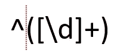

Pattern to extract integer costs

(请注意，垂直的红色虚线只是图案不同部分的视觉辅助)

脱字符号(`^`)表示一行的开始，也就是说，我们匹配的任何文本都必须在一行的开始。方括号中的`\d`表示我们正在匹配数字(0-9),`+`用于匹配一个或多个数字。如果没有加号，那么它只会匹配第一顿午餐的 1，而不是正确的 12。

下面的截图显示了使用`+`量词的(非)结果。该模式在 regex101.com[网站](https://regex101.com/)进行测试。

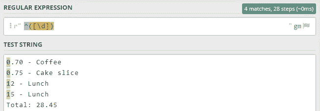

Integer pattern without quantifier test

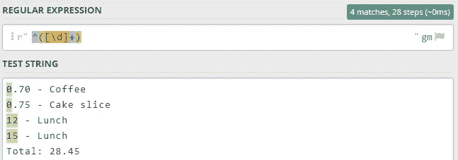

Integer pattern with quantifier test

关于方括号和圆括号，前者用于将加号的“匹配一个或多个数字”规则应用于数字。后者用于创建适当的正则表达式组。简单地说，每场比赛都可以单独引用组。我们将在最后的 Python 脚本中回到这个主题。

# 改善成本模式

前面的模式适用于整数成本。然而，也有浮点成本。我们需要扩展模式以适应这两种选择。

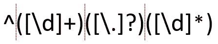

Complete cost pattern

我们可以复制之前的模式，因为我们仍然在匹配数字序列。我们把它放在第二个模式的开头，但是现在我们只匹配小数点前的数字。


Integer pattern results

整数是一个或多个数字的序列。另一方面，浮点数有两个这样的序列，用小数点(`.`)隔开。因此，我们可以重复整数匹配组`[\d]+`，来匹配浮点数整数和小数部分。我们只需要在中间添加一个组来匹配小数点。

因此，我们使用`[\.]?`。方括号中的内容将被逐字匹配，但是由于句点在正则表达式中有特殊的含义，我们需要通过在它前面加上反斜杠`\`来对其进行转义。这样，我们指定要匹配数字序列之间的实际周期。否则，将使用句点来匹配它找到的任何字符。

[](https://www.datadriveninvestor.com/2020/07/23/learn-data-science-in-a-flash/) [## 一瞬间学会数据科学！？数据驱动的投资者

### 在我之前的职业生涯中，我是一名训练有素的古典钢琴家。还记得那些声称你可以…

www.datadriveninvestor.com](https://www.datadriveninvestor.com/2020/07/23/learn-data-science-in-a-flash/) 

注意，我们还将第二个数字序列中的量词从`+`改为`*`(星号)，因为我们需要使用“匹配零个或多个数字”规则来代替。如果其中一份午餐的价格低于 10 英镑，那么我们就无法用两个“匹配一个或多个数字”(一个在小数点之前，另一个在小数点之后)来匹配这个一位数的整数。

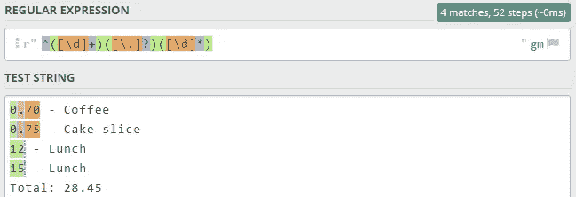

Complete cost pattern test

现在所有成本都匹配成功了。颜色让我们很难理解每笔费用的总成本是匹配的，但是当我们在 Python 中实现它时，我们会看到我们实际上匹配了总成本。因为我们用括号将模式的各个部分分组，所以我们匹配了整个成本，同时还可以访问匹配的各个组。

# 获取费用名称

随着成本的完成，困难的部分已经过去。现在我们只需要匹配匹配行中的其余内容，即分隔成本和名称的连字符，以及名称。

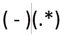

Pattern for extracting the expense name

提醒我们自己，一项支出看起来像这样

```
0.70 - Coffee
```

也就是说，费用后面跟一个空格，然后是连字符，然后是另一个空格，最后是费用名称，费用名称是一个字符序列(字母、数字、空格等。).

然后，我们可以为这个模式创建两个简单的组:一个组匹配连字符及其周围的空格，另一个组匹配名称。由于名称可以有各种类型的字符，这次我们使用句点的功能，即匹配任何字符。同样，星号匹配序列中的零个或多个字符。

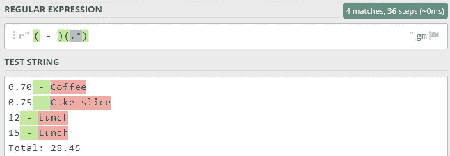

Name pattern test

连字符及其周围的空格本身都不是费用的一部分，但它们是匹配费用的重要文本引用。

# 把所有的东西放在一起

现在我们已经完成了模式的每个部分，您可以看到最终的模式和实现它的 Python 脚本了。

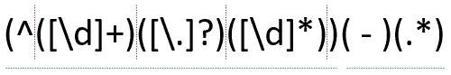

Complete ReGex pattern

(请注意，绿色下划线仅用于在视觉上区分成本和名称模式)

这里没有什么新的东西，只是你以前见过的相同的模式，这次是一个单一的模式。

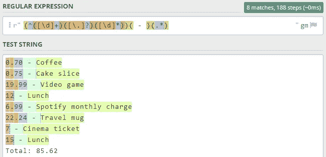

Final pattern test

现在是 Python 代码！

首先是示例文本。

现在是剧本！

在这个脚本中，我们从一个. txt 文件中加载文本，通过匹配 ReGex 模式提取费用，并将数据存储在一个导出为 CSV 的 pandas DataFrame 中。

这些函数很简单，但是让我们回顾一下。

*   从文件中获取整个文本，作为一个字符串列表(每行一个字符串)
*   `"".join(expenses_text)`从不同的行中创建一个单独的字符串(字符串包含换行符，所以我们仍然知道每一行的开始和结束)
*   `re.findall`使用我们创建的模式匹配费用。`re.MULTILINE`确保我们获得每一场比赛，而不仅仅是第一场
*   `[[m[5], m[0]] for m in matches]`创建一个列表列表，其中内部列表包含费用的名称和成本
*   pandas 部分使用该列表创建一个新的数据帧，从 1 开始添加一个索引列，并将其导出为一个新的 CSV 文件

最后，关于正则表达式组。如果我们打印由`re.findall`返回的单个匹配

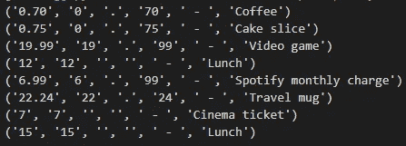

re.findall results

我们发现该函数为每个匹配返回一个元组。每个元组元素代表一组模式。换句话说，对于每笔费用，我们都可以访问整个成本、整数部分、小数点、浮点部分、连字符及其周围的空格，以及费用名称。我们只需要第一个和最后一个组，但是不需要进一步的字符串转换就可以访问匹配的不同部分是很有用的。

# 结论

使用上面的示例，我们已经成功创建了下面的 CSV 文件，只从一个文本文件开始。

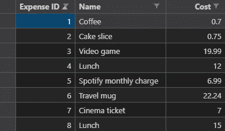

Resulting CSV

正如我在开始时所说的，这是一个简单的正则表达式练习，但仍然是一个好的正则表达式练习。

作为最后的想法，我想给你指出[regex101.com](https://regex101.com/)和 [Python ReGex cheatsheet 上的 Debuggex](https://www.debuggex.com/cheatsheet/regex/python) 。前者是编写和测试你的模式的绝佳环境，而后者是一个正则表达式的备忘单。

哦，你可以在我的 GitHub 库上找到这篇文章[的 Python 代码和所有相关资源！](https://github.com/Ze1598/medium-articles/tree/master/Using%20RegEx%20to%20extract%20expenses%20information%20from%20a%20text%C2%A0file)

## 访问专家视图— [订阅 DDI 英特尔](https://datadriveninvestor.com/ddi-intel)