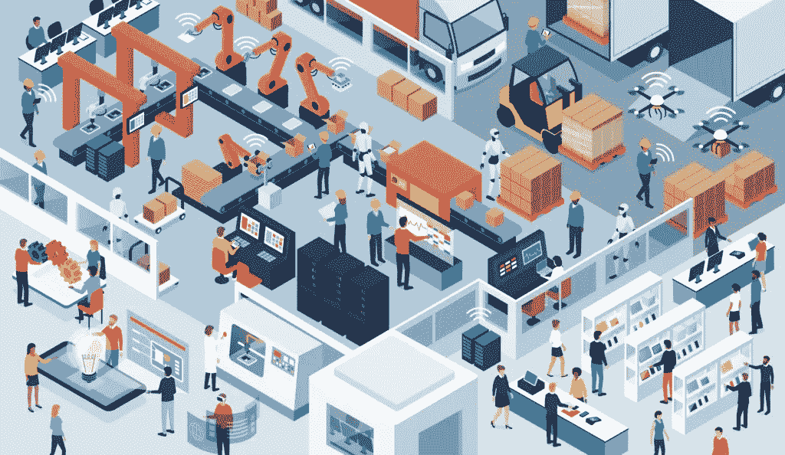
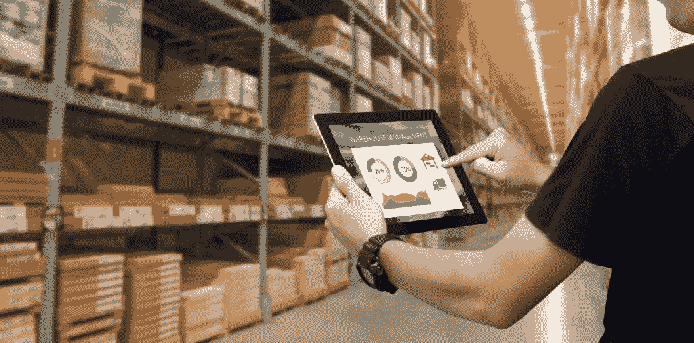

# 利用零售自动化在当前经济中生存和发展

> 原文：<https://medium.datadriveninvestor.com/using-retail-automation-to-survive-and-thrive-in-the-current-economy-a6e65744ea1e?source=collection_archive---------15----------------------->

我们都听说过自动化这个术语在不同的环境中使用。尽管如此，还没有多少人开始使用它来利用迅速扩大的零售环境。由于在线购物的客户数量在过去几个月中显著增加，手动完成某些流程已不再可能。在本文中，我们将告诉您自动化零售以及您可以从中获得的一些好处。首先，我们先来一个定义。

# 什么是零售自动化

零售业的自动化是指任何可以由机器代替人类执行的过程。这通常是低级的、多余的任务，占用大量的时间，非常乏味，雇佣某人来做所有的工作是没有意义的。这就是零售自动化发挥作用的地方，它可以以更高的准确性执行所有这些重复的任务，而且它永远不会厌倦或厌倦自己的工作。特别是在电子商务行业，有很多事情可以自动化，从库存管理到营销活动，以及这两者之间的一切。

随着您的业务增长，零售自动化变得更加重要，因为它允许您的流程跟上需求。记住所有这些，让我们来看看自动化零售可以给你的企业带来的一些好处。

 [## 自动化已准备好带领我们走出危机，并赋予人们权力-以下是|数据驱动…

### 随着我们准备进入 2020 年下半年，并试图在全球预防性关闭后重新开启经济…

www.datadriveninvestor.com](https://www.datadriveninvestor.com/2020/06/23/automation-is-poised-to-lead-us-out-of-the-crisis-and-empower-people-here-is-how/) 

# 1.削减成本

我们在上面已经提到过，有些任务是可以自动化的，不需要雇佣人来完成这些任务。想想这会为你节省多少员工工资、福利、办公空间和其他管理费用。当我们把自动化提供的生产力考虑在内时，其好处尤其明显。例如，当下订单时，会向客户发送一封触发电子邮件来确认订单。虽然这是自动化的一个基本例子，但每天手动处理数千个订单是不可能的，效率也不会很高。这只是零售业自动化如何为企业削减成本的一个例子。

# 2.效率的提高

总的来说，自动化可以为你节省大量的时间和精力，从而使你的员工和你的企业更有效率。你的网上商店总是开放的，在任何时间点，来自世界另一端的人都可以访问你的网站并下订单。自动化可以实现订单的下达和处理，比等到第二天员工来手工完成订单要快得多。此外，即使有人打电话请病假或去度假，由于自动化，你仍然可以进行正常的业务活动。

# 3.更好的客户体验

我们生活在体验经济中，为每个用户量身定制在线体验变得比以往任何时候都更加重要。这对于浏览你的在线商店的潜在用户来说尤其重要。一旦他们登陆你的网站，你需要能够为他们提供个性化的推荐。这向你的客户表明，你知道他们的需求，这也有助于你提高转化率。在这方面，特定的电子商务平台比其他平台要好。Magento 是最好的之一，因为它提供了高度的自动化，同时提高了客户体验。

# 4.推动销售

如果我们想一想所有投入到增加访客数量和使产品本身更吸引顾客的努力，我们做的所有事情也可以自动化。例如，自动化零售系统可以通过向特定客户发送电子邮件，邀请他们回来完成购买，从而帮助您减少购物车废弃。此外，一些电子商务平台会收集您网站上的用户活动信息，这有助于您更好地了解他们的需求和习惯。这些有价值的信息可以被用来让相关的商品出现在你的用户面前，从而进一步推动销售。

# 5.减少人为错误

任何时候涉及到人为因素，你都会有错误要处理。有时这些可能很关键，可能会妨碍您准确了解业务状况和其他重要信息。如果您的业务正在增长，并且您总是需要掌握库存数量、销售数字、客户忠诚度和许多其他数据，这一点尤其正确。如果不能完全消除错误，自动化这样的过程可以显著减少错误。最后，您可以永远告别手动更新电子表格或向系统输入数据。目前可用的软件可以为您执行所有这些任务，从而使您能够将更多精力放在核心业务功能上。

# 今天就开始自动化您的流程

一个[创新的零售软件解决方案](https://skywell.software/retail-software-development/)可以帮助您从自动化中获得最大收益，并使您的业务更上一层楼。通过提高效率，同时降低成本，您可以在竞争中获得优势。争夺顾客的竞争非常激烈，尤其是在电子商务行业，人们会毫不犹豫地离开你的商店去竞争。这就是为什么您需要确保所有流程快速高效，让您的客户以及员工的生活更加高效。

投资零售正成为提高员工生产力、让他们做出更明智、更自信决策的必要手段。随着您的企业开始扩大规模，这将为您带来巨大的回报，您需要更高质量的数据和服务客户的能力，与您在初创公司或小型企业时的水平相同。亲眼看看自动化能为您的企业带来什么。

*原载于*[*https://sky well . software*](https://skywell.software/blog/using-retail-automation-to-thrive-in-the-economy/)*。*

**访问专家视图—** [**订阅 DDI 英特尔**](https://datadriveninvestor.com/ddi-intel)