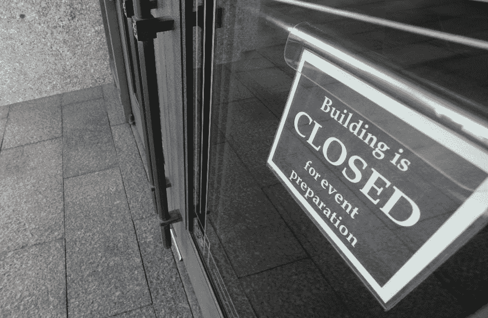

# 犹他州共和党大会使用区块链投票服务

> 原文：<https://medium.datadriveninvestor.com/utah-republican-convention-uses-blockchain-voting-service-e73340e187b9?source=collection_archive---------21----------------------->

SALT LAKE CITY, UT — APRIL 04: A closed sign hangs on one of the doors at the Conference Center which sits empty for the 190th Annual General Conference of the Church of Jesus Christ of Latter-Day Saints on April 4, 2020 in Salt Lake City, Utah. The Mormon worldwide two-day conference normally draws 20,000 attendees per session, but due to the COVID-19 virus the conference is being broadcast online only. (Photo by George Frey/Getty Images)

4 月 25 日结束的犹他州共和党大会使用区块链选举平台 Voatz 作为其官方投票服务，为 6 月的初选挑选了他们的提名人。Overstock.com 旗下的美第奇风险投资公司(Medici Ventures)领导了这家初创公司的种子和首轮融资。Voatz 在以前的选举活动中因安全缺陷而受到批评。然而，犹他州虚拟州大会是沃茨迄今为止最重要的审判，并以大量的投票率成功完成。

沃茨联合创始人兼首席执行官尼米特·索内(Nimit Sawhney)表示:“沃茨的表现符合预期，处理了 93%的注册代表投票。”

犹他州共和党主席德里克·布朗也有同感。布朗在采访中说，“投票率非常高，反馈也非常积极。”布朗解释说，他对使用 Voatz 感到满意，因为当地选举官员支持他，他们在选举管理中使用了这个平台。布朗先生告诉我，出席人数比以往任何一次大会都多。

鉴于新冠肺炎公众集会的限制，这不是一个小任务。布朗先生说，“使用 Voatz 使我们能够以数字方式重建我们通常的会议程序，并以一种使过程更加方便和安全的方式实施技术。”

Overstock.com 首席执行官兼美第奇风险投资公司总裁 Jonathan Johnson 说:“这是犹他州七名州长候选人之间的重大竞争。这一轮其他重要的犹他州竞选包括所有四个国会席位、州检察长、所有州众议院席位以及该州一半的参议院席位。投票是在 Voatz 移动应用程序上进行的。

Voatz 平台使用生物识别、面部识别和区块链来验证个人身份。毫不奇怪，Voatz 通过智能手机和平板电脑提供的便利使其成为公共集会挑战期间的一个令人信服的选择——特别是对于残疾人和缺席选民，以及新冠肺炎的限制。这项服务已被用于政党的试点测试，但也被教会团体、大学、工会和非营利组织用来管理选举。

 [## 数字货币、区块链和货币的未来|数据驱动的投资者

### “区块链”、“加密货币”、“令牌化”，以及现在的“央行数字货币”已经成为…

www.datadriveninvestor.com](https://www.datadriveninvestor.com/2020/02/18/digital-currencies-blockchain-and-the-future-of-money/) 

沃茨并非没有争议。二月份，[麻省理工新闻](http://news.mit.edu/2020/voting-voatz-app-hack-issues-0213)发表了一篇对该应用的严厉批评，表达了对该公司平台的安全担忧。在报告中，麻省理工学院指出黑客有可能阻止、改变和利用个人用户的投票方式。麻省理工学院的研究被美联社、波士顿环球报、Wired、CoinDesk 等媒体引用。

因此，西弗吉尼亚州的初选取消了 Voatz，并为无法前往投票站的选民提供了纸质选票系统。

索内先生说，“麻省理工学院的报告忽略了事实，得出了错误的结论。”他继续向[解释说，分析](https://blog.voatz.com/?p=1209)的发现是基于他们的一个旧版本的平台，在西弗吉尼亚州的选举中没有使用；报告所依据的移动应用程序没有连接到实时环境，无法通过既定的安全保护层；麻省理工学院的研究团队假设 Votz 的架构是如何工作的。

麻省理工学院的分析指出，“他们的发现表明，为了确保选举过程的完整性，选举管理需要公开。他们指出，目前，使用纸质选票的州的选举过程是透明的，公民和政党代表有机会观察投票过程。

麻省理工学院提出了一个公平的观点，但他们的分析忽略了我们当前纸质选票投票系统的缺陷——这些缺陷影响了现在的选举。以下是一些例子:

4 月 16 日，[华尔街日报](https://www.wsj.com/articles/in-texas-a-battle-brews-over-voting-by-mail-amid-coronavirus-11587037108?mod=hp_lead_pos11)刊登了如何在得克萨斯州，民主党正试图通过邮件扩大投票，因为新冠肺炎相关的担忧。文章中写道，“共和党人说今年没有足够的时间来推广广泛的邮寄投票；这将需要数百万美元，并对该州 254 个县中每个县独立管理的选举进行组织改革。此外，他们认为这种投票更容易出现舞弊和其他问题。

2019 年 12 月， [NPR](https://www.npr.org/2019/12/23/790929823/box-of-ballots-found-in-texas-could-change-outcome-of-midland-bond-proposal-agai) 报道，“一项在得克萨斯州米德兰建造两所高中的 5.69 亿美元债券提案以 25 票之差未获通过。经过重新计票，它以 11 票之差获得通过。然后发现了一个装有 820 张没有清点的选票的盒子。”

在 2014 年 10 月的一篇来自 NPR 的旧文章中，称“成千上万的邮寄选票可能会被拒绝——而选民可能永远不知道，或者不知道为什么。”并继续解释说，“美国选举援助委员会发现 2012 年有超过 25 万张缺席选票被拒绝。”有时选票没有及时送到计票办公室；不是邮寄晚了，就是邮局耽搁了。

关键是，如果你是一名注册选民——教堂活动、非营利组织、当地城市选民、州或国家选举——你应该能够投票。投票是任何民主的基础。没有选民就不是民主。

这项对区块链应用程序的最新测试可能有助于维持新冠肺炎时期的民主进程。总是有安全问题。Voatz 不是一个完美的解决方案，但他们的竞争对手也不是。

…阅读更多内容

*最初发表于*[T5【https://www.forbes.com】](https://www.forbes.com/sites/robertanzalone/2020/04/29/utah-republican-convention-uses-blockchain-voting-service/)*。*