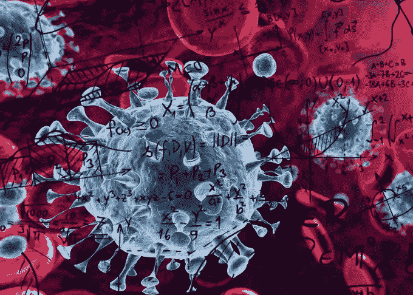
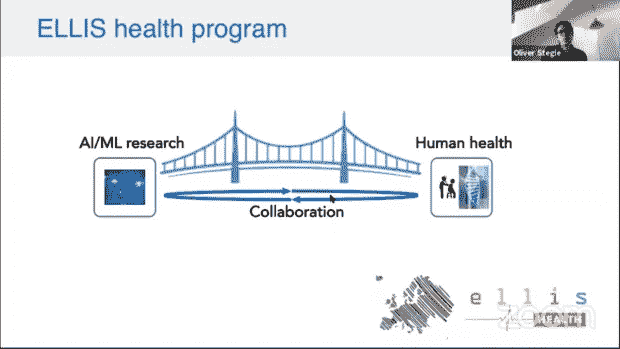
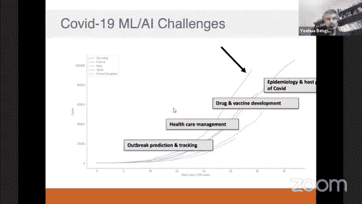
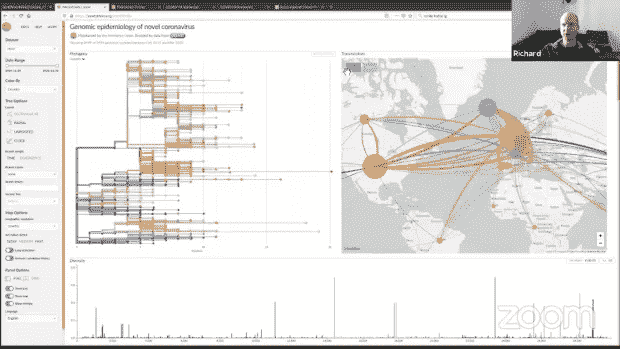
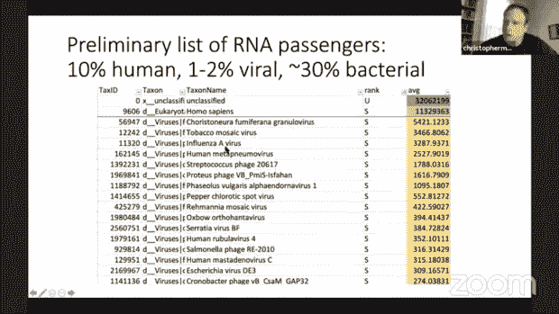
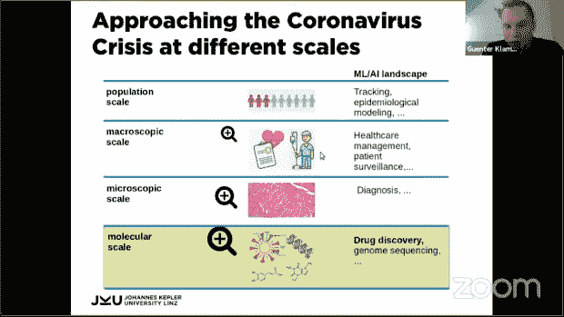
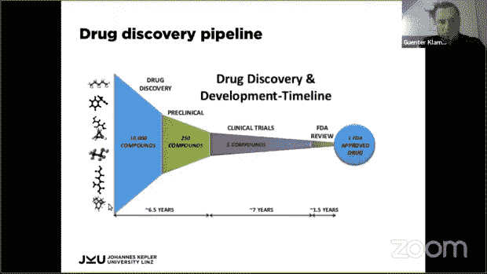
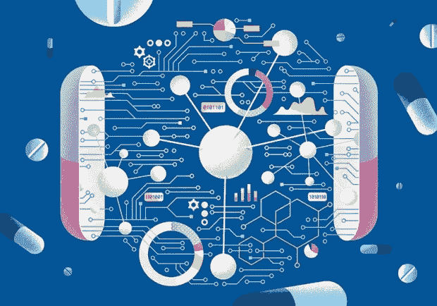
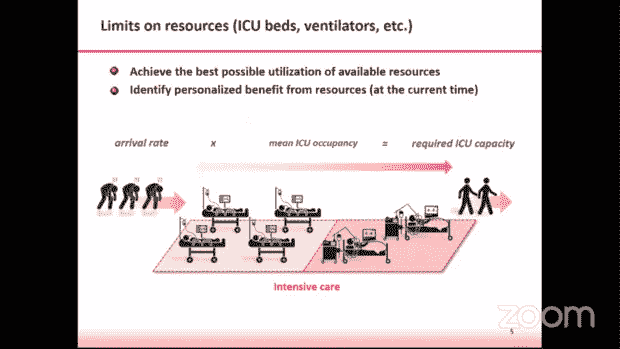
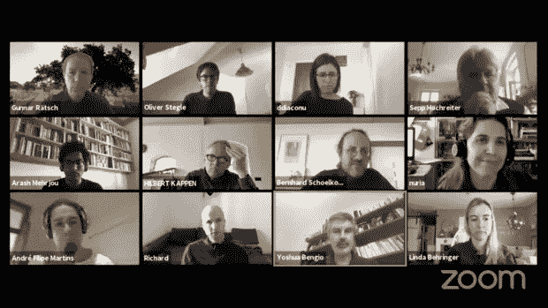

# 利用电脑对抗 SARS-CoV2

> 原文：<https://medium.datadriveninvestor.com/utilizing-computing-in-the-fight-against-sars-cov2-2573e28eb282?source=collection_archive---------17----------------------->

> “世界正面临由新冠肺炎疫情引起的突发公共卫生事件。我们都需要承担这个责任。”埃利斯协会

全世界的学者、研究人员、科学家和组织都在尽一切努力对抗目前席卷地球的病毒性疾病。这些努力从致力于疫苗和治疗一直到以尽可能好的方式传播对这种疾病的认识。谨记社会距离的概念，虚拟会议和研讨会是谈论这种疫情的各个方面及其潜在的跨学科和多学科对抗策略的极好方式。埃利斯协会最近组织了一次这样的聚会。

 [## 冠状病毒；惊慌失措；字里行间的 z |数据驱动的投资者

### 围绕冠状病毒的话题；更准确地说，新冠肺炎几乎占据了整个新闻预报的头条…

www.datadriveninvestor.com](https://www.datadriveninvestor.com/2020/03/23/coronavirus-a-to-panic-z-between-the-lines/) 

*ELLIS(欧洲学习和智能系统实验室)协会*的使命是创建一个多样化的网络，促进研究卓越和推进 [AI](https://www.datadriveninvestor.com/glossary/artificial-intelligence/) 的突破，教育下一代研究人员。在当前的冠状病毒疾病之后，该协会于 2020 年 4 月 1 日举行了一次在线研讨会。

> 这个虚拟聚会的目的是讨论各种项目，使用由领先的国际研究人员承担的[人工智能](https://www.datadriveninvestor.com/glossary/artificial-intelligence/) (AI)和[机器学习](https://www.datadriveninvestor.com/glossary/machine-learning/) (ML)的方法来解决新冠肺炎问题。研究主题包括流行病学建模、疫情预测、药物开发和医疗保健管理等。

研讨会以*Bernhard schlkopf*(经验推理部主任)和*Oliver steg le*(steg le 研究小组负责人——统计基因组学和系统遗传学)的致欢迎词开始。他们强调了 *ELLIS Health Program* 的作用是培养尖端的 AI/ML 技术，以利用生物医学中的高通量数据。

# 数据科学对抗新冠肺炎

计算机科学家 Nuria Oliver 因其在人类行为的计算模型、移动计算、人机交互、智能用户界面以及用于社会公益的[大数据](https://www.datadriveninvestor.com/glossary/big-data/)方面的工作而闻名，她在本次在线研讨会上发表了第一次演讲。标题为 *'* [*数据科学*](https://www.datadriveninvestor.com/glossary/data-science/) *抗击新冠肺炎，*它强调在当前疫情期间通过适当的数据分析做出更好的决策。

“我在传染病数据的使用方面有很多经验。多年来，我们经历了许多阻碍这些技术实际应用的障碍，”她说。新冠肺炎危机的主要现实之一是，在没有适当和充分证据的情况下作出决定。同样的第一个原因是，在公共管理中，有许多与能力、意识、数字思维和必要技能集相关的障碍。还有一些关于数据保护和隐私的担忧。另一个问题是研究界和决策界之间的差距。接下来的问题是，在这种需要的时候，对立即采取有组织的行动缺乏准备。“为了克服所有这些限制，我们创建了一个数据科学组织，该组织通过不同的团队直接与该地区的总裁合作，”她解释道。

这些团队构成了移动数据分析(移动网络和应用程序)、流行病学模型(建立不同粒度级别的感染数量预测，并涉及集合种群和间隔模型)和附加建模。移动组正在试图理解这样的问题，如竞争措施如何改变了移动性，干预服务是否影响了移动性，以及在许多其他问题的长列表中，哪些类型已被丢弃。同样，流行病学小组正在解决不同流动情景下的感染人数、社会竞争措施是否充分以及感染的主要原因等问题。额外的建模组涉及死亡预测、重症监护、热点检测，以及寻找有助于做出更好决策的新数据源。

尽管如此，仍然缺乏相关数据，例如与人们在这场争论中的社会接触行为、新冠肺炎危机对他们生活的经济和劳动力影响、人群中症状的流行以及缺乏测试相关的数据——最重要的问题是有多少人真的被感染了？从这个项目中得出的一些结论包括迫切需要让公民参与获取数据，性别和年龄的重要性，以及紧急实施隔离基础设施和更多的测试。

# 基因组分析探索新冠肺炎

接下来是由瑞士巴塞尔大学 Biozentrum 病原体进化、基因组学和生物物理学研究小组负责人理查德·内赫(Richard Neher)发表的演讲，题目是*“使用病毒基因组追踪 SARS-Cov-2 并预测其传播”*谈到他的一个项目，*下一个菌株*，他解释说，它可以追踪病原体和疾病爆发的基因组和遗传多样性。它开始于五年前，主要是研究流感的演变——这是一种不断传播的病毒，我们需要经常更新疫苗，因此，了解其基因多样性的最新情况非常重要。随着新冠肺炎感染率的增加，研究人员建立了一个*下一个菌株*来更多地了解它。

在观察*系统进化树*时，可以看到病毒随着时间的推移正在积累突变(基因的修改)——这些大多是病毒复制机制犯下的随机复制错误。这些表现也提供了一个关于这种疾病的地理多样性以及在过去几个月中它是如何在世界范围内传播的想法。所以，基本上，这些基因组为我们提供了疾病爆发的结构，科学家们预计每两周就会有一些变化。

这些数据被开发成一个网络应用程序，作为规划医院容量的一个想法。它允许我们指定特定人群的年龄分布(年龄至关重要，因为老年人往往会受到这种疫情的严重影响)，以及不同的缓解措施如何可以减少传播。它给出了一个覆盖了实际观察到的案例的模型输出，这意味着给出一些粗略的想法，即我们所拥有的信息，在适当的时候，可能会共同产生不同的未来动态。当然，在与测试次数不足等相关的问题上存在不确定性。

# 微生物监测网络抗击新冠肺炎

梅森实验室(Weill Cornell Medicine)负责人克里斯托弗·e·梅森(Christopher E. Mason)发表了一场发人深省的演讲，题为“一个快速的国际新冠肺炎和微生物监测网络”。梅森实验室致力于为人类在地球、太空和其他星球的生存制定一个为期 500 年的十年计划

这项工作的重点是找到病毒在环境中的证据，而不是在患者体内。该小组希望建立一个全球地图，其想法是，如果这是例行公事，我们可能已经能够跟踪不同 RNA 病毒的出现。预测性微生物特征可以预测一个人来自哪个城市，以及病毒在不同城市的出现(有些城市比其他城市更高)，准确率约为 88%。

过去几个月以来，在全球六大洲 25 个国家的 59 个城市(约 10000 个地点)进行了试点采样，以跟踪不同环境中的冠状病毒。观察到的一个有趣的数据是，在公共服务中，大约 10%的 RNA 是人类的，1-2%是病毒的，30%是细菌的，这是一个相当新的发现。一些湿实验室实验有助于确定环境中是否存在这种病毒。

该组织正试图在纽约市*建立*弹出式实验室*，以便更容易地进行实验，如*环介导等温扩增(LAMP)* 检测。一个有趣的方法是询问人们的手机，进行测序，并获得对微生物的估计——以前只是为了好玩，但现在是为了临床目的！长期的梦想是观察遗传变异、宿主细胞的差异表达、宿主免疫细胞的多样性、RNA 功能的变化以及任何其他存在的东西(细菌和病毒)。从宿主和微生物的角度来看，这些样本可以在计算方面做一些事情。此外，*新冠肺炎宿主遗传学倡议*也是由该小组最近发起的，基本上是一个人们查看宿主易感性并分享基因组测序数据以获得一些新见解的地方。*

# 快速药物开发是当前的需要

这一部分包含了分别由 *Guenter Klambauer* (机器学习[研究所](https://www.datadriveninvestor.com/glossary/machine-learning/))和 *Yoshua Bengio* (世界领先的人工智能和深度学习[专家之一)主讲的两场讲座。](https://www.datadriveninvestor.com/glossary/deep-learning/)

处理这类危机有不同的尺度，即。、人口规模(流行病学建模等。)、宏观尺度(医疗保健管理、病人监视)、微观尺度(诊断)和分子尺度(药物开发等)。).Klambauer 博士的第一次演讲题为*筛选 SARS-CoV 抑制剂，重点是在分子水平上解决冠状病毒危机——药物开发阶段。*

药物开发方面有多种方法。基本动机之一是设计一种分子，可以在不同水平上抑制或阻碍病毒。例如，破坏它的一些蛋白质或抑制它的复制机制。目前，计算机辅助药物发现非常普遍。这种方法的几乎所有阶段都受到了*机器学习的极大影响。*

第一步是化合物设计，自 2016 年以来，ML 在该领域越来越受欢迎，利用 *VAR、GAN、RL、***、*和杂交方法生成分子。如果第二步是虚拟筛选，可能会快一点。它基本上是通过使用计算机模型来筛选已经可用的大型分子数据库来完成的。为此，有三种主要的技术，包括基于配体、基于结构和混合的方法。*

**

*通常，一个药物发现管道有一个很长的时间尺度。一种方法是从数百万种化合物开始，然后在虚拟筛选的帮助下，选择一个大约有 1 万种化合物的库。随着时间的推移，这些会慢慢减少到几个有利的候选人。接下来的步骤包括临床前和临床试验。最后，它会得到美国食品和药物管理局的批准，如果幸运的话，我们会拿到药。鉴于目前的紧急情况，迫切需要加快整个过程，机器学习在这种情况下可以提供很大帮助。ML 帮助我们在开始时选择非常好的分子(通过预测参数，如副作用和功效)，这反过来使我们更快。有了 [*深度学习*](https://www.datadriveninvestor.com/glossary/deep-learning/) 的新一波计算药物发现。例如，*深度神经网络*非常擅长一次预测多种毒性效应。对于一些药物靶标，预测质量如此之高，以至于产生虚拟的湿式实验室测试/分析。类似的大规模虚拟筛选正被用于获得 SARS-CoV2 抑制剂。科学家们还用这个模型筛选了 *DrugBank* 数据库，得出了已经上市的分子的排名，因此可以用于药物再利用的过程。*

*在会议*“MILA 的新冠肺炎研究”*中，Bengio 博士谈到了两个方面，药物研发、接触者追踪和风险评估。这些是在新型冠状病毒疾病之后，*蒙特利尔学习算法研究所*的几个项目之一。这个疫情让科学界团结一致，共同抗击这场危机——通过全球合作，专注于拯救生命。*

*通过电话采访他们见过的人进行数字接触追踪，可以对限制这种疫情的传播产生重大影响。麻省理工学院媒体实验室和 MILA 正在为此开发应用程序，其中 ML 方法产生更准确的风险预测。在这个过程中需要强调的一点是用户的隐私。隐私问题的范围从耻辱的发展和随后对人权的侵犯，一直到信息落入坏人之手时的恐慌蔓延。直接的解决方案是从部署一个在隐私方面非常强大的应用程序开始，并分析我们在限制病毒感染率方面取得了多大进展。有必要平衡这些相互冲突的术语——隐私和健康保护——以实现有效的结果。研究人员正在研究私有集合交集方法，结合适合新冠肺炎情况的 ML。*

**

*Image Source: Nature*

*在药物发现项目方面，科学家们正在建立和预训练*神经网络*，该网络可以预测候选药物与病毒主要靶蛋白的结合能。它能让我们了解分子与目标的结合程度。用这种方法，我们可以得到一些好的分子，然后用它们进行生物分析。RL 框架也已被开发用于合成新分子。它使用了基于刚性片段的分子表示，这使得它真的更好，因为有更多的抽象动作。这也使得这些分子更容易合成。然而，仍然有一些挑战需要解决。*

# *曼梯·里来营救了*

*下一个演讲由 Mihaela van der Schaar (剑桥大学机器学习、[人工智能](https://www.datadriveninvestor.com/glossary/artificial-intelligence/)和医学的 John Humphrey Plummer 教授)主讲，题为*‘使用机器学习和 PHE 数据帮助医院应对新冠肺炎，*强调了最新计算技术的发展将如何帮助建立工具来帮助医疗保健人员应对这场危机。ML-AIM 实验室和 *PHE(英国公共卫生部)*合作研究的目标是提供可靠的证据，帮助医疗专业人员做出艰难的决定来拯救生命。它使用 ML 方法来预测每个患者的个性化风险、益处、治疗和资源，以便各个医院可以确定何时需要什么类型的资源。*

**

*医生和临床医生必须做出许多至关重要的决定，例如何时将病人转移到 ICU，何时应该给病人使用呼吸机，使用多长时间，何时可以转移到普通病房，何时可以回家。无论是重症监护室的床位还是呼吸机，资源都越来越有限。目的是准确地模拟当前需求和后续需求的预测。为此，自动化的 ML 框架正在被使用。这些是预测病人死亡、出院、入住重症监护室或使用呼吸机的几率(时间和持续时间)。这些信息对于医院做短期和长期的未来资源规划也是有用的。*

*ML 可用于解决几个新冠肺炎挑战，例如估计该疾病的纵向轨迹、开发早期预警系统、为每个患者提供个性化治疗建议、告知政策、改善合作、管理不确定性和加快临床试验，等等。*

# *透过数据的镜头看新冠肺炎*

*这部分包括来自 *Fred Hamprecht* (海德堡大学)和*Devvret Rishi*(ka ggle Initiative)的两个小型会议。*

**

*基本上，有必要在不同的时间尺度上更好地理解和解决这一疫情问题。从短期来看，关键资源的分配、最佳治疗策略以及做出良好的流行病学预测以帮助决策者是一个问题。另一方面，长期目标是开发药物和疫苗。机器学习者将能够对这些阶段中的每一个做出重大贡献，他们之间(与科学)的全球合作是抗击这种病毒性疾病所广泛需要的。*

*鉴于与会者的热情反馈，下一期研讨会于 4 月 15 日举行，另一期于 4 月 22 日继续举行。*

**来源:* [*埃利斯对阵新冠肺炎*](https://ellis.eu/covid-19)*

**原载于 2020 年 4 月 29 日 https://www.datadriveninvestor.com**[*。*](https://www.datadriveninvestor.com/2020/04/29/utilizing-computing-in-the-fight-against-sars-cov2/)**