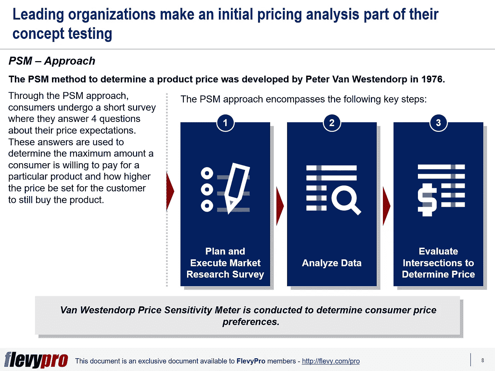

# 利用范·韦斯滕多尔普价格敏感度量表(PSM)评估消费者对产品的支付意愿(WTP)

> 原文：<https://medium.datadriveninvestor.com/utilizing-van-westendorp-price-sensitivity-meter-psm-to-appreciate-consumers-willingness-to-pay-e2e8c6213882?source=collection_archive---------2----------------------->

产品或服务的定价决策并不像看起来那么简单。这是高管需要考虑的一个关键因素。定价远高于竞争对手的产品可能会吸引不到所需的客户，而定价远低于竞争对手的产品可能同样有害。

制造商可以利用研究来更好地了解消费者愿意为产品支付的价格。有许多基于研究的定价方法可用，例如一元、序贯一元、联合分析、 [Van Westendorp 价格敏感度量表](https://flevy.com/browse/flevypro/price-sensitivity-meter-psm-5142)等。—然而，在给定的产品开发阶段，研究人员经常搞不清使用哪一种。现在让我们来讨论一下 Van Westendorp 价格敏感性指数方法。

[价格敏感度计(PSM)](https://flevy.com/browse/flevypro/price-sensitivity-meter-psm-5142) 是一种简单易用的新产品价格评估方法。这种方法是彼得·范·韦斯滕多尔普在 1976 年发明的。通过 PSM 方法，消费者接受一项简短的调查，回答 4 个关于他们价格预期的问题。这些答案用于确定消费者愿意为特定产品支付的最大金额，以及为了让消费者仍然购买该产品，价格应该定得多高。

这种方法为产品价格提供了一个大概的数字，易于管理，需要消费者更少的努力，PSM 结果以简单的图表形式传达。然而，这种方法只调查产品的“支付意愿”属性，更适合创新产品——因为使用这种方法不容易确定竞争产品的价格。PSM 分析应该是你的[定价策略](https://flevy.com/business-toolkit/pricing-strategy-ps)流程的一部分。

PSM 方法包括以下关键阶段:

1.  **计划并执行市场调研调查**
2.  **分析数据**
3.  **评估交叉点以确定价格**

让我们讨论该方法的前两个阶段。

# 计划和执行市场调查

PSM 研究的初始阶段需要决定研究的媒介，并为调查规划后勤、设计、资源、指南和治理协议。更具体地说，该阶段包括:

*   准备实地研究计划。
*   确定调查应该以在线、电话还是面对面的方式进行。
*   识别消费者(受访者)。
*   为调查分配所需的资源。
*   准备好数据收集工具和研究工具(问卷)。

研究问卷应包括以下问题:

*   什么价位的产品会变得如此昂贵，以至于你会考虑购买它？
*   指出对您来说贵但您仍会购买该产品的价格？
*   什么样的价格对产品来说太便宜了，以至于你开始怀疑它的质量而不买它？
*   指出您认为物有所值(划算)的产品价格？
*   从调查参与者那里收集数据。

# 分析数据

第二阶段是分析受访者的实地调查数据。一旦验证了现场数据并清除了任何不一致的错误，就完成了这项工作。这一阶段采取的步骤包括:

*   对 4 个问题进行排序，将价格分为“太便宜”、“便宜”、“变贵”和“太贵”这些等级的值应该以美元数值表示。
*   将调查参与者的回答绘制在图表上。
*   在 X 轴上描绘价格。
*   在 Y 轴上表示报出相应价格的消费者的百分比(即累积频率)。
*   反转两条曲线的值。
*   带有“太便宜”和“太贵”值的曲线是用相反的值绘制的。这将创建另外两条曲线。这些曲线显示了认为价格“越来越贵”和“便宜”的消费者的百分比

有兴趣了解更多关于 [Van Westendorp 价格敏感度计](https://flevy.com/browse/flevypro/price-sensitivity-meter-psm-5142)的另一阶段的信息吗？你可以在[Flevy documents market place](https://flevy.com/browse)上的**价格敏感度计(PSM)** 这里下载[一个可编辑的幻灯片。](https://flevy.com/browse/flevypro/price-sensitivity-meter-psm-5142)

## 你在这个框架中找到价值了吗？

您可以从 [FlevyPro 库](https://flevy.com/pro/library)下载关于这个和数百个类似业务框架的深入介绍。 [FlevyPro](https://flevy.com/pro) 受到 1000 名管理顾问和企业高管的信任和使用。有些人不得不说:

> “我的 FlevyPro 订阅为我提供了当今市场上最受欢迎的框架和平台。它们不仅增加了我现有的咨询和辅导产品和服务，还让我跟上了最新的趋势，为我的实践激发了新产品和服务，并以其他解决方案的一小部分时间和金钱教育了我。我强烈推荐 FlevyPro 给任何认真对待成功的顾问。”

–战略商业建筑师事务所创始人比尔·布兰森

> “作为一家利基战略咨询公司，Flevy 和 FlevyPro 框架和文件是一个持续的参考，有助于我们为客户构建我们的调查结果和建议，并提高他们的清晰度、力度和视觉效果。对我们来说，这是增加我们影响力和价值的宝贵资源。”

–Cynertia Consulting 的咨询区域经理 David Coloma

> “作为一个小企业主，FlevyPro 提供的资源材料已被证明是非常宝贵的。根据我们的项目事件和客户要求按需搜索材料的能力对我来说很棒，并证明对我的客户非常有益。重要的是，能够针对特定目的轻松编辑和定制材料有助于我们进行演示、知识共享和工具包开发，这是整个计划宣传材料的一部分。虽然 FlevyPro 包含任何咨询、项目或交付公司都必须拥有的资源材料，但它是小公司或独立顾问工具箱中必不可少的一部分。”

–变革战略(英国)董事总经理迈克尔·达夫

> “作为一名独立的成长顾问，FlevyPro 对我来说是一个很好的资源，可以访问大量的演示知识库来支持我与客户的合作。就投资回报而言，我从下载的第一个演示文稿中获得的价值是我订阅费用的好几倍！这些资料的质量让我能够打出超出自己体重的水平，这就像是用很小一部分开销就能获得四大咨询公司的资源一样。”

–Roderick Cameron，SGFE 有限公司的创始合伙人

> “我每个月都会浏览几次 FlevyPro，寻找与我面临的工作挑战相关的演示文稿(我是一名顾问)。当主题需要时，我会进一步探索，并从 Flevy 市场购买。在所有场合，我都阅读它们，分析它们。我采纳与我的工作最相关和最适用的想法；当然，所有这些都转化为我和我的客户的利益。"

量子 SFE 公司首席执行官奥马尔·埃尔南·蒙特斯·帕拉

在 [**管理和企业咨询**](https://app.ddichat.com/category/management-and-corporate-consulting) **:** 中安排一个 DDIChat 会话

 [## 专家-管理和企业咨询- DDIChat

### DDIChat 允许个人和企业直接与主题专家交流。它使咨询变得快速…

app.ddichat.com](https://app.ddichat.com/category/management-and-corporate-consulting) 

在此申请成为 DDIChat 专家[。
与 DDI 合作:](https://app.ddichat.com/expertsignup)[https://datadriveninvestor.com/collaborate](https://datadriveninvestor.com/collaborate)在此订阅 DDIntel [。](https://ddintel.datadriveninvestor.com/)