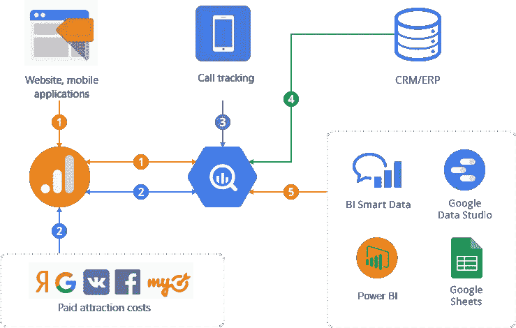
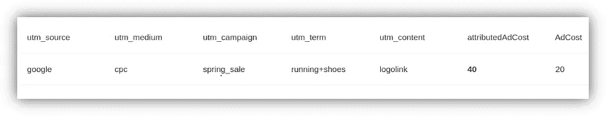

# UTM 标签及其在商业智能中的作用

> 原文：<https://medium.datadriveninvestor.com/utm-tags-and-their-role-in-business-intelligence-ac5fbe8a8115?source=collection_archive---------11----------------------->

Source:[Depositphotos](https://ru.depositphotos.com/5126501/stock-photo-usa-postage-stamps-background.html)

## 了解如何在广告活动中自动使用 UTM 标签和动态参数

UTM 标签是分析广告活动的基本元素。没有它们，你就不能发现哪个广告把访问者送到了你的网站，不能把会话和广告成本联系起来，也不能建立商业智能。

 [## 影响者在聚光灯下表演|数据驱动的投资者

### 影响者营销是一个脱颖而出的游戏。结果是一个令人难忘的-和可信的-连接到一个产品或…

www.datadriveninvestor.com](https://www.datadriveninvestor.com/2020/01/15/influencers-perform-in-the-spotlight/) 

在本文中，我们将告诉您什么是 UTM 标签，为什么使用它们，以及它们如何组合来自不同来源的数据。我们还将了解在创建 UTM 标签时应该避免哪些错误，以及如何简化动态参数的使用。

# 什么是 UTM 标签，为什么需要它们？

UTM 标签是一个特殊的参数，它被添加到 URL 的问号后面。

示例:

*http://www。网站。com/？UTM _ source = yandex . ru&UTM _ medium = CPC&UTM _ campaign = TV&UTM _ term = TV&UTM _ content = Samsung*

首字母缩略词 UTM 代表海胆追踪模块。一点历史:2005 年，谷歌收购了海胆软件，因为它的分析系统海胆点播。这个系统后来形成了谷歌分析的基础。随着 Google Analytics 的发布，UTM 标签已经成为营销人员用来跟踪各种广告活动(包括线下广告)转换的标准。

有五种主要类型的 UTM 标签。其中三条是强制性的:

1.  **utm_source** 指向用户的转换源——也就是显示广告的站点
2.  **utm_medium** 表示用户来自的频道
3.  **utm_campaign** 标识了进行转换的广告活动

两个标签是可选的:

1.  **utm_term** 展示了广告活动中的关键词
2.  **utm_content** 标识用户点击的广告内容项目

# 为什么正确的 UTM 标记对商业智能至关重要？

要回答这个问题，你需要理解商业智能是如何工作的。实现的方法有很多。在本文中，我们将详细讨论 OWOX BI 使用的方法。

简而言之，商业智能的本质是结合不同来源的数据:你的网站或移动应用程序、广告来源、电子邮件和电话跟踪服务、CRM/ERP 系统。所有这些数据都被上传到一个存储库(在我们的例子中是 Google BigQuery ),然后使用一些键组合起来。然后，您可以在报告中使用这些信息，并在不同的部分对其进行分析。

数据如何与 OWOX BI 结合:

Image courtesy of the author

# 商业智能的优势

*   在单一系统中分析数据
*   准确评估广告活动的效果
*   查看从首次访问到购买的用户路径
*   根据数据而不是直觉做决定

# 数据整合的挑战和特点

理论上，一切听起来都很简单，但实际上，在设置商业智能时，您可能会面临以下问题:

*   脸书，扬戴克斯。Direct 和其他广告平台不会给出 UTM 标签方面的广告统计数据。稍后我们将解释为什么这是一个问题。
*   您可以仅使用 UTM 标签将用户会话数据与广告成本数据相结合。没有别的办法了。
*   如果没有 UTM 标签或者它们设置不正确，你就不能识别一个活动或广告。这意味着您无法正确地将成本归属于某个会话，也就是说您无法找出每个会话的成本。了解每个会话的成本是构建商业智能的基础。

# UTM 标签可以回答的问题

UTM 标签可以回答很多问题，包括:

*   哪个广告促成了这一转变？
*   用户来自哪个地区？
*   哪些网站显示了过渡发生的广告？(这主要与上下文广告有关。)
*   哪种设备的转换率更高？
*   创收最多的用户是什么性别或年龄？

是的，你可以用其他方式回答这些问题，但是你也可以使用 UTM 标签。您可以通过动态参数收集这些数据。

# 动态参数及其在广告服务中的应用

营销人员使用动态参数来传递有意义的信息，这些信息表征了用户和广告显示的条件。这些参数被指定为花括号{}中的 UTM 标记值。动态设置是在您建立活动时建立的。当显示广告时，广告服务将参数值放在大括号中。

# Yandex 的例子。直接动态参数

*   {广告标识}或{横幅标识}是广告标识符
*   {campaign_name}是广告活动的名称
*   {campaign_id}是广告活动的 id
*   {关键词}是显示广告的关键词短语
*   {region_name}是显示广告的地区

带有动态参数的链接示例(粗体):

www。网站。com/？UTM _ source = yandex & UTM _ medium = CPC & UTM _ campaign = {**campaign _ name**}&UTM _ term = {**关键字**}&&UTM _ content = id | {**phrase _ id**} _ {**retargeting _ id**} | cid | {**campaign _ id**} | GID | {**gbid**} | aid | {

你可以对 Yandex 中的所有广告使用类似的链接模板。直接。但是，您不需要在 UTM 标签中指定活动的名称。广告系统将设置活动的真实名称，而不是{campaign_name}。唯一的问题是，在设置中，最好用英语指定活动的名称。

# 脸书动态参数的例子

*   ad_id={{ad。id}}是广告的 id
*   adset_id={{adset。id}}是广告集的 id
*   campaign_id={{campaign。id}}是广告活动的 id
*   ad_name={{ad。name}}是广告的名称
*   adset_name={{adset。name}}是广告集的名称
*   campaign_name={{campaign。name}}是广告活动的名称

我们只引用了两个广告服务，但是许多大型广告服务都使用动态参数，包括 Google、Bing 和 MyTarget。

# OWOX BI 如何使用 UTM 标签

OWOX BI 帮助您自动[将广告服务的成本数据](https://www.owox.com/products/bi/pipeline/google-analytics-cost-data-import/)上传到 Google Analytics 和 Google BigQuery，以及[将您网站上的用户行为数据](https://www.owox.com/products/bi/pipeline/google-analytics-to-google-bigquery/)传输到 BigQuery。

使用 OWOX BI，您可以获得完整的高质量数据:

*   为了链接会话和成本数据，OWOX BI 识别广告中的 UTM 标签。没有广告服务 API 在它们的最终形式中给出具有动态参数的标签。也就是说，链接中只有参数名，而没有参数值。OWOX 知道如何识别这些动态参数。当它从广告服务上传成本数据并遇到带有动态参数的链接时，它可以确定它们的值。这使您可以在谷歌分析报告中查看 UTM 标签中的成本数据。[查看我们的帮助中心，获取 OWOX BI 支持的所有动态参数列表](https://support.owox.com/hc/en-us/articles/115000029034)。
*   导入成本数据时，OWOX BI 会检查活动中的 UTM 标签，并报告任何错误。错误的例子在下面讨论。
*   OWOX BI 将导入的数据转换为正确的格式。例如，Google Analytics 有自己的模式来存储数据，并使用参数而不是 UTM 标签:例如， *ga: source* 而不是 *utm_source* 标签。OWOX 将数据转换成服务使用的格式，并将数据发送到该服务。
*   如果广告服务中的数据发生变化，OWOX BI 会更新上传到 Google Analytics 的数据。比如如果 Yandex。Direct 分析你的流量，并确定你的广告被机器人通过，他们很可能会把钱退还给你的余额。OWOX BI 跟踪这些事情，并保持谷歌分析数据的相关性。
*   如果需要，OWOX BI 可以将您的历史数据上传到 Google Analytics。有了付费套餐，可以上传过去半年的数据。有了免费的软件包，你可以上传过去一个月的数据。我们现在正在开发 OWOX BI 的更新版本，如果广告服务中有数据，它将允许您下载过去任何时期的成本数据。
*   此外，OWOX BI 能够使用自动标记在 Google BigQuery 中收集关于 Google 广告活动的[原始数据，这些数据来自 *gclid* 和 *yclid* 参数。事实是，当显示自动标签广告时，链接中没有使用 UTM 标签。如果你只在谷歌分析中分析广告成本，这不是问题。但是，如果你试图从相同的谷歌广告上传成本数据，并将其与会话数据相结合，你必须通过 *gclid* 而不是标签来确定广告成本。OWOX 知道怎么做。](https://support.owox.com/hc/en-us/articles/115000118353?_ga=2.8573693.991121332.1579090468-610037343.1575931431)
*   当使用 OWOX BI 导入数据时，广告服务的货币被转换为 Google Analytics 属性的货币。

# 使用 OWOX BI 导入 Google Analytics 成本数据的算法

1.  OWOX BI 使用官方广告服务 API 接收广告显示统计数据。
2.  对于每个公告，OWOX 都会获得 UTM 标签。在大多数情况下，它们是一个链接。
3.  如果 UTM 标签包含动态参数，OWOX 将从该链接中提取这些标签。
4.  OWOX BI 分析这些标签的错误，并用它们的值替换动态参数。
5.  获得所有 UTM 标签值后，OWOX 形成一个 CSV 文件上传到 Google Analytics。除了标签之外，这个文件还包含关于成本、放映、点击和日期的数据。
6.  最后，OWOX BI [将这个文件上传到 Google Analytics](https://support.owox.com/hc/en-us/articles/219386448) 。

OWOX BI 定义的标记错误:

*   没有强制性的 UTM 标签。
*   使用了广告服务 API 中不可用的不支持的动态参数。比如 Yandex。Direct 有一个动态参数，可用于跟踪广告在搜索结果中的确切位置。但是在 ad 部分的 API 中，是不可能得到这个数据的。在这种情况下，我们建议使用谷歌分析用户设置，而不是动态设置。
*   无法解析 UTM 标签。当广告平台不具备定义标签的技术能力时，某些类型的广告可能会出现这种情况，例如 Yandex 上的智能横幅。直接。
*   UTM 标签中的语法错误。

# 通过 OWOX BI 将成本数据导入 BigQuery 的算法

构建商业智能的下一步是将成本数据导入 Google BigQuery。这样做非常类似于将成本数据导入 Google Analytics。唯一的区别是，我们只将 UTM 标签和成本的信息传输给 Google Analytics，我们将额外的参数(脸书超过 200 个指标)传输给 Google BigQuery。

这使您可以建立详细的报告进行深入分析，创建再营销列表，有效地管理广告费率，并训练您的机器学习模型进行更准确的规划。

# 收集用户行为数据

OWOX BI 有自己的计数器(类似于谷歌分析计数器)，安装在客户的网站上。在它的帮助下，OWOX 在 Google BigQuery 中以点击量的形式记录用户行为的数据。这些数据只有几分钟的延迟。24 小时后，用户会话从包含点击数据的表格中形成表格。

然后，我们填充这些表中的两个字段: [attributedAdCost 和 AdCost](https://support.owox.com/hc/en-us/articles/218060287) 。

1.  首先，OWOX BI 从谷歌分析获得带有 UTM 标签的广告数据。在大多数情况下，这只是使用 OWOX BI 加载的成本数据。
2.  OWOX BI 从谷歌分析数据中形成了一个广告费用表。
3.  OWOX 使用会话表中的标记和开销表中的标记来定义每个会话的开销。
4.  因此，在会话流表中，所有开销都分配给用户会话(attributedAdCost 字段)。

Image courtesy of the author

这些信息有助于您分析不同部分的数据。最简单的事情是计算每份订单的成本。只需获取转换用户的 attributedAdCost，如果有一些付费转换，则合计成本，并获得您订单的成本。

您还可以按用户、群组或登录页面对费用和收入进行分组。这有助于评估旨在吸引老用户或吸引新用户的活动的有效性，以及规划不同类别、地区等的预算。

在我们关于[如何评估产品类别、客户群和登录页面的有效性](https://www.owox.com/blog/articles/cost-per-session/)的文章中，了解通过了解一次会议的成本可以解决哪些任务。

# UTM 标签中的错误

根据我们的经验，这些是 UTM 标记中最常见的错误:

*   根本不用标签。例如，你在脸书上做广告，有一个脸书公司的网页，上面有你网站的链接。如果你不使用 UTM 标签，你永远也不会明白你的页面或广告是否有过渡。
*   没有使用所有需要的标签。例如，您指定了一个 *utm_source* ，但是没有指定一个 *utm_medium* 。
*   在一个活动中使用不同的寄存器命名一个标签。例如， *CPC* 和 *cpc Google Analytics* 将算作两个不同的活动。
*   在链接中使用锚点。锚点是后跟某个值的晶格。锚需要放在 UTM 标签之后。
*   使得标记值太长(超过 8 KB)。在这种情况下，标签将被修剪。

手动标记中的语法错误:

*   包括差距。
*   重用“？”符号。
*   在 UTM 标记值中使用“&”。“与”符号将一个标签与另一个标签分开。如果在标签值中使用，会造成混乱。
*   在 UTM 标签值中使用括号{}。OWOX BI 算法将括号中的值作为未知的动态参数。

# 简短的结论

1.  UTM 标签是分析广告活动效率不可或缺的实践。
2.  根据业务逻辑和要解决的任务设计活动和 UTM 标签。自己决定需要分析哪些数据段。例如，如果你想分析品牌和非品牌流量，最好在广告来源中有不同的活动。
3.  充分发挥动态参数的潜力。在 Google Analytics 的成本分析报告中，您可以使用高级选项轻松过滤您的数据。例如，您可以按位置查看成本，显示您的上下文广告网络等。

**访问专家视图—** [**订阅 DDI 英特尔**](https://datadriveninvestor.com/ddi-intel)