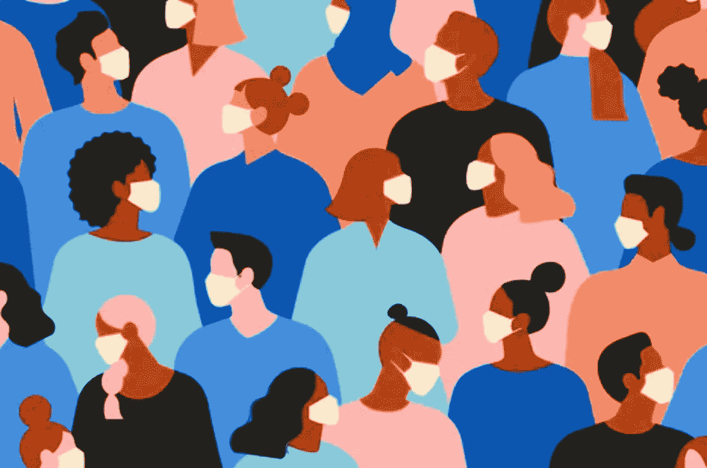

# 疫苗与新抗体疗法对抗 COVID19

> 原文：<https://medium.datadriveninvestor.com/vaccines-vs-new-antibody-treatment-to-fight-covid19-e6f20d37aa34?source=collection_archive---------9----------------------->

科学家正在寻找疫苗的替代品，使用 X 射线发现的抗体可以更快地结束冠状病毒疫情。

[https://theconversation.com/coronavirus-is-a-breeding-ground-for-conspiracy-theories-heres-why-thats-a-serious-problem-132489](https://theconversation.com/coronavirus-is-a-breeding-ground-for-conspiracy-theories-heres-why-thats-a-serious-problem-132489)

就在一个月前，我写了一篇关于牛津超级疫苗的文章，这种疫苗未经临床试验就直接进入生产。那篇文章谈到迫切需要疫苗来结束疫情。疫苗是对抗疾病的一种非常可靠的方法。但是一般的疫苗是在几年的时间内开发出来的，而且在大多数情况下仍然不是 100%安全的。然而，目前疫苗是长期对抗 COVID19 疫情最广泛接受和有效的形式。

牢记疫苗的缺点。科学家开发了一种相对快速而有用的方法，通过产生中和抗体来帮助人们抵御冠状病毒。

通常，疫苗包括引入致病因子的一小部分，在这种情况下，是 SARS-COV2 病毒的一部分——可能是刺突蛋白，也可能是弱化形式的整个病毒。这导致我们体内立即产生抗体，然后结合到病毒颗粒上，阻止它作用于我们的细胞。

 [## 冠状病毒；惊慌失措；字里行间的 z |数据驱动的投资者

### 围绕冠状病毒的话题；更准确地说，新冠肺炎几乎占据了整个新闻预报的头条…

www.datadriveninvestor.com](https://www.datadriveninvestor.com/2020/03/23/coronavirus-a-to-panic-z-between-the-lines/) 

这些抗体是在体内自然产生的，但有些人不能产生这种抗体，其他人可能会导致具有敏感免疫力的人出现危险的症状或疾病。

这就是为什么科学家们决定使用中和抗体——不同于自然产生的抗体。这些中和抗体与人体产生的抗体是一样的，但都是在实验室制造的，然后注射到我们的体内。然后，它们结合导致疾病的病毒或微生物，中和其作用，并防止其感染我们的身体细胞。

通过这种方式，任何可能对疫苗免疫或特异性反应较弱或可能无法产生自身抗体的患者或个人都可以利用这些中性抗体来保护自己免受 COVID19 感染。

他们是怎么做到的？

华盛顿大学的一组科学家自 2013 年以来一直在研究冠状病毒，他们创造了针对 SARS 和 MERS 的中和抗体。在意识到当前的疫情也是由冠状病毒 SARS-COV2 引起的后，他们决定将注意力转向寻找对抗 COVID19 的完美中和抗体。

> 领导这项研究的科学家之一韦斯勒博士说，
> 
> “我们非常兴奋地发现了这种有效的中和抗体，我们希望它能参与结束新冠肺炎疫情，”

**结果——SARS-CoV 抗体命名为 S309**

这种抗体不亚于一个单位的海豹突击队。在血液中检测到 COVID19 病毒后，它会立即有效地中和该病毒。

这些抗体的最好部分可能会在我们的血液中持续 1 到 2 年，而我们自己的身体产生的抗体通常不会持续超过几个月。

作为救世主，他们的工作已经完成，但作为科学家，他们仍然必须找到这种中和抗体实际上是如何工作的，发现这还不够。

下一个任务是在低温电子显微镜中使用特殊形式的 X 射线。这有助于他们理解明亮的中和抗体结合 COVID19 的刺突蛋白并使其无用的机制。

对显微镜样本的分析表明，样本完全没有传染性。

科学家们再次找到了一种快速有效的方法来治疗 COVID19。

这篇文章是《自然》杂志论文的简化版，解释了这个过程。这种疗法已经在进行成功的临床试验，一旦这些试验完成，这种药就可以作为非处方药在你当地的药店买到。

是的，COVID19 生物制品将是一个漫长的过程，但随着这一领域的大量研究的进行，我们很快就会有必要的武器来结束它。第一步是意识，然后是社交距离。

我们已经跨越了这两个阶段，我们的生活将很快恢复正常，随着世界各地的研究人员为我们创造的药物和疫苗的出现。

最终，新冠肺炎能教给人类的最重要的一课是，我们都在一起。—基兰·马祖姆达尔-肖，百康 T3