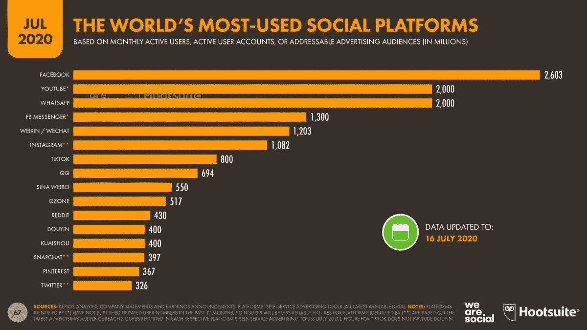
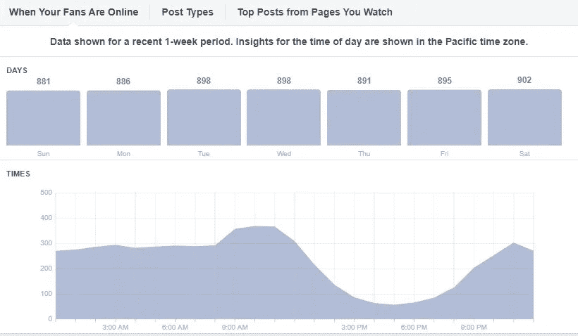
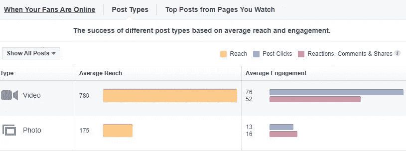

# 宝贵的经验引领数字化成功之路

> 原文：<https://medium.datadriveninvestor.com/valuable-lessons-lead-the-way-to-digital-success-ec27ff48ca42?source=collection_archive---------25----------------------->

## 早期的失误会困扰你的企业很长一段时间

Photo by Estee Janssens on Unsplash

在线营销等同于数字营销的弊端。以错误的方式参与——或者根本不参与——失败的搜索引擎优化和其他错误挖了很深的洞要爬出来。

错误肯定会发生，但如果你在数字营销中从一开始就犯了错误，它会永远困扰你的业务， [Melanie Namulwany Hapisu](https://twitter.com/Namulwany/) 对此很清楚。除了是一名数字营销人员，她还是一名广告人、战略家和培训师。

在一次[非洲推特聊天](https://twitter.com/AfricaTweetChat/)中，她谈到了数字营销的错误以及如何避免这些错误。

Namulwany Hapisu 列举了她看到的最常见的失误:

*   创建社交媒体页面，根本不发布*。仅仅创建页面并把它放在那里是不够的。你需要建立一个受众群体，并利用你在页面上发布的内容为他们创造价值。*
*   *不计后果地在付费广告上花钱。你所需要做的就是在有机增长和付费增长之间取得平衡。没必要乱花钱。*
*   *出错时删除评论。这应该是一个*不！不要！不要！* [解决](https://www.datadriveninvestor.com/glossary/address/)无论是在评论区还是单独在直接消息中的问题。千万不要删除。*
*   *针对所有人。你必须从一开始就清楚这一点，因为没有哪个品牌针对所有人。*
*   *不一致。记住，一致性并不意味着你每天都发帖子。可能是一周一次。*
*   *不回应评论和信息。不要只是放出来内容和欲望投入，然后就走了。当你得到那份工作时，确保你也参与其中。*

# *反社会的摇头*

*品牌通常会犯一个他们很容易避免的惊人的内容错误。*

* [## 数据讲述数字营销的故事|数据驱动的投资者

### 谈到投资回报，社交媒体改变了游戏规则。同时，量化内容和…

www.datadriveninvestor.com](https://www.datadriveninvestor.com/2019/07/21/data-tells-the-tale-of-digital-marketing/) 

“他们错过了社交媒体中的‘社交’，”Namulwany Hapisu 说。“与其卖得太多，不如努力多教育你的观众。

“也缺乏适合手机的内容，”她说。“大多数人都在使用手机。因此，在创建内容时，一定要考虑到这一点。”

为了了解更多关于创建内容的知识，Namulwany Hapisu 制作了一个播客，讲述如何利用内容营销进行商业活动。

不更新老客户是另一个不必要的问题。

“你最终错过了留住他们的机会，”Namulwany Hapisu 说。“他们不知道你在做什么，也不知道你提供了什么能让他们受益的新服务。你基本上没有给他们任何关注的理由。

“这也可能会限制你从他们那里获得推荐，”她说。“如果你有一项他们圈子里的人可能需要的服务，这一点至关重要。”

如果一家企业没有让消费者普遍了解新的服务产品，这就更糟糕了。

除了在网上犯错，根本不在也同样糟糕。

Namulwany Hapisu 说:“你肯定会错过一部分在网上的目标受众。“一个简单的视觉效果可以向你展示世界上一些最常用的社交平台。想象一下你可以通过社交联系到多少人。

“使用社交媒体能让你接触到更广泛的受众——包括国际受众，”她说。“你能想象能接触到这么多人吗？太神奇了。”

# 数字中的答案

检查分析可以解决大多数数字营销错误。

“分析可以帮助你了解你在社交媒体上到底在和谁说话，他们何时在线，他们消费什么类型的内容，”Namulwany Hapisu 说。“这些是人们经历的常见问题。

“基于你的在线交流，分析基本上可以帮助你了解什么是有效的，什么是无效的，”她说。“一旦得到解释，分析实际上可以帮助决策。”

根据 Namulwany Hapisu 的说法，如果企业拥有现有页面，脸书报告和洞察工具有双重好处:

*   知道你页面上的人什么时候在线，他们什么时候在线。

*   根据你的交流，了解你的受众一直在与什么样的内容互动。

Namulwany Hapisu 说:“在实施数字营销战略时，不要在开始之前就改变它。“解决听众的痛点。

“要有营销预算，”她说。"如果你想有机生长，确保你有一个平衡."

# 随意约会

Namulwany Hapisu 精心准备了她的营销策略:

*   设定现实的数字营销目标。
*   没有适当的资源，不要采取太多的策略。
*   不要期望一夜之间就有结果。

“把社交媒体想象成结交新朋友或者和你的心上人调情，”她说，“这需要时间。”

 [## 对于搜索引擎优化，文字是关键|数据驱动的投资者

### 搜索引擎优化可以恐吓未经训练。从一开始，它有助于获得正确的缩写…

www.datadriveninvestor.com](https://www.datadriveninvestor.com/2018/12/29/for-seo-the-words-are-key/) 

相反，Namulwany Hapisu 找到了搜索引擎优化策略不奏效的原因:

*   您的网站可能有糟糕的内容。
*   你的网站跳出率很高。
*   您的网站不支持移动设备。
*   大多数消费者现在都使用手机。
*   也许你期待结果太早了。SEO 需要耐心。

Namulwany Hapisu 说:“有意识地腾出时间来创造内容。“这是你的孩子。你需要照顾它。

“如果你必须一个月创作一次内容并安排好所有的时间，那就这么做吧，”她说。“这样你就可以经常吸引你的追随者了。”

最伟大的数字营销工具之一就在你的指尖。

“把你的个人社交媒体和品牌简介放在手机上，”Namulwany Hapisu 说。"然后，一旦你收到关注者的通知，你就可以随时随地参与其中."

**关于作者**

吉姆·卡扎曼是[拉戈金融服务公司](http://largofinancialservices.com/)的经理，曾在空军和联邦政府的公共事务部门工作。你可以在[推特](https://twitter.com/JKatzaman)、[脸书](https://www.facebook.com/jim.katzaman)和 [LinkedIn](https://www.linkedin.com/in/jim-katzaman-33641b21/) 上和他联系。

*原载于 2020 年 10 月 8 日 https://www.datadriveninvestor.com***。***