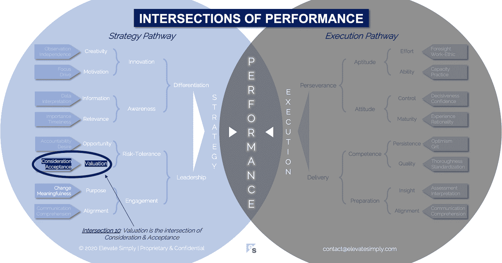

# 10.估价:考虑与接受的交叉点

> 原文：<https://medium.datadriveninvestor.com/valuation-the-intersection-of-consideration-acceptance-eebe7b15e763?source=collection_archive---------11----------------------->

Image from 123rf.com

最近，我与一个公司高管团队进行了一次一致性评估，他们发现价格是一个竞争劣势。当我把这个发现告诉这位高层领导时，他的回答是“价格不是问题。问题在于，在潜在客户的心目中，我们无法将我们服务的价值与我们的价格联系起来。”无论对错，这是一个很有见地的观点，也是许多企业可能会纠结的观点。

**什么是价值，如何确定？**

估值活动不仅限于公司的产品和服务。估价是大多数商业决策的关键输入，从确定整体战略到雇用资源到绿色照明项目再到研发投资。无论是明示还是暗示，决策中的每个可能选择都有其价值。企业以各种形式实现价值:

*   *财务价值*:收入/利润增加，费用减少，投资回报率，公司估值，定价，弹性
*   *相关性价值*:市场感知、声誉、品牌资产、商誉、可持续性、创新、认可、需求、利用率、消除浪费、效率、客户满意度
*   *时间价值*:首次上市、快速上市、市场时机、节奏时机、寿命、任期
*   *人员价值*:保留、参与、员工满意度、创造力、奉献精神、存在感、动力、推荐

根据我的经验，价值通常是由“旁观者的观点”决定的。每个人对任何事情都有自己的价值标准。在我们寻求让事情变得简单易行的过程中，我们实施了一些与价值相关的“帮助”,当消费者试图购买几乎任何东西，而价格已经确定时，就可以证明这一点。虽然我们可能不同意设定的价格，但它有助于我们快速做出购买决定，因此使交易更快、更规范。

思考已经有价格的东西是相当简单的。然而，在商业中，许多像前面提到的决策(即制定战略、招聘、选择项目、R&D)并没有价格标签，因此分析中的财务估价部分并不简单，上面提到的其他类型的价值分析也不简单。

大多数时候，企业和领导者在不完整和不完善的信息下做出估值决定。为了有效地做到这一点，他们必须至少理解估值的构成。

**什么是估值交集？**

估价是对价和接受的交集*(见下图交集 10)*。归根结底是选择的问题。在两个或两个以上的东西之间选择，或者在有东西和没有东西之间选择。

*考虑事项*

对价是估值中的“什么”。在考虑什么？有哪些选择？

当考虑公司战略时，每个选择的价值都非常高，影响也非常深远。所以风险也高。相比之下，另一个评估场景是考虑使用哪个供应商来打印名片。印刷名片的价值显然远低于公司战略的价值。在最坏的情况下，解决或修复糟糕的名片印刷比选择糟糕的企业战略更容易。

考虑是复杂的，涉及财务、相关性、时间和人员等价值变量。尽管选择名片供应商所实现的价值可能是显而易见的(名片看起来好还是不好)，但商业策略的价值通常需要更长时间才能实现。每一个估值考量都不一样，这也是为什么估值这么复杂的原因。

*交集 10:估值=对价+接受*

Image by [Brett Simpson](https://medium.com/u/191cf90a65d7?source=post_page-----eebe7b15e763--------------------------------)

*验收*

接受回答了“值得吗？”，说到估值。答案可能是“不”，这是一种接受的形式，因为我们已经接受了一个选项而不是另一个。它可能不是我们认为(或希望)会接受的那个，但不管出于什么原因，它是被选中的那个。

接受的力量不仅仅在于选择 A 还是 b。接受还包括条款，也就是协商。条款可以是条件、规定、妥协、界限、里程碑、附加批准、时间表、先决条件等。在商业中，除了一些简单的交易，总会有条款。每个利益相关者都希望确保他们从考虑中获得最大价值。

当然，价值推导并不总是公平的，通常是那些有权力的人更有可能获得最大的价值。也就是说，在考虑和接受估值决定时，准备充分的领导者可以施加很大的影响。

**领导者能做什么？**

当涉及到重要的估值时，领导者必须保持消息灵通，并了解所有利益相关者的价值杠杆。控制对价的能力可以为估价交叉点的接受方提供形状。例如，领导者必须计划“何时”评估结果会开花结果或为人所知(即短期与长期计划)。只有这样，才能做出取舍。

重要的是，最成功的领导者是那些与所有利益相关者建立意识的人。意识并不意味着共识，而是理解什么是被考虑的，以及接受的规则是什么。

**总结&下一个**

估值很棘手。不管是有意还是无意，企业的每个方面都有价值。确定哪些方面和决策需要更深层次的分析和考虑并不容易。集中的努力水平将导致更好的接受决定和结果。

下一次我们将考察绩效的第 11 个交叉点，即**机会交叉点**。

*在这一系列文章中，我们探索*性能*的交叉点，共有 30 个。*绩效的交叉点*框架是基于*[*Brett Simpson*](https://www.linkedin.com/in/brettjsimpson/)*[*董事总经理(简称为*](https://www.linkedin.com/company/elevatesimply/)*)20 多年来作为企业家、顾问和投资者在大大小小的组织中的领导经验和见解。**

***绩效-文章链接的交叉点***

*1.[绩效:策略的交集&执行](https://medium.com/the-innovation/1-performance-the-intersection-of-strategy-execution-2bf06329f8d4)*

*2.[战略:领导力的交叉点&分化](https://medium.com/the-innovation/2-strategy-the-intersection-of-leadership-differentiation-a568b17731ab)*

*3.[领导:约定的交集&风险承受能力](https://medium.com/the-innovation/3-leadership-the-intersection-of-engagement-risk-tolerance-f8c887e6c1d3)*

*4.[差异化:创新的交叉点&意识](https://medium.com/@brettjsimpson/4-differentiation-the-intersection-of-innovation-awareness-a21d053ecf12)*

*5.[订婚:目的的交集&对齐](https://medium.com/@brettjsimpson/5-engagement-the-intersection-of-purpose-alignment-953747437c26)*

*6.[风险承受能力:机会的交集&估值](https://medium.com/@brettjsimpson/6-risk-tolerance-the-intersection-of-opportunity-valuation-29cf4d9a0ac)*

*7.[认知:信息的交集&关联性](https://medium.com/@brettjsimpson/7-awareness-the-intersection-of-information-relevance-f0fd5322bcb7)*

*8.[创新:创造力的交汇点&动机](https://medium.com/@brettjsimpson/8-innovation-the-intersection-of-creativity-motivation-7c1a12e0d5e2)*

*9.[目的:变化的交叉点&意义](https://medium.com/@brettjsimpson/9-purpose-the-intersection-of-change-meaningfulness-9f12b0153e1)*

*10.[估值:对价的交集&验收](https://medium.com/@brettjsimpson/valuation-the-intersection-of-consideration-acceptance-eebe7b15e763)*

*11.[机遇:欲望的交汇&责任](https://medium.com/the-innovation/opportunity-the-intersection-of-desire-accountability-7e81adb1e195)*

*12.[相关性:重要性的交集&及时性](https://medium.com/@brettjsimpson/relevance-the-intersection-of-importance-timeliness-56cc748eb066)*

*13.[信息:数据的交集&解读](https://medium.com/@brettjsimpson/information-the-intersection-of-data-interpretation-62acc94ba8bf)*

*14.[动机:焦点的交集&驱动](https://medium.com/@brettjsimpson/14-motivation-the-intersection-of-focus-drive-d9ebd3ca9951)*

*15.[创造力:观察的交集&独立性](https://medium.com/@brettjsimpson/15-creativity-the-intersection-of-observation-independence-57f7294acb2b)*

*16.执行力:毅力与交付的交集*(即将推出！)**

*17.交付:准备与能力的交集*(即将推出！)**

*18.毅力:天资与态度的交汇*(即将推出！)**

*19.准备:洞察力和一致性的交集*(即将推出！)**

*20.能力:坚持与质量的交汇点*(即将推出！)**

*21.态度:控制与成熟的交汇点*(即将推出！)**

*22.资质:努力与能力的交汇点*(即将推出！)**

*23.洞察力:评估与解释的交集*(即将推出！)**

*24.质量:彻底性和标准化的交汇点*(即将推出！)**

*25.坚持:乐观与勇气的交汇*(即将推出！)**

*26.成熟:经验与理性的交集*(即将推出！)**

*27.控制:果断与自信的交汇*(即将推出！)**

*28.能力:能力与实践的交集*(即将推出！)**

*29.努力:远见和职业道德的交集*(即将推出！)**

*30.走向:传播与综合的交汇点*(即将推出！)**

****在*** [***管理与企业咨询***](https://app.ddichat.com/category/management-and-corporate-consulting)***:****

* [## 专家-管理和企业咨询- DDIChat

### DDIChat 允许个人和企业直接与主题专家交流。它使咨询变得快速…

app.ddichat.com](https://app.ddichat.com/category/management-and-corporate-consulting) 

***申请成为 DDIChat 专家*** [***此处***](https://app.ddichat.com/expertsignup) ***。****