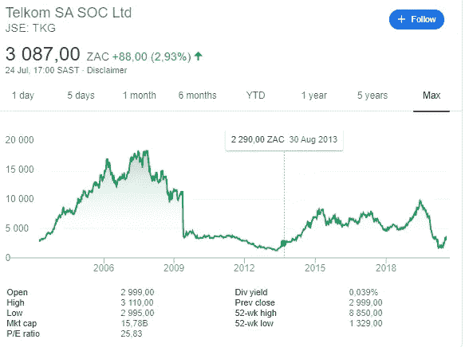
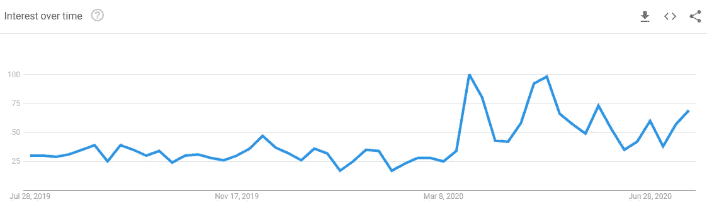

# 估值和商业模式:Rain Mobile 与 Telkom

> 原文：<https://medium.datadriveninvestor.com/valuations-and-business-models-rain-versus-telkom-b9e18d6a476e?source=collection_archive---------6----------------------->

Rain Mobile 的价值超过了 Telkom。非洲彩虹资本的股东、会计师、分析师到底在抽什么？这是你会问的问题。名不见经传的 Rain Mobile 怎么能吸引到与电信巨头相当的估值，更不用说比它高了？Motsepe 的 ARC(Rain 的大股东)是不是想在这里上演类似 Steinhoff 的戏码？

# **让我们来看看前景**

*   在应用了 12.5%的少数股权折扣和 18.7%的可销售性折扣后，ARC 将其在 Rain 的 20.7%投资估价为 ZAR 27 亿英镑。打折前的估值为 35 亿 ZAR
*   这使得 Rain Mobile 对 ZAR 的总估值达到 171 亿美元。
*   Telkom 的市值目前是 157 亿 ZAR。

Telkom’s ZAR 15.7 billion market capitalization

# **估价方法和重要性(g)**

ARC 使用贴现现金流法对 Rain Mobile 进行估值。公司要吸引如此高的价值 g，增长指标也必须非常高。

我们很容易陷入批评 DCF 模型或批评 ARC 在评估 Rain Mobile 时使用的增长因子(g)的陷阱，因为我们不欣赏结果集。因此，从逻辑上检查公司目前达到的增长率，然后检查预测增长率是否合理是很重要的。

技术企业家、数字营销者、增长黑客和风险资本家很容易理解与闪电战规模相关的超高增长率，但特许会计师、金融分析师和散户投资者却不太理解。分析师很快调低了增长预期。财务总监们很快削减了营销预算。战争仍在继续。

 [## 商业无国界:如何走向全球？数据驱动的投资者

### 首先，你要形成你的主要目标。例如，寻找投资，固定你的市场…

www.datadriveninvestor.com](https://www.datadriveninvestor.com/2020/07/14/business-without-borders-how-to-go-global/) 

Rain Mobile 目前可能正在经历 PayPal 在大规模扩张阶段经历的事情，正如雷德·霍夫曼(PayPal 和 LinkedIn)所说。正在发生的大规模扩展只能被描述为闪电式扩展。当闪电式扩张开始时，公司发展如此之快，以至于不得不以牺牲效率来换取速度。它必须让小火燃烧，只解决大火。客户服务之类的问题变得不重要。这一点在 Rain Mobile 身上体现得很明显。他们的廉价产品每天吸引着成千上万的新客户，而他们的客户服务却无法应对。

# **有证据表明，Rain Mobile 正在经历一个快速扩张阶段**

*   **脸书传呼流量和投诉** —就在南非进入封锁状态后，Rain 的网络成为有史以来最差的网络，可能是因为它太拥挤了。该公司可能有大量新注册用户，以至于它甚至没有机会升级网络。新的联系远远高于他们的合理预期。自从封锁以来，他们的[脸书页面](https://www.facebook.com/RainSouthAfrica/)上的投诉显著增加。类似的流量和投诉增加的趋势在 YouTube 上也很明显。
*   **谷歌搜索趋势**——谷歌搜索趋势给出了对特定主题兴趣的粗略指示。在封锁之前，谷歌对南非 Rain Mobile 的搜索趋势平均每周 26 次。现在平均每周 52 起。这是在很短的时间内(3 个月)100%的增长率

Rain Mobile Google Search Trends

# **要问的关键问题**

1.  **我们有估值问题还是商业模式问题**？我们似乎有估值问题，当然也有商业模式问题。这是一场商业模式之战。精益模型与重型模型的对比。停留在过去的商业模式与未来的商业模式。
2.  **是 ARC 高估了 Rain Mobile 还是市场低估了 Telkom** ？答案很容易是两者都有。我们没有来自 Rain Mobile 的当前收入数据，也没有关于增长率的适当信息来确定高估值是否合理。由于对冠状病毒将如何影响这个庞然大物的收入和现金流缺乏足够的了解，市场以一种奇怪的过度反应低估了 Telkom。
3.  **我们应该在私募和公募估值之间有重大差异吗？**我们是否拥有并且应该拥有不同的数字组？市场总是被认为是正确的，因为它体现了集体智慧，但市场经常被发现是错误的。一些被严重低估的公司被收购并私有化。市场。董事的估价可能是错误的。市场的估价也可能是错误的，但是市场十有八九是正确的，而董事的估价十有八九是错误的。
4.  为了实现销售，您需要在基础设施上投资多少？在这个问题上，Rain Mobile 可能需要比 Telkom 投入更多的资金来创造销售，因为它是一个新的市场。Telkom 拥有庞大的电信基础设施，并已经开始创收。然而，在纯技术层面上，Rain 比 Telkom 投资更少，因为根据摩尔定律，实施新技术的成本逐年下降。纯数据基础设施比完整的 MNO 需要更少的资本投资。数字更容易表达一个概念。一个虚构的例子可能是这样的:为了开始产生收入，Rain Mobile 需要 70 亿 ZAR 的基础设施，而 Telkom 需要 200 亿 ZAR 的基础设施，差异归因于不同的技术和实施成本。
5.  **你支付多少运营费用和维护费用来维持你的收入水平**。在这方面，Telkom 处于劣势。该实体需要一批工程师、一批光纤专家、一支庞大的呼叫中心队伍和一卡车的客户服务顾问来维持其收入水平。如此多的其他公司在和他们一样的光纤、LTE、3G 和 4G 领域竞争，他们必须努力捍卫自己的地盘。成本结构沉重，网络维护成本高。Rain Mobile 获得的 10 亿美元收入并不等同于 Telkom 获得的 10 亿美元收入。雨赚的十亿更值钱。所有的收入是不平等的。在 Rain 赚取的 10 亿美元中，由于运营支出结构的差异，与 Telkom 相比，股东可以获得更多。
6.  **边际成本——怎样才能产生额外的 10 亿兰特销售额？** Rain Mobile 相对于 Telkom 享有边际成本优势。可能需要 100 多名 5G 支持者和 100 多名员工来获得 20 万名客户，这些客户将每月向他们支付 500 per，以获得无限数据，这将为运营商每年带来 10 亿兰特的收入。在人口高度集中的大都市可以很容易地获得顾客，这进一步降低了边际成本。
7.  **Telkom 运了多少朽木**？无用资产指的是在旧资产中损失的资本，或者是在新购买的过时技术设备中锁定的资本。这是对资源的消耗。在足球的背景下，这类似于把大卫·贝克汉姆和埃利克·坎通纳留在曼联队的名单上。当然，他们是传奇，他们会踢球，在他们的巅峰时期，他们比现在的球员如马库斯·拉什福德更好。然而，传奇们已经过了他们的最佳时期，在追逐英超联赛的过程中，他们在球场上将是非常无用的。这是朽木资产的可悲案例。你不应该把它们放在球队名单上。有些甚至很难处理掉。会计等价物将是诚实的重估和减记，这将显示真实的盈利能力(通过计入呆滞资产的损失)以及显示资产负债表上实物资产的真实投资。如果对 Telkom 的资产负债表进行诚实的熏蒸，我们会对由此产生的利润水平和资产负债表规模感到惊讶。

> 这些显著因素导致了我们在估值上的差异。

# **为什么一家初创公司的价值会超过一家经验丰富的巨头？**

细节决定成败。估值是前瞻性的。他们不关心你过去做了什么。他们强调你将来会做什么。你会为客户产生多少价值，为股东创造多少财富？资本主义冷酷无情。

贴现现金流(DCF)估值并不关心 Telkom 存在了多久，以及它在电信基础设施上投资了多少。大多数人很快就开始讨论设备和基础设施的问题。这种观点假设所有基础设施都可以持续部署以产生回报。它忽略了技术变化的速度，这使得一些设备在提供服务时变得过时和昂贵。一个 Rain Mobile 5G booster 可以轻松地为超过 1000 条 Telkom 电缆的更多人提供服务。

拥有一家公司的用处在于这家公司将来能为你赚钱。如果没有赚钱的能力，拥有公司就没有任何意义。没啥用。如果能力有限，股票不应该吸引更高的估值。一个很好的问题是:未来 10 年，Telkom 会比 Rain Mobile 赚更多的钱吗？回答这个问题之前要仔细考虑。

商业模式在回答上述问题时变得非常重要。年轻人的精力超越了老年人的经验。创新的、准确的商业模式迅速将旧的商业模式赶出市场。

#自由希望

再见。

**进入专家视角—** [**订阅 DDI 英特尔**](https://datadriveninvestor.com/ddi-intel)