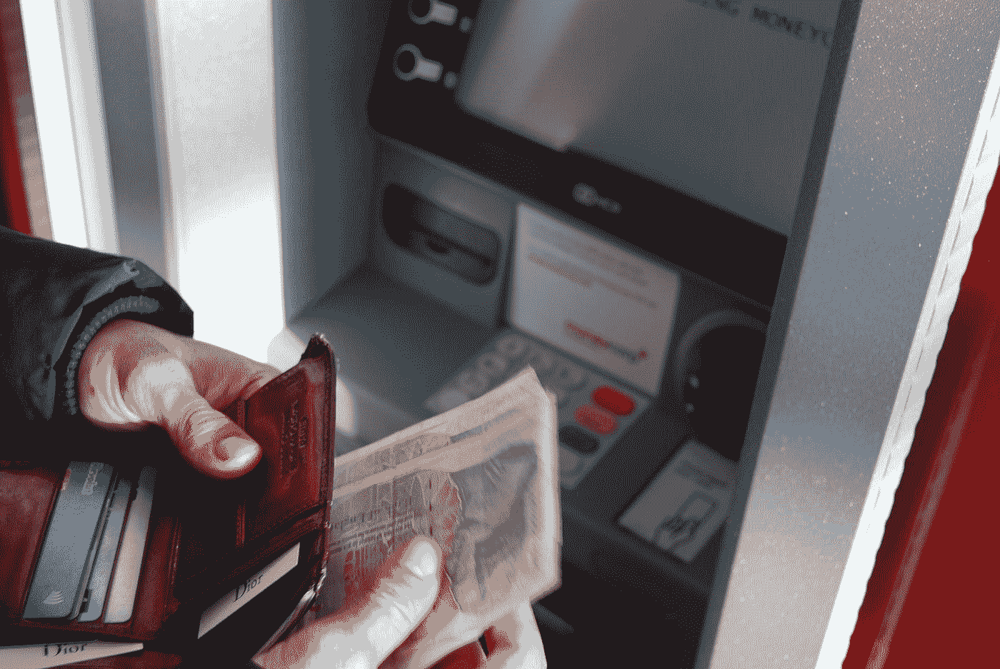
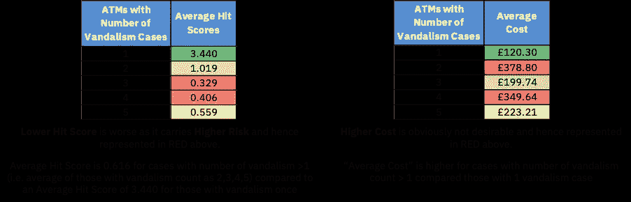
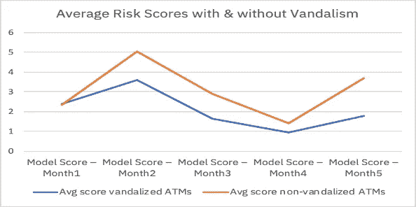
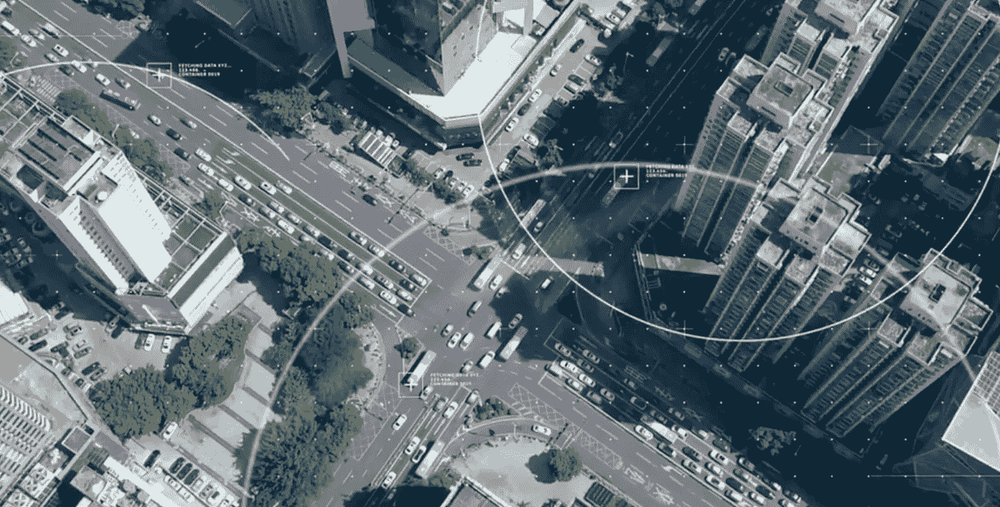

# 银行和金融服务中的恶意破坏欺诈分析

> 原文：<https://medium.datadriveninvestor.com/vandalism-fraud-analytics-in-banking-and-financial-services-17c25f0c5a1f?source=collection_archive---------8----------------------->

## *恶意破坏欺诈分析和预测分析的融合为银行和分支机构业务服务带来了更大的影响*

Photo by [Nick Pampoukidis](https://unsplash.com/@pampouks?utm_source=medium&utm_medium=referral) on [Unsplash](https://unsplash.com?utm_source=medium&utm_medium=referral)

随着世界各地 COVID 和后 COVID 场景中出现更多需求，拥抱数字化转型不再是一种选择，在这些场景中，数字化颠覆有着巨大的推动力。通过数字化银行业务，数字化转型的整个游戏正变得无处不在，以适应不断发展的环境中的客户体验。将运营和需求转移到数字渠道正成为“新常态”，而且这一趋势正在加速。与此同时，银行和金融机构也有责任为其客户提供无缝、安全的体验。影响任何银行和金融服务组织的 ATM 机群的恶意破坏或欺诈案件是一个值得关注的领域，以便能够做出明智的决策，确保业务可用性并减轻对客户体验的影响。

我们研究了有恶意破坏的 ATM 机和没有恶意破坏的 ATM 机的财务影响，并确定了风险最高的 ATM 机和最不可能被恶意破坏的 ATM 机之间的明确界限。那些评级较高的公司的成本是正常情况下的两倍。

Photo by [Nico Wijaya](https://unsplash.com/@nicowijaya?utm_source=medium&utm_medium=referral) on [Unsplash](https://unsplash.com?utm_source=medium&utm_medium=referral)

预测分析模型提供了有关哪些设备将来会出现故障以及如何计划其可用性、计划其维护、计划管理和处理这些服务的资源等信息。将恶意破坏欺诈分析等更具物理性的情报与常规预测分析相结合，可以产生更强的影响。

***全球化体现在安全威胁上:***

犯罪活动转移很快，也就是说，一旦警方在热点威胁区的执法开始变得更加有效，犯罪浪潮就会转移到保护级别较低的管辖区。虽然卡欺诈和物理 ATM 攻击事件正在下降，但在 2017 年至 2018 年期间，爆炸性气体攻击事件也增加了 40%。一些自动保护技术可能是有效的，但它们是昂贵的，因此有必要预先保护和防止这种破坏案件。识别和跟踪恶意破坏和欺诈的热点区域使我们能够识别这些迁移模式。

地理特征分析的灵感来自犯罪学和流行病学领域的一些建模，以根据历史数据了解可能发生犯罪活动的热区或潜在威胁区域。当我们在预防性维护场景中考虑和应用这一概念时，通过跟踪恶意破坏或欺诈的位置，我们可以定义区域，根据风险暴露对 ATM 机队进行排名，并对库存进行风险管理，以限制未来 ATM 犯罪事件的影响。数据科学和人工智能模型利用地理位置数据和历史破坏案件，并经过训练，根据下个月未来可能发生的破坏风险对 ATM 进行排序。当仅在被破坏的机器上执行分析时，我们比较了以下场景以查看更大的影响。

*   在 6 个月或几个季度内，ATM 被破坏 1 次，而 ATM 被破坏超过 1 次
*   得分最高的 10 台 ATM 与得分最低的 10 台 ATM(得分低表示风险较高，得分高表示风险较低)

Illustrative analysis based on experiment results

两组都表明，平均得分最低的自动取款机被蓄意破坏的频率更高，平均成本也更高。

“低命中分数”表示“高风险”。从所进行的实验中可以清楚地看出这一点，排名也相应地保持不变。实验表明，在整个数据分析时间范围内，两组的评分是一致的:“有任何故意破坏或欺诈行为的 ATM”与“没有任何故意破坏行为的 ATM”。

Illustrative analysis based on experiment results

还可以通过分析 ATM 视频监控系统来研究以威胁为中心的方法而不是漏洞方法，在 ATM 视频监控系统中，可以执行行为分析，以在机器学习技术的帮助下识别指示可能攻击的手势。银行和金融服务组织可以采取先发制人的步骤来应对这样的情况，即想要炸毁安全的 ATM /分支机构区域的罪犯与仅仅想要提取现金、获得账户余额、执行 pin 更改或希望执行任何常规和真实交易的人相比，不会具有相同的冷静态度。

Illustrative image showing portion of a city/road cross section which can be identified based on parameters such as potential hot zone scores depending on finding on model parameters arising out of various factors

总而言之，我坚信研究和实验表明了一种模式，即通过地理位置进行的恶意破坏欺诈分析对于挖掘影响 ATM 机队的潜在犯罪区域非常重要，这可以在利用先进机器学习技术的恶意破坏分析的帮助下得到更好的管理。这对可用性、客户体验以及银行和金融机构的运营成本节约都有直接影响。虽然预测建模是一个关键的警报/警告系统，但恶意破坏欺诈分析有助于深入了解如何最大限度地降低 ATM 机队的风险，并进一步扩大整个数字化转型格局。

***免责声明*** *:这里的帖子是我从各种来源的经验、分析、思考和阅读中得出的个人观点，不一定代表任何公司的立场、策略或观点。*