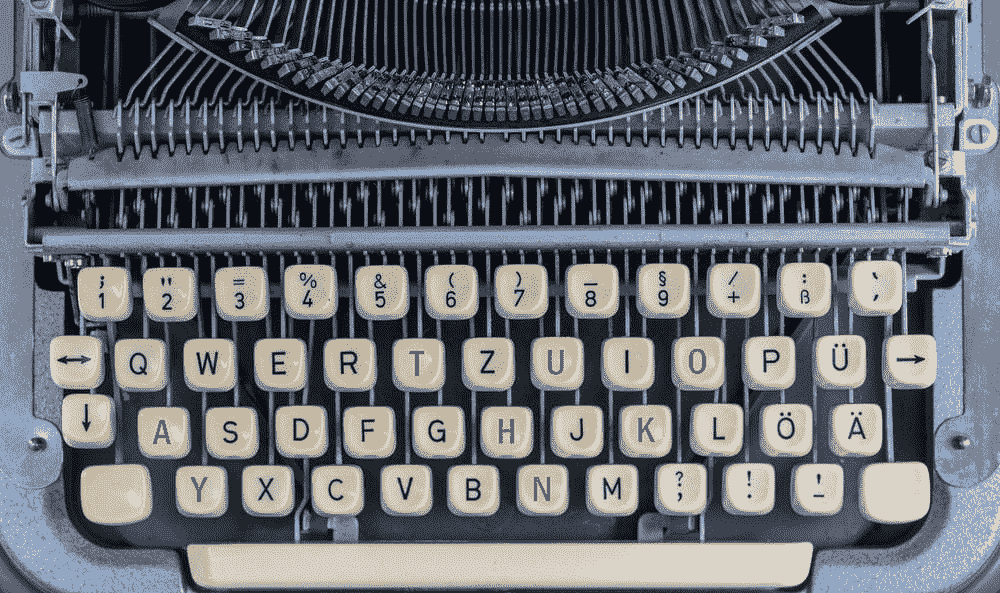

# 可变自动编码器:第 1 部分

> 原文：<https://medium.datadriveninvestor.com/variational-autoencoders-part-1-368bbc3d8aa?source=collection_archive---------12----------------------->

Photo by [Clément H](https://unsplash.com/@clemhlrdt?utm_source=medium&utm_medium=referral) on [Unsplash](https://unsplash.com?utm_source=medium&utm_medium=referral)

# 内容:

*   **为什么要改变自动编码器**
*   **什么是变分自动编码器**
*   **关于 VAEs 的更多细节**
*   **自动编码器和可变自动编码器**
*   **理解自动编码器的更详细方法**

# 为什么要改变自动编码器

变分自动编码器用于描绘数据集的底层结构。

# 什么是变分自动编码器

变分自动编码器是一类重要的神经网络。

变分自动编码器(VAEs)已经成为复杂分布的**无监督学习**的最流行方法之一。

VAEs 已经显示出在生成多种复杂数据方面的前景，包括手写数字、人脸、门牌号、CIFAR 图像、场景的物理模型、分割以及从静态图像预测未来。

Photo by [Hitesh Choudhary](https://unsplash.com/@hiteshchoudhary?utm_source=medium&utm_medium=referral) on [Unsplash](https://unsplash.com?utm_source=medium&utm_medium=referral)

# 关于 VAEs 的更多详细信息

在许多现实世界的问题中，你可以有一大堆我们正在研究的数据。

它可以是图像、文本或音频。

但是在一个比我们正在看的实际数据低得多的维度空间中，数据的潜在过程可能要简单得多。

 [## 认知计算——一套被广泛认为是……

### 作为它的用户，我们已经习惯了科技。这些天几乎没有什么是司空见惯的…

www.datadriveninvestor.com](https://www.datadriveninvestor.com/2020/02/19/cognitive-computing-a-skill-set-widely-considered-to-be-the-most-vital-manifestation-of-artificial-intelligence/) 

所以机器学习中的许多技术，他们试图将数据的维度压缩到一个更小的空间。

一种在最近的研究中被大量使用的非常流行的技术叫做变分自动编码器。

要理解 VAEs，您必须准备好深入研究技术细节。

Photo by [Ayelt van Veen](https://unsplash.com/@ayeltvanveen?utm_source=medium&utm_medium=referral) on [Unsplash](https://unsplash.com?utm_source=medium&utm_medium=referral)

但是在这篇和接下来的博文中，我将以一种非常容易理解的方式向你解释，这对于你的**实际实现非常有用。**

因此，在我们开始变型自动编码器之前，让我们先讨论一下普通的自动编码器。

我假设你已经熟悉这些术语，比如:神经网络，反向传播。

Photo by [Moritz Kindler](https://unsplash.com/@moritz_photography?utm_source=medium&utm_medium=referral) on [Unsplash](https://unsplash.com?utm_source=medium&utm_medium=referral)

# 自动编码器和可变自动编码器

自动编码器执行以下任务:

*   它需要某种输入数据。
*   数据可以是图像或向量(具有非常高的维度)
*   它通过神经网络运行数据
*   它会尝试将数据压缩成更小的表示形式。

Photo by [Traf](https://unsplash.com/@traf?utm_source=medium&utm_medium=referral) on [Unsplash](https://unsplash.com?utm_source=medium&utm_medium=referral)

# **理解自动编码器的更详细方法**

它通过两个主要组件完成上述任务。

1.  **编码器**
2.  **解码器**

**编码器**简直就是一堆层。它们可以是全连接层或卷积层。

他们会接受输入。他们将把它压缩成一个更小的表示，比输入的维数更小。

> 以上情况称为“**瓶颈**”。

然后，从瓶颈开始，它将再次尝试使用全连接或卷积层来重建输入。

Photo by [Andrew Seaman](https://unsplash.com/@amseaman?utm_source=medium&utm_medium=referral) on [Unsplash](https://unsplash.com?utm_source=medium&utm_medium=referral)

训练自动编码器的最后一个功能是查看解码器网络末端的重建版本。

然后，您将简单地计算相对于输入的重建损失。

通过比较输出中像素与像素的差异，我们可以创建一个损失函数，并开始训练网络来压缩我们的图像。

当然，我们有使用全连接层的简单自动编码器。但是你可以把它们和卷积层交换一下(如果我们处理的是图像或者音频之类的东西)。)

如果你训练一个深度卷积网络对一大堆图像进行编码，你实际上是在创造一种全新的压缩算法。

> **谷歌实际上正在考虑使用这些类型的网络来减少你在手机上使用的带宽。**

Photo by [Leon Seibert](https://unsplash.com/@yapics?utm_source=medium&utm_medium=referral) on [Unsplash](https://unsplash.com?utm_source=medium&utm_medium=referral)

因此，如果你下载一个图像，那么全分辨率图像首先被缩小。

然后，它通过无线互联网连接发送给你，然后在你的手机中实际上有一个解码器，从压缩的图像中重建全分辨率图像。

举例来说，如果你把这个应用到像 **MNIST** (一个图像数据集)这样的东西上，那么看看这些隐藏的表示实际上在学习什么是非常有趣的。

所以，你可以看到一堆图像，在左侧你可以看到通过网络输入的数字

右边是所有的重建图像。

但是，你可以看到如果我们改变隐藏表示的大小会发生什么。

Photo by [National Cancer Institute](https://unsplash.com/@nci?utm_source=medium&utm_medium=referral) on [Unsplash](https://unsplash.com?utm_source=medium&utm_medium=referral)

因此，如果我们只使用一个 **2D 隐藏表示**，这意味着我们在网络中间的瓶颈只有两个变量。

然后我们得到的重建图像看起来很好，但是非常模糊。

模糊是因为你强迫你的图像的全部信息通过两个单一的变量。

当你重建时，你会丢失一些细节，这就是为什么图像看起来如此模糊。

如果你在你的**潜在表象**中使用更多的维度，那么你可以得到更清晰、更锐利的重建。

但是你需要更多关于瓶颈的信息。

有趣的是，同样的技术也适用于图像分割。

Photo by [Hitesh Choudhary](https://unsplash.com/@hiteshchoudhary?utm_source=medium&utm_medium=referral) on [Unsplash](https://unsplash.com?utm_source=medium&utm_medium=referral)

你拿一个输入图像，让它通过卷积编码器。

它经过瓶颈表示，然后被重新映射为完整的输出图像。

但在这种情况下，你不是重建原始图像，而是试图将目标对准图像的分段版本。

正是这种类型的网络被用于自动驾驶汽车，将公共道路的不同部分分割成汽车需要检测的特定对象。

在下一篇文章中，我将讨论更多关于自动编码器的内容。

我还将讨论更多的应用，以及如何根据你的任务通过代码实现不同的自动编码器。

# 你的下一步是什么？

> *如果你喜欢这篇文章，点击下面的推荐会很有帮助:)
> 关注我的* [*推特*](https://twitter.com/imPraveenPareek) *，*[*LinkedIn*](https://www.linkedin.com/in/praveenpareek/)*和* [*中型*](https://medium.com/@praveen.pareek)
> 
> ***看我以前的帖子:***[**Gartner 炒作人工智能的周期！**](https://medium.com/analytics-vidhya/the-gartner-hype-cycle-for-artificial-intelligence-4574710a2b97)

 [## Gartner 人工智能炒作周期！

### Gartner 的一份新报告发现，尽管人才短缺，但公司仍在继续采用人工智能。

medium.com](https://medium.com/analytics-vidhya/the-gartner-hype-cycle-for-artificial-intelligence-4574710a2b97) 

## 访问专家视图— [订阅 DDI 英特尔](https://datadriveninvestor.com/ddi-intel)