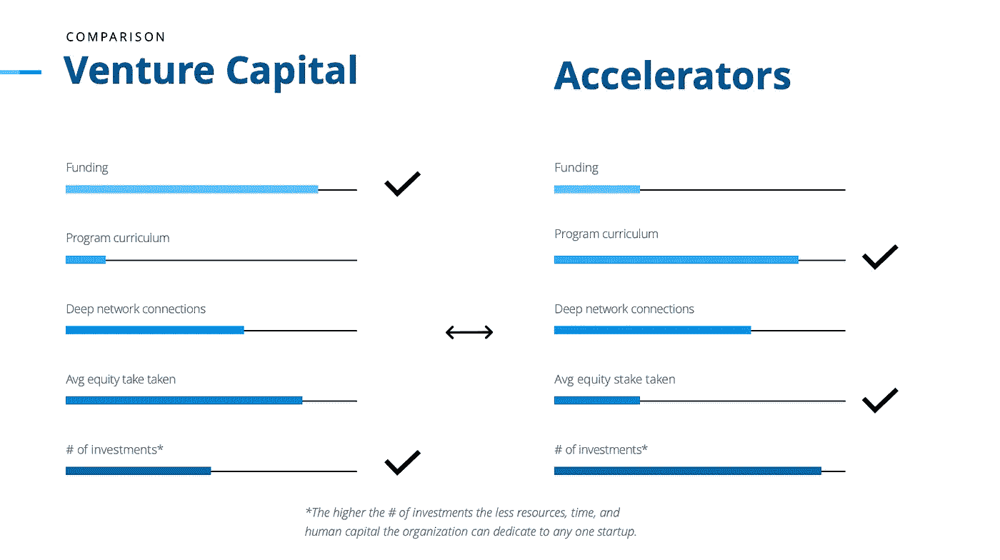

# 风险投资公司变成加速器-好还是坏？

> 原文：<https://medium.datadriveninvestor.com/vc-firms-turned-accelerators-good-or-bad-84f018c05bd2?source=collection_archive---------3----------------------->

初创企业的启动和规模格局正在发生变化，但这并不新鲜。在风险资本投资成为常态之前，企业主必须向银行申请贷款，在此之前，他们必须完全启动自己的企业。

 [## 风险投资家在给创业公司播种时会考虑什么标准？数据驱动的投资者

### 2017 年，风险投资资金攀升至十年来的最高水平。你的创业公司目前吸引风险投资的机会是…

www.datadriveninvestor.com](https://www.datadriveninvestor.com/2018/04/20/what-criteria-do-venture-capitalists-consider-when-seeding-a-startup/) 

随着技术的发展和企业家变得更有创造力，获得启动资金的过程正在发生变化也就不足为奇了，但这值得讨论，因为不是每一种变化都会变得更好。

## 风险资本

创业公司创始人早在种子阶段就寻求风险投资。通常，在创业团队找到一些有意义的方式证明他们的想法有吸引力之前，风投不会投资——但他们不再要求创业团队提交沉重的商业计划，包括三年财务预测和成本分析。尽管这看起来像是风投在帮创业者的忙，但这更多是风投的结果，他们不想通读很可能在几个月后就过时的长篇商业计划。

> 初创公司变化迅速且不可预测，因此，商业计划几乎毫无用处。

如果一家初创公司显示出一些有希望的进展，风险投资公司会邀请他们进行推介，讨论他们的上市策略，并相互讨论，直到他们做出决定。此时，初创公司的创始团队收到了一份类似于“股权换资金”的提议:“我们将给你 100，000 美元，换取你公司 30%的股份。”

风险投资公司必须持有相当一部分股权，以降低(或至少维持)其投资组合的风险水平。投资新的创业公司是一场巨大的赌博，因为有太多的事情可能出错。投资者知道这一点，并以此作为与企业家谈判的筹码。

一旦交易达成，风险投资公司除了资本之外还提供资源。通常来说，风险投资非常适合为创始人介绍关键合作伙伴，通过加入他们的董事会增加初创企业的可信度，并向他们认识和合作的其他企业交叉推广初创企业。

## 启动加速器

创业加速器只有一个目标:帮助创业者将他们的想法或早期风险转化为值得投资的业务。

加速器提供的主要好处是**课程**(一个每周一次的计划，引导创始人走过业务建设的各个阶段)**手把手的支持**(包括技术和招聘帮助)**网络机会**(加速器与创业生态系统中的各种利益相关者和关键合作伙伴有广泛的联系)，以及**获得空间、导师、**和其他基本资源。

> 加速器就像企业家学校。

最常见的情况是，加速器有一个他们坚持的主题或垂直行业。这些主题可以从创业阶段(如想法阶段、种子阶段、首轮融资阶段等。)通过行业类型(如可持续发展、社会影响、技术、零售等。).加速器每年运行一次或两次他们的项目，每个项目的创始人小组被称为“群组”。每个项目群中有 6-30 个企业家团队。

## 加速器与风险资本

最近几个月，我注意到越来越多的风险投资公司吹嘘他们的新项目团队，我也注意到许多加速器宣传他们的创业融资风格。

这里的问题是，风险投资公司并不打算运行“学习成为企业家”计划，加速器也不打算“资助新的创业公司以换取股权”。

然而，这种活动的转换正是双方在当前市场中所做的，所以我开始质疑:**这是好事还是坏事？**

下面的图表描述了创业者在考虑下一步行动时，对他们至关重要的主要因素之间的比较。

如你所见，风险投资公司比加速器提供更多的资金，但他们也比加速器获得更多的股权(在大多数情况下)。

两种组织类型在人脉方面的优势大致相同，因为风险投资公司往往有深厚的人脉，而加速器往往有许多广泛的人脉——这意味着他们在这一点上有着相同的优势和劣势。

此外，传统的风险投资公司每年都会进行一些大额投资，而加速器通常会进行大量小额投资，因为他们的团队中有很多企业家团队。每年投资的数量很重要，因为你投资的越多，对任何一项投资的关注就越少。

这并不是说加速器不给他们的创业公司个人和实际的关注。事实上，我认为他们给予每个创始人团队更多的实际关注，因为他们有更多的资源可以支配，包括自愿花时间与创始人团队在一起的行业专家和导师。另一方面，风险投资公司不太可能直接参与初创企业的启动和扩张，更多地扮演顾问的角色。

Photo by [Marcus Wallis](https://unsplash.com/@marcus_wallis?utm_source=unsplash&utm_medium=referral&utm_content=creditCopyText) on [Unsplash](https://unsplash.com/s/photos/decision?utm_source=unsplash&utm_medium=referral&utm_content=creditCopyText)

## 判决

在我看来，旧投资模式中的新创新非常棒。我喜欢来自风险投资基金和加速器的创新思维，但我担心这些活动可能不符合相关企业家的最佳利益。我不得不质疑风险投资人出去给创业者创造“节目”的动机。

他们只是想填补他们的创业管道，还是真的想帮助创始人学习如何开始、启动、发展和扩大业务？

他们是否有时间亲自参与团队中的每个创始团队，或者他们只是希望课程本身就足以满足企业家的需求？

另一方面，我质疑加速器为何对股权融资模式如此感兴趣。资金在等式中越普遍，企业家就越少审查加速器，以真正确定这是否是帮助他们建立业务的正确选择。金钱可以蒙蔽人，企业家尤其容易受到这个陷阱的伤害，因为他们非常有激情，而且经常破产。无论如何，当企业家为钱而来的时候，加速器有什么激励来保持他们的程序令人兴奋和更新？

总而言之，我认为我们在风险资本领域和加速器领域看到的转变是积极的。就我而言，创始人拥有的选择和资源越多越好，但我们都需要密切关注这一趋势，并确保这里的赢家永远是企业家。利用这些创新的了不起的人来获取经济利益和声望是不道德的，也是不可接受的。

