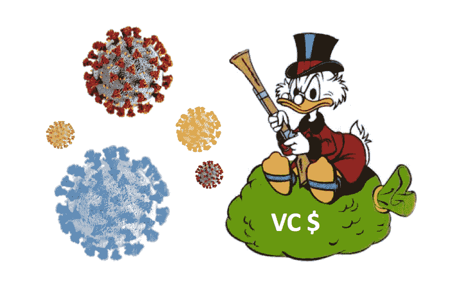

# 风投、初创公司和新冠肺炎

> 原文：<https://medium.datadriveninvestor.com/vcs-startups-and-covid-19-8c54a3f83e59?source=collection_archive---------3----------------------->

## 21 世纪 20 年代的黑天鹅，前新冠肺炎时代和后时代

## 经济恶化是机遇还是挑战？

Powerpoint skills — Level Pro

过去的几年对初创公司和风投来说就像是公园里永不落幕的浪漫散步，空气中弥漫着爱——毫无疑问。

随着价值逐渐从公开市场转移到私人市场，风险投资基金在过去十年中筹集了大量资金。在同一时期，初创公司经历了一场激进的融资牛市，与 2006 年的 280 亿美元相比，2019 年达到了 1400 亿美元的峰值。

在同一时期，前期投资种子的估值从 420 万美元翻了一番，达到 800 万美元，A 轮前期投资的估值从 1000 万美元上升到 2900 万美元。目前，我们有比以往任何时候都多的风险投资资助的美元 1B+ (>60)独角兽——这是一个充满活力的时代。

好像这还不够，风险投资基金坐在一大堆干粉上，等着被部署。不过，新冠肺炎可能会永远扼杀这种浪漫。风险投资生态系统真的讨厌不确定性，以及通货紧缩。

> 如果明天可以买到更便宜的东西，我为什么要今天买呢？即使财务表现没有任何变化，今天的 2000 万美元前期交易也可以在 6 到 12 个月内为 1000 万美元的前期交易提供资金。

# **前新冠肺炎时代**

如果市场上有“领养的火绒”、“失业者的社交网络”、“人们的 yelp”或“勒索你的朋友”的网站(是的，他们都接受了资助)，你实际上知道有些事情从根本上是错误的。

 [## 动荡迫使暴风雨中的平静|数据驱动的投资者

### 自然界中很少有东西是直线行进的，尤其是经济。当投资者和消费者希望平静时…

www.datadriveninvestor.com](https://www.datadriveninvestor.com/2019/03/25/volatility-compels-calm-amid-the-storm/) 

通常看不见的手(亚当·斯密——聪明人)会纠正市场，就像互联网泡沫时期一样。但是到目前为止什么都没发生，这就是为什么风投市场过去是这样的:

**所有阶段的估值**都处于历史最高水平**过去 15 年，它们在多个行业稳步增长。**

**融资规模**从**高点**一路飙升至更高，尤其是在 B/C/D 轮融资中，主要是由于大量的美元 1B+风险投资基金，当然还有软银。

**稀释**逐渐减少，相当低**，因为风险投资在争夺最好的创业公司和企业家，而有限合伙人继续在零利率环境下寻求收益。**

****流动性**高得不能再高了**，这要归功于风投、风投和政府倡议的生动且不断增长的生态系统。****

****T21 的燃烧率达到了顶峰，比以往任何时候都要高。越来越多的烧钱怪兽得到了风投的资金，就像服用了类固醇的健美运动员一样。****

******单位经济的盈利能力**很低**，高速增长和市场份额是主要的成功指标。******

> ******C 奥维德-19 带来了巨大的风向变化，世界现在颠倒了。我们正处于经济自由落体的过程中，资本市场下跌，信贷市场冻结，各国央行正在干预，不确定性成了我们的新伴侣。******

# ******后新冠肺炎时代******

******起起伏伏总是会发生的，石油危机、网络泡沫、全球金融危机、欧元危机以及现在的新冠肺炎——尽管这种情况感觉非常不同，但我认为复苏将是漫长、痛苦的，充满不确定性。******

******为了把握新冠肺炎的实际含义，我想把它与 2008 年的全球金融危机和 2000 年的互联网泡沫进行比较。就在雷曼兄弟倒闭后，投资的风投资金下降了 40%，而在互联网泡沫破裂后，下降了 49%，两种情况下都花了两年多时间才从危机中恢复过来。不过，值得注意的是，种子融资恢复最快，而 C 轮融资耗时最长。******

******查看历史数据，我发现了一个有趣的方面。除了 2008 年第三季度有所下降之外，早期融资的交易数量没有任何变化。估值和融资规模是导致风险投资金额下降的主要因素。******

******在风险投资方面，有限合伙人对风险投资基金的承诺在 2000 年后下降了 40%以上，在 2008 年后下降了 58%。因此，在新冠肺炎之后，我们可能会看到类似的下跌。******

******让我们将今天和未来 12 到 24 个月与新冠肺炎之前的世界进行比较:******

********所有阶段的估值**都将大幅下降**，尤其是在 B/C/D 轮融资中，风投对新交易会非常谨慎。他们将只关注现有的投资组合和机会交易。********

********圆形尺寸**将下降，并在下个月出现新的**低点**。现金是王道，runway 也是如此，初创公司会选择尽可能长时间地获得资金。******

******稀释**会随着时间的推移**增加**，尤其是在种子期。多轮混合稀释将出现**新高**。****

****随着时间的推移，风险投资基金**的流动性**将会下降。新的第一次基金将很少，第二次和第三次基金将小于预期。****

******创业公司的烧钱速度**会下降**，裁员和自举将是基本的生存要求。******

******盈利能力将不得不**增长**，现金流为正将是新的高速增长。******

****对于初创公司和风投来说，市场将会发生变化，我们将从蜜月期走向真正的婚姻，前面会有问题和挑战。将会有更少的担心错过回合，即将到来的回合肯定会比去年更艰难。****

****初创公司和风投将不得不期待更低的增长率、更长的销售周期和更高的(自然)流失率。筹资速度将会放缓，同时总体上更加困难。由于不确定性和市场波动，各行业的商业活动将普遍下降。由于中国和其他市场前所未有的封锁，供应链将出现大规模中断。价格、M&A 活动和首次公开募股将减少或放缓。****

> ****这可能是一个重新思考风险投资如何投资初创公司以及初创公司如何配置资本的机会吗？**为了维持一个可持续和节俭的创业生态系统，从 1 到 0 的重置有时是必要的**，**？******

# ****新冠肺炎危机剧本****

****如今大多数筹集资金的企业家从未经历过衰退，可能是因为他们太年轻了。企业家需要为低迷的市场做好准备，因为规则已经改变。****

****筹集资本在某种程度上就像和一位大师(在这里是风投)下棋。每一次谈话或会议都是定位你的创业公司的战略举措，是一项了不起的投资，也是最划算的交易。****

****好的和坏的市场都会造就伟大的公司，最好的公司仍然会得到资助——适者生存。因此，创业者必须根据风投调整后的投资标准出售自己的初创企业。****

****通常情况下，衰退是创办公司的绝佳市场。例如，谷歌、贝宝和 Salesforce 熬过了网络泡沫的余波。或者更近一些，Airbnb、Square、Stripe、优步和 Instagram 都是在全球金融危机期间成立的。****

****企业家应该仔细思考以下 10 个行动步骤:****

1.  *****烧掉你的 2020 年商业计划和战略，* ***从一张空白的画布*** *。*****
2.  *****快速反应、采纳、迭代！* ***积极主动，专注盈利*** *。*****
3.  *******延长你的跑道*** *，削减成本，精简现金相关业务。*****
4.  *******焦点*** *。消除次要项目、实验和表现不佳的单位。*****
5.  *******保守*** *募集资金，接受更高的稀释和更低的估值。*****
6.  *******质疑你的商业基本面*** *，修改关键业绩指标。*****
7.  *****提高生产力* ***重新考虑你的人员编制*** *，精简你的团队。*****
8.  *******与你的客户、投资者、董事会做好沟通，经常*** *。*****
9.  *******在这段紧张的时间里，展示你的团队需要的领导力*** *。*****
10.  *******现金为王*** *，评估所有备选方案，不要依赖 VC 投资。*****

> ****经久不衰的公司的一个显著特征是它们的领导人在这样的危机中的反应方式。接受新的现实，为任何可能的情况做好准备，祝你好运！****

****有什么想法或问题吗？伸出手来！想要阅读更多？****

****[现代企业家欺诈](https://blog.usejournal.com/modern-entrepreneurial-fraud-c05f2c86a068)****

****[薛定谔的估值问题](https://blog.usejournal.com/schr%C3%B6dingers-valuation-problem-ec5bdbda63a0)****

****[最大化基金分配](/@VC_Truman_Show/maximizing-fund-distributions-4d4d31fea133)****

****[封顶表疯狂](/@VC_Truman_Show/cap-table-madness-62a9750e35f)****

****[*风险投资基金*](/@VC_Truman_Show/venture-capital-fund-amentals-f048c8675d77)****

****[*权益、债务以及介于两者之间的灰色地带*](/@VC_Truman_Show/equity-debt-and-the-grey-zone-in-between-92e65bfde596)****

****[*KPI<kēpərˈfôrməns ˈindiˌkātər>猎人*](/@VC_Truman_Show/kpi-kē-pərˈfôrməns-ˈindiˌkātər-hunter-b625370126e7)****

# ****关于[我自己](https://www.linkedin.com/in/marc-penkala-89697940/)****

*****我是一个充满激情、亲力亲为的风险投资家(+7y)、企业家(+7y)、导师和天使投资人。经过 7 年飞行超过 1，000，000 英里，在飞机上花费 1.200 小时，在各大洲查看 1，000 个初创项目，我决定在* [*山地伙伴*](http://mountain.partners/en/) *收集一些基于这一极其有益的职业旅程的想法。伸出手来！*****