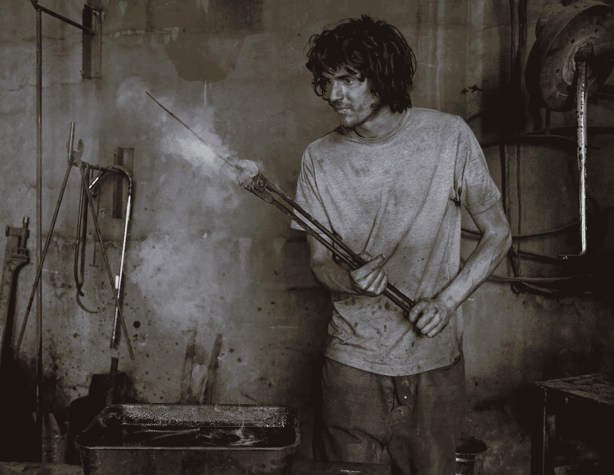

# 凡勃伦错了:迈向新渴望经济

> 原文：<https://medium.datadriveninvestor.com/veblen-is-wrong-the-new-aspiration-economy-765c3d5456d?source=collection_archive---------1----------------------->

[布伦海姆锻造](http://www.courierpaper.com/lifestyle/handmade-knives-south-east-london-blenheim-forge/)刀具。圆形[萨拉维纳](https://serviceplan.blog/en/2018/04/sarah-wiener/)餐饮集团。后备箱。[桑德奎斯特](https://www.sandqvist.com/en/)。冥想。帽衫。奥特利。无肉饮食。巴兹·瑞克森 MA-1。不含酒精的烈酒。包豪斯。忙碌。卡尔萨里肯尼。隐私。CBD。新月在水瓶座。喜欢和关注者。非转基因。数码排毒。第比利斯时装周。格里塔·图恩伯格。金月。间歇性禁食。微观影响。

这是后凡勃伦时代的渴望经济。

在凡勃伦看来，地位只来自于通过消费来展示财富。但是今天的地位不仅仅是用经济术语来表达的。相反，它与文化、健康、伦理、精神、社会影响和环保主义有关。格里塔·图恩伯格是一个青少年，她的事业和道德信念让我们其他人感到羞愧，她享有精英地位。

 [## 另一场精心策划的全球经济危机正在逼近？如果我们的数据经济可以帮助它|数据…

### 我们的 DApp 的开发，称为 DECENTR，目前正与我们的 R&D 同步进行，作为我们即将到来的…

www.datadriveninvestor.com](https://www.datadriveninvestor.com/2019/03/06/another-engineered-global-economic-crisis-looming-not-if-our-data-economy-can-help-it/) 

便宜的商品和活动，像接地、无肉饮食或冥想，是现代社会地位的象征。当消费者购买非转基因产品并询问产品的产地和制造商时，他们通过自己的手艺来表明自己的身份。财富和经济阶层因此被一个人的*价值*和价值观所取代。

现代阶级的根基不在于财富甚至经验的积累和展示，而在于知识。关于艺术、设计、建筑、时尚、音乐以及物品制造方式和地点的知识。它植根于对提供变革性旅行体验的偏僻地点的了解。这是关于了解我们吃的所有东西的营养价值，以及碳足迹——我们穿的、用的和做的所有东西的价值。它还植根于知情:消费者能够解读微妙的品牌信号，或者了解复古和街头服饰。还有社区成员的身份，或者通过积累喜欢和追随者在社交媒体上吸引和控制注意力的能力。

传统奢侈品牌曾经是阶级和地位的可靠信号，现在可以出租和转售。任何人都可以穿着古驰服装四处走动。这颠覆了维布伦商品的概念。凡勃伦商品是其合意性随着价格而增加的东西。但是如今，手工刀可以被认为比路易威登手袋更受欢迎，在零浪费餐馆吃饭比住在四季酒店更能显示身份。看看英国《金融时报》的《如何消费》，也被称为“1%人群的购物清单”:它充满了关于制造商、缓慢旅行、圣诞原木的特征，以及对限量版、低技术展示人类原创性和创造力的钦佩。

现代身份与金钱关系不大。渴望与消费脱钩。穿着新的毛皮大衣曾经是财富的象征；现在这是浪费和无知的信号。欲望与价格脱钩，与知识、故事、归属感和变革潜力相结合，让我们成为更好的人。假毛皮很便宜，但它能区分穿着者，并赋予他们精英地位。现代抱负者是环境保护者、影响者、粉丝、运动鞋头、爱好者和收藏家。不是最富有的人，而是周围最投入的人。

新的欲望经济改变了品牌的角色和意义。品牌的价值有所不同:不是因为它们能给消费者经济地位，而是因为它们提供了社会、文化和环境价值。这是通过品牌故事来实现的。故事让产品更受欢迎，当购买产品时，现代渴望者正在文化、社会和环境叙事中为自己买一个角色。任何品牌如果投资于“引人注目的生产”，都可能成为一个有抱负的品牌。引人注目的生产是指以其商品和服务的采购、生产、分销和营销方式展示其社会、环境和文化价值。

现代渴望要求新观念。消费者看重什么，愿意花钱和关注什么，他们如何将自己与他人区分开来，以及如何传达自己的地位，这些都与一百年甚至十年前不同。当资本不同时，交易也不同。