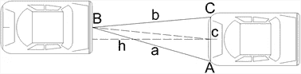
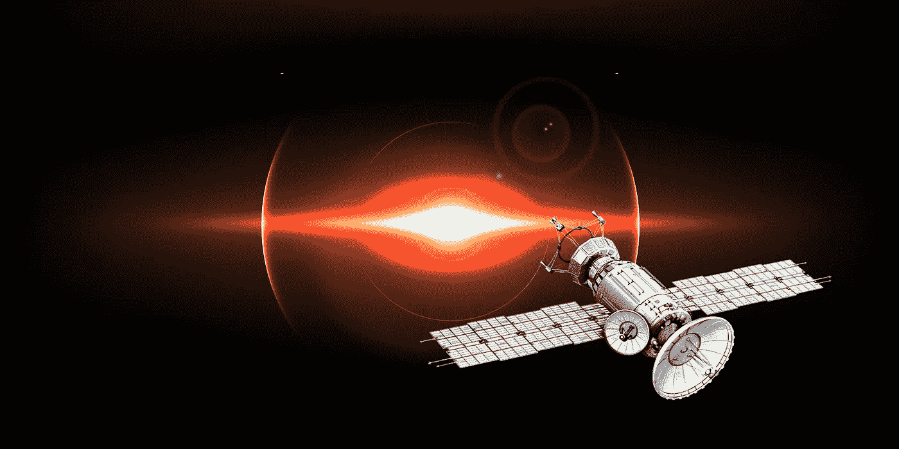
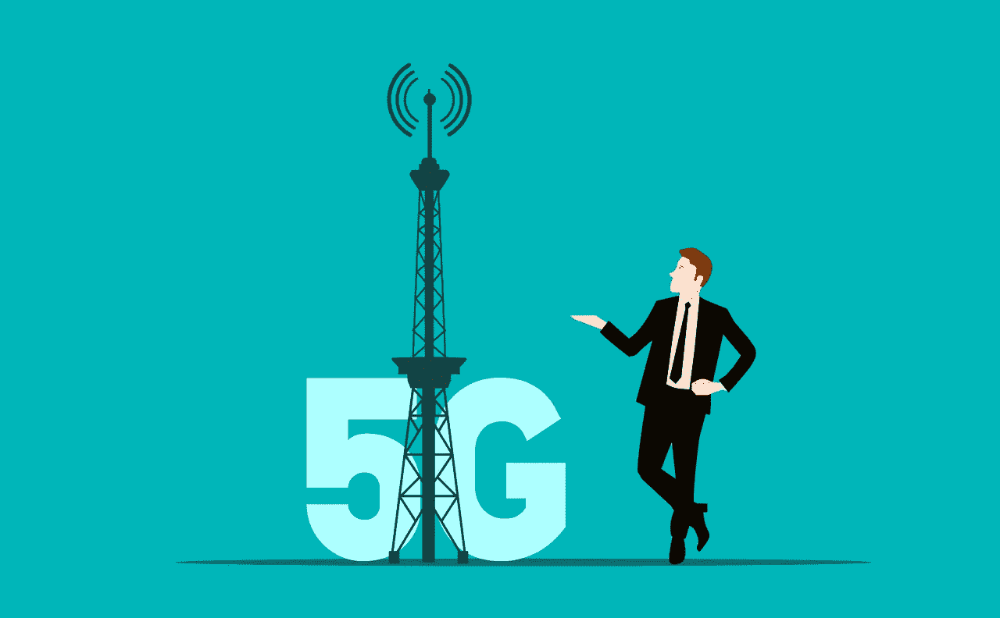
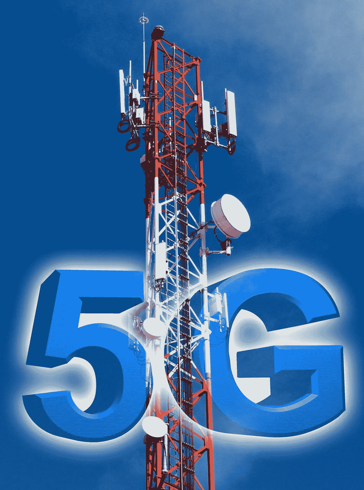
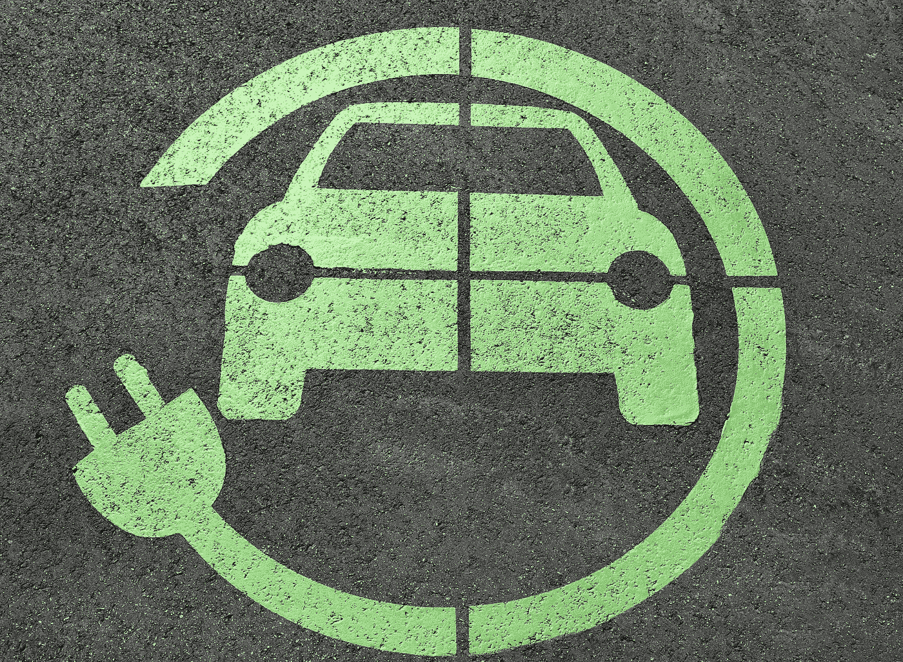
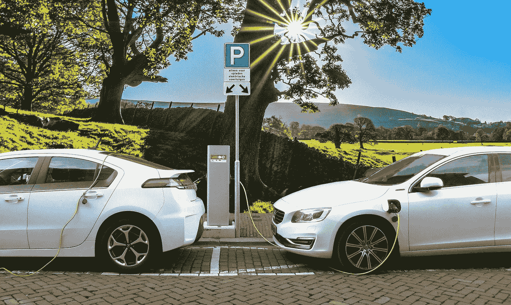
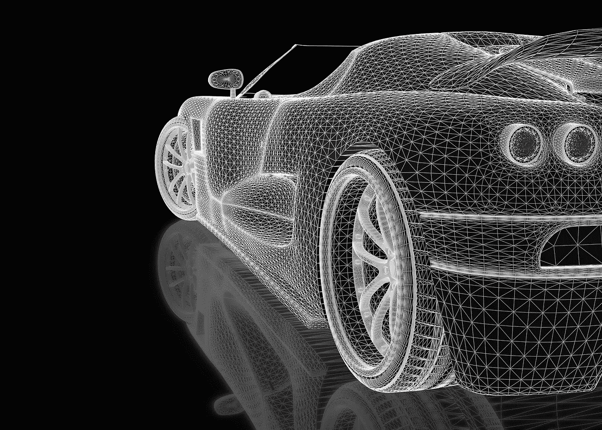

# 汽车防撞:定位技术的应用

> 原文：<https://medium.datadriveninvestor.com/vehicle-collision-avoidance-usage-of-positioning-technology-4d026bd0ef2c?source=collection_archive---------10----------------------->

## 为了减少因视线不佳造成的车辆碰撞事故，提出了超声波和红外线相结合的测距方法，以保证车辆之间的安全距离

Photo by [Hanny Naibaho](https://unsplash.com/@hannynaibaho?utm_source=unsplash&utm_medium=referral&utm_content=creditCopyText) on [Unsplash](https://unsplash.com/s/photos/traffic?utm_source=unsplash&utm_medium=referral&utm_content=creditCopyText)

# 这篇文章主要是关于什么的？

本文首先考虑经济实惠的超声波和红外线联合定位方案，可以初步达到汽车的防撞效果。

进一步考虑到现代通信技术的快速发展，采用 GPS 和 5G 融合定位方案，同时解决高精度定位和高速信息互联的要求。

所以那些车可以通过“群体智能”来协调车与车之间的空间位置，达到防碰撞的效果。避碰问题解决后，将能够为车辆行驶提供基本的安全保障，促进方兴未艾的自动驾驶技术的顺利发展。

逐步实现汽车交通的进化，为建设低碳节能的可持续发展社会贡献力量。

# **简介**

现代社会离不开汽车作为交通工具，但由此引发的交通事故也是不断发生，尤其是车辆碰撞往往造成严重的生命和财产损失。

比如 2012 年 6 月 3 日，在中国，上海高速发生了一起重大交通事故。当日凌晨 5 时 20 分至 40 分，上海高速盐城开发区段突发大雾，两车道共发生约 60 辆机动车。

**追尾**造成 11 人死亡，30 多人受伤。一般规定能见度在 30m 以下的高速公路要封闭，但是局地大雾很难预测。

因此，当当地能见度不良时，司机的视线被阻挡，很容易造成车辆碰撞，造成严重损失。要防止此类事故的发生，除了加强高速公路管理，还需要考虑必要的技术措施。

> **防止车辆碰撞可以从车对车协调的角度考虑。如果车辆能够相互告知它们的精确位置，那么保持它们之间的距离将会更容易**

这需要精确定位技术的帮助。定位是对空间位置的感知，是在空间自由活动的必要条件。

从古代的远洋航海罗盘到今天每个电子终端都有的 GPS，定位技术无处不在。

人类用视觉的交汇来定位距离，用耳朵来辨别方向，用手脚的触觉来感知周围的环境。在海上航行可以使用航海图和星象图，利用视觉图像对比来定位，而指南针利用地球磁场来确定方向。

**近代**从陆基无线电导航过渡到 GPS 定位，以及无线基站定位、WIFI 定位、蓝牙定位，主要利用无线电波的传播特性，红外定位、视觉定位主要利用光的线性传播特性。

**惯性导航**利用机械惯性的特性，多普勒导航利用相对速度引起的波动频率变化的特性。

各种定位技术可谓五花八门，各有其适用条件，可根据用户需求和经济成本进行选择。

> 定位技术和互联网技术在车辆中的联合应用可以初步达到车对车协同的效果，使车辆之间保持足够的安全距离

**一般来说**，只要定位精度达到亚米级(< 1 m)，就可以让车辆更准确的感知周围其他车辆的位置，从而防止碰撞事故的发生。

[https://gph.is/1wp7RGa](https://gph.is/1wp7RGa)

# **超声波定位**

## **超声波定位的原理**

声纳技术是利用声波工作的技术，分为主动声纳和被动声纳。前者像雷达一样，不断向外界发射声音信号，根据回波判断目标的性质。后者不主动发射信号，只接收目标的声音信号。

**被动声纳**由于不发射信号，主要用于隐蔽侦察。当声纳信号被两个以上的接收机听到时，已知声波传播速度和两个接收端之间的声程差或相位差，就可以对声纳系统进行定向。

> 自然界中的蝙蝠和海豚都可以利用超声波来移动和捕猎，这是一种主动声纳

**蝙蝠在飞行的时候**，喉咙里会产生超声波。当遇到昆虫或障碍物时，超声波被反射，蝙蝠可以用耳朵接收，并可以确定探测目标是昆虫还是障碍物，以及距离有多远。

Image by [Alexas_Fotos](https://pixabay.com/users/alexas_fotos-686414/?utm_source=link-attribution&utm_medium=referral&utm_campaign=image&utm_content=988225) from [Pixabay](https://pixabay.com/?utm_source=link-attribution&utm_medium=referral&utm_campaign=image&utm_content=988225)

人们通常称这种用蝙蝠探测目标的方法为“回声定位”蝙蝠回声定位的精度和抗干扰能力对人体声纳雷达技术具有重要的参考价值。

由于超声波在空气中衰减较大，传播距离一般只有几十米，使得超声波定位只适用于小范围。

> **短距离超声波测距系统的精度在厘米级，已用于室内定位和现场定位**

比如汽车驾驶考场，发射器放在车上，跟着车的运动。接收系统可以在计算机上跟踪汽车的轨迹，以便计算机自动判断汽车驾驶员是否合格。

由于声波的传播速度远低于电磁波，所以系统的时间同步相对简单。

**信标**利用无线电或红外线发送，并开启超声波传输。接收器在接收到信标信号后开始计时。当超声波信号到达接收点时，接收器停止计时。

根据授时的时差计算出定位物体到各个接收点的距离，然后利用三边定位等方法，获得定位物体的坐标。

## **三面超声波定位**

超声波可以用于车辆之间的距离测量和定位。红外发射被用作计时的起点。

**红外光和超声波**同时发出。由于传播距离短，红外光的传播时间可以忽略不计。然后根据超声波到达的滞后时间计算距离。如下图所示。

Ultrasonic positioning of vehicles

前车的超声波发射单元是 B，后车的超声波接收单元是 A 和 c，测得 AB 之间的距离是 A，BC 之间的距离是 B，AC 之间的距离是已知的固定距离 c。

参考剩余的倒车超声波雷达，可以根据超声波到达的滞后时间来定义车辆防撞的报警级别。

如果超过 0.1 秒，与前方车辆的距离大于 34m，可以认为是安全距离，不作提示。

**在 0.01~0.1 秒**之间，设置不同的提示等级。如果短于 0.01 秒，前方车辆在 3.4m 以内，有碰撞危险，蜂鸣器会连续报警。当然，结合车辆的当前速度来设定预警级别更为合理。

## **简单的超声波定位**

从节约成本的角度出发，只需要一个发射头和一个接收头就可以实现简单的超声波定位。

> 发射器安装在前车的后端，接收头安装在后车的前端

前车以 0.2 秒的间隔发送红外信号和超声波信号。后车根据红外信号和超声波信号的时间差得出两车距离“d”，并近似。

用这个对角线距离作为两车之间的距离，再结合后车的速度“v”来判断是否在安全范围内。

> **由于跟随车辆的速度越大，所需的安全距离也越大，因此可以简单地根据表达式**

**v/d < k(v)**

为了确定是否需要报警，d 的单位可以取为 m，v 的单位可以取为 km/h。k 根据安全要求设置为适当的值，可以表示为速度 v 的函数。

例如，如果简单地设置为固定值 1，如果后面的车辆速度为 60 km/h，那么两车之间要求的安全距离至少为 60m，如果距离小于这个值，就会发出报警，这样可以防止前面的车辆突然减速到零的事故。

这样，在极端情况下，考虑到人的反应时间约为 0.1~0.2 秒，扣除后剩余的有效制动距离仍能保证安全。

Image by [Schwoaze](https://pixabay.com/users/schwoaze-4023294/?utm_source=link-attribution&utm_medium=referral&utm_campaign=image&utm_content=3392100) from [Pixabay](https://pixabay.com/?utm_source=link-attribution&utm_medium=referral&utm_campaign=image&utm_content=3392100)

要使超声波检测只影响当前车道的前后车，可以考虑限制前车的超声波扩散角度，防止在距离较短时干扰其他车道的后车。

为了使红外光发射更长，可以使用雾穿透更好的波长范围。内陆雾通常是辐射雾，此时远红外线的传输损耗较小。

**超声波的传播速度**受空气密度等因素影响。空气的密度越高，超声波的传播速度越快，空气的密度与温度密切相关。

比如温度为 0℃时，超声波速度为 332 米/秒，30℃时为 350 米/秒，速度差为 18 米/秒。

> 这会影响超声波测距的精度，但满足初步的车辆防撞要求，这仍然是可能的

**汽车的超声波定位**和防撞解决方案的优点是设备简单，经济，不需要网络。可以作为车辆防撞的基本保障。

**缺点**探测距离短，只适合跟车跟随，无法定位更多车辆位置。为了实现完全的车对车协作，必须采用全球定位技术和信息互联技术。

Image by [Sambeet D](https://pixabay.com/users/sambeetarts-1339110/?utm_source=link-attribution&utm_medium=referral&utm_campaign=image&utm_content=1970121) from [Pixabay](https://pixabay.com/?utm_source=link-attribution&utm_medium=referral&utm_campaign=image&utm_content=1970121)

# **GPS 和 5G 定位**

## **GPS 定位**

GPS(全球定位系统)是一种利用卫星在世界范围内提供导航和定位功能的系统，最早由美国建造。使用该系统，用户可以在全球范围内实现定位、测速和计时功能。

> **GPS 卫星由 24 颗卫星组成，分布在 6 个倾角为 55 度的中圆轨道上**

每个轨道为 120 度，轨道高度为 20，200 公里。其中 21 颗为可用于导航的卫星，3 颗为现役备份卫星。

**GPS 定位的原理**

导航卫星不断向地球表面发送信号，包括信号的准确传输时间和不同时间卫星在太空中的位置。

地球上的任何用户都将根据卫星信号到达的顺序接收卫星信号。用户的精确位置可以计算出自己的空间坐标。

理论上只要同时接收 4 颗卫星的信号就可以实现定位，4 颗以上可以提高定位精度。

**中国的北斗三号系统**

由 3 颗静止轨道卫星、3 颗倾斜静止轨道卫星和 24 颗中圆轨道卫星组成，共计 30 颗卫星。

三颗地球静止轨道卫星位于东经 80 度、110.5 度和 140 度。3 颗倾斜同步轨道卫星倾角为 55 °, 24 颗中圆轨道卫星均匀分布在 3 个轨道平面上。

轨道高度为 21528 公里 55 度。2020 年 6 月 23 日，我国在西昌卫星发射中心成功发射北斗三号系统最后一颗全球组网卫星，并于 7 月 31 日正式开通全球服务。

Image by [Leslin_Liu](https://pixabay.com/users/leslin_liu-5650887/?utm_source=link-attribution&utm_medium=referral&utm_campaign=image&utm_content=4694750) from [Pixabay](https://pixabay.com/?utm_source=link-attribution&utm_medium=referral&utm_campaign=image&utm_content=4694750)

此外，俄罗斯的 GLONASS 和正在测试和组网的欧洲伽利略共同构成了当今世界四大卫星导航定位系统。GPS、BDS、GLONASS 和伽利略使用不同的卫星轨道。

> 如果两者结合应用，可以有效提高卫星定位服务的精度。这是卫星导航应用发展的一个主要趋势

北斗三号卫星导航系统全球定位精度优于 10m，亚太地区单点定位精度可达 2.5m，已经可以满足一些基础场景的需求。

**在单点定位过程中**

卫星向接收终端发送的卫星导航电文，由于大气折射、设备固有误差等因素，会降低定位精度。

**为了消除误差**的影响，可以选择地质条件坚实的地点建立参考站，对卫星导航信号进行实时观测。

通过这些已知位置的参考点的观测数据，辅以 RTK (Real-Time Kinematic)等差分计算技术，可以消除设备的误差影响，计算出电离层和对流层的误差修正参数，从而提高终端的性能。

动态定位精度可达亚米、厘米级，静态可达毫米级。

高精度 GPS 定位服务已经扩展到越来越多的领域，例如被用于高速铁路精密工程测量。

由于大气模型参数在一定范围内差异较小，对于部署在地面增强系统中的基站来说，单站覆盖半径通常为 30–50 公里，定位精度随着站间距离的增大而降低。

**比如**，已经在国内投入商业运营的钱逊定位公司，在全国部署了 2000 多个参考站。

其中，南方部署密集且定位精度可达厘米级，北方部署密度稀疏，定位精度可达亚米级，已能为汽车辅助驾驶提供服务。

Image by [Mohamed Hassan](https://pixabay.com/users/mohamed_hassan-5229782/?utm_source=link-attribution&utm_medium=referral&utm_campaign=image&utm_content=5753179) from [Pixabay](https://pixabay.com/?utm_source=link-attribution&utm_medium=referral&utm_campaign=image&utm_content=5753179)

## **5G 定位**

全球导航卫星系统(GNSS)覆盖区域广，支持设备数量不限，但缺点是信号强度弱，穿透力差，易受干扰。

> **无法提供城市、峡谷、室内、地下等环境广域无缝定位服务**

**无线通信系统**具有覆盖广、使用成本低、可靠性高的优点。利用通信系统进行定位，实现通信导航一体化，可以有效弥补卫星定位的不足。

从第四代移动通信系统 4G 开始，增加了专用于定位的参考信号 PRS(定位参考信号)，基于移动通信网络定位的相关研究开始迅速增加。

由于资源限制(如带宽、持续时间等。)，4G 定位精度不能超过米级。随着第五代移动通信系统 5G 的到来，毫米波、多输入多输出(MIMO)和波束形成等技术为提高定位性能带来了新的机遇。

**5G 的理论定位精度**

也达到了亚米甚至厘米级。5G 还具有低时延、高可靠、大带宽、多接入等特点，将为万物智能连接提供坚实可靠的网络服务。

【2019 年 6 月，中国电信、中国移动、中国联通、广电获得中国 5G 商用牌照，5G 网络建设全面铺开。

5G 定位系统的实现方法是在需要定位的区域建设大量通信基站，利用通信网络形成具有定位功能的定位系统。

**通信基站**检测各种参数(如信号、距离、角度、速度、方向等。)的信号，并将该信号发送给处理中心进行处理并反馈定位结果。

可以简单的认为 5G 定位系统是卫星定位系统的地面版，只不过移动导航卫星变成了固定的通信基站。

Image by [Tumisu](https://pixabay.com/users/tumisu-148124/?utm_source=link-attribution&utm_medium=referral&utm_campaign=image&utm_content=4308821) from [Pixabay](https://pixabay.com/?utm_source=link-attribution&utm_medium=referral&utm_campaign=image&utm_content=4308821)

**一般来说**，在测距方式下，定位只需要 3 个基站。在角度测量方法下，只有两个基站可用于定位。如果测距和角度测量相结合，单个基站也可以用于定位。

**5G 多输入多输出系统**在发射端使用多根天线独立发送信号，在接收端使用多根天线接收信号。

这可以在保持相同带宽的同时提高通信容量和频谱利用率，还可以为角度测量能力提供信号，结合测距，可以实现单基站定位。

**单基站定位**可以有效解决强弱干扰导致的可见基站数量不足的问题，还可以减少建筑物遮挡等因素导致的非视距定位问题。

> 在复杂环境下，单一定位算法存在误差

如果使用多种算法和定位技术的组合，也就是在网络层，使用基本定位技术的结果进行第一次判断。

而其他预测各种定位技术测试量的混合算法可以在不同层面反馈和判断定位数据，有助于提高定位的鲁棒性和准确性。

[https://gph.is/g/E3gR3k7](https://gph.is/g/E3gR3k7)

## **GPS 和 5G 定位的集成**

虽然卫星导航系统和地面增强系统构建的高精度定位能力可以覆盖很广的区域，但由于有障碍物，存在很多定位盲区。

密集部署的 5G 基站不仅可以有效补充室外的卫星信号盲区，还可以覆盖卫星信号无法到达的室内区域，因此 5G 和 GPS 在定位服务上的融合显得恰逢其时，相辅相成，轻松打造覆盖室内外场景的高精度定位网络。

> **5G 定位对时钟同步提出了更高的要求，也需要通过卫星导航系统的精确授时功能来获得**

**5G 接入网和卫星导航所需的地面增强系统网络**在建站和维护方面天然具有融合优势，因此可以从两网的建设、部署运营、维护监管等方面进行统一规划。

使用基于控制平面的广播模式为地面增强系统提供差分数据更为有利。广播方式可以避免获取终端位置的环节，可以节省上行传输链路资源和时延，减少对平台侧的影响。

> 同时，可以提高终端位置信息的保密性

**利用 5G 的低延迟特性**和广播方式，使得按需提供便捷、高精度的 GPS 定位服务成为可能。

例如，基于 5G 物联网技术的边坡监测系统将大量检测微小位移的传感器连接到监测网络，并使用 5G 网络传输北斗差分数据，以实现优于 1 毫米的高精度定位。

一旦边坡发生异常位移，可以准确定位隐患位置，然后利用 5G 网络将数据快速传输到控制中心，进行边坡滑坡地质灾害的智能分析和预警。

> **智能手机是卫星导航系统应用中最大的大众应用市场**

**过去的**，只支持单点定位。还有手机天线接收卫星信号能力弱，使得其定位精度往往在 10 m 以上，无法满足高精度定位。需求。

Image by [ADMC](https://pixabay.com/users/admc-467593/?utm_source=link-attribution&utm_medium=referral&utm_campaign=image&utm_content=4885743) from [Pixabay](https://pixabay.com/?utm_source=link-attribution&utm_medium=referral&utm_campaign=image&utm_content=4885743)

**2017 年**，Google 在 Android 系统中开放了卫星信号原始观测值(包括载波相位、伪距、多普勒频移)的输出接口，使得差分算法移植到通用计算芯片上成为可能。

这种解决方案不仅可以将高精度定位终端极大地拓展到智能手机市场，还可以利用通用芯片强大的计算能力提高定位精度和算法的收敛速度。

因此，在智能手机上集成 5G 和 GPS 高精度定位是可行的，并将使智能手机成为信息社会高精度定位的重要基础感知节点。

**偏远地区**

相对于服务的人数，5G 网络的建设和运营成本并不经济。这时候可以用低轨通信卫星来弥补。

例如，美国太空探索技术公司计划在太空建立一个由大约 12，000 颗或更多卫星组成的网络，提供全球互联网服务，即 Starlink 项目。

截至 2020 年 10 月底，已发射近 900 颗卫星，并提供网络服务。开始进入试运行阶段。Starlink 的星间通信用的是激光，时延比相同距离的光缆低。

> 对于洲际数据通信，Starlink 的网络延迟比地面通信更有优势

如果 Starlink 卫星布置在 600 km 左右的高度，考虑到卫星与地面的往返距离，增加的传输时延约为 2 × 2 ms = 4 ms。

即使卫星排列在 1200 km 的高度，额外的传输延迟也只有 2 × 4 ms = 8 ms 左右，仍在可接受的范围内。

2020 年 11 月 6 日，我国长征六号火箭成功搭载并发射“电子科技大学”卫星，准备开展卫星上太赫兹通信设备的适配试验，积极探索太赫兹通信未来的空间应用。

> Starlink 卫星选择较低轨道时，延迟小，信号强，但卫星受空气阻力影响大，寿命短

**如果选择更高的轨道**，延迟大，信号弱，但卫星寿命长。谁比谁更经济，需要根据使用要求和各种因素综合考虑。

2018 年 6 月 2 日，长征二号火箭成功发射武汉大学“珞珈一号”卫星，该卫星集成了夜光遥感、导航增强、通信传输等功能。

低轨全球通信星座的全球导航增强系统不需要独立建设，可以与低轨通信星座集成开发。

**低轨道通信卫星**

也用于导航和定位增强，具有强信号和良好的抗干扰特性。还可以在低轨卫星上布置地基光学探测设备，利用覆盖范围广的特点，实现对地球每个角落的近实时连续观测。

这样，Starlink 卫星星座将逐步演变为一个能够集成和部署具有苛刻延迟要求的计算和数据设备的星座平台，为全球事务提供更好的服务。

综合考虑可用性和经济性，需要提供高精度的定位服务。

在人口密集地区和主要道路可以选择使用集成通信和导航的 5G 基站。它具有容量大、可靠性高的优点，而在海洋、沙漠等。在偏远地区，使用通信和导航一体化的低轨道卫星星座预计会更经济。

Image by [Christine Sponchia](https://pixabay.com/users/sponchia-443272/?utm_source=link-attribution&utm_medium=referral&utm_campaign=image&utm_content=3396909) from [Pixabay](https://pixabay.com/?utm_source=link-attribution&utm_medium=referral&utm_campaign=image&utm_content=3396909)

## **基于高精度定位的汽车防撞方案**

高精度定位技术和互联网技术的综合运用，将使汽车能够实时准确地了解周围车辆的位置，并在距离接近时发出警报，可以达到汽车防撞的效果。

> 对于车辆防撞定位要求，至少要求亚米级

**传统的卫星定位**无法满足车辆要求的定位精度。因此，需要利用网络辅助差分定位技术，结合航迹推算技术来提高定位精度。

在城市等人口密集区域，首选 5G 和 GPS 融合定位方式。卫星导航信号被传送到车辆和地面参考站。参考站向 5G 基站发送差分导航增强数据。

在一定范围内广播这个数据。车辆接收到后，结合接收到的导航信号，可以实时精确定位到至少亚米级别，然后将这个定位数据反馈给无线基站。

无线基站聚合多辆车的定位信息，通过边缘节点的快速处理，无线基站分发覆盖区域内所有车辆的定位信息。

> 使每辆车都能知道其他车的位置，进而判断车与车之间是否有足够的安全距离，达到防撞的效果

**在无线基站难以覆盖的偏远地区**，低轨卫星广播导航增强数据，与车辆进行信息交互。

在无法接收卫星导航信号的地下、室内场景，直接由通信导航一体化的 5G 无线基站提供定位功能。

因此，只要形成一个广域覆盖的高精度定位网络和信息网络，就可以时刻监控车辆本身和周围其他车辆的位置等各种信息。

> **车辆防撞只是不难实现的功能之一**

**基于定位的车辆防撞功能**的实现需要满足完整性和及时性。完整性是指在一个局部区域内所有有交通联系的车辆都必须参与到位置汇聚和分配的过程中。

如果有疏漏，容易造成危险；时效性是指指定地点的汇聚和分发过程必须在极短的时间内完成，比如 0.2 秒，超过就很难发挥作用，这对整个处理环节提出了很高的要求。

Image by [Paul Brennan](https://pixabay.com/users/paulbr75-2938186/?utm_source=link-attribution&utm_medium=referral&utm_campaign=image&utm_content=2301604) from [Pixabay](https://pixabay.com/?utm_source=link-attribution&utm_medium=referral&utm_campaign=image&utm_content=2301604)

**5G 的低时延**可以很好地方便车辆和无线基站之间的快速信息交换，而边缘计算提供了高速的计算过程。

边缘计算将云计算平台迁移到移动接入网络的边缘，深度整合传统电信网络和互联网服务，降低移动服务交付的端到端延迟。

由于边缘计算将更多的数据计算和存储从“核心”下沉到“边缘”，部署在靠近数据源的地方，很多数据不必经过网络到达云端进行处理，从而降低了延迟和网络负载，也增加了数据安全性和隐私性。

> 考虑到汽车是可移动的

车辆的相关信息需要通过边缘节点在云端共享，使得边缘节点之间可以相互交换信息，边缘节点只能对强耦合的交通群进行快速计算和反馈，并最小化。处理规模满足极短反应时间的严格要求。

 [## 阿尔法折叠和 GPT -激进的技术颠覆将如何影响我们的未来|数据驱动…

### 2019 年，我写了如果你关心 AI，你需要关注的前 10 个人。最近有两个机构提到…

www.datadriveninvestor.com](https://www.datadriveninvestor.com/2021/01/07/alpha-fold-and-gpt-how-radical-technology-disruptions-will-affect-our-future/) 

**位置聚集和分布的过程**

需要边缘节点和应用终端之间的负载平衡，以实现高效的可用性。考虑 5G 无线基站的情况。它的覆盖半径一般是几百米。

如果同时支持 10000 个移动终端，假设每个终端的定位数据为 20 字节，包括一个 2 字节的识别码，3 × 4 = 12 字节的坐标码，6 字节的预留码，那么定位聚合后的数据容量为单个基站 200 KB。

考虑到自身基站和前后基站的总容量为 1 MB，如果基站数据广播速度达到每秒 100 MB，只需 0.01 秒即可完成分发，可以满足时效性要求。

考虑到低轨卫星的情况，由于覆盖面积一般达到几十万平方公里，即使考虑稀疏性，每平方公里仅支持几十个终端，总支持量就要达到几千万，定位聚合后的数据容量高达 200 MB，要在极短的时间内完成分发是极其困难的。

Image by [Syaibatul Hamdi](https://pixabay.com/users/syaibatulhamdi-13452116/?utm_source=link-attribution&utm_medium=referral&utm_campaign=image&utm_content=5253354) from [Pixabay](https://pixabay.com/?utm_source=link-attribution&utm_medium=referral&utm_campaign=image&utm_content=5253354)

**而大量的数据对于接收端是没有用的**，反而增加了终端的处理负荷。可以考虑采用预处理的方法，只向每个终端发送附近的定位数据，而不采用广播的方案，但这增加了卫星节点的处理负荷和通信负荷，可能会带来较大的技术风险。

一个折中的方案是用二维网格以一定的间隔(比如 1000 m)对融合定位终端进行排序。

> 如果发现一个网格中只有一个终端，而相邻网格中没有其他终端

**在一定时间**内，该终端不会与其他终端发生碰撞，因此可以将其从分发的定位数据中删除。分布式的定位数据只包含可能有危险的热点终端，所以数据容量会被大大压缩。

而 200 MB 压缩到 2 MB，再采用广播方案就很容易满足要求了。采用该方案后，卫星节点增加的处理负载很少，通信负载消耗也不多，更容易支持大量终端的定位汇聚和分发过程。

**借助高精度定位**

该车无需使用昂贵的检测设备就能了解周围的信息，可以达到“我为人人，人人为我”的效果，不仅可以防止车辆碰撞，减少交通事故。

> 还可以发挥“群体智能”的作用，协调路口交通，减少红绿灯的使用，实现“智慧交通”

结合车辆的“单车智能”，将更容易推广自动驾驶技术。

随着 5G 智能手机开始广泛应用，基于位置的防撞功能可以很容易地扩展到参与交通的人，手机将增加“交通避障”功能，以便实现车辆和行人的防撞，而不需要添加特殊设备，就像导航一样方便，并融入人们的日常生活。

[http://gph.is/2wxOx2u](http://gph.is/2wxOx2u)

# **汽车交通演变**

## **电动汽车**

人们普遍认为，汽车将朝着电动化、互联化、智能化和共享化的方向发展。由此带来的技术变革将改变汽车的使用方式、交通法规、交通管理、交通基础设施。

只有汽车行业会发生巨大的变化，未来整个交通系统也会重构。这条变革之路得到了大多数汽车从业者的认可。

电动汽车是指汽车的行驶主要由一个电池驱动，有利于使用清洁能源，减少化石燃料的使用，建设低碳社会。

> **在中国城市，电动自行车已经取代了大部分燃油摩托车，续航里程大多不足 100 公里。估计在 200 km 左右的城市使用的电动车基本可以满足需求**

除了增加电池密度，解决电动汽车焦虑的措施还将对充电设备的发展和鼓励私人安装充电桩起到积极作用。

由于城市中有大量的室内停车场，您可以考虑安装一个从上部运行的充电设备，使用手机远程操作。

充电时放下插头，充电完成后自动收回，两个甚至四个停车位可以共用一个充电装置，减少充电设施的资金投入。

在解决城市充电便利的条件下，还可以在高速公路沿线布置充电站或换电站(统称为换电站)，这将进一步扩大电动汽车的续航里程。

**充电桩**还可配备双向充电功能，使电动汽车成为移动储能单元，为电网提供调峰填谷的储备能力，增强电网供电稳定性。

> 在充电不够方便的情况下，一些混合动力和增程式汽车可以充分利用燃油和电驱动的双重优势，也有很大的市场空间

但从长远来看，由于两种驱动系统的考虑，车辆复杂程度的增加和经济性的不足使得市场很难扩大。

电动自行车和电动汽车之间也可能存在一种中间类型，即双人有篷电动自行车在停放或低速行驶时，既能遮风挡雨又能自动平衡或降低支撑轮以保持平衡。

行驶时可自动收起，不影响驾驶。这种模式兼具实用性和经济性，停车方便，有望有一定的市场空间。

Image by [(Joenomias) Menno de Jong](https://pixabay.com/users/joenomias-2512814/?utm_source=link-attribution&utm_medium=referral&utm_campaign=image&utm_content=3117778) from [Pixabay](https://pixabay.com/?utm_source=link-attribution&utm_medium=referral&utm_campaign=image&utm_content=3117778)

## **联网汽车**

汽车电动化后，丰富的电力资源使得相关互联网应用的顺利展开，也就是联网。汽车将不仅仅是一种交通工具，还将成为一个巨大网络上的智能终端。

汽车的联网也被称为 Vehicle to Everything，它包括车辆与车辆之间的通信(V2V)，车辆与基础设施(V2I)，车辆与行人(V2P)，以及网络(V2N)。

联网通过汽车与外界的连接，使汽车具有“听得见四面八方”的能力，实现智能动态信息服务、智能车辆控制、智能交通管理。

> 汽车的“互联”网络将成为汽车的基础设施

厂商不仅要善于生产汽车的“身体”，还要控制汽车的“大脑”，软硬件双管齐下，让汽车更环保、更智能。

**联网汽车**会产生大量的实时数据，如汽车诊断信息、保养信息、安全信息(门窗开闭、安全气囊使用)、性能信息(发动机状态、电池电量)、行驶信息(速度、制动加速度、方向盘)、驾驶员信息(位置、用户模式、驾驶历史)等。

汽车中央控制系统(或称汽车操作系统)管理着各种信息，既方便控制又提高了车辆行驶的可靠性。

**可以预见**在汽车电子电气架构接口的高速、高可靠、标准化、可扩展性要求下，电动汽车的软硬件将在“软件定义汽车”的框架下独立进化并逐渐统一。

这将为进一步完善汽车公司的智能化发展打下良好的基础。

**继低延迟 5G 网络之后**

是成熟的，在高精度定位的辅助下，联网汽车会先将参与交通的汽车的准确位置传输到边缘节点，进行信息聚合和必要的计算，然后将相关信息返回给车辆。

通过使每辆车随时掌握周围车辆的距离、速度等信息，可以实现汽车防撞等功能，也可以发展智能交通，辅助车辆自动驾驶技术的早日实现。

Image by [Tayeb MEZAHDIA](https://pixabay.com/users/tayebmezahdia-4194100/?utm_source=link-attribution&utm_medium=referral&utm_campaign=image&utm_content=3075497) from [Pixabay](https://pixabay.com/?utm_source=link-attribution&utm_medium=referral&utm_campaign=image&utm_content=3075497)

## **智能汽车**

在电动汽车的中央操作系统和联网成熟后，智能汽车将成为进一步的发展方向，最令人期待的自动驾驶技术也将出现。

自动驾驶技术的核心决策者是一个人工智能(AI)系统，人工智能系统需要大量的数据进行训练，这需要在汽车联网后产生的大量数据上进行。

> 如今，世界上许多公司都在竭尽全力推动自动驾驶功能的早日实现

例如，在中国，百度于 2020 年 10 月 11 日宣布，其无人驾驶出租车服务将在北京开放测试和运营，这表明无人驾驶的商业化步伐正在加快。

但如果汽车只有自行车智能，虽然可以模拟人类的驾驶习惯，但不可能是最有效最经济的。由于道路环境极其复杂，雷达、摄像头、激光雷达等局部传感器系统受到视线、环境等因素的限制，限制了安全性的提升。

> 为了实现更高的安全性，自动驾驶需要对本地传感器系统进行补偿

当使用自行车智能时，车辆对环境的感知和对驾驶的决策是通过车载传感器和计算处理单元来完成的。

这在交通设施相对完善的城市道路或工况相对简单的高速公路上更为可行。但对于交通设施缺陷严重、调配不畅的道路，或者复杂场景。

如交通拥挤、人车混杂，自行车智能还难以完成复杂道路环境的感知和实时决策。

因此，现阶段我国自动驾驶的重点研发方向是“车路协同”，不仅需要车辆的“智能”，还需要道路的“智能”，让参与交通的各方互动协作，达到智能交通的最高境界。

# **结论**

交通事故往往会造成重大的生命财产损失，尤其是因视野不佳而导致的高速公路上车辆追尾事故往往带给人们深刻的反思。除了加强高速公路管理，还要考虑不受视野影响的车辆。

防撞措施保证了高速公路在恶劣天气下仍能保证通行，不会造成事故。超声波和红外线受浓雾影响较小，可以作为汽车碰撞预警的检测手段。

所需技术设备简单，经济性好，缺点是仅限于车辆跟驰的场景。

结合现代 5G 通信和 GPS 高精度定位技术，将交通参与各方的精确位置进行汇总后分发，使车辆能够及时准确地感知周围车辆的状态。

这不仅有助于保持车辆之间的安全距离，而且基本上恶劣的天气也为智能交通的发展创造了良好的条件。

在解决了车辆防撞问题后，自动驾驶技术的发展将是合乎逻辑的，它将在安全得到保证的情况下蓬勃发展并逐渐成熟，以便人们能够更快地获得安全、高效、廉价的高质量交通服务。

汽车也将向电动化、连接化、智能化、共享化方向发展，这将为交通领域带来巨大变革，为推动建立节能低碳的可持续发展社会树立典范。

**访问专家视图—** [**订阅 DDI 英特尔**](https://datadriveninvestor.com/ddi-intel)