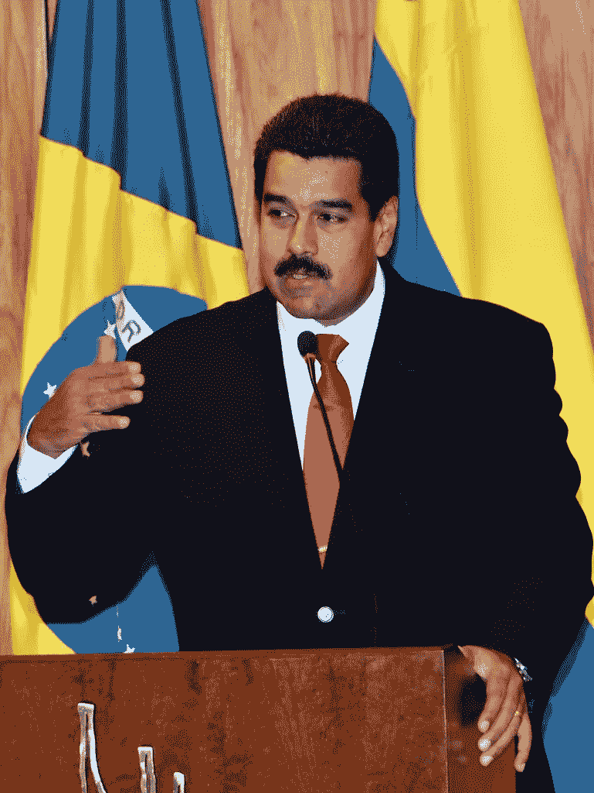

# 委内瑞拉首都加拉加斯现在是西半球最糟糕的大城市

> 原文：<https://medium.datadriveninvestor.com/venezuelas-capital-caracas-now-the-worst-big-city-the-western-hemisphere-9d63c641a85f?source=collection_archive---------13----------------------->

Valter Campanato/ABr / CC BY 3.0 BR ([https://creativecommons.org/licenses/by/3.0/br/deed.en](https://creativecommons.org/licenses/by/3.0/br/deed.en))

委内瑞拉的社会主义领袖尼古拉斯·马杜罗是不是试图表现得像一个如何不治理国家的广告？看起来的确是这样。

根据经济学人信息部的最新研究，委内瑞拉首都加拉加斯被评为西半球最不适宜居住的大城市。

它在全球范围内的表现也相当糟糕。在最近的研究评估的 140 个城市中，它排在第 131 位。

 [## 为什么包容性财富指数比 GDP 更能衡量社会进步？|数据驱动…

### 你不需要成为一个经济奇才或金融大师就能知道 GDP 的定义。即使你从未拿过 ECON 奖…

www.datadriveninvestor.com](https://www.datadriveninvestor.com/2019/03/08/why-inclusive-wealth-index-is-a-better-measure-of-societal-progress-than-gdp/) 

排在首位的是奥地利的维也纳，综合评分为 99.1。这座城市在稳定性、医疗保健、教育和基础设施方面得到满分 100 分。它的文化/环境接近完美，得分为 96.3。

# 破碎的国家？

与加拉加斯相比。它的总分是 46.9 分。稳定性和医疗保健的评分分别为 35 和 33.3。教育、基础设施和文化/环境的得分分别为 66.7、53.6 和 56.3。

总体得分较低的加拉加斯位于倒数 10 个城市。换句话说，根据我的估算，93%的被评估城市更适合居住。

加拉加斯的排名并不比叙利亚首都大马士革高多少，大马士革自 2011 年以来一直遭受着残酷的内战。大马士革的得分为 30.7，这使得它在该报告列出的所有地方中排名最后。显而易见，鉴于多年来持续的军事行动，叙利亚不是一个适宜居住的国家。

但是加拉加斯没有经历过战争。相反，这个城市受到了困扰整个委内瑞拉的同样问题的伤害:社会主义。

不久前，委内瑞拉还是南美最富有的国家。现在它是一个被恶性通货膨胀和内爆经济蹂躏的废人。

这是一个故事的编辑版本，于 2019 年 9 月 4 日首次发表在 Forbes.com 上。