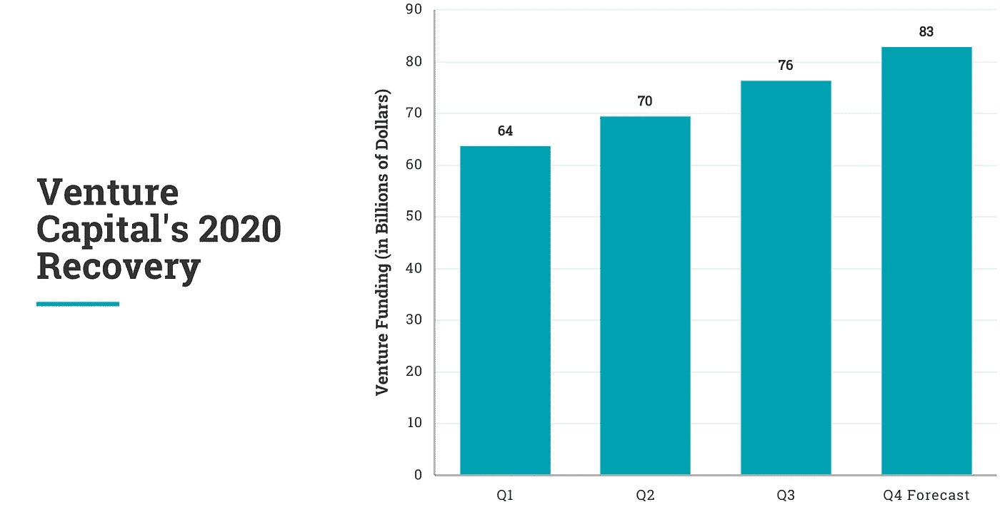

# 风险投资基金不仅复苏了，而且还在蓬勃发展

> 原文：<https://medium.datadriveninvestor.com/venture-capital-funding-hasnt-just-recovered-it-s-booming-6ffd1b5b2c2c?source=collection_archive---------19----------------------->

## 这是新的网络泡沫吗？

Photo by [Markus Winkler](https://unsplash.com/@markuswinkler?utm_source=medium&utm_medium=referral) on [Unsplash](https://unsplash.com?utm_source=medium&utm_medium=referral)

对新冠肺炎的遏制措施让世界陷入了严重的衰退，数千万人失去了工作。

然而，风险投资基金安然度过了大部分危机，第一季度同比仅下降 4%，Q2 同比仅下降 2%。第二季度已经从 3 月份的底部开始显著增长，环比增长 17%。

第三季度的数据显示，随着融资额同比增长 [9%](https://news.crunchbase.com/news/q3-2020-global-venture-report/) ，情况确实出现了迅速好转。对美国公司来说，第三季度的风险投资创下了“七个季度以来的新高”，第四季度的同比增长也相当可观。

Figures by CrunchBase. [Q1](https://news.crunchbase.com/news/the-q1-2020-global-vc-report-funding-slowly-impacted-by-coronavirus/), [Q2](https://news.crunchbase.com/news/q2-2020-global-venture-report-funding-through-the-pandemic/), [Q3](https://news.crunchbase.com/news/q3-2020-global-venture-report/). Visualized by author.

# 第四季度—压轴戏

风险投资涵盖从天使投资到首次公开募股的所有领域，2020 年将有许多令人兴奋的首次公开募股，包括 Affirm、Airbnb、DoorDash、QuantumScape、Wish、Roblox、ThoughtSpot、UIPath 和 C3.ai。

还有很多，有几个将持续到 2021 年，但无论如何，最近有很多风险投资和交易在进行中。

Affirm 是一家 100 亿美元的分期贷款公司，于 10 月 8 日申请 IPO，预计一旦 SEC 完成审查，它将上市。

QuantumScape 是一家电动汽车电池公司，拥有令人兴奋的技术，据称超过了 Telsa——其竞争对手的股票上涨了 10，000%以上。

C3.ai 是一家人工智能解决方案公司，IPOd 的股票代码为$AI。他们的产品包括 AutoML，这是人工智能领域的一个细分市场，其发展速度甚至超过了整个行业。虽然我没有特别使用过 C3.ai，但显然我使用过像[这样的 AutoML 工具。人工智能](http://obviously.ai)，这使得实现人工智能更加容易，因此有很大的潜力。

 [## 没有代码的数据科学|明显是 AI

### 显然，AI 将世界上最先进的算法放在你的手中，只需点击几下鼠标。预测收入

显然. ai](http://obviously.ai/) 

# 不仅仅是复苏，还有 IPO 热潮

IPO 的长队甚至可以与互联网时代的狂热相媲美，成为有史以来 IPO 最多的一年。下个月会有很多变化，但无论如何，这都是重要的一年。

根据 [*全球 IPO 趋势:2020 年第三季度报告*](https://www.prnewswire.com/news-releases/global-ipo-activity-rebounds-sharply-hitting-historic-highs-in-q3-2020-301152545.html) *，从全球来看，美国交易所占了第三季度 IPO 收益的 87%。*2020 年前三个季度，将有超过 100 家公司发布 IPOd，包括期待已久的巨头 Palantir 和 Snowflake。

 [## 对比 2020 年数据 IPO:Palantir 与雪花

### 分析两大数据巨头。

medium.com](https://medium.com/datadriveninvestor/comparing-2020-data-ipos-palantir-vs-snowflake-46651c628605) 

# 摘要

如果你是一家正在寻找资金的初创公司，季度融资数据显示，现在是一个不可思议的时机。你只需要看看 Crunchbase，甚至是 Twitter 就能找到无数正在筹集资金的创业公司。