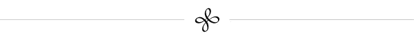

# 冒险球

> 原文：<https://medium.datadriveninvestor.com/ventureball-25849c6e1f1d?source=collection_archive---------0----------------------->

## 对冲基金投资者风险资本入门

Start-up stock certificates are lottery tickets. How many do you want?

为什么要投资风险基金？创业公司大多会失败，他们会吸收大量资源，风投基金的表现一般不会超过 S & P 500。当然，少数公司和基金取得了巨大的成功，但是你不能提前告诉他们。没人能。

聪明的投资者寻找低效率的市场，在那里他们可以利用数据获得优势。在这篇短文中，我将描述目前推动风险投资的三种趋势，以及一种培养经理人阿尔法的独特方法。

# 我们如何衡量成功

对冲基金报告月度回报(扣除费用后)。大多数对冲基金可以每季度或年底赎回。

[风险投资不同。](https://nvca.org/wp-content/uploads/2019/08/NVCA-2019-Yearbook.pdf)风险基金通常投资 3-5 年，分阶段收回资本。通常，他们会保留很大一部分资本用于后续投资。投资组合的价值*总是*在最初几年下降，然后在第 5-7 年赶上。

在风险投资中，我们衡量现金回报与投资的倍数。虽然基金仍在到期，但我们使用 TVPI(总价值支付倍数)，这基本上是账面价值。随着更多的退出为投资者带来实际回报，这变得更有意义。基金结束后，我们用一个单一的数字——收益倍数。

 [## 为什么包容性财富指数比 GDP 更能衡量社会进步？|数据驱动…

### 你不需要成为一个经济奇才或金融大师就能知道 GDP 的定义。即使你从未拿过 ECON 奖…

www.datadriveninvestor.com](https://www.datadriveninvestor.com/2019/03/08/why-inclusive-wealth-index-is-a-better-measure-of-societal-progress-than-gdp/) 

风险投资基金在 7-10 年间的回报率中值是投资资本的 1.9 倍，这是*不*投资的充分理由。为了补偿这种风险，风投必须至少获得 2.5 倍的回报才能实现收支平衡，3 倍或更高的回报才能被认为是值得的投资。

然而，在美国，排名前四分之一的风险投资基金确实击败了标准普尔 500。

In this graph, 1.0 is the public-market index benchmark; above the line is positive alpha, below the line is negative alpha.

前十分位(深蓝线)回报是由运气驱动的——大多数不会重复，你也无法提前识别。在 25-10%的范围内(蓝绿色线以上)，有一些表现稳定的人。然而，三大趋势正在改变这一格局，投资者必须理解它们。

# 1:大量资金已经流入风险资本

> 2018 年，全球共有[、2540 亿](https://assets.kpmg/content/dam/kpmg/xx/pdf/2019/01/kpmg-venture-pulse-q4-2018.pdf)美元通过风险资本融资投资于约 18000 家初创公司，比 2017 年的数字增长了 46%，其中仅美国就占 52% ( [、1310 亿](https://www.cnbc.com/2019/01/09/venture-capital-spending-hit-all-time-high-in-2018-eclipsing-the-dot-com-era-record.html))。尽管该行业看起来相对健康，但一个前所未有的趋势是，受资助的公司越来越少，但规模越来越大。
> — [*Toptal，2018 年创投状况*](https://www.toptal.com/finance/venture-capital-consultants/state-of-venture-capital-industry-2019)

随着交易规模的增加和交易数量的减少，创纪录的资金正流入风险资本。更多的资金迫使每个人都向下游发展:首轮融资现在是 1000-2000 万美元，而“种子”阶段交易的中值现在是 200 万美元。Samir Kaji 现在正在跟踪超过 900 家活跃的美国微型风险投资(种子)基金。这对创业者来说是一个巨大的优势:风险公司不再与其他基金合作，而是与之竞争。许多 10 亿美元的基金已经留出资金用于种子投资，因此它们可以从上游市场分一杯羹。种子市场很拥挤。

*底线:数吨的资金试图装载同样数量的资金多得多的公司是* [*导致灾难*](https://www.youtube.com/watch?v=NVVsdlHslfI) *。*

# 2:开软件公司越来越便宜了

My estimate of the general cost to create a new product. I believe costs will continue to decline.

就在十年前，一个软件产品投入市场测试至少要花费 100 万美元。今天，它的成本如此之低，以至于许多程序员能够在一个周末一起编写第一个产品，然后用接下来的几个月为市场做准备。许多咨询公司正在将他们的产品“产品化”,并提供给他们现有的客户。

开源代码的增长和数以百万计的可用 API 使应用程序开发人员能够立即整合复杂的支付和银行工具、地图、天气、通信、登录、安全和其他服务。企业家现在可以在一周或更短的时间内创建一个可用的移动应用程序。用不了多久，他们就会创造出[完全不用编码的应用程序。](https://thunkable.com/)

这些新公司不需要巨额资本。他们可以倾听客户的意见，不断适应他们的需求，而不是在产品上花很多钱。通过关注客户和建立经常性收入，他们降低了失败的风险。与以往相比，更多的公司在 4-12 个月内实现了收入。

*一句话:就在巨额资本已经进入市场的时候，下一代公司不需要那么多。*

# 3:现在每个人都有数据

从种子投资到 F 轮投资，所有的风险资本家现在都报告他们的交易数字，并订阅几个数据库，这些数据库向他们提供其他人的数据。这使得这些市场非常有效。每个人都知道市场价格是多少。因为现金供过于求，估值比其他情况下要高。

不足为奇的是，风投们抱怨很少有“好交易”可寻。风险投资者一直是一群动物，追逐每个人都想参与的“性感”交易。

三十年前，棒球比赛是凭直觉决定的。今天，数据和计算机模型做出了大多数决定，不仅仅是在棒球比赛中，在大多数职业运动中也是如此。如今，大多数风投都声称自己是“数据驱动的”现在，所有风投都有几个数据仪表盘，让他们可以了解每个人在做什么:

正如迈克尔·莫布森在他的文章 [*中指出的技能悖论*](https://cdn.porchlightbooks.com/assets/ChangeThis/manifesto/100.03.SuccessEquation/pdf/100.03.SuccessEquation.pdf) ，当技能的总体水平全面上升时，运气在决定结果方面发挥着越来越大的作用。

*一句话:随着风险投资变得更加数据驱动，挑选经理人变得更像是掷骰子。*

# 一种新的资产类别

我们可以把公司股票的世界看作一个金字塔，更多的信息和数据创造了更有效的市场:

现在，我们可以从纳西姆·塔勒布(Nassim Taleb)身上学到一课:大量不相关、高凸性的投资创造了一个抗脆弱的投资组合，在大多数宏观环境下都能提供强劲的回报。仔细想想，[早期公司的股票确实是一种选择](https://www.youtube.com/watch?v=RCZ27kmq6BU)。大多数期权到期时都一文不值，但有一些会有回报，可以弥补其余的损失。

罗伯特·威尔特班克指出，总的来说，天使投资的回报一直超过主要指数。但这需要严格的方法。你承担的风险越大，你就越需要多样化。

投资者大多被排除在一个关键的资产类别之外——寻求首轮外部融资的公司。如今有三只美国基金在这一层面运作: [500 startups](https://500.co/) 、 [Hustle](https://www.hustlefund.vc/) 和 [Right Side Capital](https://www.hustlefund.vc/) (免责声明——我是 Right Side Capital 的风险合伙人)。这些基金每周进行多达四笔交易。这些基金建立了自己的交易数据库，以更好地了解市场价格。他们为自己的公司提供各种服务，在这个“pre-VC”资产类别中，他们拥有的数据远远多于任何人。

我无法获得其他基金的业绩数据，但右侧团队为每只基金的投资者设定了 3 倍以上的净回报目标。他们的三只基金都达到了目标(他们现在正在募集第四只基金)。大规模分散投资限制了下跌空间(损失资本的可能性低)，也限制了上涨空间(没有 10 倍回报的可能性)。

# 税收考虑

这些超早期基金将巨大的税收优势传递给了美国投资者。符合条件的小企业股票规则意味着投资者可能不用支付资本利得税。损失被转嫁——投资者每年可以从他们的普通收入中获得高达 10 万美元。

超过 90%的 Right Side Capital 的投资符合条件，这意味着投资者将很少或根本不用为他们的收益缴纳联邦税。他们还提供了 3-5 年的损失，可以通过普通收入(例如，通过租金或版税)来抵消。其他两只基金可能也是如此。

# 摘要

随着风险投资变得更有效率，随着创办一家新公司的成本越来越低，大多数风险投资人发现自己有越来越多的钱去争夺越来越少的公司。但是一个聪明的、定量的方法给了那些有数据的人优势，而其他人却没有。任何“抗脆弱”投资者都应该注意到 3 倍以上的回报和极大的税收优势。

[大卫·西格尔](https://linkedin.com/in/siegelventures)是连续创业者、初创投资人、区块链专家，也是[右侧资本](http://rightsidecapital.com)的风险合伙人。他是 [*全球贝塔创投*](http://globalbetaventures.com) 的作者。你可以联系他，并在 dsiegel.com 看到他所有的作品。