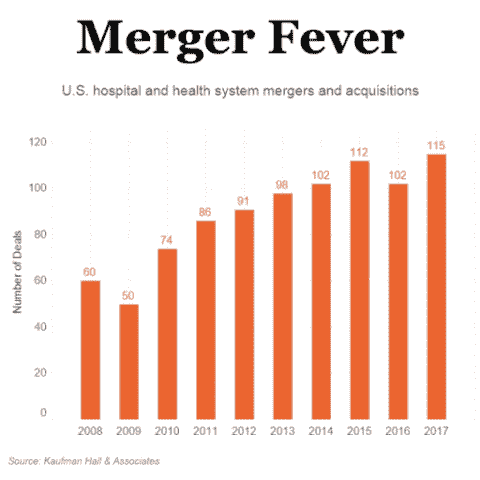
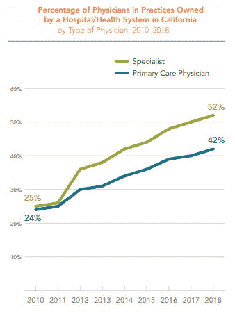
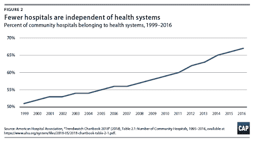
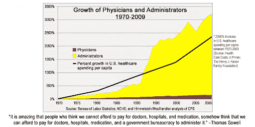
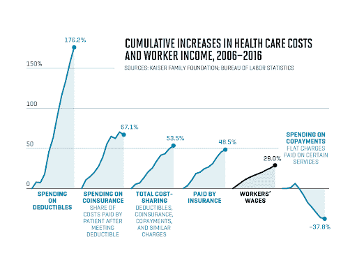
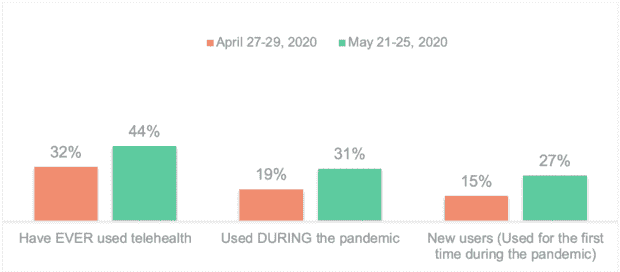

# 医疗保健的垂直化=初创公司的机会

> 原文：<https://medium.datadriveninvestor.com/verticalization-of-healthcare-opportunities-for-startups-baf8fb714a82?source=collection_archive---------16----------------------->

2020 年 8 月 10 日:[预计大流行后会有更多的医院整合](https://www.hfma.org/topics/news/2020/08/more-hospital-consolidation-is-expected-post-pandemic.html)

2020 年 7 月 6 日:[医院并购活动经受住新冠肺炎衰退](https://revcycleintelligence.com/news/hospital-merger-and-acquisition-activity-withstands-covid-19-slump)

2020 年 6 月 22 日:[在疫情引发的延迟之后，医疗保健交易应该会加速](https://www.modernhealthcare.com/mergers-acquisitions/after-pandemic-induced-delays-healthcare-deals-should-speed-up)

诸如此类的头条新闻体现了美国医疗保健行业的持续趋势——更大的参与者越来越少。早在疫情之前就已经发生了:

一般来说，当公司相互收购并变得更大时，他们倾向于关注规模经济。通常，提高盈利能力的方法要么意味着高价格下的小批量，要么意味着低价格下的大批量。就美国医疗保健而言，这种情况在专科医生身上发生得更快，但初级保健医生也没有落后太多。

事实上，不是为了强调这一点，而是在过去的 20 年里，医疗保健已经急剧加速，成为一场巨人的游戏:

这种对垂直化的强调在很大程度上是由不断上升的管理成本推动的——这本身就是一个完整的话题。

整合是更多选择的沃土，尤其是对那些有支付能力的人来说。将这一趋势与免赔额的增加相结合，即消费者尽管有保险，但对高昂的医疗费用越来越失望。

对这一趋势的第一个反应是上门医疗，OneMedical 可以说是这一趋势的旗手。最初的股价为 14 美元，如今为 28 美元，尽管自 IPO 以来的 6 个月里经历了一些起伏。有许多快速追随者采取非常不同的方法，最著名的是[前进](https://goforward.com/)。

**回应#2** 是医生指导的电子商务——在家里进行，有持续的监控和数据驱动的决策。[帕洛玛](https://www.palomahealth.com/)治疗甲状腺,[稳定](https://steady.health/)治疗糖尿病,[峰值](https://www.getpeaktoday.com/)治疗男性健康——这些都是进入个性化医疗的数字优先公司，与传统零售或电子商务有着根本的不同。

**响应#3** 是远程和按需服务的加速。大量初级保健医生现在远离患者，远程为他们看病，这得益于 covid 疫情:

另一个案例研究是放射学，这是最适合远程和按需服务的专业之一。诊所一直在相互收购，挤压利润，这增加了对人工智能驱动的工具的需求，这些工具可以提高效率，也有助于扩展数字优先的解决方案。 [RadNet 今年早些时候收购 DeepHealth](https://www.globenewswire.com/news-release/2020/03/11/1998565/0/en/RadNet-to-Acquire-DeepHealth-Inc-Expanding-its-Efforts-in-Artificial-Intelligence.html) 就是这一趋势的象征。

一篇短文不可能涵盖所有情况。因此，不要理会整合为企业家创造的其他大好机会。

*感谢*[*Harpreet DHA TT*](https://www.linkedin.com/in/harpreet-dhatt-md-0a980b90/)*、医学博士*[*Preeti suker kar*](https://www.linkedin.com/in/preeti-sukerkar-m-d-ph-d-763794b/)*、医学博士/博士的反馈。原载于* [*数据驱动投资人*](https://www.datadriveninvestor.com/2020/10/18/verticalization-of-healthcare-opportunities-for-startups/) *，《我很乐意在其他平台上辛迪加》。我是*[*Tau Ventures*](https://www.linkedin.com/pulse/announcing-tau-ventures-amit-garg/)*的管理合伙人和联合创始人，在硅谷有 20 年的从业经验，涉足企业、创业公司和风险投资基金。这些都是专注于实践见解的有目的的短文(我称之为 GL；dr —良好的长度；确实读过)。我的许多文章都在 https://www . LinkedIn . com/in/am garg/detail/recent-activity/posts**上，如果它们能让人们对某个话题产生足够的兴趣，从而进行更深入的探讨，我会感到非常兴奋。如果这篇文章有对你有用的见解，请在 Tau Ventures 的 LinkedIn 页面***上发表评论和/或给文章点赞，感谢你对我们工作的支持。这里表达的所有观点都是我自己的。**