# 波动性、流动性不足和资金外流的恶性反馈循环

> 原文：<https://medium.datadriveninvestor.com/vicious-feedback-loop-of-volatility-illiquidity-and-outflows-a1eff3ec71a8?source=collection_archive---------17----------------------->

**总结**

*   直到最近，自满和否认一直是压倒性的。
*   作为最后贷款人的美国美联储已经推出了一系列计划，试图支撑一切。
*   两周前，整个华尔街都沉浸在“没有衰退”和“V 型”复苏的妄想中。
*   新兴市场的地位甚至更为脆弱，避险环境正导致资本外流和本币兑美元汇率走低，而新兴市场的大部分债务都是以本币计价的。
*   过度杠杆化的不良资产负债表之间的相互联系，极大地提高了近期信贷危机的风险。小心堕落天使。

当我们看着世界各地的股票指数每天增加或减少数万亿时，值得记住的是，市场是定价机制，而不是价值机制，或者如本·格雷厄姆所言，它们是投票机器，而不是加权机器，至少在短期内是如此。

根据过去的事件，对我们的立场有一些看法:

**重大危机的生命周期——2008 年**

1.自满和否认。(截至 2008 年 1 月)

2.意识在增长。人们对政策制定者的信心很强，尽管政策制定者还不明白他们已经失控。市场认为一切都会好的——例如，对贝尔斯登的救助反应积极。(2008 年上半年)

3.随着政策制定者失去控制变得越来越明显，出现了巨大的恐慌(雷曼)

4.政策制定者开始掌控局面，但市场不再相信他们(08 年末 09 年初)

5.市场开始上涨，尽管有一个滞后(Q2 2009)

**2020 年我们在哪里？**

直到最近，自满和否认一直是压倒性的。过去两周，人们的意识有所提高(第二阶段),但仍有很多人相信问题是可以控制的。为了使当前的市场定价正确，我们可以:

1.对正常衰退的正确定价

2.发生严重风险事件

请注意，我们不会两者都定价。也许我们离经济衰退的正确定价不远了，因此没有多少余地来争辩存在额外的巨大风险溢价。因此，我认为我们正处于第二阶段(即认识到事件是真实的，有经济影响，但没有真正的恐慌)

我们会进入第三阶段吗？

如果金融市场出现危机蔓延，第三阶段是意料之中的。例子包括:

企业的重大负面收入冲击导致信贷担忧

对个人收入的重大负面冲击导致信贷问题

该病毒将比预期持续更长时间，例如持续到 2021 年

更广泛地说，2008 年发生的事情是，一个复杂的系统以无法精确预测的方式失灵。格林斯潘认为 2008 年危机的具体细节是“不可预见的”,这或许是正确的。但显然可以预见的是，该系统将以令人惊讶的方式失败。

每次市场下跌的感觉都不一样。总有一个叙事，而叙事往往比滴滴本身更恐怖。如果我们能够理解令人信服的叙述让我们做出非理性行为的力量，我们可能会更好地做出更好的决定。叙事可能非常有力。通过框架效应，它们可以改变我们看待事实的方式，通过代表性偏差，它们可以导致我们忽略裸利率概率，同时在我们的现状和熟悉的叙事之间进行比较。

**回到 2020 年**:

无论美联储的出拳力度有多大——这次是 QE 无穷大——市场在买入“美联储看跌”这句古老的咒语时，仍处于“半空的玻璃杯”状态，这句咒语因相信美联储总能拯救经济和股票而广受欢迎。周一，市场再次告诉我们，这些模式正在发生变化。到目前为止，上周五早期阶段以短期股市反弹形式出现的相对平静具有欺骗性，并继续为市场转移到“卖出反弹”的下一轮进一步抛售行动提供资金。如果各国央行采取的所有大规模行动，从降息、无限 QE 计划、互换额度、新的融资工具，都仅仅实现了股市短暂的一天反弹，那么市场先生显然声明，还有其他事情正在发生。

有几十年什么都没发生；有几周是几十年的时间。弗拉基米尔·列宁

作为最后贷款人的美国美联储已经推出了一系列计划，试图支撑一切。他们开始购买美国国债和抵押贷款支持证券。他们大幅提高了向银行提供隔夜回购贷款作为抵押品的规模。他们还为货币市场、公司债券和市政债券提供资金，以保持它们的稳定。**他们将购买公司债券**——为了规避美联储法案，他们将在财政部投资的特殊目的载体(SPV)中购买这些债券。

美联储宣布无限制 QE。本周的每一天，他们计划购买 750 亿美元的美国国债和 500 亿美元的住房抵押贷款证券(每月 2.5 万亿美元)，并根据需要调整这一数字。

因此，接下来的思路是，每天的流动性变得更糟，他们拿出更大的枪。

*“美联储正试图阻止这种重新定价进一步发展。他们将设定价格并提供信贷。他们希望阻止病毒后重新定价的完成。乍一看，除了股票和高收益，他们似乎正在国有化金融市场。这最好能稳定金融市场！**比安科研究*

 [## 另一场精心策划的全球经济危机正在逼近？如果我们的数据经济可以帮助它|数据…

### 我们的 DApp 的开发，称为 DECENTR，目前正与我们的 R&D 同步进行，作为我们即将到来的…

www.datadriveninvestor.com](https://www.datadriveninvestor.com/2019/03/06/another-engineered-global-economic-crisis-looming-not-if-our-data-economy-can-help-it/) 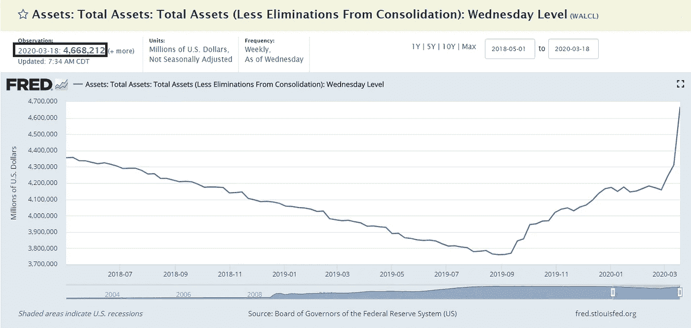

*来源:圣路易斯联邦储备银行*

他们有望在下周初轻松突破 5 万亿美元，年底资产负债表低于 7-8 万亿美元也不足为奇。这可能被证明是保守的。各地的债务都在货币化。

美国联邦政府陷入这场危机时，结构性财政赤字每年高达 1 万亿美元，而且还在上升，约占美国 GDP 的 5%。国会和白宫对财政救助计划的讨论，包括向大多数美国居民发送直接支票和提供行业救助，已经从最初的 8，000 亿美元增加到 1.2 万亿美元到 2+万亿美元。

*国会议员本周末正在努力争取在白宫设定的星期一最后期限前就一项可能高达 1 万亿美元的救市计划达成一致。周六，白宫经济顾问拉里·库德洛表示，该计划可能相当于美国经济产出的 10%，或超过 2 万亿美元美国消费者新闻与商业频道*

以下是 2007-2008 年经济危机和政府干预计划时机的简史。“金融稳定和复苏法案”签署于 2009 年 2 月 17 日。在 2009 年 3 月 6 日， [$SPY](https://twitter.com/search?q=%24SPY&src=cashtag_click) 在 18 天后触底，跌幅约为 15%。

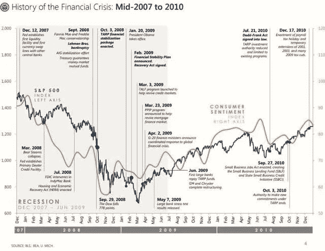

作为一个整体，世界的债务与 GDP 之比从未像现在这样高。美国企业部门的债务与 GDP 之比达到了创纪录的高水平，而美国政府的债务与 GDP 之比也处于仅次于二战的高位。全球创纪录的债务水平，使得现在成为不得不应对全球经济大规模关闭的特别多变的时期。

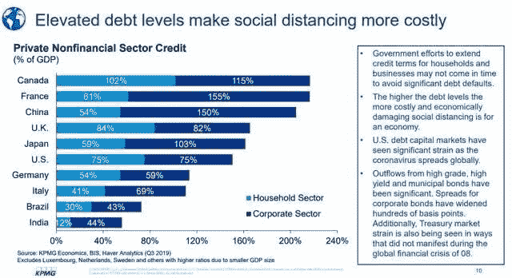

*来源:毕马威经济学*

两周前，整个华尔街都沉浸在“没有衰退”和“V 型”复苏的妄想中。现在整个华尔街都预计美国和全球经济衰退。JPM 对 Q2 和美国经济增长的预测为-24%，摩根士丹利为-30%。**这些是萧条增长率**(下图)。

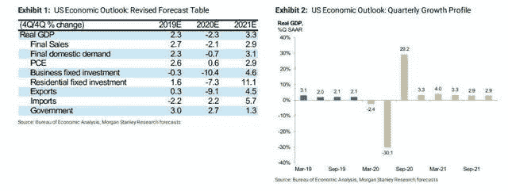

*资料来源:摩根士丹利研究*

在经历了如此大的冲击之后，谁能说我们可以重新开放，经济就会马上恢复生机呢？全球可自由支配的消费者支出在两周内下降了 100%(如下图)。

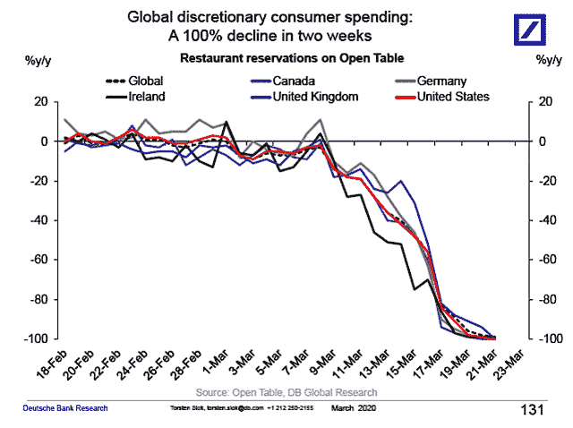

*资料来源:德意志银行研究*

OpenTable 餐厅就餐访问流量，同比变化百分比:

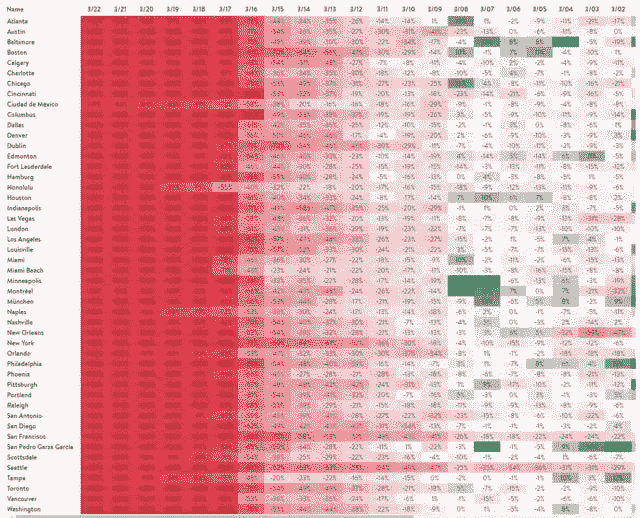

*来源:OpenTable*

初步迹象表明，本周首次申请失业救济的人数达到了数百万。对于首次申请失业救济人数，这一点目前正形成共识。**每周新索赔的基线数量可能是 10–20 倍或更多**。最近典型的一周是 25 万。即使是 2008—2009 年大衰退中最糟糕的一周也不到 800，000 人，因为这种关闭发生的速度在正常衰退中并不典型。

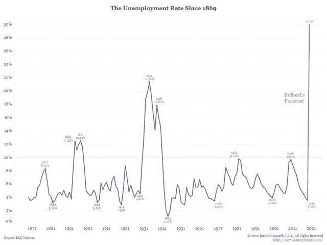

*资料来源:Bianco Research*

新兴市场的地位甚至更为脆弱，避险环境正导致资本外流和本币兑美元汇率走低，而新兴市场的大部分债务都是以本币计价的。**这正在创造一个新兴市场厄运循环**，汇率下跌导致更昂贵的债务，从而导致更多资金外流。如果外国市场崩溃，这意味着标准普尔 500 指数从美国以外来源获得的 40%以上的收入将会枯竭，因此美国股市也会受到影响。

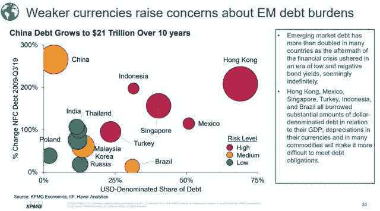

*来源:毕马威经济学*

**在流动性改善以及美元通过美国美联储的流动性走低之前，由于大量被迫卖方和国外市场的挤压，大多数风险资产都面临巨大的下行压力。**

资金外流正达到真正的极端水平。下图显示了流出菲律宾指数的资金:

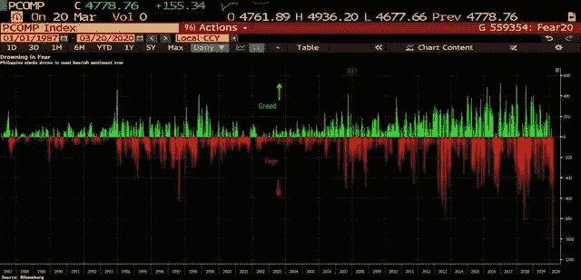

*资料来源:彭博*

这个世界有一个美元问题。许多国家都有以美元计价的债务。随着全球贸易陷入停滞，美元停止在全球流动，美元债务违约风险上升。

伦敦银行同业拆借利率 OIS 显示，美元融资压力远未结束。已经跃升>100 个基点，为 GFC 以来的最高水平。

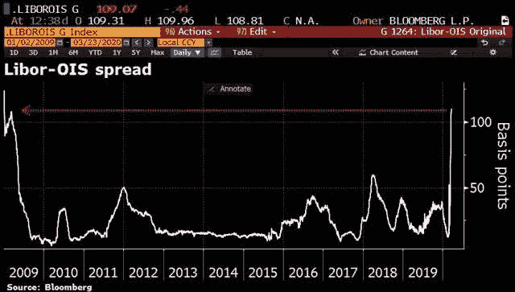

*来源:彭博*

**小心坠落的天使**

尽管几乎所有资产类别都表现出创纪录的波动性，但令大多数投资者不安的是美国国债市场。出现了数十种理论，试图解释 2008 年以来最极端的美国国债市场波动。

当美国国债市场经历大幅波动时，几乎所有其他资产类别都会感受到痛苦，因为美国国债利率是全球金融体系的基石。如果没有一个正常运转的国债市场，在其它市场进行交易或有效对冲利率风险几乎是不可能的。如果你已经注意到了国债利率的变化——它们正在上升——在美联储采取行动后，它们本应为零，而不是上升。信贷市场的很大一部分功能失调，交易不正常。在我们看到它们正常运行之前，这仍然是市场尚未准备好的信号。

过度杠杆化的不良资产负债表之间的相互联系，极大地提高了近期信贷危机的风险。小心堕落天使。

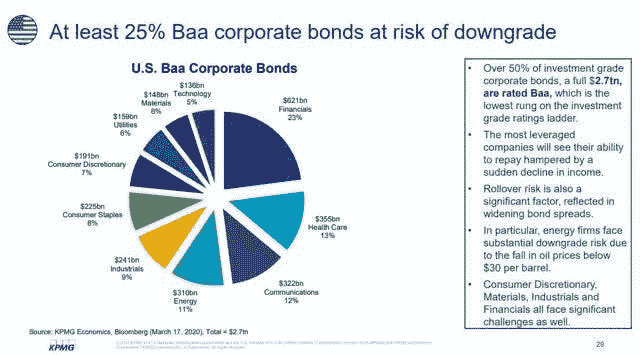

*资料来源:毕马威经济学*

在这场流动性危机中，企业信用利差继续快速飙升。从百分比来看，高质量投资级市场的涨幅最大。

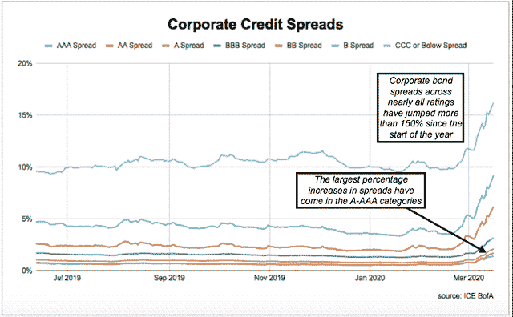

*来源:冰博发*

由于认识到衰退几率上升，信贷息差进一步扩大，重新引发了人们对 BBBs 中“堕落天使”风险的担忧，并使杠杆率过高的资产负债表面临危机以来最大的压力测试。

你看到的是人们利用交易所交易基金获取流动性(例如，为赎回提供资金或筹集现金)。很多基础债券都没有人出价:

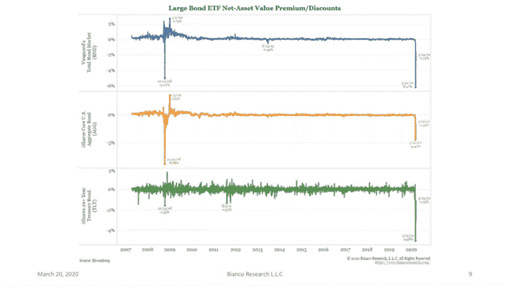

*资料来源:Bianco Research*

债券基金流出:

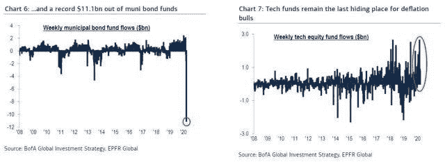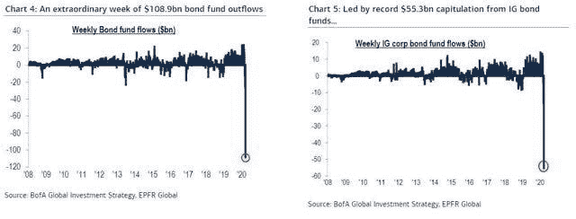

*资料来源:美国银行*

从根本上说，一个经济体系只是一系列相互关联的资产负债表。这些资产负债表的杠杆率越高，系统就越依赖于现金流(即脆弱)。这就是为什么政府积极而迅速地采取行动至关重要。因为用不了多久，一个具有灾难性影响的反馈回路就会在整个系统中蔓延开来。

即使那样，我也不确定他们能不能成功。这个系统实在是太大太复杂了。所需的治疗方法的效力几乎肯定会产生意想不到的负面后果

*原载于*[*www.trading-manifesto.com*](http://www.trading-manifesto.com)