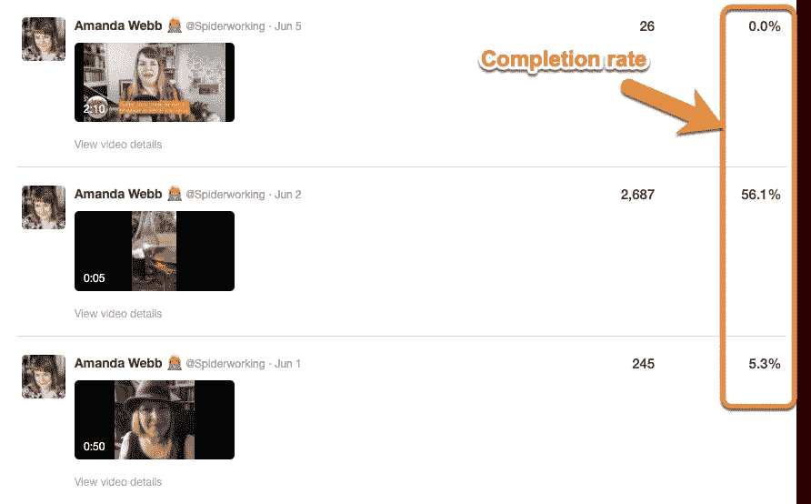
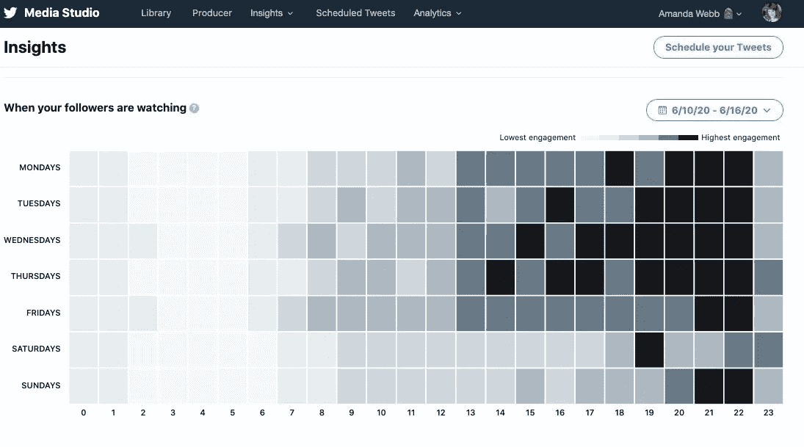

# 视频触及潜在客户，赢得您的业务

> 原文：<https://medium.datadriveninvestor.com/video-reaches-out-to-fans-for-your-business-90fcd7c5465d?source=collection_archive---------5----------------------->

## Twitter 视频应该成为社交媒体战略的核心部分

Photo by Sam McGhee on Unsplash

在 Twitter 上直播只是全面视频战略的一部分，也是最具活力的策略之一。

社交媒体管理公司 [Hootsuite](https://twitter.com/Hootsuite) 的全球参与负责人[尼克·马丁](https://twitter.com/AtNickMartin)说:“就像在任何网络上直播一样，你可以直接与你的社区联系，享受当下。”。“真实性被谈论了很多，上线是你能做的最真实的事情之一。它与你的粉丝建立了双向对话。

“不是每个人都知道如何在 Twitter 上直播，”他说。Hootsuite 的博客文章给出了如何实现这一目标的逐步指南。它还提供了一些有用的技巧，可以让你的直播视频变得更好。”

Hootsuite 的另一篇文章解释了 [*“如何在 Twitter 上直播，与你的粉丝联系。”*](https://blog.hootsuite.com/how-to-go-live-on-twitter/)

 [## 有效的营销始于一条推文

### 较少使用的 Twitter 功能让你比竞争对手更有优势

blog.markgrowth.com](https://blog.markgrowth.com/effective-marketing-starts-with-a-tweet-9fdde98d6d04) 

对于那些更喜欢冒险的人来说，蜘蛛网创始人阿曼达·韦伯有详细的建议。她的公司与全球数百家企业合作，帮助他们从在线营销中获得成效。

Webb 是一名社交媒体和内容营销人员，擅长数字营销策略。她为《Agorapulse》、《社交媒体评论》、《乔恩·卢默》、《T21》和《社交面包师》等杂志撰稿。她与数字营销专家 Madalyn Sklar 讨论了为 Twitter 建立视频战略的问题。

视频是一个吸引注意力的东西，对于突破社会噪音是必不可少的。

“照片和图像是一维的，”韦伯说。“视频可以给你的 Twitter 添加活力。比起文字或图像，你可以用视频表达更多。另外，没有字符限制。

“一个移动的图像吸引了人们的注意力，”她说。那个拇指停止滚动。当人们在视频中看到你时，就好像他们在现实生活中见到你一样。这是了解你和你的企业的好方法。”

# **对抗牙牙学语**

韦伯告诫说，不要因为没有角色限制而感到过于自由。

“你必须小心不要胡言乱语，我以前肯定是这样做的，”她说。

另一方面，面部表情和肢体语言对于获得观众的信任非常重要。

Sklar 说:“视频推文很棒，因为它们是建立品牌知名度和与你的社区建立更强联系的绝佳方式。”“它们真的能提高参与度。”

 [## 视频快照图片-完美的内容|数据驱动的投资者

### 提到“内容”，首先想到的是文字和图片。错过了一个…

www.datadriveninvestor.com](https://www.datadriveninvestor.com/2019/10/06/video-snaps-picture-perfect-content/) 

视频增加了情感，更加个性化。言语在某些人身上不会产生太多的共鸣。每个人对联系的感觉都不一样。

“这就是为什么为所有不同类型的消费者提供混合内容非常重要，”韦伯说。

当人们说话时，看着他们的脸会给人留下更深刻的印象。这就是为什么重要的信息在视频中比在文字或推特上更真实。

“如果他们想和你一起工作，他们会对你的个性和业务有更好的了解，”韦伯说。

随机视频可以一次性发布，但一般来说，所有内容——包括视频——都应该在疯狂背后有一个方法来集中你的信息。

“你可以不用视频策略，但你要确保你的时间没有被浪费，”韦伯说。“如果你想通过你的活动有效地实现销售，你需要一个策略。你需要知道你的视频制作有很强的商业目的。

“我不认为当你感到有灵感时，有一个策略会禁止你变得随意，”她说。"然而，它帮助你有一个理由和目的，并保持内容小鬼在海湾."

# **瞄准战略**

投资一点点想法可以制定一个强有力的计划。

Sklar 说:“要创建一个强大的视频策略，问问你自己，你的目标观众想从你这里看到什么。”“有他们想了解的话题吗？有什么特定类型的视频会吸引注意力吗？不要害怕问。

“思考一下*如何*最好地为你的在线社区服务也是明智的，”她说。"你能提供什么让人们觉得既有益又有趣的东西？"

最强有力的策略来源于牢记基本面。

“从你的商业目标开始:更多的销售，”韦伯说。“然后设计一个视频内容计划，帮助培养理想客户观众和影响他们的人。

“从吸引合适观众的视频开始，”她说。“这可以是教程、操作视频、幽默内容或新闻故事。如果你创造的东西对你的观众有帮助，你就会吸引他们的注意力。”

 [## 视频创造移动差异|数据驱动的投资者

### 直接转向视频对电影来说是一个不好的信号，但它可以引发商业营销活动。视频为…做了更多

www.datadriveninvestor.com](https://www.datadriveninvestor.com/2019/05/08/video-creates-a-moving-difference/) 

不断增长的受众带来了销售机会。这就是韦布提醒不要表现得太“推销”的地方，她在一篇关于[创造营销内容](https://spiderworking.com/blog/2020/05/25/write-effective-marketing-posts/)的文章中谈到了这一点。

“我很高兴 Twitter 用视频功能带回了回复，”她说。“现在你又可以用 Twitter 发送个性化回复了。这是了解你的观众的一个很好的方式。

“你可以通过直接信息发送视频信息，”韦伯说。“用这个来提供一个快速的咨询电话或者个性化的提议，但是只有在你已经了解这个人的时候。不要过度使用这个。把它留到特殊场合，你会让你的观众高兴的。”

# **顾客的喜悦**

为此，她给出了以下建议:

*   使用视频让你的潜在客户放心，他们正在做出正确的决定。
*   视频见证摇滚。与你的客户交谈，看看你能说服谁为你做推荐。
*   用您的视频回答常见问题。这将有助于考虑购买的人做出正确的选择。

Sklar 说:“你会想知道你的视频有多少浏览量。”。“低浏览量可能表明你的内容不是你的观众想要的，或者只是没有得到足够的曝光。

“跟踪谈话也是一个好主意，”她说。“你的视频让人们开始说话了吗？在某些情况下，你可能会跟踪网站流量、电子邮件注册或购买等转化。”

Sklar 指出，任何人都可以通过他们的 Twitter 分析访问视频统计数据。

 [## 从内心创造，而不是分析

### 那些窥视分析魔力的人有被数据催眠的风险。搜索引擎优化规则为…

medium.com](https://medium.com/datadriveninvestor/create-from-your-heart-not-the-analytics-4b3807d057c4) 

“大家都在回复、转发、点赞吗？”韦伯说。“从推特上很容易看出这一点。这是一个很好的衡量视频表现的标准。Twitter 分析视频标签显示你的视频的浏览量和完成率。显然，较短的视频会获得更多的完成，但看看哪些较长的视频做得最好很有趣。”

韦伯在“分析见解”标签下注明了“非常酷的视频内容”。

“在观众中，你可以看到你的[粉丝在推特上观看视频内容](https://www.agorapulse.com/blog/get-twitter-stats/)，”她说。“我用这个来帮助我决定什么时候安排视频。”

其他有用的指标包括[顽童跟踪监视器](https://agencyanalytics.com/blog/utm-tracking)和谷歌分析目标。

“在 Twitter 上效果最好的视频类型最终将取决于你独特的观众，”Sklar 说。“你想创造符合他们兴趣和需求的内容。什么能真正抓住他们的注意力并保持住？

她说:“如果你需要想法来激发那些创造性的汁液，我有一篇关于你的下一个推特视频的博文，其中有 [*和*的八个想法。”。](https://madalynsklar.com/2019/01/why-twitter-video-will-benefit-your-brand-plus-8-ideas-you-can-use/)

# **像照片，但不是**

Webb 说“各种各样的视频”在 Twitter 上都有效:

*   Videophotos 让你像照片一样拍摄，但运行你的摄像机，而不是拍摄静态图片。
*   新闻片段让我把每周的脸书现场新闻节目分成几个片段，在一周内分享。
*   预告片[宣传其他内容](https://twitter.com/Spiderworking/status/1267456066016722944)。

“不要听从我的建议，”韦伯说。"测试什么对你的观众有效，并做更多的工作."

 [## 视频推动营销|数据驱动投资者

### 当话题转到创意视频时，没有人会把安德鲁和皮特这对营销组合逼到墙角。他们的悠闲…

www.datadriveninvestor.com](https://www.datadriveninvestor.com/2019/01/23/video-sets-marketing-in-motion/) 

视频长度取决于其意图。

“在 Twitter 上直接上传的限制仍然是 140 秒，但你可以使用 Media Studio 上传更长的视频，”韦伯说。“我尽量让视频简短。推特上的人喜欢滚动。保持他们的注意力超过一两分钟是很难的。

“人们确实在看《万岁流》，”她说。“这很难猜测。一切都是为了测试和衡量结果。”

Sklar 同意这一评估。

“在 Twitter 上保持视频简短甜蜜是明智的，”她说。“在你实际需要表达观点的时间内传达你的信息。不要没完没了地东拉西扯，因为人们会听不进去的。推特给你 140 秒。

“说到媒体工作室，并不是每个人都有机会使用它，”Sklar 说。"对于那些拥有它的人来说，不是每个人都有超过 140 秒的时间."

虽然短一些更好，但是教育材料要长一些。对此，韦伯强调，总体目标——不管长短——是吸引合适的人。

# **最佳混合配方**

“当谈到平衡视频和文本推文时，没有一个完美的比例，”Sklar 说。“一切都是为了让它为您服务。如果你发现你的社区*喜欢*视频，做更多。如果他们更喜欢发短信，那就把它作为你的重点。然后到处撒视频。”

虽然不确定这样的比例，但 Webb 每天至少发布一个视频和一条文本推文。

“更重要的是广播推文和参与推文之间的比例，”她说。“你的视频推文应该是迈向更多对话的一步。”

Sklar 规定了 Twitter 的最佳实践:

*   创造你的观众会觉得有价值的内容。
*   实验一下，看看到底是什么引起了人们的共鸣。
*   *玩得开心*。视频非常适合展示你的个性。

“在 Twitter 上发布视频时，不要担心拥有最好的设备，”Sklar 说。“你的智能手机会很好地完成工作。记住你的衡量标准，因为了解每个视频的表现是明智的。别想多了。”

 [## 伟大的视频激励他人！数据驱动的投资者

### 当谈论视频内容时，去找专家。那应该是德米安·罗斯，他制作他的每周 D 计划播客…

www.datadriveninvestor.com](https://www.datadriveninvestor.com/2019/06/14/great-videos-inspire-others/) 

韦伯告诫不要害羞:

*   直奔主题。如果有人在你的视频上点击播放，如果你不能立即抓住他们的注意力，他们就不会逗留。
*   你的视频是关于你的顾客的，还是关于你自己的？永远把它们框定为关于你的客户。这样[他们会觉得你很在乎](https://twitter.com/Spiderworking/status/1267456066016722944)。
*   为您的视频添加标题，以便所有人都可以访问。你可以使用 Kapwing 之类的工具来完成这项工作，也可以将字幕上传到 Twitter Media Studio。
*   如果你在你的视频里，不要看你自己。看镜头。当你看着自己时，你就失去了与观众的目光接触。
*   写一条推文，给人一个看的理由。在推文中问一个问题，这样人们就可以回答了。

“重新利用对我来说非常有效，”韦伯说。“这是为 Twitter 重新格式化的，我只是尝试了一下，认为它会失败。事实证明，它运行良好，并为我带来了客户，但这一切都在测试中。”

**关于作者**

吉姆·卡扎曼是拉戈金融服务公司的经理，曾在空军和联邦政府的公共事务部门工作。你可以在[推特](https://twitter.com/JKatzaman)、[脸书](https://www.facebook.com/jim.katzaman)和 [LinkedIn](https://www.linkedin.com/in/jim-katzaman-33641b21/) 上和他联系。