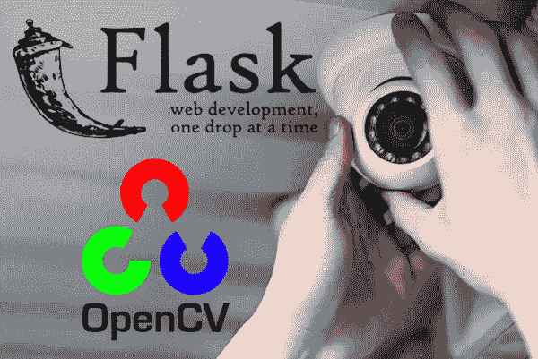
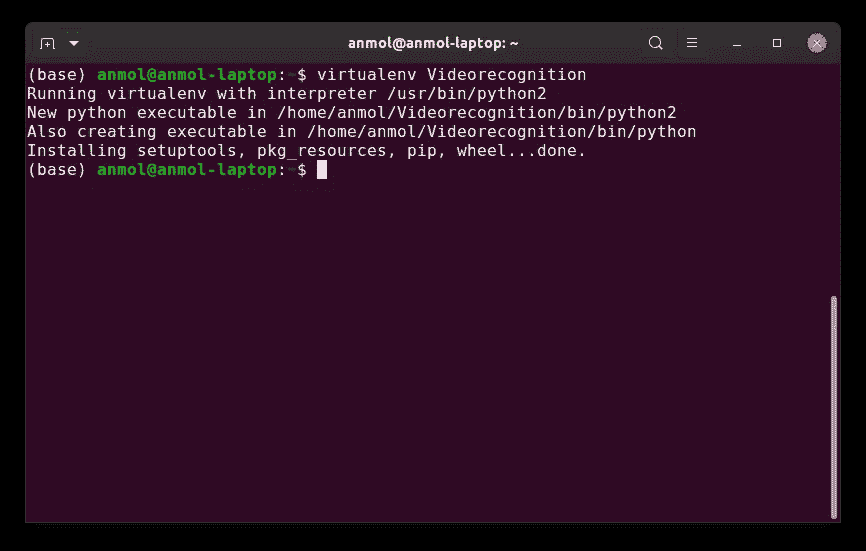
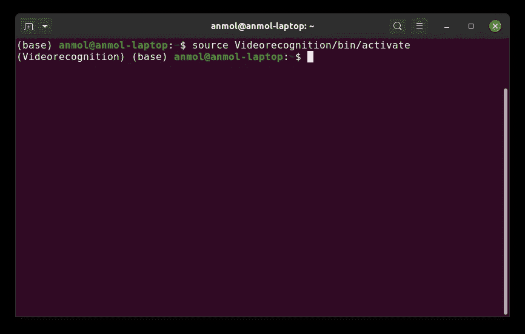
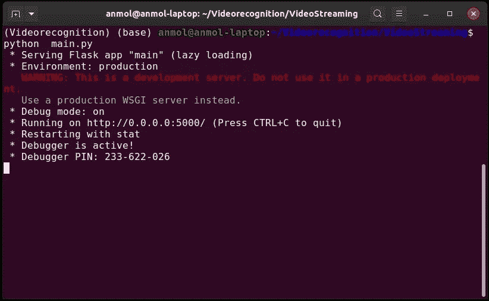
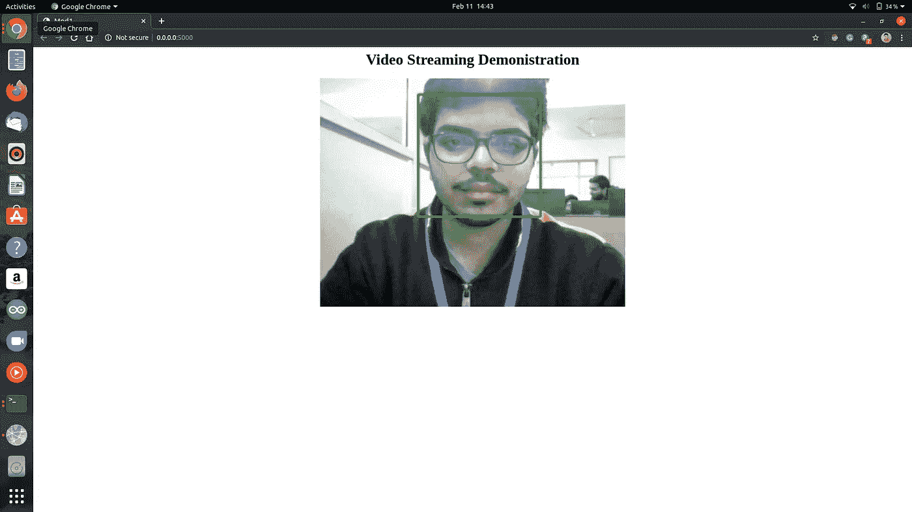

# 使用 Flask 和 OpenCV 的视频流

> 原文：<https://medium.datadriveninvestor.com/video-streaming-using-flask-and-opencv-c464bf8473d6?source=collection_archive---------0----------------------->



Stream video using OpenCV and Flask. ([Image Source](https://www.pyimagesearch.com/2019/09/02/opencv-stream-video-to-web-browser-html-page/))

> 我的名字是安摩尔·贝尔，我是团队**比特-N-字节**的领导者。我们是一个由三名团队成员组成的小组，他们来自位于 Ghaziabad 的 **KIET 机构集团，正在攻读计算机科学与工程的 B.Tech。本文以人脸检测为例，说明如何使用 Flask 和 OpenCV 进行视频流处理。**

如今，机器学习正在成为一个非常热门的领域。由于开发的日常需求和快速增加，需要部署机器学习模型。但是很难或者不可能在移动设备上部署它们。一种选择是使用机器学习移动框架，如 [TensorFlow Lite](https://www.tensorflow.org/lite) 来调用预先训练好的模型。

[](https://www.datadriveninvestor.com/2019/03/22/fixing-photography/) [## 修复摄影|数据驱动的投资者

### 汤姆·津伯洛夫在转向摄影之前曾在南加州大学学习音乐。作为一个…

www.datadriveninvestor.com](https://www.datadriveninvestor.com/2019/03/22/fixing-photography/) 

有没有更简单的选择？是啊！随着 5G 的到来，上传 100KB 的图像只需 0.01 秒，速度约为 [100Mbps](https://5g.co.uk/guides/how-fast-is-5g/) ，因此我们可以在服务器端部署几乎所有东西，包括人脸识别服务。考虑一个人脸检测的例子，本文将演示如何在 Linux 服务器上使用 Python Flask 和 OpenCV 进行视频流传输。

让我们开始吧…

# 步骤 1:创建和激活环境

我们将为项目创建一个虚拟环境。



创建虚拟环境需要 virtualenv 包。您可以用 pip 安装它:

```
$ pip install virtualenv
```

要创建虚拟环境，您必须指定一个路径。我们正在主文件夹中创建环境的本地目录“Videorecognition ”,要创建该文件夹，请键入以下内容:

```
$ virtualenv Videorecognition
```

要激活环境，请执行以下命令:



```
$ source Videorecognition/bin/activate
```

# 步骤 2:安装 Flask 和 OpenCV

首先，我们需要用 [apt-get](https://help.ubuntu.com/community/AptGet/Howto) 包管理器刷新/升级预安装的包/库:

```
$ sudo apt-get upgrade
$ sudo apt-get upgrade 
```

现在我们将执行以下命令来安装 OpenCV 和 Flask:

```
$ sudo apt install python3-opencv
$ pip install Flask
```

# 步骤 3:创建项目结构

现在，所有的先决条件都已安装，让我们设置我们的项目:

```
├── VideoStreaming/
│   ├── camera.py
│   ├── main.py
│   ├── haarcascade_frontalface_alt2.xml
│   ├── templates/
│   │   ├── index.html
```

# 步骤 4:使用 OpenCV 检测人脸

现在我们已经创建了我们的项目结构，我们将使用 OpenCV 来检测人脸。我们将使用最基本和最简单的方法来检测人脸，即使用 Haarcascades。

```
**#camera.py*****# import the necessary packages***
import cv2***# defining face detector***
face_cascade=cv2.CascadeClassifier("haarcascade_frontalface_alt2.xml")
ds_factor=0.6class VideoCamera(object):
    def __init__(self):
      ***#capturing video***self.video = cv2.VideoCapture(0)

    def __del__(self):
       ** *#releasing camera***        self.video.release()def get_frame(self):
       **#extracting frames** ret, frame = self.video.read()
        frame=cv2.resize(frame,None,fx=ds_factor,fy=ds_factor,
        interpolation=cv2.INTER_AREA)                    
        gray=cv2.cvtColor(image,cv2.COLOR_BGR2GRAY)
        face_rects=face_cascade.detectMultiScale(gray,1.3,5)
        for (x,y,w,h) in face_rects:
         cv2.rectangle(frame,(x,y),(x+w,y+h),(0,255,0),2)
         break ***# encode OpenCV raw frame to jpg and displaying it*** ret, jpeg = cv2.imencode('.jpg', frame)
        return jpeg.tobytes()
```

# 步骤 5:创建显示视频的网页

现在，我们将创建一个网页来显示我们的视频。

```
***<-- index.html -->***
<html>
  <head>
    <title>Video Streaming Demonstration</title>
  </head>
  <body>
    <h1>Video Streaming Demonstration</h1>
    
  </body>
</html>
```

# 步骤 6:创建流服务器

现在，我们已经使用 haarcascade 检测到人脸，并创建了一个网页来显示视频，我们将把这两个模块与我们的服务器集成在一起。

```
***# main.py******# import the necessary packages*** from flask import Flask, render_template, Response
from camera import VideoCameraapp = Flask(__name__)[@app](http://twitter.com/app).route('/')
def index():
    ***# rendering webpage*** return render_template('index.html')def gen(camera):
    while True:
        ***#get camera frame***
        frame = camera.get_frame()
        yield (b'--frame\r\n'
               b'Content-Type: image/jpeg\r\n\r\n' + frame + b'\r\n\r\n')[@app](http://twitter.com/app).route('/video_feed')
def video_feed():
    return Response(gen(VideoCamera()),
                    mimetype='multipart/x-mixed-replace; boundary=frame')if __name__ == '__main__':
    ***# defining server ip address and port***
    app.run(host='0.0.0.0',port='5000', debug=True)
```

# 步骤 7:启动并访问服务器

通过执行以下命令，在项目目录中打开终端窗口:

```
$ cd Videorecognition
$ cd VideoStreaming
```



要启动服务器，请执行以下命令:

```
python main.py
```

要访问服务器，请打开浏览器并导航到服务器 URL:

```
[http://0.0.0.0:5000/](http://0.0.0.0:5000/)
```



# 结论

希望这篇教程能帮助其他人找到 Flask 和 OpenCV 的入门之路！

详情和最终代码，请访问我的 GitHub 仓库:[带烧瓶的视频流](https://github.com/behl1anmol/VideoStreamingFlask)

下节课再见！

谢谢你，

安摩尔