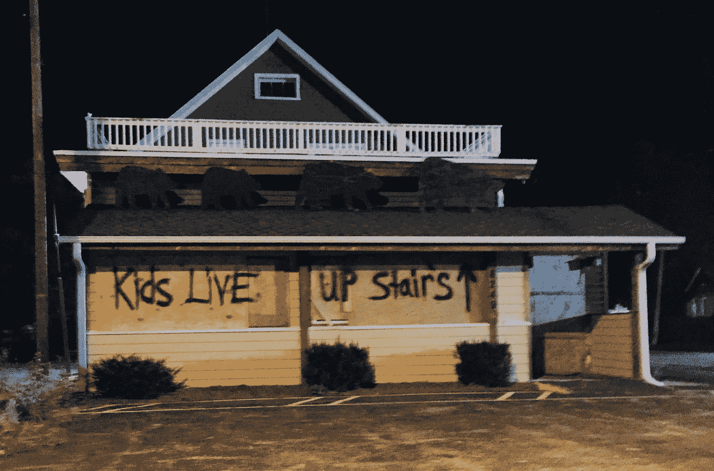

# 暴力制造单一议题选民

> 原文：<https://medium.datadriveninvestor.com/violence-creates-single-issue-voters-197382d7124a?source=collection_archive---------7----------------------->

对社区安全的担忧可能压倒一切。

Virtually All Businesses Boarded Up In Anticipation Of A Riot. Messages were painted on the boards to discourage the rioters from damaging their building. August 25, 2020\. (photo: [*Hajee](https://www.flickr.com/photos/27728294@N05/))

六个月前，暴力对公共安全的威胁甚至不是一个投票问题。两周前，59%的投票者将此列为他们最关心的问题之一。

随着特朗普在民调中攀升，左翼的警报响起，也许为时已晚:“ [*法律和秩序的担忧将驱使选民转向特朗普。”*](https://www.dailypress.com/opinion/vp-ed-column-allen-0825-20200824-vjwc6ghq35e35dmkhftcyagrqy-story.html)

加利福尼亚州的威利·布朗同意道:“以正义的名义烧杀抢掠会把选举拱手让给特朗普，而民主党在 11 月大选中横扫对手的最大威胁不是白宫的共和党人，而是以种族正义的名义摧毁城市的示威者。”

《纽约时报》警告说，基诺沙的混乱已经动摇了威斯康辛州的一些选民:随着居民看到火灾和抢劫，一些人担心当地民主党领导人无法控制局势。

众所周知，密歇根州众议员黛比·丁格尔曾警告克林顿竞选团队在 2016 年有失去密歇根州的危险。现在，她再次警告她的民主党同僚，对警察缺乏支持和对暴力的容忍正使密歇根州处于严重的危险之中，无论民意调查可能会说什么。

> “暴乱和无法无天是邪恶的。任何允许、宽恕或无视街头暴力、抢劫和伤害的民政当局都没有任何合法性。这是第一位的。如果一个政党支持我所相信的一切，但不相信在任何地方都要维持法律和秩序，我会支持支持的那个政党。从这个意义上说，我是一个只关注一个问题的选民，因为没有秩序，就没有任何其他问题的空间。”——安德鲁·苏利文，“[民主党人走进了一个陷阱:如果法律和秩序是这次选举的关键，他们就会输掉。](https://andrewsullivan.substack.com/p/the-trap-the-democrats-walked-right)“2020 年 8 月 28 日。

上述观点来自一位作者，他自己承认，“因为说我认为唐纳德·特朗普的当选是民主的灭绝事件而受到嘲笑。”如果有人认为，“如果拜登获胜，我们可能会有最后一次机会让中间派坚持下去——我对这一点的希望微乎其微，”对法律和秩序有如此强烈的感受，那么犹豫不决的选民会有什么感受呢？

显然，考虑到这个令人不安的问题，民主党突然发现自己在本周的选举中处于不断变化的地位。几个月来，共和党一直将暴力事件的增加以及伴随着许多抗议活动的暴力事件视为话题，但高调的民主党人却集体转向将[的暴力事件归咎于唐纳德·川普。](https://joebiden.com/2020/08/30/statement-by-vice-president-joe-biden-on-the-deadly-violence-in-portland/?preview=true#)

民主党人缺少一项关键数据，除非民主党策略师能够说服民主党高层改变路线，否则这很可能在选举日损害该党。

 [## 全民或跨州的国营保险私人医疗保险:经济学…

### 我们目前生活在一个所有非医疗行业都痴迷于…

www.datadriveninvestor.com](https://www.datadriveninvestor.com/2020/05/21/state-run-insurance-for-all-or-across-the-state-lines-private-healthcare-coverage-economics-politics-social-mix-up/) 

## 严重的误判

民主党人接受了一个事实，乔治·弗洛伊德被一名警察跪了七分钟的视频几乎在一夜之间改变了美国关于警务的全国性谈话。

警察杀害手无寸铁的人已经持续多年。全国的执法人员每年都会杀死大约 1000 人。然而，乔治·弗洛伊德的*视频*和雅各布·布雷克背部被击中七次的视频，是什么点燃了社区的行动。

暴力抗议的照片和视频将同样强大。

在过去几个月的抗议活动中，在主要城市发生的暴力、纵火和抢劫可能有同样大的力量动摇人心。

正如人们所说，一幅画胜过千言万语。一个视频更有价值。

指望选民——尤其是犹豫不决的独立选民——会观看并厌恶乔治·弗洛伊德(George Floyd)和雅各布·布莱克(Jacob Blake)的两个视频，但不会观看或厌恶数千个描述骚乱期间暴力的视频中的任何一个，是完全不合逻辑的。

现在每个人都是摄影记者和摄像师。每个人口袋里都有一个[便携式高品质录音棚](https://twitter.com/nieto_phillip)。从波特兰的抗议者枪击一名男子的头部，到愤怒的蒙面 BLM 抗议者与华盛顿的户外食客对峙；[整个 2020 年](https://www.youtube.com/watch?v=en5DZgJTWZ8)“爱情之夏”，西雅图市长珍妮·德坎称之为“爱情之夏”，已经被偷拍到了。

事实上，一些与上周离开 RNC 大会的惊恐的共和党人搭讪的“抗议者”包围并威胁兰德·保罗参议员和前佐治亚州议员弗农·琼斯等人，他们考虑周到地拍摄了自己。

这些抗议者似乎相信他们的道德正义。犹豫不决的选民看到这种行为后会被说服吗？

在民权时代，使非暴力成为如此有效策略的关键因素之一是它唤起了目击者的同情。当一群愤怒的白人威胁他们时，美国白人看到沉着、端庄的非洲裔学生拿着书直盯着前方的照片，被感动得支持民权运动。

[威尔·兰德·保罗议员惊恐的眼神](https://www.foxnews.com/politics/rand-paul-attack-police-arrest-investigation-white-house-rnc-protests)和[大喊“我们把兰德·保罗逼到墙角了！](https://nypost.com/2020/08/30/ignorant-mobs-roaming-the-nations-capital/)“唤起同样的同情？

应该平心而论地指出，参议员兰德·保罗是最近的《布莱娜·泰勒正义法案》的作者，该法案旨在终止危险的“禁敲”令，这种令包括布莱娜·泰勒在内的许多人付出了生命的代价。

有人指出，尽管他们的初衷是好的，但这些抗议者可能会为唐纳德·特朗普创造更多的支持。最近的民意调查似乎表明这可能是事实。

民主党中比较冷静的人已经对暴力发出了警报，以及它对民主党在 11 月的机会造成的损害。事实上，民主党人现在突然改变了他们的信息，承认有暴力行为，似乎表明纵火，抢劫和破坏没有帮助乔拜登。

(特约撰稿人布鲁克·贝尔)

## 访问专家视图— [订阅 DDI 英特尔](https://datadriveninvestor.com/ddi-intel)