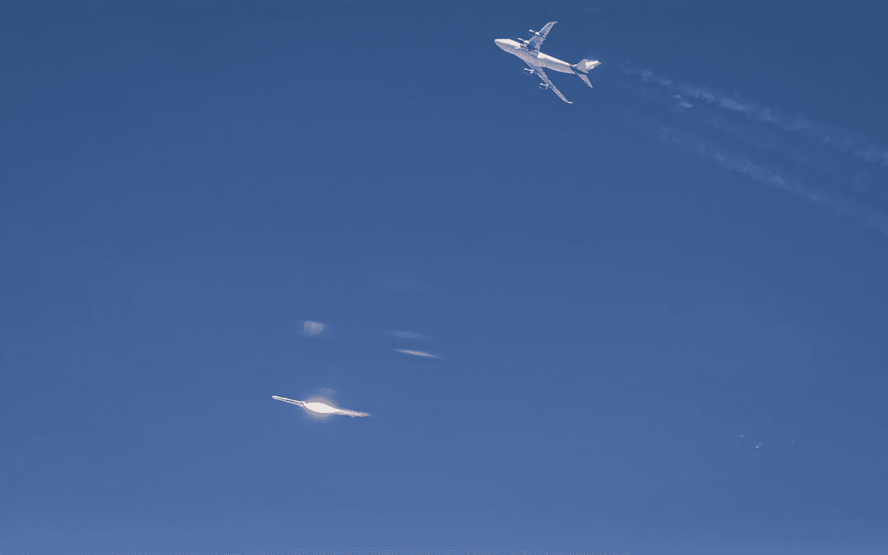

# 维珍火箭空投:航天发射的新方式？

> 原文：<https://medium.datadriveninvestor.com/virgins-rocket-air-drop-a-new-way-for-space-launches-fde7ecf1066c?source=collection_archive---------18----------------------->

From Virgin Orbit’s [Twitter](https://twitter.com/Virgin_Orbit/status/1350846974342303744)

亿万富翁理查德·布兰森拥有的美国维珍轨道公司公司想从飞机上发射火箭。飞机飞到一定高度，上面挂着一枚火箭。然后火箭被空投到轨道上。

> 通过在空中从飞机上发射，美国维珍轨道公司的系统不需要那么大的火箭，也不需要那么多的燃料，这有助于降低成本……这是一个潜在的更灵活的系统，因为它使得从 747 飞机可以起飞和降落的任何地方发射卫星理论上成为可能。——[边缘](https://www.theverge.com/2021/1/17/22221212/virgin-orbit-rocket-test-launch-satellites-nasa-branson)

唯一的问题是——它还没有工作！第一次测试失败了。但是维珍没有放弃。凭借 NASA 和国防部的合同，来自主权基金的现金，该公司正在 2021 年 1 月 17 日再次尝试！从他们的推文来看，发布会到目前为止似乎是成功的！