# 虚拟建筑作为可访问的内存

> 原文：<https://medium.datadriveninvestor.com/virtual-architecture-as-the-accessible-memory-dbad40c2532e?source=collection_archive---------6----------------------->

## 在 VR 里找爸爸

Screenshot from “The Virtual Architecture Museum”

  W 帽子让**成为一个好的架构 app** ？一方面是信息丰富的详细模拟，另一方面也是视觉上和技术上令人信服的模拟。并且支持多语言。而且作为跨平台。

前段时间偶然看到这方面的大作。虚拟建筑博物馆[可能是我迄今为止在这个领域见过的最强大的应用。](http://vma.muar.ru/en/palace-of-the-soviets)

# 历史的第三维

[**Shchusev 国家建筑博物馆**](http://vma.muar.ru/en)(*государственныйархитектурныймузейим。А.В.щусева*在 **3Dreamteam** 的帮助下开发了一个独特的平台，该平台展示了几个现有的但从未实现的建筑项目:[虚拟建筑博物馆](http://vma.muar.ru/en/palace-of-the-soviets)。可用于 iOS ( [iPhone](https://itunes.apple.com/app/apple-store/id978672309?pt=117723770&ct=vmavizerracom&mt=8) 和 [Mac](https://itunes.apple.com/us/app/virtual-architecture-museum/id1033476231?l=ru&ls=1&mt=12) )、 [Android](https://play.google.com/store/apps/details?id=com.vizerra.muar&referrer=utm_source%3Dvmavizerracom%26utm_medium%3Dreferral%26utm_campaign%3Dvmavizerracom) ，也可作为独立程序[用于 Windows](http://vma.muar.ru/files/VirtualArchitectureMuseum.exe) 。

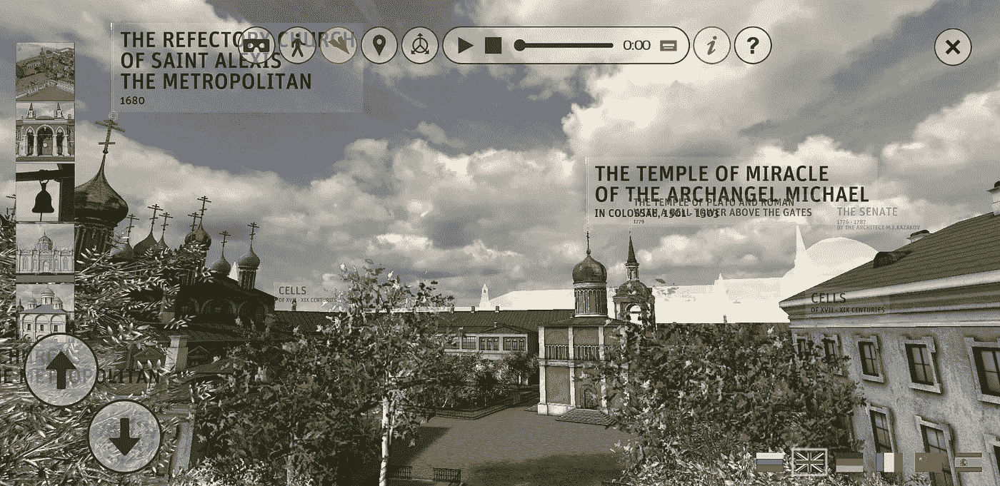

Screenshot from the app

该项目允许游客从**鸟瞰图**(也在飞行中**)体验城市背景下的建筑群。**带注释的多媒体导览(带文本、叙述和历史文档)**也可用——以六种语言完美实现。而那些想要徒步**参观历史(甚至从未存在过的)建筑**的人也将得到适当的服务——第一人称视角**通过沉浸(只有声音仍然缺失)迷住一个人。****

 [## 人工智能和虚拟现实的融合-你能期待什么|数据驱动的投资者

### 在技术领域，融合是合乎逻辑的一步。就在几十年前，你可能需要一个专门的…

www.datadriveninvestor.com](https://www.datadriveninvestor.com/2018/08/30/the-convergence-of-ai-rv-what-you-can-expect/) 

我用一部安卓智能手机进入了历史——画面流畅，没有丢帧，也没有很长的加载时间。自最新更新以来，一项新功能扩展并完善了进入第三维度的时间旅行体验——支持 [Google Cardboard](https://vr.google.com/cardboard/) ！令人着迷。在虚拟现实中参观历史。

Screenshot from the app

为什么不和我们一起来一次小小的时光旅行呢？

# 改变世界的建筑。

我们从可能是苏联时代最引人注目的建筑项目开始。早在 20 世纪 20 年代，建造**苏联宫殿**的想法就诞生了——一个雄心勃勃的想法，一个有威望的目标。最初的前卫设计都被媒体撕得粉碎。1931 年，莫斯科的 [**基督救世主大教堂**](https://en.wikipedia.org/wiki/Cathedral_of_Christ_the_Saviour) 被拆除，苏联[宫殿](https://en.wikipedia.org/wiki/Palace_of_the_Soviets)(必须建在这个地方)的实际建筑竞赛开始了。

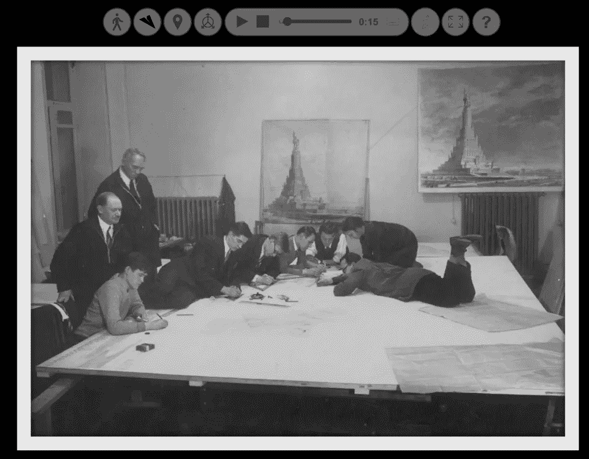

Screenshot from the app

做出了许多贡献。其中之一是鲍里斯·约凡创作的第一个简洁的变体，它仅限于清晰的形式，并在图书馆塔上向一名工人展示火炬。

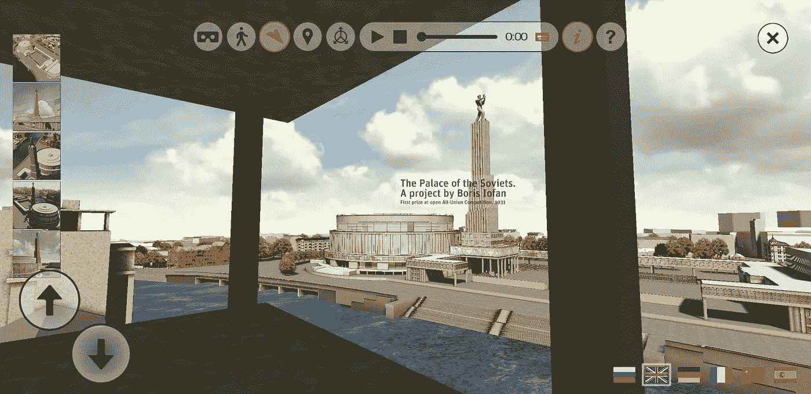

Screenshot from the app

由著名的新古典主义建筑师 Zholtovsky 设计的这个项目被批评为“毫无生气的古代仿制品”，但是仅仅因为它的狂妄自大的宏伟，它被谨慎地选中了。

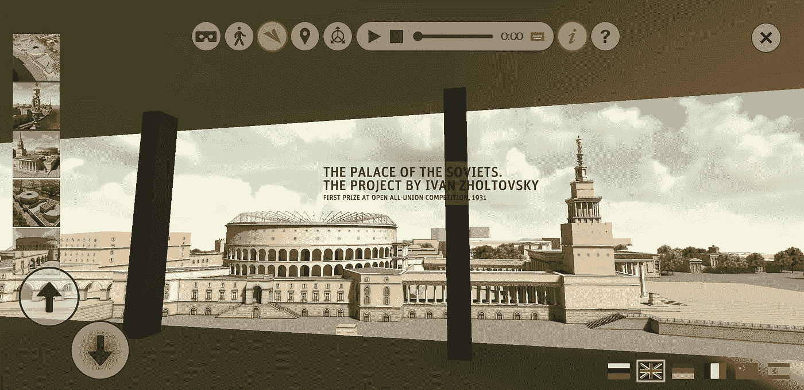

Screenshot from the app

也有来自国外的贡献——11 人来自美国，5 人来自德国(包括 Gropius 和 Poelzig ),其他人来自法国、荷兰、瑞士、意大利和爱沙尼亚。建筑大师、**勒·柯布西耶、**提供了一个太阳的视觉——考虑到周边、声学、人体工程学。这个提议引起了很大的兴趣，但是被拒绝了，理由是“太工业化了”。

Screenshot from the app

28 岁的美国人赫克托·汉密尔顿(Hector Hamilton)以其简单的视觉给评审团留下了深刻的印象(尽管国际建筑界批评了该项目的技术弱点和视觉落后)——他的草案(与 Iofans 和 Zholtovsky 一起)被宣布为领先贡献。

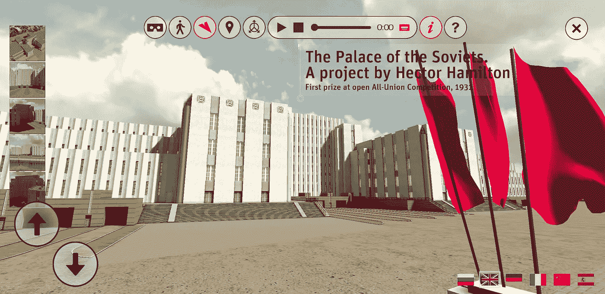

Screenshot from the app

获胜者是 Boris Iofan 的第二个提案，他与 T2 的 Vladimir Shchuko 和 T4 的 Vladimir Gol'freich 一起设计了一个不朽的作品，让人想起弗里茨·兰的 T7 大都市 T9，它的高度是 415 米，1362 英尺，盖过了世界上所有的城市建筑。

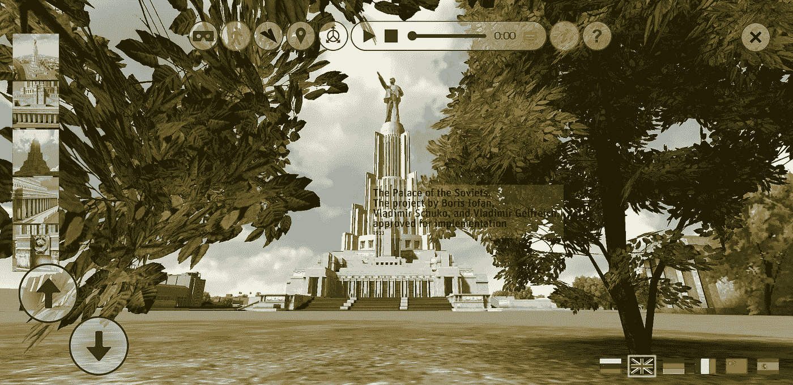

Screenshot from the app

在宫殿内，几个大厅被规划用于政治活动、剧院甚至滑冰。这座建筑的顶部是一座 100 米高的列宁雕像，雕像的顶端是国会大厅和图书馆。在模拟中，你可以绕着列宁的头飞行，从上面看到莫斯科的部分地区。

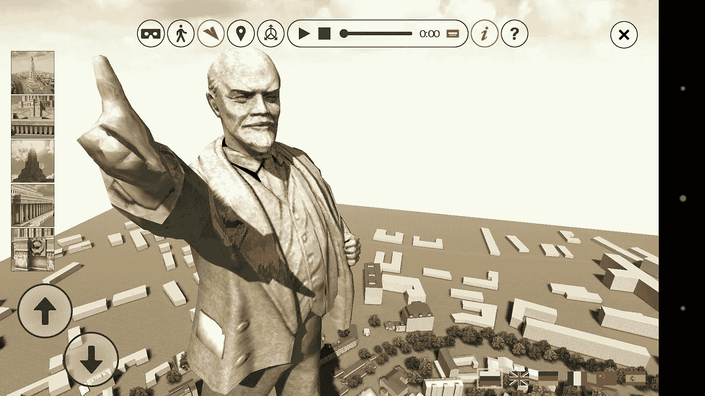

Screenshot from the app

规划和实现花了几十年时间，由于第二次世界大战和其他情况(如地下水渗漏)而失败，因此考虑将建筑场地改为公共游泳池，而不是建筑里程碑。

# 时间机器是可能的。

虚拟博物馆包含许多其他的综合体，比如 1901 年格拉斯哥国际展览会上由谢克特设计的展馆

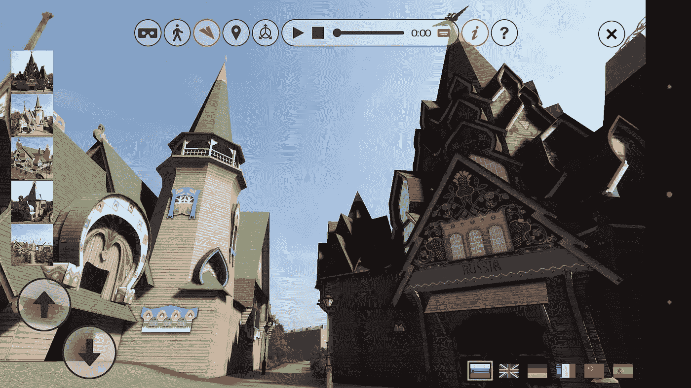

Screenshot from the app

或者是**王子尼基塔·特鲁别茨科伊**的乡间住宅*【欢乐花园】*【Neskuchnoe】，包括可以迷路的花园和迷宫。

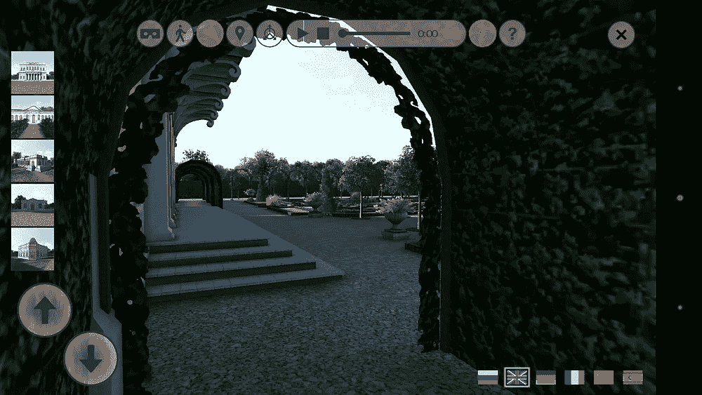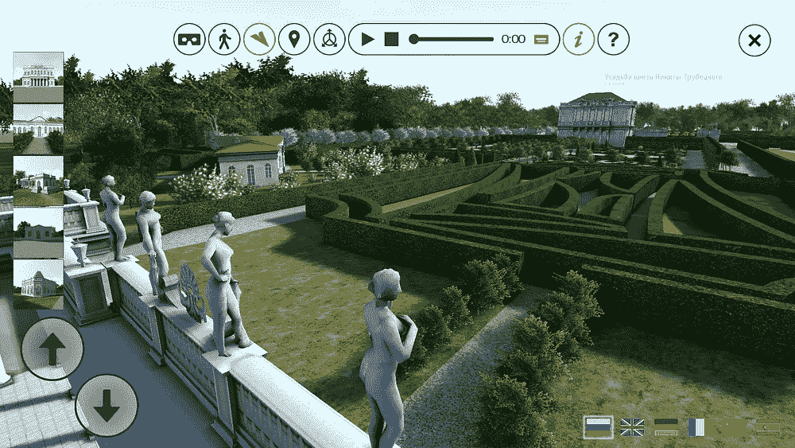

Screenshots from the app

还有很多地方不会让你离开…

但是一个重建的地方与我有着特殊的关联。个人认为。

**在 VR 里找我爸**

这个项目——不像其他网站——实现了。一个非常不寻常的项目:由世界著名建筑师梅尔尼科夫设计的嵌齿轮形式的鲁萨科夫俱乐部

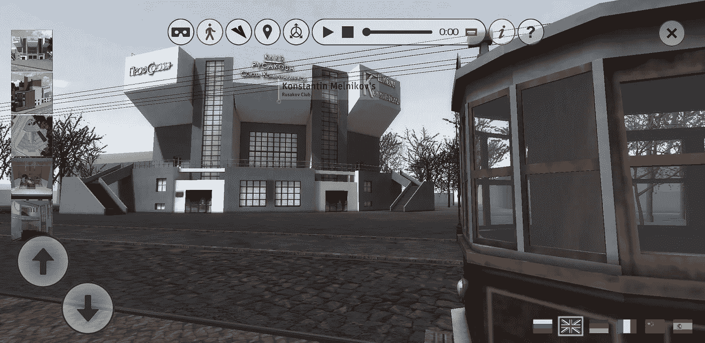

Screenshot from the app

这座多功能建筑是为工人的娱乐和教育而设计的，有几个可以单独使用的大厅。然而，这些礼堂加在一起可以容纳 1100 多人。

这座建筑依然存在(尽管莫斯科城市管理部门一直倾向于拆除旧建筑来建造新的建筑精品)——现在它是罗马·维克图克实验剧院的所在地。这是 Roberto Conte 拍摄的实际建筑状况的照片:

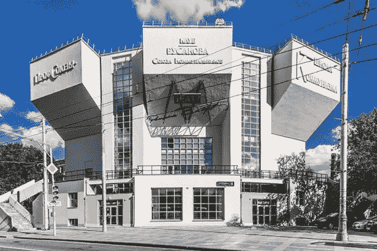

© Roberto Conte (www.robertoconte.net)

在 VR-simulation 中，你可以进入大楼，甚至体验到 **A.A. Vesnin** 为制作**切斯特顿的**[*曾是星期四的人:一场噩梦*](https://en.wikipedia.org/wiki/The_Man_Who_Was_Thursday) 】而设计的构成主义布景。

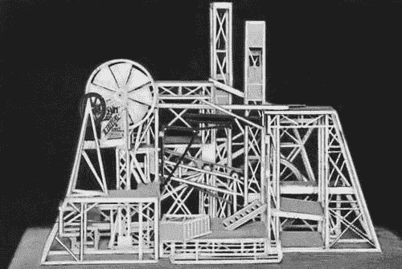

A.A.Vesnin. Set design for the play “The Man Who Was Thursday” at the Moscow Kamerny Theatre. 1923\. (Source: [http://bse.sci-lib.com/particle004171.html](http://bse.sci-lib.com/particle004171.html))

Screenshot from the app

但是这座建筑承载着对我来说非常重要的记忆。在这里，在 20 世纪 50 年代，在戏剧工作室“鲁萨科夫工作室”里，我的父亲是一名演员、摄影师和组织者。

他知道这栋大楼的所有角落；他目睹了(比不出名的)演员崭露头角。他还参加了大楼后院的植树活动。

他为这次植树活动拍摄了一张照片——将历史与重建相比较:

Screenshot from the app

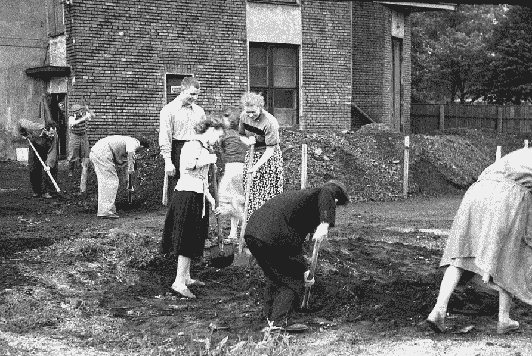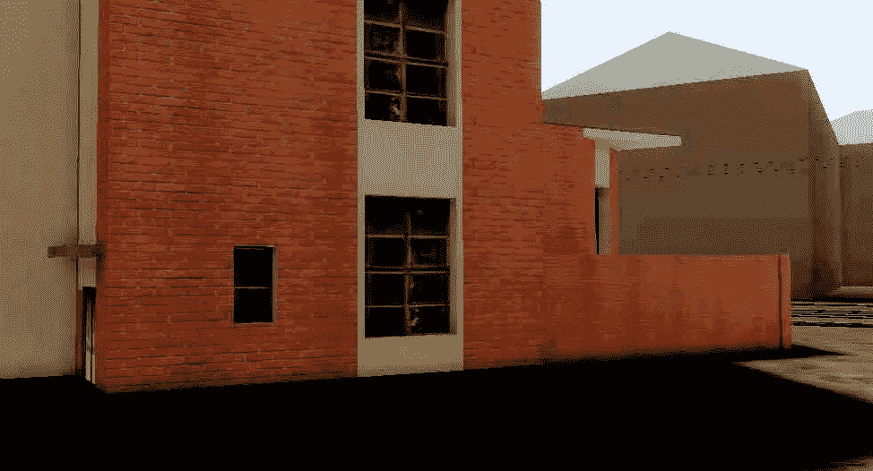

Left: Planting Trees by Russakov Theater Studio. Photo: Vladimir Perelman, 1956 // PerelmanArchiv ©

我经常去这个地方——虚拟的。提醒我的父亲，他经历了这片土地，这些墙壁，这片天空。在现实中。在 20 世纪 50 年代。

虚拟现实可以将我们转移到每一个可能的世界——但它也可以将过去带给我们。我一直沉浸在对父亲的回忆中。

*本文由*[*【DataDrivenInvestor.com】*](https://www.datadriveninvestor.com/2020/02/15/vr-architecture-as-an-accessible-memory/)首发