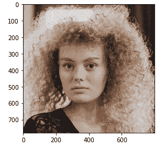
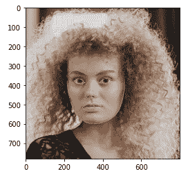
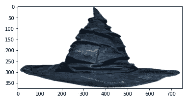
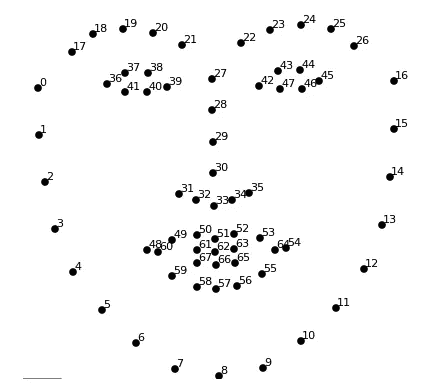
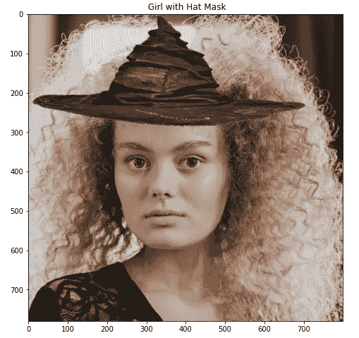

# 虚拟化妆:Snapchat 风格的帽子滤镜

> 原文：<https://medium.datadriveninvestor.com/virtual-make-up-snapchat-style-hat-filter-7f57fcabb9dc?source=collection_archive---------7----------------------->

给一张脸添加不同种类的帽子是一个非常酷的功能，我想自己尝试一下。因此，当我有机会将它作为正在进行的 OpenCV 课程的一部分来实现时，我欣然接受了这个机会。以下是我的做法。

**步骤 1:面部标志检测**

在这一步中，我们加载图像并应用 Dlib 面部标志检测器来检测给定图像上的标志点。下面是原图。



Girl without make-up

```
points = fbc.getLandmarks(faceDetector, landmarkDetector, imDlib)
```

下图显示了检测到的标志点。



Girl’s face with detected landmark points

**第二步:加载帽子的图片并调整大小**

在这一步中，我们加载帽子的图像，并调整其高度和宽度，以匹配面部的尺寸。我们还必须考虑到帽子通常比脸宽的事实。因此，调整后的图像必须至少是脸的两倍宽。这是通过下面几行代码实现的。

```
hatWidthResized = points[16][0] - points[0][0]
hatWidthResized = int(math.ceil(hatWidthResized / 100.0)) * 100width = int(hatWidthResized * 2.5)
height = int(width / 2)hatResize = cv2.resize(imgHat,(width,height),
interpolation = cv2.INTER_AREA)
```

在我们的例子中，我们决定将帽子的宽度增加 2.5 倍，这样可以获得更好的效果，因此我们将帽子的大小调整为脸部宽度的 2.5 倍。下面我们展示了帽子的图像。



Image of resized hat according to 2.5 times face

**第三步:分离帽子图像的颜色和 alpha 通道**

```
hatOriginal = hatResize[:,:,0:3]
hatOriginal = cv2.cvtColor(hatOriginal,cv2.COLOR_BGR2RGB)
maskHat = hatResize[:,:,3]
```

在这一步中，我们将帽子图像的 RGB 和 alpha 通道分成不同的变量。这些将在稍后用于计算帽子图像的遮罩。

**第四步:确定帽子的位置**

在这一步中，我们必须将帽子放置在头部的正中央。方法是根据鼻子上的点对齐帽子，因为这些点或多或少在脸的中心。所以我们把点 27 和点 30 作为我们感兴趣的区域点。



Landmark points. Notice points 27 to 30 Nose points

```
midNosePointX, midNosePointY = points[27]
topNosePointX, topNosePointY = points[30]
noseLength = topNosePointY - midNosePointY
```

**步骤 5:基于面部确定感兴趣区域。**

```
nose_length_constant = 6.8 
y1 = int(midNosePointY-(nose_length_constant * noseLength)) 
y2 = y1 + height
x1 = midNosePointX - int(width/2)
x2 = midNosePointX + int(width/2)
```

我们计算需要放置帽子的面的长度，以达到最佳效果。在这里，我们通过实验确定了一个常数，这个常数需要乘以机头长度，以获得帽子的最佳位置；*"鼻长常数= 6.8"*

[](https://www.datadriveninvestor.com/2020/11/19/social-media-and-covert-censorship-by-sponsoring-popularity-over-credibility/) [## 社交媒体和通过赞助受欢迎度超过可信度的秘密审查|数据驱动的投资者

### “喜欢”按钮，如选项、鼓掌、关注或推荐按钮，是社交网络平台、互联网…

www.datadriveninvestor.com](https://www.datadriveninvestor.com/2020/11/19/social-media-and-covert-censorship-by-sponsoring-popularity-over-credibility/) 

**第六步:限制边界点**

在这一步中，我们限制感兴趣区域的边界点值。如果我们不做这一步，那么一些帽子的图像可能会导致边界点超过人脸的界限，这是不希望的。

```
if x2 > origImageWidth:
    x2 = origImageWidth
    hatOriginal = cv2.resize(hatOriginal,(x2-x1,y2-y1))
    maskHat = cv2.resize(maskHat,(x2-x1,y2-y1))# taking y1 as the centre coordinate
if y1 < 0:
    y1 = 0
    hatOriginal = cv2.resize(hatOriginal,(x2-x1,y2-y1))
    maskHat = cv2.resize(maskHat,(x2-x1,y2-y1))

if x1 < 0:
    x1 = 0
    hatOriginal = cv2.resize(hatOriginal,(x2-x1,y2-y1))
    maskHat = cv2.resize(maskHat,(x2-x1,y2-y1))
```

因此，我们还必须限制帽子图像的遮罩尺寸。

**步骤 7:创建帽子图像和感兴趣区域的组合掩模。**

```
maskedHatImage = cv2.merge((maskHat,maskHat,maskHat))
aughatmasked = cv2.bitwise_and(hatOriginal,maskedHatImage)
```

在此步骤中，我们通过对帽子的原始图像和帽子图像的遮罩执行按位 and 运算，来创建帽子图像的 3 通道遮罩和帽子的组合遮罩。

步骤 8:创建帽子图像和感兴趣区域的组合掩模。

```
hatGirlRegionOfInterest = hatGirl[y1:y2,x1:x2]hatGirlRegionOfInterestImage = cv2.bitwise_and(hatGirlRegionOfInterest, cv2.bitwise_not(maskedHatImage))hatGirlRegionOfInterestCombined = cv2.bitwise_or(hatGirlRegionOfInterestImage, aughatmasked)
```

在该步骤中，我们基于 x1、x2、y1、y2 点提取感兴趣区域。然后，我们对带有感兴趣区域的帽子图像的反转遮罩执行按位 and 运算。然后，我们使用按位“或”运算将该遮罩与帽子图像的扩充遮罩相结合。

**第九步:创建最终图像**

在这一步中，我们用帽子和感兴趣区域图像的组合遮罩替换原始图像中的感兴趣区域，以获得以下结果。



Girl with Harry Potter Sorting Hat

**结论**

该算法的难点在于确定鼻长常量值。因为人脸尺寸不同，所以确定常数值很棘手，可能会影响不同图像的性能。

## 访问专家视图— [订阅 DDI 英特尔](https://datadriveninvestor.com/ddi-intel)