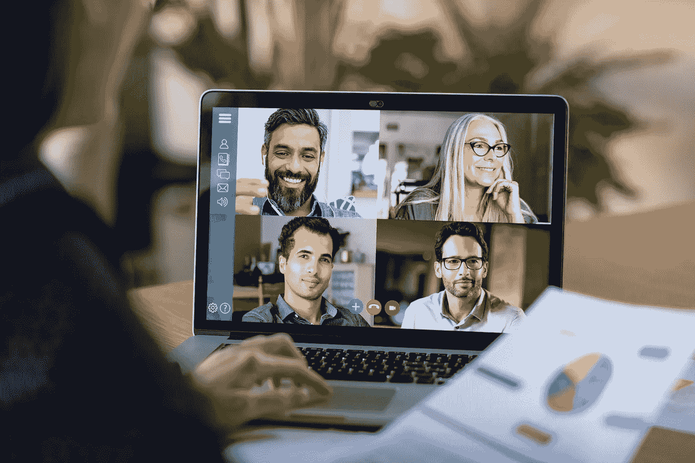

# 虚拟现实角。I:变焦镜头

> 原文：<https://medium.datadriveninvestor.com/virtual-reality-pt-i-the-zoom-boom-5262d679dbdd?source=collection_archive---------32----------------------->

## 这是最好的时代，也是最坏的时代。那是新的喧嚣的 20 年代。那是一个孤立的时代。这是 IRL 的时代。那是变焦时代。

也许我有点夸张，但是事情变得…很奇怪。这感觉有点像我们都被困在两个世界之间:家庭和工作正在碰撞，周和周末似乎正在融合，相反的观点正在汇聚到一个主要焦点:生存。

如果我能给那些可能正在与新的虚拟现实斗争的人提供任何建议，那就是:*打开你的相机。*

*作为一名在职的企业家母亲，我忙于经营两家公司(包括突然管理 19 名远程工作的员工)，在芝加哥的家中主持播客，在家教育三个孩子。我在努力与我的丈夫共享工作空间和圈养我的狗(注:Lola 是一只被困在大狗体内的小狗)的同时做着这一切，它显然认为吠叫赶走冠状病毒是她的个人使命。*

* [## 数据驱动始于数据素养|数据驱动的投资者

### 光是听到“数据”这个词就令人生畏。老实说，只有 21%的全球员工对自己的工作充满信心

www.datadriveninvestor.com](https://www.datadriveninvestor.com/2020/03/22/data-driven-starts-with-data-literacy/) 

明确地说，我(非常)感激有机会兼顾这一切。同时炫耀一个腰包里的新冠肺炎必需品(洗手液、袋装 Clorox 湿巾、手套、酒精湿巾和一口大小的德芙巧克力……你知道，以防万一)。有趣的事实:带着腰包，很难让人觉得自己是个坏蛋。

离开这个完全混乱的风景如画的场景，我想谈谈我们的新现实。不，不是社交距离或卫生纸短缺。我说的是变焦。

在这个隔离时代，Zoom 已经成为所有人类互动的平台。从生日庆祝和虚拟快乐时光，Zoom 还成为了商务会议的伟大推动者，而每个人都被归入自己的家中。虽然这是以前虚拟会议的一个流行选项，但它已经成为 2020 年 Q2 任何*类型合作的必要条件。*

Zoom 也给我们上了一堂关于人性、联系和良好管理的重要课。(隐私问题暂且放在一边，因为有一大堆值得单独发布的内容。)

如果眼睛是你心灵的窗户，变焦相机就是一扇窗户，让你知道你是否在认真听我(和你的其他队友)在说什么。换句话说， ***打开你的相机*** 。

现在，我们的首要目标应该是减少任何不必要的阻碍同理心和人际关系的障碍。不给我们看你的脸是其中一个障碍。

有些人可能会认为打开相机是一件小事——一个可以忽略的细节。其他人不喜欢让人们不仅看到他们的脸，还看到他们客厅的装饰。我明白了。这就是虚拟背景的作用。

虽然你可能认为不露面是一种简单的不作为，但我不同意。对于一些人来说(特别是那些外向的人，他们由于缺乏人际交往而每分钟都在萎缩。我看见你了。)，在别人都在的时候不露脸可以被解读为微侵犯。为什么*你*不用遵守社会潜规则？是什么让*的你*如此特别？

我们都在以自己独特的方式努力理解我们所处的新环境。我们所有人都不舒服。但这也是为什么这是一个很好的机会在人的层面上交流。我们应该拥抱人性，而不是回避人性。一起。变焦时。

*不联系*将不可避免地导致关系破裂、沟通不畅和士气低落。五分钟的媒体给了我们大量的这三样东西。难道我们不能通过故意扩大我们和同事之间的鸿沟来增加更多吗？

所以就像我之前说的，如果你在新的虚拟现实中挣扎，打开你的相机。让我们看看你的脸。做一个领导者。成为参与者。做人吧。

呆在家里！(请和谢谢。)*