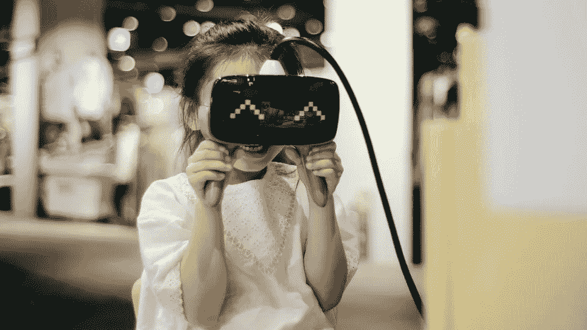

# 虚拟现实伸出手来拯救关系

> 原文：<https://medium.datadriveninvestor.com/virtual-reality-reaches-out-to-save-relationships-dce8cea68c4e?source=collection_archive---------14----------------------->

## 工人们学习如何以更大的尊重与他人相处

Photo by Insung Yoon

从《草地不总是更绿》一文看来，在家工作并不是一件美好的事情。事实上，脱离团队辛苦工作可能会无意中破坏工作关系。

“远程工作带来了一些令人烦恼的挑战，包括分心、变焦疲劳甚至无礼，”[梅根·m·比罗](https://twitter.com/MeghanMBiro)说。“脱离了物质环境，我们往往会误读和曲解对方。这可能会产生令人不安的副作用。”

作为一名[福布斯](https://twitter.com/Forbes)分析师、品牌战略家和 [TalentCulture](https://talentculture.com/) 首席执行官，比罗采访了临床心理学家兼 [Live in Their World](https://twitter.com/LiveNTheirWorld/) 创始人罗宾·罗森伯格。该计划帮助员工开发更有礼貌的互动方式，使用可以远程观看的虚拟现实。

 [## 支持你当地的候选人

### 与一家公司的第一次接触决定了长期关系

medium.datadriveninvestor.com](/support-your-local-candidate-c047e0798d16) 

比罗和罗森博格着眼于如何让关系运转起来，并在为时已晚之前修复附带损害。

罗森伯格说:“远程工作目前意味着在家工作。“对许多人来说，这是在充满挑战的条件下。有许多方面使远程工作具有挑战性，但我想首先关注不文明行为。

“说到底，不文明就是不尊重——不管是不是有意的，”她说。“礼貌是尊重。是以礼待人。为他人着想，并意识到自己和他人的行为可能会影响他人。”

潜意识影响在互动中发挥着重要作用。

罗森博格说:“通常，当人们的偏见影响他们的行为或他们表现得不文明时，受到不文明行为伤害的人可能会做出某种程度的情绪反应，而其他人认为这种情绪‘太情绪化’或‘咄咄逼人’或没有根据。”。

“事实上，当涉及到情绪反应或反应时，行为不文明的人可能会认为做出反应的人不文明，”她说。“不幸的是，这种观点将谈话从了解如何改善的机会转移到关注那些行为不文明的人，他们是不文明的‘受害者’。”

# 失去面对面的个人接触

罗森博格指出，从历史上看，远离最初的不文明和学习机会的焦点更频繁地发生在有色人种身上。

“在疫情期间工作——以及在家工作——给民用工作场所带来了独特的挑战，”她说。“在团队和公司中很难保持同样的归属感、友情和参与度。

“在一起工作时，如果我表现得对你不尊重，我可能会在一天的晚些时候注意到你对我不那么热情，甚至冷淡，”罗森伯格说。“我将有机会弥补这个缺口，即使我们没有明确谈论发生了什么。”

 [## 不管有没有科技，在工作中保持真实

### 关注人际关系，在工作中做真实的自己

medium.datadriveninvestor.com](/tech-or-no-tech-keep-it-real-at-work-b931259390e) 

空气中有变化的迹象。

“我可能会给你买咖啡，或者去你工作的地方聊聊天，或者以其他方式告诉你，我看到我们之间发生了一些负面的事情，我正在努力解决这些事情，”罗森博格说。

“在家里工作，这些注意同事反应的小机会——并做出回应——不是 WFH 新常态的一部分，”她说。"无论是小的还是大的不被尊重的经历都会恶化."

这些感觉可以从各种来源出现。

“工作场所[文化始于顶层](https://medium.com/datadriveninvestor/corporate-cultures-future-is-now-2f7fd6bfcaa1?source=friends_link&sk=77f3965a4ebc54993037a5c19cee7143)，但团队和工作小组可以有自己的亚文化，”Rosenberg 说。“领导者和管理者有责任树立榜样，推动和鼓励文明行为，并在必要时制裁不文明行为。

“这样做需要大量的脑力劳动，”她说。“另一个问题是，除非所有员工都接受过培训，并被授权帮助创造文明的文化——包括旁观者的干预——否则领导者和经理们要独自承担这个沉重的负担。”

# 带着敬意步入正轨

在她看来，当每个员工都有机会深入了解一个尊重他人的工作场所是什么样子时，整个公司都被指向同一个方向。

“随着人们在家工作，沟通不畅的机会会成倍增加，”Rosenberg 说。“我们大多数人并不像自己认为的那样是清晰的作家。基于文本的交流，如电子邮件、闲散时间、聊天等等，容易造成误解。

“例如，我们可能会误读文字中的情感，或者在没有情感的地方看到 snark，”她说。"反过来，这会在工作关系中制造或增加紧张和警惕."

 [## 订婚是一个四个字母的单词

### 工作场所文化弥合了员工沟通中的差距

medium.datadriveninvestor.com](/engagement-is-a-four-letter-word-e49970cdd3fb) 

最新的创新变成了最新的弊端。

罗森博格说:“视频会议很有帮助，但也会重现面对面会议的不礼貌现象。”。“这包括打断、贬低想法、某人因他人的想法而获得荣誉、无意中不邀请持不同观点的员工参加会议。

“视频会议也给辨别细微差别带来了挑战，”她说。“当人们的脸是屏幕上的小盒子，音频有微秒级的延迟时,‘阅读’他们是很累的。”

综合起来，感官是不堪重负的。

罗森博格说:“在试图阅读聊天框或其他基于文本的交流内容的同时，关注通话中的所有面孔也令人疲劳，并使我们丢失信息。”“有了视频会议，我们就失去了身体语言的暗示，而这些暗示提供了关于他人表现如何以及我们是否不文明的反馈。”

比罗建议退一步重新评估。

“现在从更大的角度来看，缺乏宽容和理解是如何剥夺我们的礼貌的——在工作文化中，这意味着我们无法作为团队和合作者发挥作用，”她说。“如果我们不[致力于真正的多元化](https://www.datadriveninvestor.com/2018/10/12/workplace-diversity-still-an-elusive-dream/)和拥抱多元化的文化，我们就没有真正文明的基础。

“上一次我们像往常一样停止工作，就礼貌问题进行大范围的对话——以了解污染我们互动的微观攻击是什么时候？”比罗说。"把一个问题保持抽象，你就无法做出切实的改进."

# 技术平等

永远不要让远程工作成为眼不见心不烦的[——或者将监控推向极端。那些远程工作的人可能会增加远离办公室其他地方进行生产的压力，特别是在与监视他们活动的不间断系统进行竞争的情况下。](https://medium.com/datadriveninvestor/remote-workers-out-of-sight-not-out-of-mind-f62b9f70dc1d?source=friends_link&sk=710ea5b4314b87582e8ee5bed66c895f)

Biro 说:“在你期望每个人都开始工作之前，确保平等地使用远程技术和硬件。“我们并不都有同样的特权。平等也是一个技术问题。

一种老式但却出奇有效的远程交流方式？”她通过电话说道。"我们可以毫不延迟地听到彼此声音中的细微差别。"

 [## 面对面可能不仅仅是一段美好的回忆

### 在新常态下，全虚拟聚会可能是一个大杂烩

medium.datadriveninvestor.com](/meeting-in-person-may-be-more-than-a-wonderful-memory-3c726438d82) 

避免利用受控制的远程工作人员。

“限制无休止的日常视频会议，”比罗说。“让你的人休息一下。Zoom 是一个令人惊叹的平台，但 Zoom 疲劳是一个真实的事情。没完没了的屏幕时间会产生微小的压力，让我们更不容易接受对方。”

企业家应该有明确的方法来管理远程员工。

罗森博格说:“组织可以实施几种策略来提高员工在家工作的能力。一个是现实而明确的期望。疫情期间的两项调查都强调，可以理解的是，员工明显分心。

“这是[外部干扰](https://news.prudential.com/presskits/prudentials-pulse-american-worker-survey-living-future-work.htm)——比如管理孩子——和内部干扰:[担忧和焦虑](https://content.thriveglobal.com/wp-content/uploads/2020/03/Thriving-in-the-New-Normal-March-2020-Thrive-Global.pdf)，”她说。“因此，在疫情期间，许多员工将无法在以前的水平上工作。”

这使得交流更加重要。

罗森博格说:“对每个员工的工作量和工作类型的期望应该是一个持续的讨论。”“对于经理和团队来说，就优先事项和现实的最后期限进行清晰的沟通也很重要。

“另一个策略是让领导、经理和同事了解员工的可用性和带宽，”她说经理和队友应该对每个员工的家庭生活有所了解——每个人在家工作时面临的挑战。"

# 彩色消息

罗森博格建议的一个策略是，在会议开始时，要求每位员工对他们的带宽进行快速彩色编码检查:

*   绿色，意味着一切就绪，准备聚焦
*   红色，痛苦，难以集中注意力
*   黄色，在两者之间

“为队友之间的非正式联系创造简单的方式，无论是自愿的 15 分钟‘读书小组’或围绕共享文章或流媒体节目的讨论，还是在会议期间‘一起’吃午餐，”罗森伯格说。

“帮助同事互相帮助，”她说。“促进每个人都有帮助的方式，无论是分担工作任务，娱乐同事的孩子半个小时，还是愿意倾听同事的烦恼。”

 [## 保持距离的终极方法

### 大大小小的组织都在努力应对远程工作

medium.datadriveninvestor.com](/the-ultimate-way-to-keep-your-distance-a4d86d46dd62) 

好奇让人安心。

“有一点好奇心真的很有帮助，”罗森伯格说。“挑战将是如何更好地在家工作。

“对于不同的人和不同的任务，正确的渠道将是不同的，”她说。“关键是要愿意尝试。”

虚拟现实给半个地球之外的人带来身临其境的感觉。即使距离很远，虚拟接触的能力也能将团队和文化带入同一个归属空间。

比罗说:“我认识的许多领导者都喜欢一个伟大、有效的工具来改善工作文化。”。“眼下这是如此重要。这就是了。有了虚拟现实，人们可以亲身体验别人的经历。

“这里有一个想法:领导者应该使用虚拟现实，”她说。“对于领导者来说，更好地了解他们的员工所经历的事情非常重要。我很惊讶 VR 对我们的感知所做的事情，它是高效的。”

半心半意的高科技措施将会失败。

“虚拟现实致力于增加多样性和包容性，给你一个迈出第一步的平台，”比罗说。“这是技术让我们变得更好的一个很好的例子。”

# 体验另一种观点

从任何距离看，联系都可以增长和加强。

“虚拟现实是一种令人惊叹的转换视角和产生共鸣的媒介，”罗森伯格说。“它可以——真的——让你站在另一个人的立场上。

“假设一个领导人是白人，”她说。“他或她可能读到过不尊重黑人员工的情况。领导者甚至可能接受过某种类型的敏感性训练。但是在这种情况下，*成为*黑人雇员的虚拟现实体验，是一种完全不同的体验。它正在发展洞察力，就像类固醇一样。”

 [## 寻求多样性是必须的，而且永无止境

### 许多员工觉得他们不属于自己的公司

medium.datadriveninvestor.com](/diversity-quest-is-a-must-and-never-ending-901eb9a73257) 

这些知识可以改善整个企业的氛围。

“领导者在建立和改变文化方面起着至关重要的作用，”罗森博格说。“虚拟现实体验可以帮助领导者从情感上了解最佳实践的样子和感觉。

“[软技能是优秀领导的重要组成部分，”她说。"一项软技能是同理心."](https://www.datadriveninvestor.com/2020/04/27/unleash-the-superpowers-of-soft-skills/)

罗森博格指出，移情有不同的组成部分:

*   认知:思维
*   情感:感觉
*   同情心:表演

“认知同理心是知道其他人可能的想法和感受，”罗森伯格说。“情感共鸣就是感受到另一个人的感受，就好像有一种情感感染。同情心是被感动去帮助——去行动。

“大多数领导力培训都涉及认知同理心，”她说。“某些类型的虚拟现实，做得好的话，可以引发强大的情感共鸣，从而产生同情心。正是这种对行动的推动改善了文化。”

罗森博格引用了“[伟大的研究](https://www.researchgate.net/publication/321637016_Does_Virtual_Reality_Increase_Charitable_Giving_An_Experimental_Study)表明，当你给人们一个虚拟现实体验时，与观看相同内容的普通视频或阅读相同内容相比，虚拟现实体验会让人们留下来，并使他们更有可能采取行动。”

好处又回到了领导层和整个团队。

“虚拟现实可以帮助领导者体验好的领导力是什么样子的，这样他们就可以成为最佳实践的典范，”罗森伯格说。“好的虚拟现实体验不应该只是领导者的专利。当我们深入了解彼此的经历时，每个人都会受益。

“虚拟现实，做得好的话，是促进深度理解的完美工具，”她说。“也就是说，虚拟现实是一种工具。就像任何工具一样，它可以用于“好的”，也可以用于“坏的”，或者对于给定的任务来说是错误的工具。”

**关于作者**

吉姆·卡扎曼是[拉戈金融服务公司](http://largofinancialservices.com/)的经理，曾在空军和联邦政府的公共事务部门工作。你可以在[推特](https://twitter.com/JKatzaman)、[脸书](https://www.facebook.com/jim.katzaman)和 [LinkedIn](https://www.linkedin.com/in/jim-katzaman-33641b21/) 上和他联系。

*原载于 2020 年 6 月 10 日 https://www.datadriveninvestor.com***。**