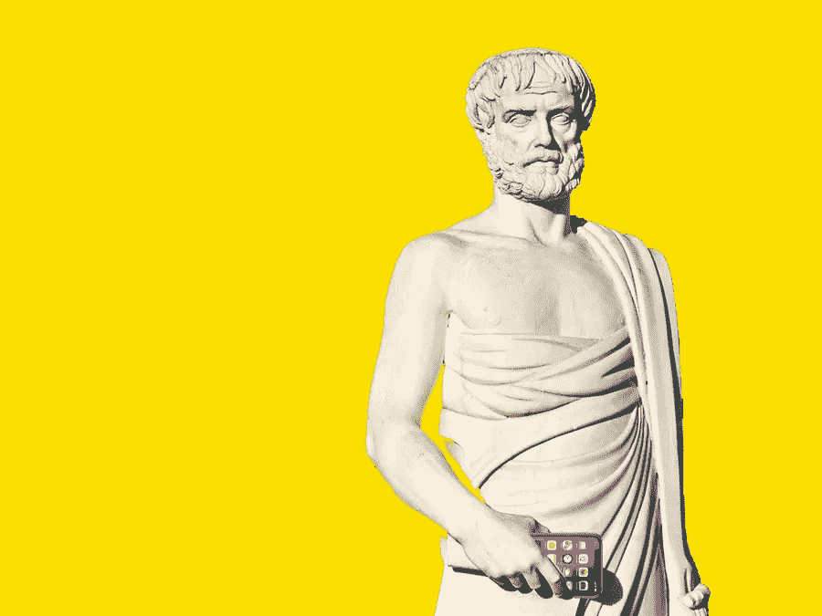

# 哲学与企业家精神:谁应该创造技术？

> 原文：<https://medium.datadriveninvestor.com/virtue-ethics-entrepreneurship-who-should-build-technology-10a5588f467a?source=collection_archive---------9----------------------->

以下是对哲学的一些想法的有组织的收集&美德理论以及它如何与建筑技术相交。我分享是为了阐明某些主题，以促进富有成效的对话，而不是指责或推进某种类型的意识形态。

## 热情

如果你问一位企业家，他或她为什么从事他们的事业，他们很可能会说，这是因为他们对解决他们正在从事的问题充满热情。史蒂夫·乔布斯曾经说过:

> 苹果不是在为人们制造完成工作的盒子，尽管我们做得很好。苹果不仅仅是这样。它的核心价值是，我们相信有激情的人可以让世界变得更好。

激情是科技和工作中最突出的流行词之一，但这个词的原意已经完全消失了。

“激情”这个词来源于拉丁语词根，“T2”(patior)(首次出现于公元 1175 年)，意思是“我受苦”

“激情”的现代用法根本不能解释为痛苦，事实上，它正好相反。激情现在是爱、热情、欲望和痴迷的同义词。

 [## 如何让人们真正倾听你|数据驱动的投资者

### 没有神奇的五步公式。这可能不是你现在想听到的，但相信我，从长远来看，这是…

www.datadriveninvestor.com](https://www.datadriveninvestor.com/2020/03/22/how-to-get-people-to-really-listen-to-you/) 

病人认为有一种外力驱使你遭受痛苦。马丁·路德·金的下面这段话以最直接最准确的方式总结了激情和生活的重要性:

> 如果一个人没有发现他愿意为之献身的东西，他就不适合活着。

你是真的热爱你的工作，还是在演戏？

## 守护进程

史蒂夫·乔布斯也说过，“做伟大工作的唯一方法就是热爱你所做的事情...就像所有与心灵有关的事情一样，当你找到它时，你就会知道。”

“找到激情”在每个人的清单上排在首位，这是有充分理由的。但这是生命的奥秘之一，所以我们认为我们可以把这个话题淡化为一篇 5 步中等文章是愚蠢的。每个人的旅程都是不同的，不可能有一本旅行指南。

但是为了让这个话题回到焦点上，我想比激情的词源更进一步。我想谈谈前面提到的那种**外力，那种推动人们创造他们所设想的技术的苦难背后的力量。**

几乎没有关于这种现象的任何研究，由于其固有的不可描述的性质，这种力量的最早记录之一可以追溯到柏拉图的*道歉* 31c，其中苏格拉底说:

> *“我有一个来自上帝的神签【daimonion】，这个神签是从我小时候开始的……****。它是一个声音，每当它说话时，它就把我从我将要做的事情上引开*** *，但它从来没有把我转向任何事情。”*

“daemon”这个词来自希腊语“daimon”，意思是“神圣的”或“引导的精神”，不要与“恶魔”混淆，恶魔是一种邪恶的精神。

每个人都有一个内在的“精灵”，无论你称之为直觉、直觉还是你头脑中的声音。它的部分功能是给一个人警告信号，有时甚至告诉那个人该做什么。苏格拉底将其描述为:

> ***“……我仿佛听到自己耳边喃喃自语的声音，*** *像神秘主义者耳朵里的笛声。”*

有很多激情驱使人们疯狂的例子，不管是好是坏，甚至是走向死亡。再说一遍，每个人的人生旅程都是不同的，但我提出这一点是为了说，外部力量或守护进程是生命中最强大的力量之一。

我相信一个人的痛苦或激情的开始甚至过程，都存在于这种喃喃自语的内心对话之中。

> “偏离你注定要走的路是不会有好结果的。你会受到各种隐藏的痛苦的困扰……你必须倾听这种沮丧、这种痛苦的信息，并让它引导你……这是一个生死攸关的问题。”罗伯特·格林

## 诚实

如果你想要一个激情的真实例子，看看那些想/正在为有特殊需求的孩子开发应用程序的父母就知道了。我已经和不同的父母进行了至少六次谈话，并且还在继续，他们解决了不同的问题，我从没想到这种情况会如此普遍。(当然，我指的是尽可能好的方式。)

这些人在加入 Skype 视频通话方面有问题，但他们追求开发应用程序这一极其困难的创业冒险。

他们不知道该做什么，他们非常忙于正常的日常事务，几乎没有存款来支持像推出一个应用程序这样的风险投资——但他们坚持以改变自己孩子的生活和其他孩子及家庭的生活为名。

我不确定我想把这个特殊的讨论引向哪个方向，因为这里有很多东西要说——数字素养、道德定价策略、接受客户让自己看起来更好，等等。—但我想缩小诚实的范围。

我经营着一家应用营销代理公司，营销行业因为见不得人(例如过度承诺和交付不足)。也就是说，我和上面提到的那些家长进行过几次交谈，他们试图弄清楚如何处理他们的应用创意和营销策略。大多数时候，不幸的是，这是一个很难进行的对话，因为我不想成为那个说“我认为这不适合你”的人。

我想举一个典型的例子:

一位家长询问营销服务，并说他们有 2000 美元用于所有的营销工作。

一个项目(SEO/ASO)的成本为 2000 美元。如果你是一名经验丰富的营销顾问，如果客户决定与你合作，你会接手这个项目吗？还是你知道他们不应该在一次服务中一掷千金就把他们打发走了？

如果他们开发一个应用程序来解决他们有特殊需求的孩子的问题，会有什么不同吗？你会因为他们不知道幕后发生了什么而向他们推销善意的谎言吗？

诚实是下一点，也是最重要的一点的副产品。

## 责任

由于“快速移动&打破事物”的哲学和技术发展的内在速度，责任是技术领域最热门的话题之一。没有人知道他们在做什么，这就是*绝对没问题*，这就是我们学习的方式。然而，当指责像烫手山芋一样被扔来扔去时，问题就出现了。

今天，承担责任仅仅被翻译成“承担责任”。大多数人没有意识到的是，承担责任不是人身攻击，甚至不是一件坏事。责任的定义意味着能够为自己的行为负责。责任是提出解决方案的第一步。如果监督行动的人逃避责任，他们就会立即变成受害者——使解决方案更难找到——因为在大多数情况下，没有人会觉得有义务去收拾别人的烂摊子。此外，这也是那个人不值得信任的一个污点。

## 谁应该构建技术？

我不想说*只有*充满激情的人才应该开发技术，但是将时间、金钱和精力投入到能让他们有生活目标感的事情上，最符合企业家的利益。**的意思，如果它确实失败了，就像** [**90%的创业公司做**](https://fortune.com/2014/09/25/why-startups-fail-according-to-their-founders/) **一样，他们的工作不会，或者至少感觉像是，它是徒劳的。**

负责任的人应该是建筑技术。这些创造者会刻意思考他们在创造什么&他们是如何创造的，并且会有足够的信心说，**“对不起，我搞砸了。下面是我打算如何修复它，并阻止它再次发生。”**

没有人知道所有的答案，也没有人期望任何人知道所有的答案。我们都在边走边学。然而，我们能找到答案的唯一方法是承担责任，并在需要的时候说出来。

如果你真的想追随你的激情，你会付诸行动。