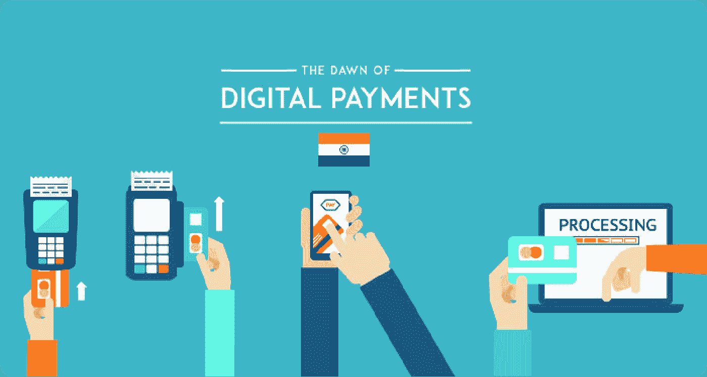

# VISA 在拯救经济中的作用

> 原文：<https://medium.datadriveninvestor.com/visas-role-in-saving-the-economy-af92d0d560a5?source=collection_archive---------24----------------------->

由于全球封锁，消费者被迫更多地在网上购物，Visa 平台上的数字支付成为美国消费者和零售商的必需品。该公司 2020 财年的收入为 218 亿美元，略低于去年的收入。

许多零售巨头，如亚马逊和沃尔玛，在疫情期间被视为救星，因为他们的数字购物努力让数百万人避免了在商店购买商品的风险，而是选择送货或取件。零售商所采取的数字化努力是惊人的，但如果没有 Visa 这样的数字支付网络，这是不可能的。自该公司 1958 年成立以来，Visa 已经成为某种程度上的垄断。

在 2020 财年，Visa 处理了近 9 万亿美元的支付量，几乎是其最接近的竞争对手万事达卡的两倍。该公司在 2020 年受到了越来越多的审查，因为他们试图收购 Plaid Inc .导致监管机构质疑收购的目的是改善客户体验还是纯粹压制竞争。

Plaid 的支付处理技术允许消费者和企业将资金从一个银行账户转移到另一个账户，而无需处理借记卡或信用卡的麻烦。这项技术已经被 PayPal 的 Venmo 等公司采用，对 Visa 现有的商业模式构成了严重威胁。

这家总部位于加州的公司不仅控制了美国 70%的借记卡交易，而且 Visa 还要求他们的企业客户，如零售商和在线购物中心，签订长期合同，限制他们转向万事达卡或其他竞争对手。

据该公司称，除了 Visa 的支付处理网络，客户还可以获得 Visa 的防盗服务，该服务在 2020 年帮助防止了近 250 亿美元的欺诈。国际支付处理也继续对 Visa 的收入产生积极影响，该公司在 2020 年从国际支付量中赚得 62 亿美元。

添加替代文本

与其他信用卡公司和金融机构不同，Visa 不通过向消费者或企业发放短期贷款的利息来赚取收入。该公司几乎所有的收入都来自向客户收取的使用其数字支付网络和使用一系列 Visa 品牌产品和服务的费用。

 [## 利用区块链构建可持续循环经济|数据驱动投资者

### 自从工业革命开始以来，全世界都关注产品的生产和消费。很少或…

www.datadriveninvestor.com](https://www.datadriveninvestor.com/2020/11/17/building-sustainable-circular-economy-with-blockchain/) 

仅在 2020 年，就有超过 2000 亿笔支付和交易通过 Visa 品牌完成，平均每天超过 5.5 亿笔支付。尽管如此，全球数字支付行业的增长机会仍然巨大，电子商务目前仅占全球零售支出的 14%。

该公司一直在向国内外市场投入大量资源，以增加这一数字，并将他们的触角延伸到全球数百万开始更多地转向数字支付而不是现金和支票的企业。在美国，现金交易仍然是最主要的支付方式。30%的交易，相当于 18 万亿美元，是用现金或支票完成的。

为了让过渡更容易，Visa 一直在推出新的服务，以吸引全球消费者更多地转向数字支付。其中最大的变化是点击支付的上线，本质上是 Visa 版的亚马逊一键式购物。该服务允许消费者在网上购买商品，而不需要每次购买时都重新输入支付信息。

另一个转变是店内购物的非接触式支付，在这一领域，美国远远落后于英国和中国等其他国家。全球非接触式支付占面对面数字支付的比例已经增长到 43%，远远超过了 5 年前的水平。这种转变在很大程度上是由中国通过阿里巴巴和微信等金融巨头采用该技术推动的。欧洲国家和澳大利亚的非接触式数字支付也出现了类似的增长，英国的非接触式交通交易同比增长 97%。

额外数字支付处理的全球潜力是 Visa 目前最大的增长机会。根据最近的一份报告，世界银行估计，世界上仍有 17 亿成年人无法获得正规金融服务。

尽管 Visa 已经为 200 个国家提供服务，但该公司并不缺乏增长潜力，特别是考虑到他们是少数几家能够在全球开展业务的美国金融机构之一。

然而，其他金融巨头之间的竞争仍然激烈。美国运通是该行业的第三大参与者，于 2020 年初获得批准，通过与中国最大的金融服务公司之一合作，开始在中国建立支付处理网络。

中国市场目前是该行业最大的增长机会，也是长期以来仅使用现金和支票的其他支付媒介(如租金、停车和自动售货机)的过渡。

B2B 市场代表了 Visa 增加支付份额的又一个无尽的机会，全球每年的企业支出约为 120 万亿美元。Visa Direct 计划允许消费者、企业和政府在彼此之间无缝转移资金，而不必处理复杂和混乱的银行账户和路由号码。

事实证明，这些服务特别有帮助，因为世界各地的政府向数百万公民发放了刺激款项，而且只需邮寄支票所需时间的一小部分。随着美国考虑新一轮刺激支付，Visa 的支付网络可能会再次被证明对美国的金融体系至关重要。

Plaid 和 Square 提供的替代支付方式可能会削弱 Visa 几十年来建立的竞争优势，但随着超过三分之二的市场被他们控制，以及 Visa 网络深入数百万公司的工作，这一天似乎还很遥远。

## 访问专家视图— [订阅 DDI 英特尔](https://datadriveninvestor.com/ddi-intel)