# 视觉设计指南。基本要素

> 原文：<https://medium.datadriveninvestor.com/visual-design-guidelines-fundamental-elements-ac6306042a4e?source=collection_archive---------21----------------------->

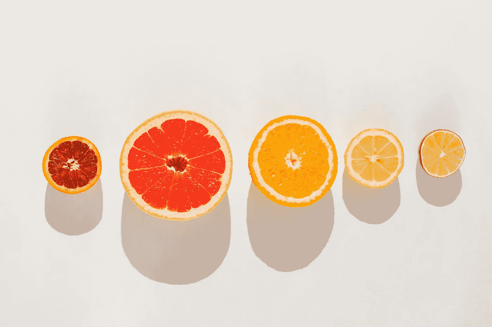

现代视觉设计的特点是一种系统的方法，旨在有效地吸引注意力，影响观众，并在任务框架内操纵感知(不考虑文化价值观或个人想法)。这是使用某些元素和算法来最有效地解决问题的分析过程的结果，而不是纯粹的创造性过程。

# 介绍

这些指南的目的是给出一个理论上的总结，以便形成一个视觉设计的总体思路。因此，在第一部分，我们将考虑一些基本的方面，没有它们，任何视觉系统都不可能存在。这些方面包括从印刷材料到数字内容。

视觉元素是最简单的组成部分，相互结合，形成许多不同的视觉系统。根据它们之间的依赖关系，可以将它们分为三类:基、原语、对象。

视觉设计的唯一基础就是画布。在它的框架内，形成视觉系统的过程借助于基本要素进行:点、线和平面。它是构成画布想象结构的基本元素和各种可见物体——形状和图形的组合。当我们接近这个主题时，将在下面讨论假想的和可见的原语的概念。

# 基础

如前所述，画布是视觉设计的基础。它是一个有限的平面，在这个平面内，所有的强化过程从始至终都在进行。画布的边界可以是任何形状，但从实用性的角度来看，最常见的是各种比例的矩形——正方形、水平、垂直。

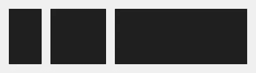

Aspect ratio

所需画布格式的选择可由各种因素决定，并取决于必须在查看器上执行的操作。矩形中心的移动迫使你向前看，而正方形将所有的注意力固定在中心。

# 基元

图元(一个点、一条线和一个平面)是构成画布结构、复杂对象和整个视觉系统的最简单的元素。它们可以是想象的，即不在画布上，但存在于感知中，并且是可见的。假想图元的例子可以是作为点的合成中心、线形式的下线条边界、或者平面边界内的段落区域。

图元相对于对象来说是主要的，因为后者由图元组成。设计师对图元的理解越深，其视觉系统的表现力和有效性就越强。它们的简单性是误导性的，所以你应该经常研究它们，以便直观地涵盖它们表现的所有方面。

# 要点

点是基本图元，是其他图元的基础。移动点形成线，移动线形成面。这是一个静态的视觉支持，仅通过它在画布上的位置就能激发平衡感和不平衡感。

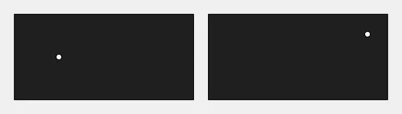

Imbalance

对象被转换为一个尺寸减小或虚数距离减小的点，反之亦然-对象可以从一个尺寸增大或虚数近似的点产生。

# 线条

线是由点的移动形成的第二个图元。它有一个明显的长度，所以它可以是无限的，限制在一边或两边。这是一个动态元素，可以描述空间和时间中的运动。

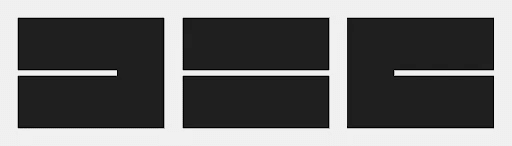

Imaginary and visible lines

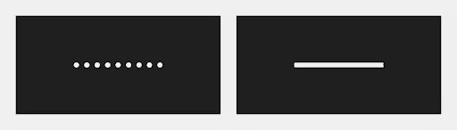

Limited and continuous lines

两条可见直线的交点形成一个假想的点。

The imaginary point at the intersection of two visible lines

如果线是可见的，那么它可以是不同的厚度，连续的或不连续的，直的或弯曲的。

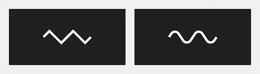

Curve

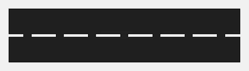

Broken line

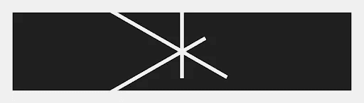

线条描述结构和边界，也可以连接、分隔和突出显示。

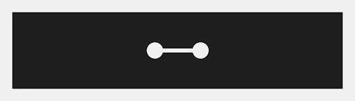

Line connection

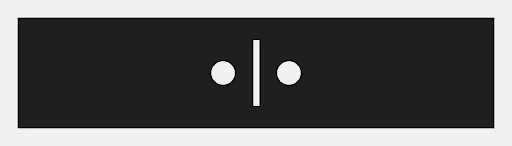

Line Separation

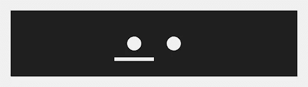

Line highlighting

形状和图形的轮廓可以是一条可见的线，也可以是一条假想的线。

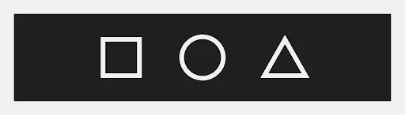

Outline shapes

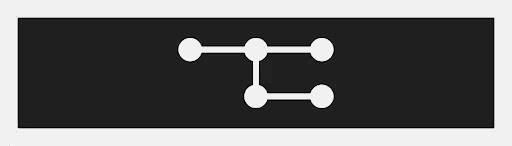

Hierarchical structure

# 飞机

平面是线移动的最后一个基元，所以它不仅有明显的长度，还有宽度。

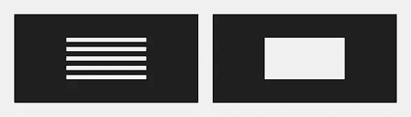

Imaginary and visible plane

两个可见平面的交点形成一条假想的线。

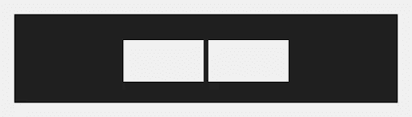

Imaginary and visible plane

平面像线条一样描述结构和边界，也可以连接、分离和突出显示。

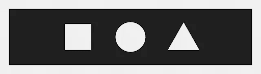

Plane of shapes

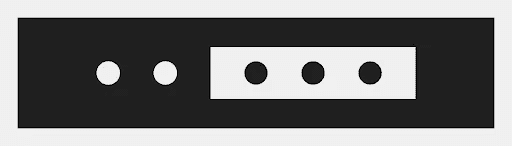

Connection, separation, and plane highlight

形状和图形是视觉对象。由图元构成的可视元素，作为表达某一图像的手段。形状对于图形来说是首要的，因为后者只能存在于形状的轮廓中。

物体可以分为三类:有机的、调和的和抽象的。

有机物体是自然和现实生活元素的图像，它应该清楚地表达所需的元素，并强调它最重要的方面，例如植物和动物，人和物体，山地景观，等等。

谐波物体是服从一定规律的几何形状和图形的图像，通常在自然界本身是不存在的，例如圆形、三角形、正方形、球形、立方体等等。

抽象对象是没有明确关联支持的无形状图像。这是它们与有机和谐物体的区别，有机和谐物体在观看者的头脑中唤起清晰的联想。

# 形状

形状是一个简单的可见对象，是一个由线的轮廓限定的平面，具有宽度和高度。

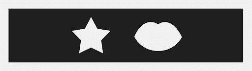

Shapes

由于易于感知，简单的形状被用来形成标志:数字，字母，象形文字等。例如，字形作为书写的最小单位，是一种具体轮廓的形状。它能够传达内在的意义，不管其表达的细微差别。

Letters

形状可以是简单的也可以是复合的。简单的形状是同质的元素，一个独特的形象剪影。复合形状是几个不同的元素，两个或更多，组合在一个共同的形象。

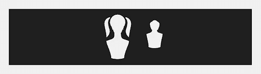

Simple shapes

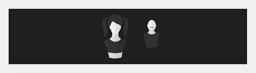

Compound Shapes

# 数字

该图形是一个复杂的可视对象，具有宽度、高度和深度。它有一个想象的体积，通过使用各种表现手段(光、阴影、透视等)来实现。

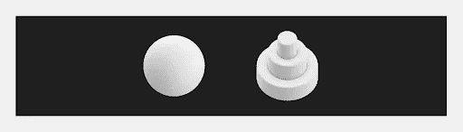

与真实世界的物体的近似程度允许你从任何角度显示它，而不会失去在观看者的感知中的关联支持。这是与对象的另一个区别，对象是一个平面对象，在保持语义内容的同时具有有限数量的角度。

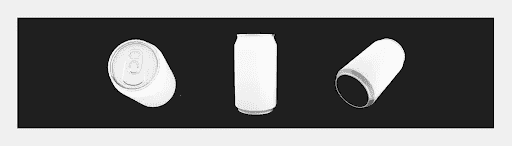

Different angles of the same body

在这部分指南的最后，我们想重申视觉元素是基本的方面，没有它任何视觉系统都不能存在。在下一部分，我们将考虑视觉元素的属性和构成方式。

*原载于 2020 年 5 月 15 日 https://geniusee.com***。**