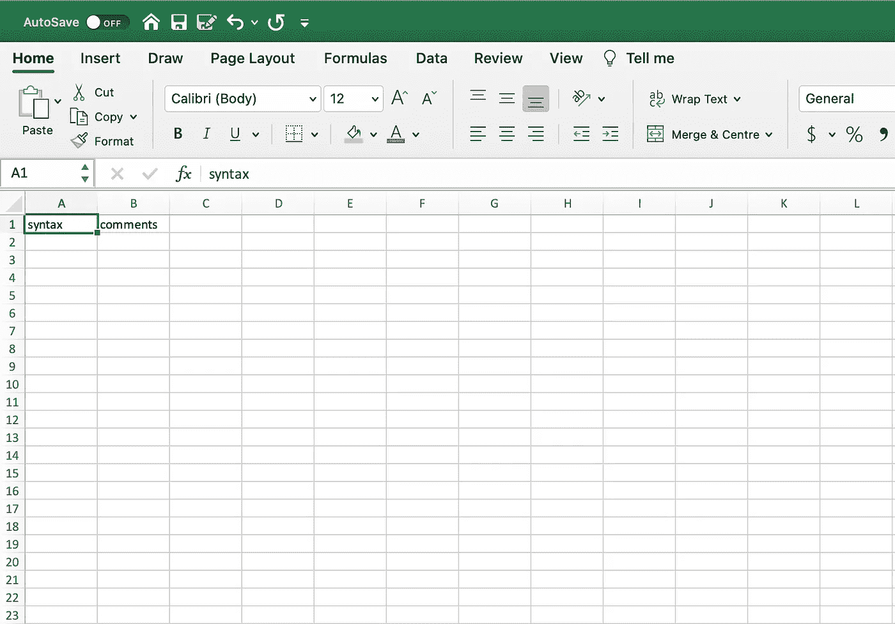
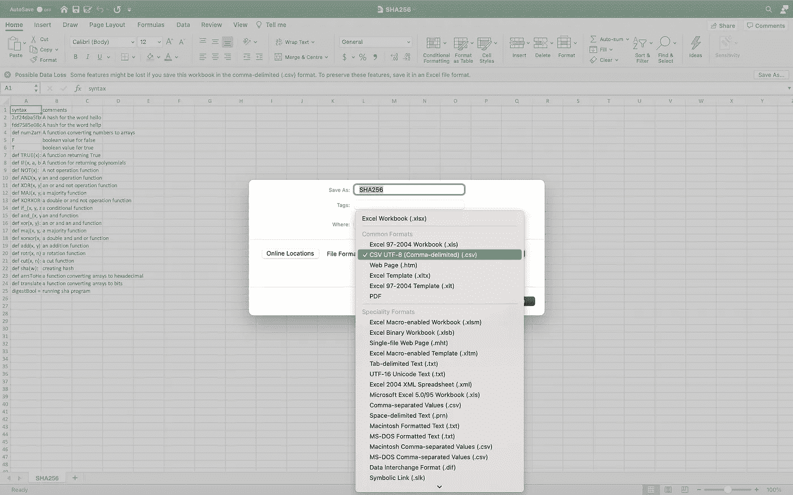
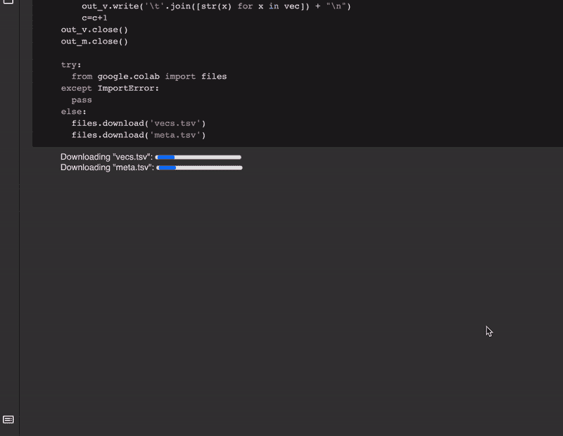
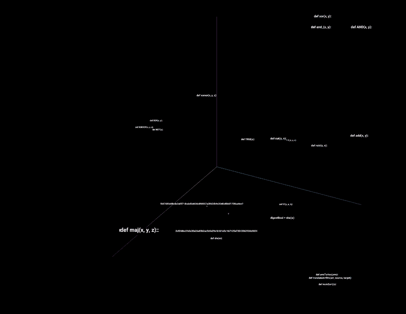

# 可视化算法

> 原文：<https://medium.datadriveninvestor.com/visualise-algorithm-bd5c6d1634d9?source=collection_archive---------24----------------------->

Photo by [Max Chen](https://unsplash.com/@maxchen2k) taken from [Unsplash](https://unsplash.com/photos/lud4OaUCP4Q)

这篇短文是可视化算法的一步一步的演练。第一步是在 Microsoft Excel 中打开一个空白笔记本，然后在第一行键入“syntax ”,接着在下一行键入“comments ”(见下图)。

Image by Author

在“语法”列下面，复制并粘贴代码的语法。同样，在注释栏下，复制、粘贴或写一个描述相应语法的句子。完成写入后，将文件另存为”。csv”。. csv 文件只是一种存储形式，它代表“逗号分隔值”文件(见下图)。

Image by Author

一旦完成。只需点击这个 [**GitHub 链接**](https://github.com/seanjudelyons/AlgorithmVisualise/blob/main/Algorithm_Visualiser.ipynb) ，然后点击 [**在 Colab**](https://colab.research.google.com/github/seanjudelyons/AlgorithmVisualise/blob/main/Algorithm_Visualiser.ipynb) 中打开，然后运行每个代码片段，提示上传. csv 文件。这将下载一个 meta 和 vecs 数据文件。

Image by Author

最后上传两个文件，即 meta 和 vecs 文件到 TensorFlow 嵌入式投影仪。链接可以在 这里找到 [**。然后看着算法在高维空间里盘旋。相似的句法会在这个维度空间里并列在一起。该算法也是由 Nikolaj Kuntner 提出的(点击这里查看他的 git 要点)。**](https://projector.tensorflow.org/)

Image by Author

# 信用

感谢嵌入式投影仪的设计者(在这里 找到他们的论文 [**)。评论的主要矢量化是 Devlin 等人最初的 transformer(在这里找到他们的论文**](https://arxiv.org/pdf/1611.05469.pdf)******)。**在这篇文章中我们实际上是用句子-Bert 进行矢量化，一个连体的 Bert 网络(在这里** **找到他们的论文[)。该算法也是由尼古拉·考特纳提出的(点击这里查看他的 G](https://arxiv.org/pdf/1908.10084.pdf) [it 要点](https://gist.github.com/Nikolaj-K/388e643d1f5e6989072a21e469d10a48))。****