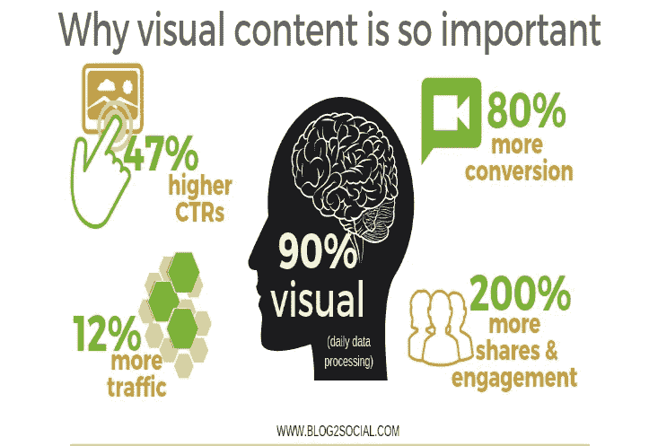

# 愿景向品牌展示成功之路

> 原文：<https://medium.datadriveninvestor.com/visualization-captures-the-essence-of-a-brand-f4002f863391?source=collection_archive---------4----------------------->

## 将你希望你的品牌唤起的氛围和感觉结合在一起

公司在对自己的品牌有一个愿景之前不会起飞。这些在线可视化考虑了无数的因素，从这些专业建议开始:

*   选择容易理解的图片。
*   使用多种[图像](https://blog.markgrowth.com/your-visual-style-repeatedly-builds-trust-9b0f530c5fde?source=friends_link&sk=10fca03792f90b28bda115f755feebec)类型和格式。
*   遵守[版权法](https://medium.com/datadriveninvestor/live-stream-freely-and-legally-c313f4114a15?source=friends_link&sk=91ad5b15b134e13041368d237af2759d)。
*   为[搜索引擎优化](https://www.datadriveninvestor.com/2018/12/29/for-seo-the-words-are-key/)优化你的图片和视频。
*   给你的视觉效果添加社交媒体按钮。
*   通过社交媒体渠道分享您的所有图像和视频。
*   通过链接帖子和图片帖子格式分享您的内容。

视觉数字战略家[阿布·贾马尔](https://twitter.com/mardmaster/)帮助公司实现他们的愿景，他在[非洲推特聊天](https://twitter.com/AfricaTweetChat)中解释了这一点。

 [## 发挥创造力，改变世界

### 视觉叙事和社交媒体联合起来创造不同

medium.datadriveninvestor.com](/be-creative-and-change-the-world-55288cce7184) 

可视化是在线的一切。你如何描述你的品牌有助于它在所有社交媒体平台上脱颖而出。通过可视化，品牌所有者在纸上勾画出他们的想法，然后在社交媒体上发布。这个想法可以有不同的形式:摄影或视频。

事实上，视频创造了最大的视觉差异。这可能是从智能手机或使用 gif 拍摄的视频。关键是要让消费者说哇！从好的方面来说。

贾马尔说，品牌形象化可以通过以下步骤有效地进行

*   定义品牌受众
*   创建情绪板
*   一致性

贾马尔说:“情绪板通常在视觉化时包含品牌的大部分细节或计划。”“这与定义你的品牌的受众和品牌与他们的受众互动的一致性密切相关。

“也被称为灵感板或愿景板，情绪板是视觉效果的集合，”他说。"他们一起工作来体现你希望你的品牌唤起的氛围和感觉."

# **开门红**

这是贾马尔入行以来一直使用的工具。

“作为一名创意者，我开始在纸板上创建情绪板，将不同的图像与步骤和每个步骤的物理表现结合起来，”他说。“可以在 Pinterest 上创建一个情绪板。你可以在那里查看不同的情绪板和想法样本。

贾马尔说:“在 Pinterest 上，你可以很容易地拖动照片、文章、横幅，或者在你的板上创建一个想法来进行工作。”

 [## 品牌在生活色彩中脱颖而出

### 一致的视觉风格增强了解、喜欢和信任

blog.markgrowth.com](https://blog.markgrowth.com/brands-stand-out-in-living-color-566ac6044168) 

为了实现他们的后视觉化计划，品牌可以选择视觉内容或纯粗体文本。然而，简单的粗体文本看起来是如此的醒目…和简单。视觉内容脱颖而出，熠熠生辉。

“品牌散发的视觉表现是情绪板，”贾马尔说。“它提取了品牌的关键词和特征，并赋予它们一种我们可以利用的更有形的形式。”

事实证明，人们的思维和反应最好的视觉效果。

“这就是为什么当品牌与观众沟通时，视觉内容会被选择而不是粗体纯文本的关键原因，”贾马尔说。"这个后视觉化阶段指的是我们计划中推出内容的阶段."

毫不奇怪，视觉内容被证明比“粗体纯文本”更有效，尽管这些元素是视觉内容的组成部分。

贾马尔说:“我们有这么多漂亮的文字字体，它们的设计可以舒缓我们的眼睛。”“但是，相比这些文字，我们更喜欢用丰富多彩的本地视频来讲述我们的品牌故事。视频做数字更好。”

视觉内容是你看到的任何东西。自然，图片和视频比灰色的文本块更能吸引眼球。

“视觉是主要基于图像的在线内容，”贾马尔说。“视觉内容的常见形式包括图片、图表、图表、信息图、在线视频、截图、迷因和 gif。

“一个品牌的视觉内容是由网站——我称之为你的第一个工作场所——颜色选择、文本大小、情绪和设计、视频和照片等组成的，”他说。

# **全部收入**

视觉内容营销涉及到观众，因为他们使用更多的感官。触动神经的视频可以用它的气味或味道唤起记忆。当然，还有视频的声音。

“视觉内容正在爆炸，”贾马尔说。“高视觉社交媒体平台——如 YouTube 和 insta gram——正在快速增长，并更新了许多新功能。即使在其他社交媒体平台上，视觉内容也比简单的粗体文本表现更好。

“67%的营销人员——数字和传统的——将视觉内容列为他们‘最重要’的内容类型，”他说。"这是因为视觉内容营销对于获得反向链接、社交分享和流量非常有效."

他指出，衡量和跟踪视觉帖子的分析更容易，这是衡量投资回报的一种简单方法。

 [## 吸引人的视觉风格可以建立对你的品牌的熟悉和信任

### 人们在任何人开口之前就知道你是谁

blog.markgrowth.com](https://blog.markgrowth.com/your-visual-style-repeatedly-builds-trust-9b0f530c5fde) 

贾马尔推荐了许多品牌可以用来吸引观众的视觉内容。

“我们使用这些形式主要是因为它们是视觉内容的细分，”他说，并给出了他的偏好:

*   “概念视觉”
*   原生视频
*   终极指南
*   解释者信息图
*   通过图表和图形实现数据可视化
*   嵌入式博客或网站发布视频
*   YouTube 视频
*   流程图
*   截屏
*   卡通和动画

“在今天的数字时代，截图是在手机上创建心情板的最快方式，”贾马尔说。“我相信我们都知道这些内容在策展时有多有效。”

在他看来，创建在线品牌可视化的最佳工具是 Milanote，它让用户在几分钟内创建漂亮的可分享情绪板。

**关于作者**

吉姆·卡扎曼是[拉戈金融服务公司](http://largofinancialservices.com/)的经理，曾在空军和联邦政府的公共事务部门工作。你可以在[推特](https://twitter.com/JKatzaman)、[脸书](https://www.facebook.com/jim.katzaman)和 [LinkedIn](https://www.linkedin.com/in/jim-katzaman-33641b21/) 上和他联系。