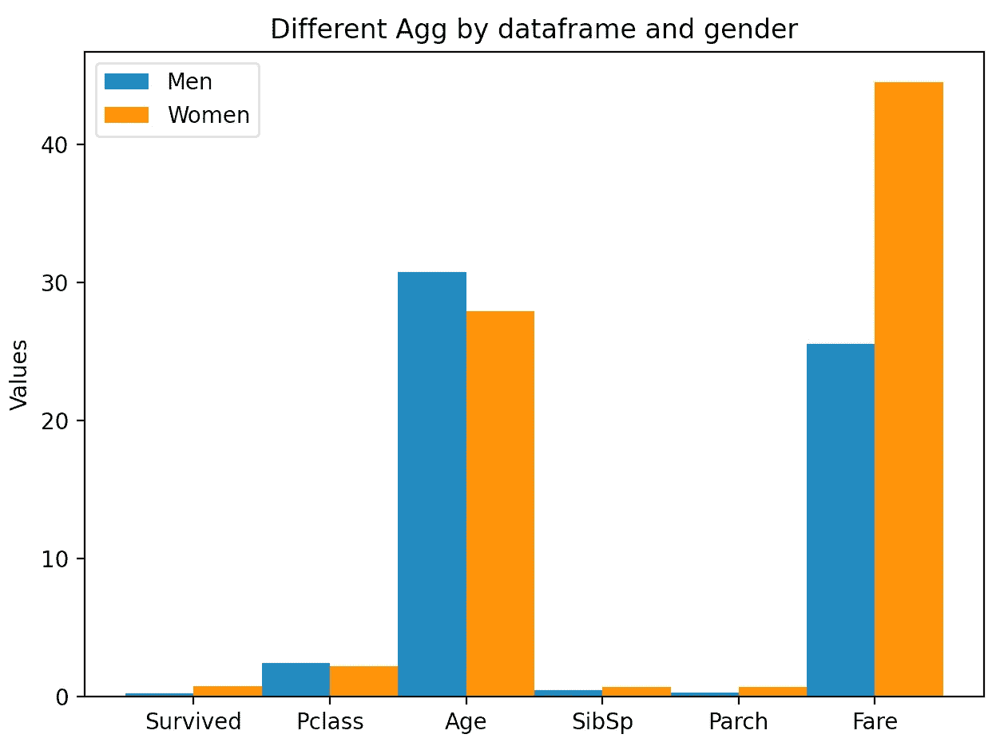
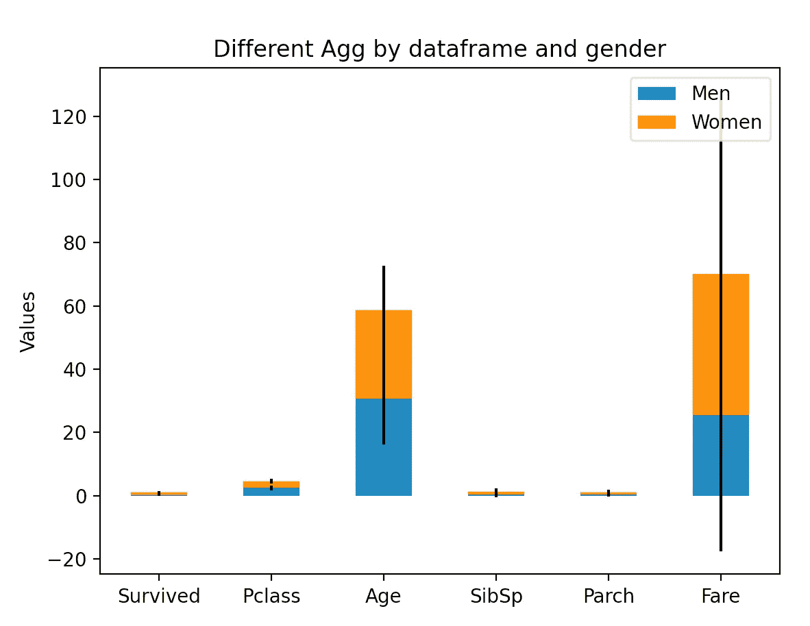
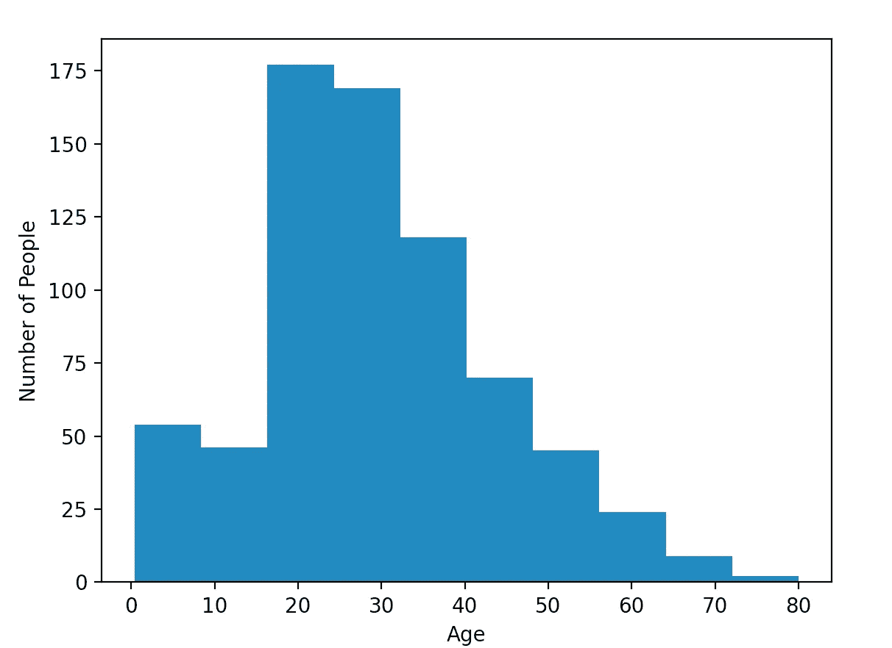
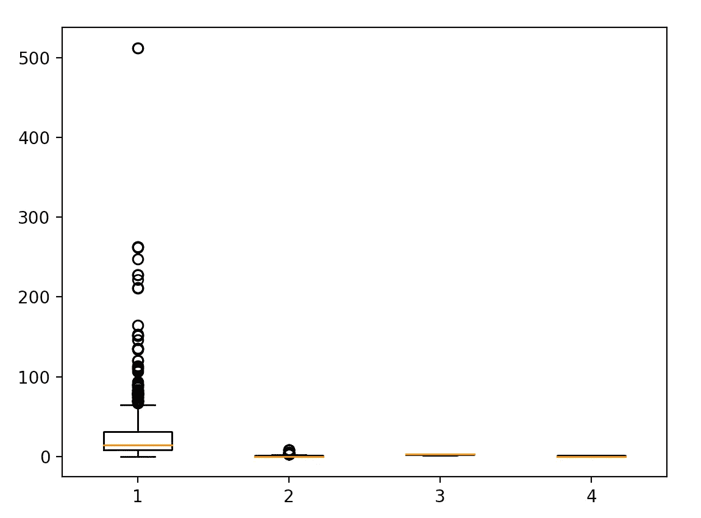
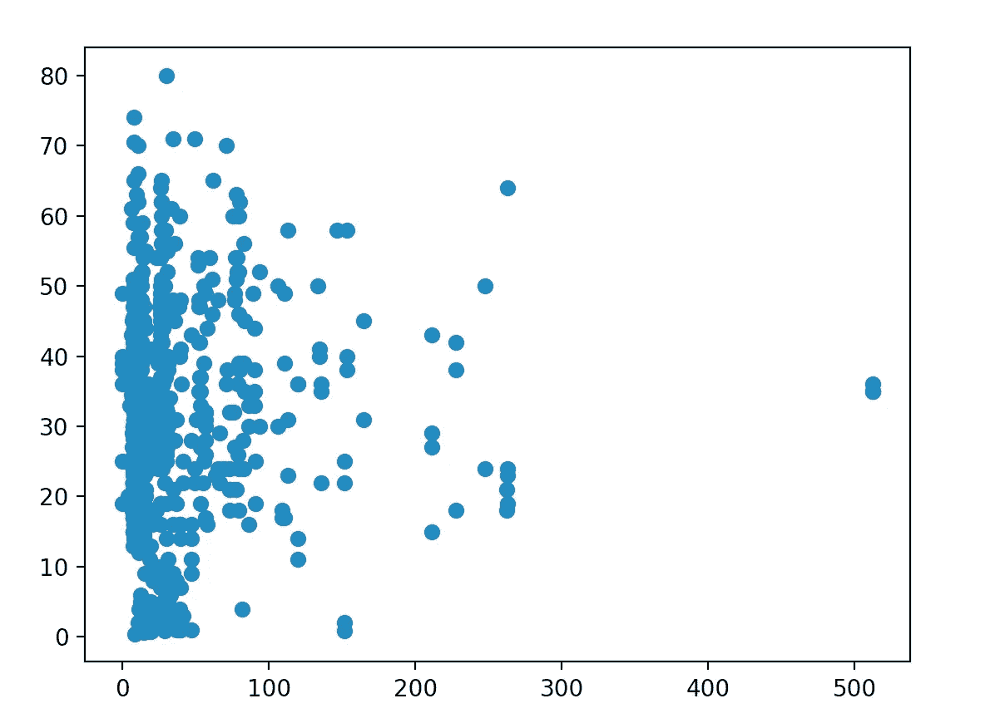

# 可视化是一种使用 Matplotlib 分析数据的艺术

> 原文：<https://medium.datadriveninvestor.com/visualization-is-an-art-using-matplotlib-to-analyze-data-24bd929ea78a?source=collection_archive---------16----------------------->

## 掌握可视化技术，一步到位地探索数据

ython 是新一代语言之一。它有库来可视化你的数据，探索并从中获得一些见解。Matplotlib 是在探索数据时最常用的库之一。每项数据分析都需要将数据可视化，以达到不同的目的，如发现异常值、密度、稀疏性、趋势，更重要的是数据的标准化。

让我们探索一下 matplotlib，然后我们可以看看有哪些其他的可视化库。

> 绘制数据以可视化并从数据中提取第一层含义是必须学习的数据分析和机器学习艺术

# Matplotlib

这是 python 中的一个库，能够提供静态和交互式可视化。


安装 matplotlib

```
python -m pip install -U matplotlib
```

Matplotlib 对库有依赖:numpy，cycler，dateutil，pillow，kiwisolver，pyparsing。

我将导入不同的例子和代码显示著名的泰坦尼克号数据集。因此，我将该文件导入数据框，删除乘客 id 列，这是非常独特的。

```
import pandas as pd

df=pd.read_csv('../../data/titanic.csv')

df = df.drop('PassengerId',axis =1)
```

## matplotlib 架构

正如我们所理解的，matplotlib 库用于数据的可视化。为了可视化，需要创建、渲染和更新图形。它的架构主要由三层组成

**后端层**:这可以称为与公共用户界面的交互层。

**艺术家层**:这一层主要是渲染物体以供观看。这是非常重要的，因为它有助于创造图像的强大影响力。期望产生具体的视觉效果使它被称为艺术家层。

**脚本层**:顾名思义，这一层用于以编程的方式进行交互，并向最终用户提供根据他们的需要或要求操纵图形的能力。

## 条形图

```
width = 0.5       # the width of the bars

men_means = list(df[df['Sex'] == 'male'].mean())
men_std = list(df[df['Sex'] == 'male'].std())
women_means = list(df[df['Sex'] == 'female'].mean())
women_std  = list(df[df['Sex'] == 'female'].std())

labels = list(df[df['Sex'] == 'female'].std().index)x = np.arange(len(labels))
rects1 = ax.bar( x - width/2, men_means, width, label='Men')
rects2 = ax.bar(x + width/2, women_means, width, label='Women')
ax.set_xticklabels(labels)
ax.set_xticks(x)
```



## 堆积条形图

```
# slight change in the above code and you have stacked barchart
width = 0.5       # the width of the bars

men_means = list(df[df['Sex'] == 'male'].mean())
men_std = list(df[df['Sex'] == 'male'].std())
women_means = list(df[df['Sex'] == 'female'].mean())
women_std  = list(df[df['Sex'] == 'female'].std())

labels = list(df[df['Sex'] == 'female'].std().index)

fig, ax = plt.subplots()

ax.bar(labels, men_means, width, yerr=men_std, label='Men')
ax.bar(labels, women_means, width, yerr=women_std, bottom=men_means,
       label='Women')

ax.set_ylabel('Values')
ax.set_title('Different Agg by dataframe and gender')
ax.legend()

plt.show()
```

上面的代码将显示基于性别的数据分布。有时，你可能会陷入标签很大且重叠的问题。您可以通过使用 **plt.xticks(旋转=45)** 来改变标签的角度。试试这个来玩 y 轴和 x 轴上的标签。



只需稍加修改代码，您就可以轻松地将上面的条形图转换为水平条形图。

## 柱状图



```
 plt.hist(df['Age'])
plt.xlabel('Age')
plt.ylabel('Number of People')
plt.show()
```

用简单的几个命令显示年龄分布列。看到数据的密度，初步判断是否归一化，是非常有用的。

这使我们开始讨论如何纠正我们对柱状图和历史图之间区别的混淆。为了简化，

直方图用于显示一个变量的数据分布，而条形图用于显示两个变量之间的比较。另一个区别是直方图处理定量数据，而条形图处理分类数据。通过准备这些图表和用你的经验体验差异，可以探索更多。

## 箱形图

这是分析给定数据的重要图表之一。使用四分位数描述数据很有帮助。如果我们谈论四分位数，我们大多数人都明白我们正在走向正常化和寻找异常值。所以，这张图表有助于通过可视化发现数据中的异常值。



```
# simple display of box plot
plt.boxplot(df[['Fare','SibSp','Pclass','Survived']])
plt.show()
```

你绝对可以玩点别的东西来美化这个情节。我刚刚举例说明了箱线图以及异常值在顶部是如何清晰可见的。

## 散点图

这个图有助于看到数据的分布。换句话说，我们可以说它能够显示两个变量的值，以及它们如何在笛卡尔坐标系中相互传播。在我看来，我真的很喜欢一开始就使用箱线图和散点图来对我的独立特性和相关特性进行第一次分析。如果数据看起来不太好，寻找异常值，并尝试使它们标准化，以便更好地输入到 ML 模型中，从而获得更好的准确性和通用性。



```
# simple example of depicting two variable in scatter plot
plt.scatter(df['Fare'], df['Age'])
plt.show()
```

这将有助于了解数据的密集程度和数据相对于其他变量的分布情况。

其他字符，以查看饼状图，多图表在一个数字等。它们也很容易描述和开发。而且，在我看来，使用不同的图来可视化相同的数据总是会提供更多的见解，而且在这一点上，它将提供经验和信心来为正确的人选择正确的图。

## 结论

有许多使用 matplotlib 的情节，我们可以通过这个库的官方网站继续。那里有许多很好的例子。一旦你有了很好的专业知识，你肯定可以进入复杂的情节和互动的情节。此外，学习 seaborn 的其他库以及更多将提供更多灵活性的 matplotlib。我意识到学习这些绘制数据的技巧不仅可以可视化和分析数据，还可以提高你的 python 技能。在我看来，理解数据是一门艺术，使用可视化来学习数据有助于使这变得容易。而且，可视化对最终用户来说更有吸引力，也更容易解释。我希望这将是学习和前进的良好起点。我将在接下来的几周内提出互动情节和它们的具体用例。到时候，**快乐学习，编码**。